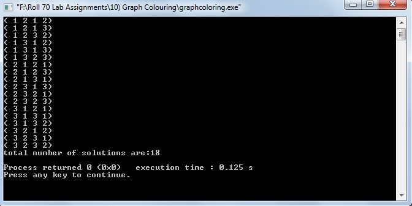

# Graph Coloring Algorithm

### Source Code

```
#include<stdio.h>
#include<stdlib.h>
#include<assert.h>

//chromatic no.
#define m 3

int sol=0;

void m_coloring(int adj[10][10],int,int x[10],int);

int main()
{
	int adj[10][10],x[10],i,j,n;

	FILE *fp;
	fp=fopen("Graph.txt","r");
	assert(fp);

	fscanf(fp,"%d",&n);

	for(i=0;i<n;i++)
	{
		for(j=0;j<n;j++)
        {
            fscanf(fp,"%d",&adj[i][j]);
        }
	}

	for(i=0;i<n;i++)
		x[i]=0; //initially all are set to zero.

	m_coloring(adj,n,x,0);
	fclose(fp);
	printf("total number of solutions are:%d\n", sol);

    return(0);
}


void m_coloring(int adj[10][10],int n,int x[10],int k)
{
	int i,j;
	while(1)
	{
		while(1)
		{
			x[k]=(x[k]+1)%(m+1); //next highest color.

			if(x[k]==0) //all colors used up.
				return ;

			for(j=0;j<n;j++)
            {
               if((adj[k][j]!=0) && (x[k]==x[j]))
					break;
            }

			if(j==n) //new color found.
				break;
		}
		if(k==n-1) //print the solution vector
		{
			sol++;
			printf("(" );
			for(i=0;i<n;i++)
				printf("%2d",x[i]);
			printf(")\n");
		}
		else
            m_coloring(adj,n,x,k+1);
	}
}
```

### Data File [Here](Graph.txt)

### Output

