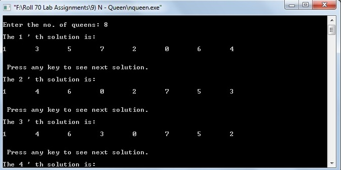

# N-Queen's Problem

### Source Code

```
#include<stdio.h>
#include<stdlib.h>

#define MAX 20
int col[MAX];
int colfree[MAX];
int upfree[MAX];
int downfree[MAX];
int r=-1;
int count=0;
int n;

void addqueen();
void writeboard();

int main()
{
	int i;

	printf("\nEnter the no. of queens: ");
	scanf("%d",&n);

	for(i=0;i<n;i++)
		colfree[i]=1;

	for(i=0;i<(2*n-1);i++)
	{
		upfree[i]=1;
		downfree[i]=1;
	}

	addqueen();
	printf("\nTotal no. of solutions = %d",count);

	return(0);
}

void addqueen()
{
	int c;
	r=r+1;

	for(c=0;c<n;c++)
	{
		if((colfree[c]==1) && (upfree[r+c-1]==1) && (downfree[r-c+n]==1))
		{
			col[r]=c;
			colfree[c]=0;
			upfree[r+c-1]=0;
			downfree[r-c+n]=0;

			if(r == n-1)
			{
				count++;
				printf("\nThe %d ' th solution is: \n",count);
				writeboard();
			}
			else
				addqueen();

			colfree[c]=1;
			upfree[r+c-1]=1;
			downfree[r-c+n]=1;
		}
	}

	r=r-1;
}

void writeboard()
{
	int i;
	printf("\n");

	for(i=0;i<n;i++)
	{
		printf("%d\t",col[i]);
	}

	printf("\n\n");

	printf("\n Press any key to see next solution. \n");
    getch(); //to freeze screen.
}
```

### Output

