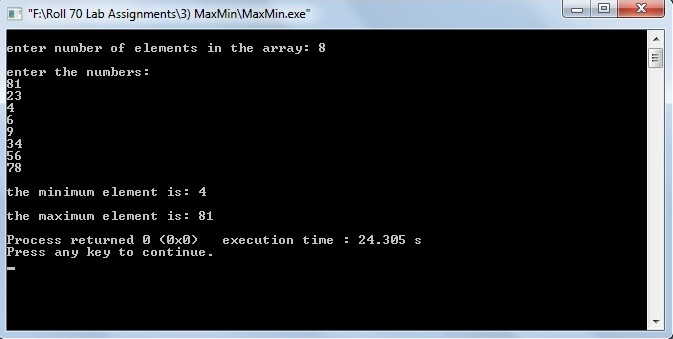

# Maximum and Minimum number in an array

### Source Code

```
#include<stdio.h>

typedef struct point
{
    int x;
    int y;
}point;

point maxmin(int [],int,int);

//using divide and conquer method.

int main()
{
    int n,i;
    int A[20];
    point r;
    printf("\nenter number of elements in the array: ");
    scanf("%d",&n);
    printf("\nenter the numbers: \n");
    for(i=0;i<n;i++)
    {
        scanf("%d",&A[i]);
    }

    r = maxmin(A,0,n-1);

    printf("\nthe minimum element is: %d\n",r.x);
    printf("\nthe maximum element is: %d\n",r.y);

    return(0);
}


point maxmin(int A[],int f,int l)
{
    point u,v,res;
    int m;

    if((l-f) == 1)
    {

        if(A[f]>A[l])
        {

            u.x=A[l];
            u.y=A[f];
            return(u);
        }
        else
        {

            u.x=A[f];
            u.y=A[l];
            return(u);
        }

    }
    else
    {
        m=(f+l)/2;

        u=maxmin(A,f,m);
        v=maxmin(A,m+1,l);

        if(u.x < v.x)
            res.x=u.x;
        else
            res.x=v.x;


        if(u.y > v.y)
            res.y=u.y;
        else
            res.y=v.y;

        return(res);
    }
}
```

### Output

