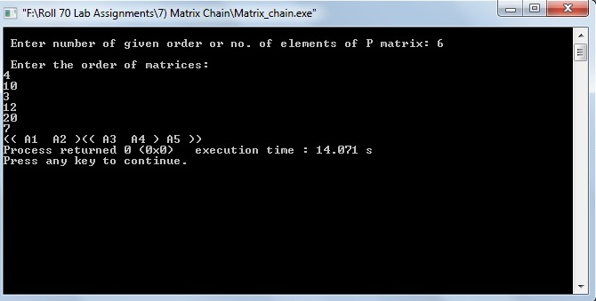

# Chain Matrix Multiplication

### Source Code

```
#include<stdio.h>
#define max 10
int m[max][max];
int s[max][max];
int p[max];
void matrix_chain(int);
void optimal_paranthesis(int,int);

int main()
{
	int n,i;
	printf("\n Enter number of given order or no. of elements of P matrix: ");
	scanf("%d",&n);
	printf("\n Enter the order of matrices: \n");
	for(i=0;i<n;i++)
		scanf("%d",&p[i]);
	matrix_chain(n-1);
	optimal_paranthesis(1,n-1);

    return(0);
}

void matrix_chain(int n)
{
	int i,j,k,l,q;
	for(i=1;i<=n;i++)
		m[i][i]=0;
	for(l=2;l<=n;l++)
	{
		for(i=1;i<=n-l+1;i++)
		{
			j=i+l-1;
			m[i][j]=9999;
			for(k=i;k<=j-1;k++)
			{
				q = m[i][k] + m[k+1][j] + p[i-1]*p[k]*p[j];
				if(q < m[i][j])
				{
					m[i][j]=q;
					s[i][j]=k;
				}
			}
		}
	}


}

void optimal_paranthesis(int i,int j)
{
	if(i==j)
		printf(" A%d ",i);
	else
	{
		printf("(");
		optimal_paranthesis(i,s[i][j]);
		optimal_paranthesis((s[i][j]+1),j);
		printf(")");
	}
}
```

### Output

