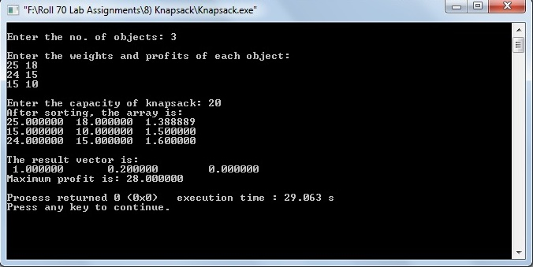

# Knapsack's Problem

### Source Code

```
# include<stdio.h>
void knapsack(int , float [], float [], float);

int main()
{
   float weight[20], profit[20], capacity;
   int num, i, j;
   float ratio[20], temp;

   printf("\nEnter the no. of objects: ");
   scanf("%d", &num);

   printf("\nEnter the profits and weights of each object: \n");
   for (i = 0; i < num; i++)
    {
      scanf("%f %f", &profit[i], &weight[i]);
    }

   printf("\nEnter the capacity of knapsack: ");
   scanf("%f", &capacity);

   for (i = 0; i < num; i++)
    {
      ratio[i] = profit[i] / weight[i];
    }

    //sorting in descending according to profit/weight ratio
   for(i=0;i< num-1;i++)
   {
      for(j=0;j< (num-i-1);j++)
      {
         if (ratio[j] > ratio[j+1]) {
            temp = ratio[j];
            ratio[j] = ratio[j+1];
            ratio[j+1] = temp;

            temp = weight[j];
            weight[j] = weight[j+1];
            weight[j+1] = temp;

            temp = profit[j];
            profit[j] = profit[j+1];
            profit[j+1] = temp;
         }
      }
   }

   printf("After sorting, the array is: \n");
   for (i = 0; i < num; i++)
    {
      printf("%f  %f  %f \n",  profit[i],weight[i],ratio[i]);
    }

   knapsack(num, weight, profit, capacity);
   return(0);
}


void knapsack(int n, float weight[], float profit[], float m)
{
   float x[20], tp = 0;
   int i, j, u;

   u = m;

   for (i = 0; i < n; i++)
      x[i] = 0.0;

   for (i = 0; i < n; i++)
    {
      if (weight[i] > u)
         break;
      else
      {
         x[i] = 1.0;
         tp = tp + profit[i];
         u = u - weight[i];
      }
    }

    if (i < n)
      x[i] = u / weight[i];

    tp = tp + (x[i] * profit[i]);

    printf("\nThe result vector is: \n ");
    for (i = 0; i < n; i++)
        printf("%f\t", x[i]);

    printf("\nMaximum profit is: %f \n", tp);
}
```

### Output

