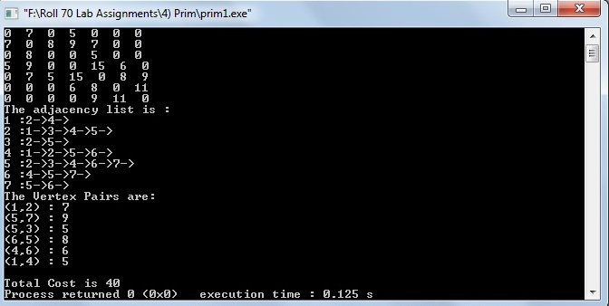

# Prim's Algorithm for Minimal Spanning Tree (MST)

### Source Code

```
#include<stdio.h>
#include<stdlib.h>
#include<assert.h>
#define MAX 32767
#define NIL -1

typedef struct info
{
    int parent;
    int vertex;
    int weight;
}info;

typedef struct alist
{
    int vertex;
    int weight;
    struct alist *next;
}alist;

int prims(info *vertexlist,alist **adjlist,int n,int r);
void minheapify(info *A,int heapsize,int index);
void buildminheap(info *A, int heapsize);
void heapdecreasekey(info *A,int w,int index);
info extractmin(info *A,int heapsize);

int main()
{

    FILE *fp;
    int n,i,j,temp,r;
    int **gmatrix,cost;
    info *vertexlist;
    alist **adjlist,*head,*newnode,*tail,*v;
    int cnt =0,a;

    fp = fopen("prim.txt","r");
    assert(fp);

	fscanf(fp,"%d",&n); //no. of vertices.
	fscanf(fp,"%d",&r); //starting vertex.

    gmatrix=(int**)calloc(sizeof(int*),n);

    for(i=0;i<n;i++)
        gmatrix[i]=(int*)calloc(sizeof(int),n);

    for(i=0;i<n;i++)
    {
        for(j=0;j<n;j++)
        {
            fscanf(fp,"%d",&temp);
            gmatrix[i][j]=temp;
        }
    }

    vertexlist = (info*)calloc(sizeof(info),n);
    adjlist = (alist**)calloc(sizeof(alist),n);

    for(i=0;i<n;i++)
    {
        vertexlist[i].parent=NIL;
        vertexlist[i].weight = MAX;
        vertexlist[i].vertex= i;
        head=NULL;

        for(j=0;j<n;j++)
        {
            printf("%d  ",gmatrix[i][j]);
            temp = gmatrix[i][j];
            if(temp!=0)
            {
                newnode=(alist*)malloc(sizeof(alist));
                newnode->next=NULL;
                newnode->vertex=j;
                newnode->weight=temp;

                if(head==NULL)
                    head=newnode;
                else
                    tail->next=newnode;
                    tail=newnode;
            }

        }
        adjlist[i]=head;
        printf("\n");
    }

    cost=prims(vertexlist,adjlist,n,r);

    printf("The adjacency list is :\n");
    for(i=0;i<n;i++)
    {
        printf("%d :",i+1);
        v=adjlist[i];
        while(v!=NULL)
        {
            printf("%d->",v->vertex+1);
            v=v->next;
        }
        printf("\n");
    }
    printf("The Vertex Pairs are: \n");
    for(i=0;i<n;i++)
    {
        if(vertexlist[i].parent>NIL)
        {
            printf("(%d,%d) : %d \n",vertexlist[i].parent+1,vertexlist[i].vertex+1,vertexlist[i].weight);
            cost=cost+vertexlist[i].weight;
        }
    }
    printf("\nTotal Cost is %d",cost);

    return 0;
}

int prims(info *vertexlist,alist **adjlist,int n,int r)
{
    int index,heapsize,i;
    info u;
    alist *v;
    vertexlist[r].weight=0;


    buildminheap(vertexlist,n);
    heapsize=n;

    while(heapsize!=1)
    {
        u=extractmin(vertexlist,heapsize);
        heapsize--;
        index=u.vertex;

        v=adjlist[index];
        while(v!=NULL)
        {
            for(i=0;i<heapsize;i++)
            {
                if(vertexlist[i].vertex==v->vertex && v->weight<vertexlist[i].weight)
                {
                    vertexlist[i].parent=index;
                    heapdecreasekey(vertexlist,v->weight,i);
                }

            }
            v=v->next;
        }
    }
    return 0;
}

info extractmin(info *A,int heapsize)
{
    info u;
    int a;
    u=A[0];
    if(heapsize!=1)
    {
        A[0]=A[(heapsize-1)];
        A[(heapsize-1)]=u;
        heapsize=heapsize-1;
        minheapify(A,heapsize,1);
    }
    return u;
}

void heapdecreasekey(info *A,int w,int i)
{
    int j;
    info t;
    j = (i-1)/2;
    A[i].weight=w;
    while((i>0) && A[(i-1)/2].weight>A[i].weight)
    {
        t=A[i];
        A[i]=A[(i-1)/2];
        A[(i-1)/2] = t;
        i= (i-1)/2;
    }
}

void buildminheap(info *A, int heapsize)
{
    int i;
    for(i=(heapsize-1)/2;i>=0;i--)
    {
        minheapify(A,heapsize,i);
    }
}

void minheapify(info *A,int heapsize,int index)
{
    info temp;
    int left,right,smallest;
    left = (2*index)+1;
    right = (2*index)+2;
    if((left<heapsize) && (A[index].weight>A[left].weight))
    {
        smallest=left;
    }
    else
        smallest=index;

    if((right<heapsize) && (A[smallest].weight>A[right].weight))
    {
        smallest=right;
    }

    if(smallest!=index)
    {
        temp=A[smallest];
        A[smallest] = A[index];
        A[index]=temp;
        minheapify(A,heapsize,smallest);
    }
}
```

### Data File [Here](prim.txt)

### Output

