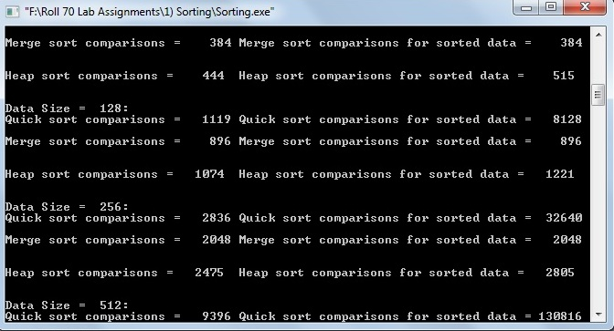

# Quick Sort, Merge Sort, Heap Sort

### Source Code

```
#include<assert.h>
#include<stdio.h>
#include<stdlib.h>

#define MAX 	32767
#define LIMIT 	15000

void quicksort(double *,int,int);
int partition(double *,int,int);
void mergesort(double *,int,int);
void merge(double *,int,int,int);
void heapsort(double [],int);
void buildmaxheap(double [],int);
void maxheapify(double [],int,int);

long int	count;

//int main(int argc,char **argv)
int main() {

	int	i,n;
	FILE 	*fp;
	double	*DATA,*A,*B,*C;

	//assert(argc == 2);

	fp = fopen("Data.txt","r");
	assert(fp);

	DATA = (double *)calloc(sizeof(double),LIMIT);
	assert(DATA);

	for(i=0; i<LIMIT; i++)
		fscanf(fp,"%lf",&DATA[i]);

	n = 2;
	while (n <= LIMIT) {


		A = (double *)calloc(sizeof(double),n); //array to perform quicksort.
		assert(A);
		B = (double *)calloc(sizeof(double),n); //array to perform mergesort.
		assert(B);
		C = (double *)calloc(sizeof(double),n); //array to perform heapsort.
		assert(C);

		for (i=0; i<n; i++) {
			A[i] = DATA[i];
			B[i] = DATA[i];
			C[i] = DATA[i];
		}

		printf("Data Size = %4d:\n");

		count = 0;
		quicksort(A,0,n-1);
		printf("Quick sort comparisons = %6ld\t",count);

		count = 0;
		quicksort(A,0,n-1);
		printf("Quick sort comparisons for sorted data = %6ld\n\n",count);


		count = 0;
		mergesort(B,0,n-1);
		printf("Merge sort comparisons = %6ld\t",count);

		count = 0;
		mergesort(B,0,n-1);
		printf("Merge sort comparisons for sorted data = %6ld\n\n",count);

        count = 0;
        heapsort(C,n-1);
        printf("\nHeap sort comparisons = %6ld\t",count);

		count = 0;
        heapsort(C,n-1);
        printf("Heap sort comparisons for sorted data = %6ld\n\n\n",count);

		n = n*2;

		free(A);
		free(B);
		free(C);
	}

	free(DATA);
	return EXIT_SUCCESS;
}

void quicksort(double *A,int p,int r) {

	int	q;

	if(p<r)	{

		q = partition(A,p,r);
		quicksort(A,p,q-1);
		quicksort(A,q+1,r);
	}
}

int partition(double *A,int p,int r) {

	int 	s,x,q;
	double 	temp;

	x = A[p];
	q = p;

	for(s=p+1 ; s<=r ; s++) {

		if (A[s]<x) {

			q++;
			temp = A[q];
			A[q] = A[s];
			A[s] = temp;
		}
		count++;
	}
	temp = A[p];
	A[p] = A[q];
	A[q] = temp;

	return q;
}


void mergesort(double *A,int p, int r) {

	int	q;

	if (p<r) {
		q = (p+r)/2;
		mergesort(A,p,q);
		mergesort(A,q+1,r);
		merge(A,p,q,r);
	}

}


void merge(double *A, int p, int q, int r) {

	int	i,j,m,n,k;
	double 	*L,*R;

	m = q - p + 1;
	n = r - q;

	L = (double *)calloc(sizeof(double),m+1); assert(L);
	R = (double *)calloc(sizeof(double),n+1); assert(R);

	for (i=0; i<m; i++)
		L[i] = A[p+i];
	for (j=0; j<n; j++)
		R[j] = A[q+1+j];

	L[m] = L[n] = MAX;

	i = j = 0;

	for (k=p; k<=r; k++){

		A[k] = (L[i] <= R[j]) ? L[i++] : R[j++];
		count++;
	}
	//free(L);free(R);
}


void heapsort(double A[],int n)
{
	int i,heapsize=n;
	double temp;

	buildmaxheap(A,n);

	for(i=n; i>=1; i--)
	{
		temp=A[0];
		A[0]=A[i];
		A[i]=temp;

		heapsize--;

		maxheapify(A,0,heapsize);
	}
}

void buildmaxheap(double A[],int n)
{
	int i;

	for(i=n/2; i>=0; i--)
	{
		maxheapify(A,i,n);
	}
}

void maxheapify(double A[],int i,int n)
{
	int l,r,max;
	double temp;

	l=2*i;
	r=2*i+1;

	if(l<=n && A[l]>A[i])
	{
		max=l;
		count++;
	}
	else
		max=i;

	if(r<=n && A[r]>A[max])
	{
		max=r;
		count++;
	}

	if(max!=i)
	{
		temp=A[i];
		A[i]=A[max];
		A[max]=temp;

		maxheapify(A,max,n);
	}

}
```

### Data File [Download Here](Data.txt)

### Output

