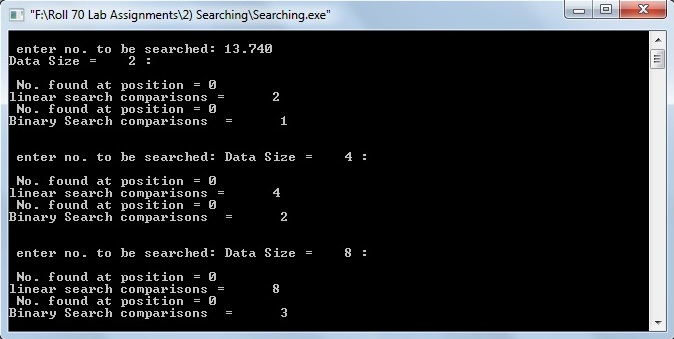

# Linear Search, Binary Search

### Source Code

```
#include<stdio.h>
#include<assert.h>
#include<stdlib.h> //for file operations

#define LIMIT 	15000

void linearsearch(double *,int,double);
void binarysearch(double *,int,int,double);

long int	count;

//int main(int argc,char **argv)
int main() {

	int	i,n;
	FILE 	*fp;
	double	*DATA,*A,*B;
    double key;

	//assert(argc == 2);

	fp = fopen("Data.txt","r");
	assert(fp);

	DATA = (double *)calloc(sizeof(double),LIMIT);
	assert(DATA);

	for(i=0; i<LIMIT; i++)
		fscanf(fp,"%lf",&DATA[i]);

	n = 2;
	while (n <= LIMIT) {

        printf("\n enter no. to be searched: ");
        scanf("%ld",&key);

		A = (double *)calloc(sizeof(double),n); //array to perform linear search.
		assert(A);
		B = (double *)calloc(sizeof(double),n); //array to perform binary search.
		assert(B);

		for (i=0; i<n; i++) {
			A[i] = DATA[i];
			B[i] = DATA[i];
		}

		printf("Data Size = %4d : \n",n);

		count = 0;
		linearsearch(A,n-1,key);
		printf("linear search comparisons = %6ld\t",count);

		count = 0;
		binarysearch(B,0,n-1,key);
		printf("Binary Search comparisons  = %6ld\n\n",count);

		n = n*2;

		free(A);
		free(B);
	}

	free(DATA);
	return EXIT_SUCCESS;
}


void linearsearch(double *A,int n,double key)
{
	int i,loc=0;

	for(i=0;i<=n;i++)
	{
        count++;
		if(A[i]==key)
		{
			loc=i;
			break;
		}
	}
	printf("\n No. found at position = %d \n",loc);
}

void binarysearch(double *A,int lb,int ub,double key)
{

	int f=lb,l=ub,pos=0,m;
	while(f<=l && pos==0)
	{
		m=(f+l)/2;
        count++;

		if(A[m]==key)
			pos=m;
		else if(A[m]>key)
			l=m-1;
		else
			f=m+1;
	}
	printf("\n No. found at position = %d \n",pos);
}
```

### Data File [Download Here](Data.txt)

### Output

