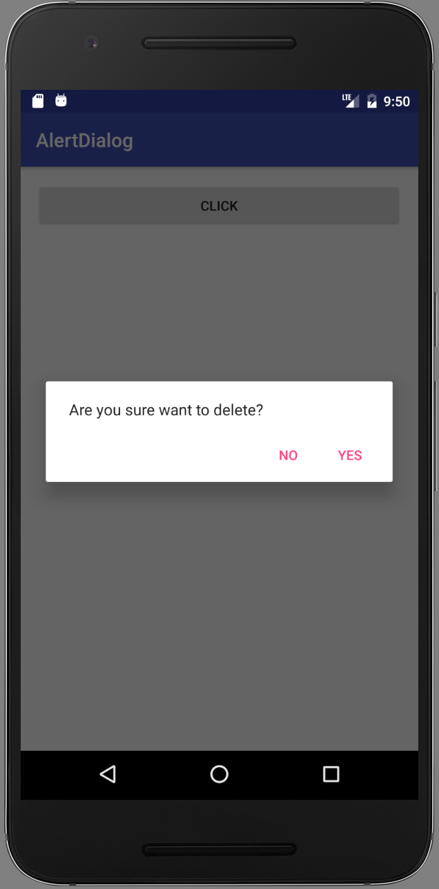
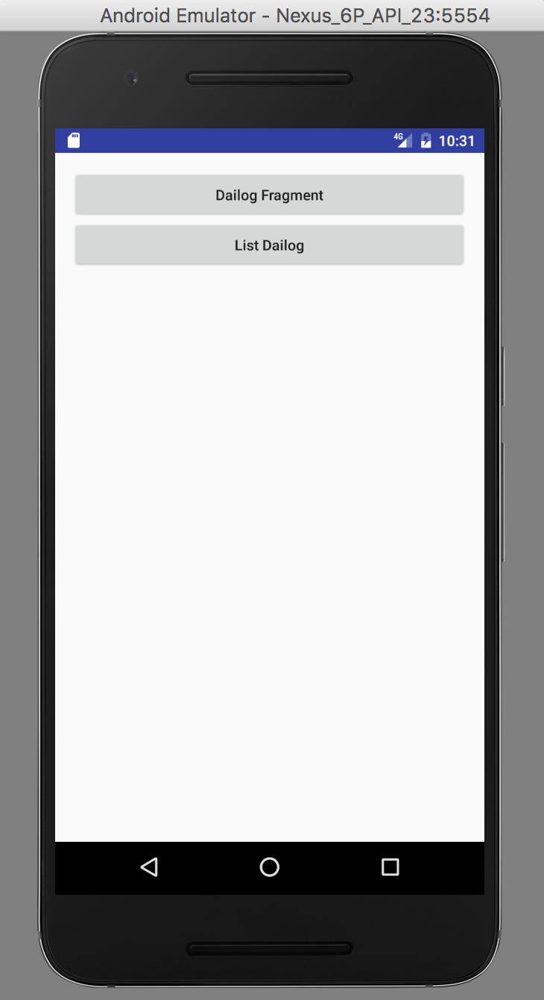
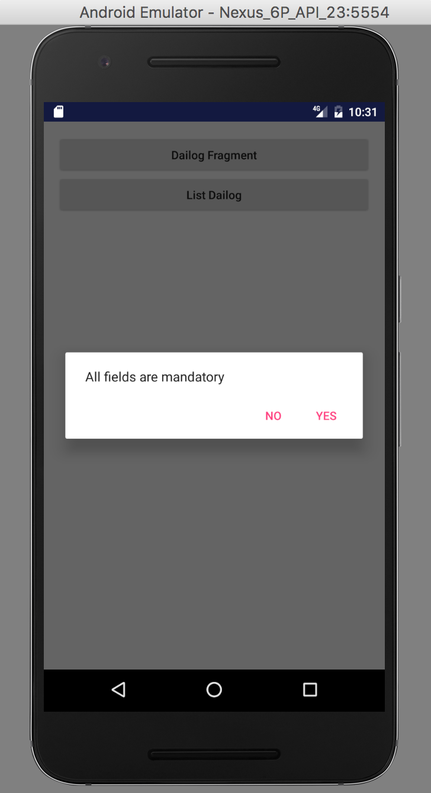
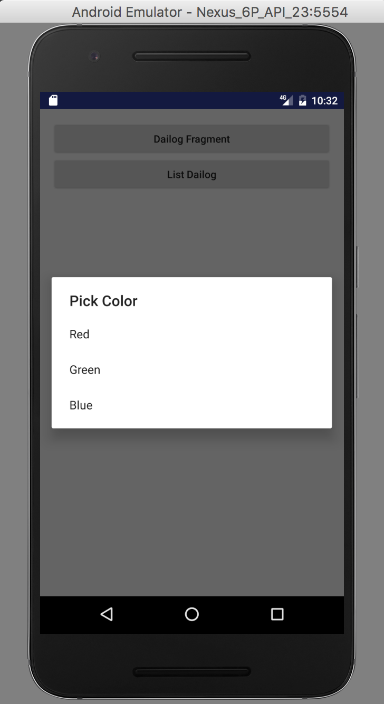

# AlertDialog In Android

An `AlertDialog` can:

- Show title 
- Show upto three buttons
- Show list of items
- Show custom layout (We have to use DialogFragment as a container for dialog)

### Simple Alert Dialog

**Step 1**

Create a project.

Inside the `build.gradle (Module: app)`, in the dependencies, change the `compile 'com.android.support:appcompat-v7:25.+'` into `compile 'com.android.support:appcompat-v7:+'`.

**Step 2**

In `activity_main.xml`, write:

```
<?xml version="1.0" encoding="utf-8"?>
<RelativeLayout xmlns:android="http://schemas.android.com/apk/res/android"
    xmlns:tools="http://schemas.android.com/tools"
    android:id="@+id/activity_main"
    android:layout_width="match_parent"
    android:layout_height="match_parent"
    android:paddingBottom="@dimen/activity_vertical_margin"
    android:paddingLeft="@dimen/activity_horizontal_margin"
    android:paddingRight="@dimen/activity_horizontal_margin"
    android:paddingTop="@dimen/activity_vertical_margin"
    tools:context="com.example.shridharmali.alertdialog.MainActivity">

    <Button
        android:layout_width="match_parent"
        android:layout_height="wrap_content"
        android:text="Click"
        android:onClick="showAlert"
        />
</RelativeLayout>

```

**Step 3**

In `MainActivity.java`, write:

```
package com.example.aniruddhadas.alertdialog;

import android.support.v7.app.AppCompatActivity;
import android.os.Bundle;
import android.content.DialogInterface;
import android.support.v7.app.AlertDialog;
import android.view.View;
import android.widget.Toast;

public class MainActivity extends AppCompatActivity {

    @Override
    protected void onCreate(Bundle savedInstanceState) {
        super.onCreate(savedInstanceState);
        setContentView(R.layout.activity_main);
    }

    public void showAlert(View v) {
        AlertDialog.Builder alertDialogBuilder = new AlertDialog.Builder(this);
        alertDialogBuilder.setMessage("Are you sure want to delete?");
        alertDialogBuilder.setPositiveButton("Yes", new DialogInterface.OnClickListener() {
            @Override
            public void onClick(DialogInterface dialog, int which) {
                Toast.makeText(MainActivity.this,"Yes button clicked", Toast.LENGTH_LONG).show();
            }
        });

        alertDialogBuilder.setNegativeButton("No", new DialogInterface.OnClickListener() {
            @Override
            public void onClick(DialogInterface dialog, int which) {
                Toast.makeText(MainActivity.this,"No button clicked", Toast.LENGTH_SHORT).show();
            }
        });

        AlertDialog alert = alertDialogBuilder.create();
        alert.show();
    }
}
```

**Step 4**

The output looks like:



----

### Alert dialog using Fragment and List of options in Alert

**Step 5**

Right click and add new java class and name it `AlertFragment`. 

Inside it write:

```
package com.example.aniruddhadas.alertdialog;

import android.app.Dialog;
import android.content.DialogInterface;
import android.os.Bundle;
import android.support.annotation.NonNull;
import android.support.v4.app.DialogFragment;
import android.support.v7.app.AlertDialog;
import android.widget.Toast;

import static com.example.aniruddhadas.alertdialog.R.styleable.AlertDialog;

public class AlertFragment extends DialogFragment {
    @NonNull
    @Override
    public Dialog onCreateDialog(Bundle savedInstanceState) {
        AlertDialog.Builder builder =  new AlertDialog.Builder(getActivity());
        builder.setMessage("All fields are mandatory");
        builder.setPositiveButton("Yes", new DialogInterface.OnClickListener() {
            @Override
            public void onClick(DialogInterface dialog, int which) {
                Toast.makeText(getActivity(),"Yes button clicked", Toast.LENGTH_LONG).show();
            }
        });

        builder.setNegativeButton("No", new DialogInterface.OnClickListener() {
            @Override
            public void onClick(DialogInterface dialog, int which) {
                Toast.makeText(getActivity(),"No button clicked", Toast.LENGTH_SHORT).show();
            }
        });

        AlertDialog alert = builder.create();
        return (alert);
    }
}
```

**Step 6**

Add another java class `ListAlertFragmentDialog` and inside it, write:

```
package com.example.aniruddhadas.alertdialog;

import android.app.Dialog;
import android.content.DialogInterface;
import android.os.Bundle;
import android.support.annotation.NonNull;
import android.support.v4.app.DialogFragment;
import android.support.v7.app.AlertDialog;
import android.widget.Toast;

import java.lang.reflect.Array;
import java.util.List;

public class ListAlertFragmentDialog extends DialogFragment {

    @NonNull
    @Override
    public Dialog onCreateDialog(Bundle savedInstanceState) {

        AlertDialog.Builder builder = new AlertDialog.Builder(getActivity());

        builder.setTitle(R.string.pick_color)
                .setItems(R.array.colors_array, new DialogInterface.OnClickListener() {
                    public void onClick(DialogInterface dialog, int which) {
                        String[] arr = getResources().getStringArray(R.array.colors_array);
                        // The 'which' argument contains the index position of the selected item
                        Toast.makeText(getActivity(), arr[which].toString(), Toast.LENGTH_SHORT).show();
                    }
                });
        return builder.create();
    }
}
```

**Step 7**

In `MainActivity.java`, write:

```
package com.example.aniruddhadas.alertdialog;

import android.content.DialogInterface;
import android.support.v4.app.FragmentActivity;
import android.support.v7.app.AlertDialog;
import android.support.v7.app.AppCompatActivity;
import android.os.Bundle;
import android.view.View;
import android.widget.Toast;

import static com.example.aniruddhadas.alertdialog.R.styleable.AlertDialog;

public class MainActivity extends FragmentActivity {

    @Override
    protected void onCreate(Bundle savedInstanceState) {
        super.onCreate(savedInstanceState);
        setContentView(R.layout.activity_main);
    }

    public void dialogFragment(View v) {
        AlertFragment alert = new AlertFragment();
        alert.show(getSupportFragmentManager(), "Alert_Fragment");
    }

    public void listDialog(View v) {
        ListAlertFragmentDialog  listAlert = new ListAlertFragmentDialog();
        listAlert.show(getSupportFragmentManager(), "list_alert");
    }
}
```

**Step 8**

Inside `activity_main.xml`, write:

```
<?xml version="1.0" encoding="utf-8"?>
<RelativeLayout xmlns:android="http://schemas.android.com/apk/res/android"
xmlns:tools="http://schemas.android.com/tools"
android:id="@+id/activity_main"
android:layout_width="match_parent"
android:layout_height="match_parent"
android:paddingBottom="@dimen/activity_vertical_margin"
android:paddingLeft="@dimen/activity_horizontal_margin"
android:paddingRight="@dimen/activity_horizontal_margin"
android:paddingTop="@dimen/activity_vertical_margin"
tools:context="com.example.aniruddhadas.alertdialog.MainActivity">

<Button
    android:layout_width="match_parent"
    android:layout_height="wrap_content"
    android:textAllCaps="false"
    android:text="Dailog Fragment"
    android:id="@+id/fragmentDialog"
    android:onClick="dialogFragment"

    />

<Button
    android:layout_width="match_parent"
    android:layout_height="wrap_content"
    android:layout_below="@id/fragmentDialog"
    android:text="List Dailog"
    android:onClick="listDialog"
    android:textAllCaps="false"
    />

</RelativeLayout>
```

**Step 9**

Finally in `strings.xml`, write:

```
<resources>
    <string name="app_name">AlertDialog</string>

    <!-- TODO: Remove or change this placeholder text -->
    <string name="hello_blank_fragment">Hello blank fragment</string>
    <string name="pick_color"> Pick Color </string>

    <string-array name="colors_array">
        <item> Red </item>
        <item> Green </item>
        <item> Blue </item>
    </string-array>

</resources>
```

**Step 10**

The output looks like:





