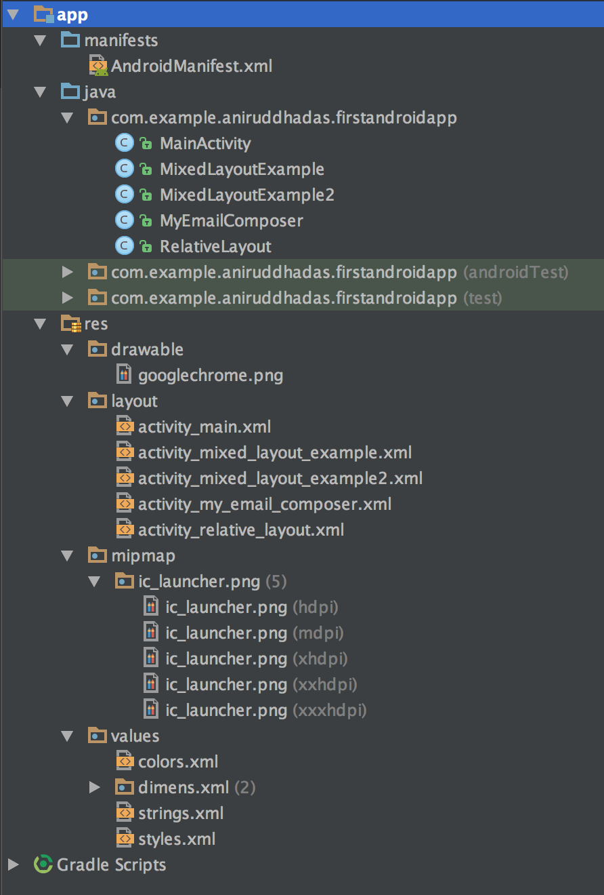
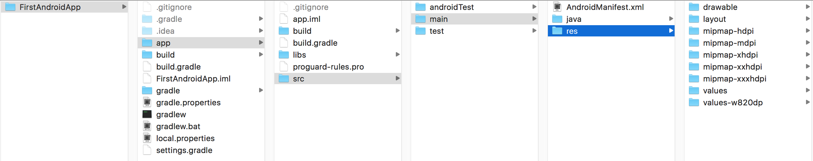
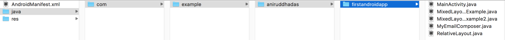

# Android Basics

### Android Jargons with iOS Analogy

- Activity = Screen

- Every activity has two parts (one activity_layout.xml and a corresponding activity.java file) just like a storyboard and a ViewController.swift

- Layout = Storyboard

- AndroidManifest.xml = Info.plist

- Gradle/ANT/Maven = Build Tools which also handles dependencies. It compiles and zips the binary into .apk in Android.

	In iOS, Xcode does the build/archive process for us and generates .ipa, and Cocoapods/Carthage handles dependencies for us.

- Gradle is superior of ANT and Maven, as it has Ant’s power and flexibility with Maven’s life-cycle and ease of use. Refer this [article](https://technologyconversations.com/2014/06/18/build-tools/).

- The project directory structure in Android:



- The `main` folder has two folders: `java` and `res`.

- The `res` folder has assets like icons, layouts, color codes, strings (constants) file.



- The `main` folder has all the java files, and the sub-folder structure according to identifier, i.e. `com.example.aniruddha.firstandroidapp`



- Namespace = Android's custom xml tags belong here.

	```
	xmlns:android="http://schemas.android.com/apk/res/android"
	```

- Linear Layout = Stack View (Vertical, Horizontal) - The order in which you place elements, they appear on screen in the exact same order.

- Relative Layout = The elements can be placed in any order, but it will appear on the screen only according to the relative position mentioned in the layout.

- Intent = Segue. So, before intent is fired, we can pass some values to the next screen.

- Fragments = ContainerView