# FirstAndroidApp

### Create a project

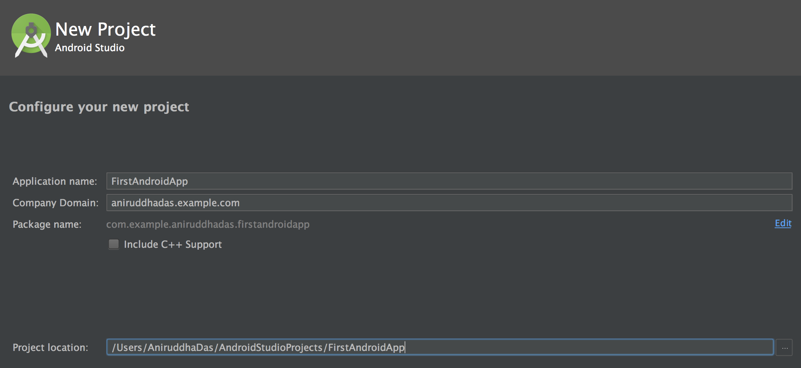

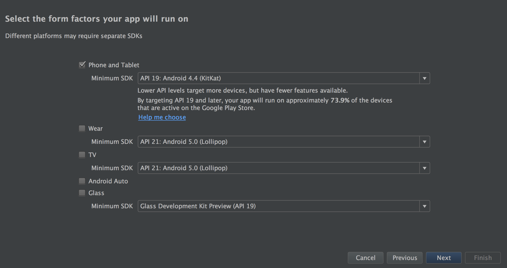

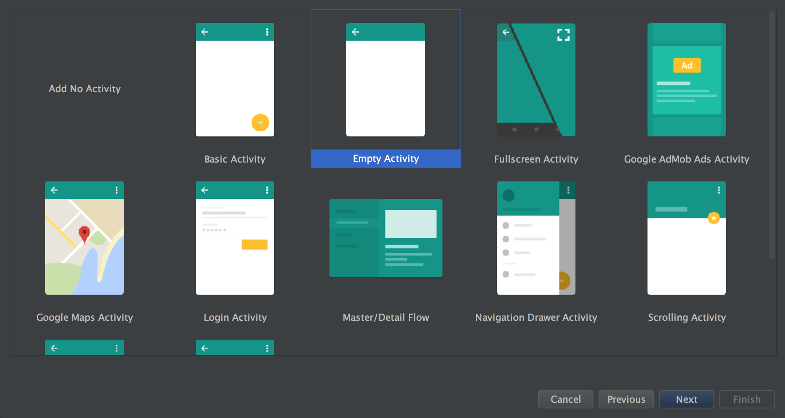

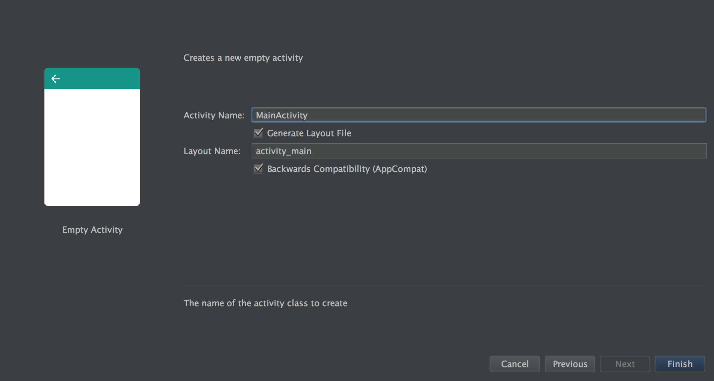

### Screen 1

Inside `res -> layout -> activity_main.xml -> Text Mode`, write this:

```
<?xml version="1.0" encoding="utf-8"?>


<LinearLayout xmlns:android="http://schemas.android.com/apk/res/android"
    xmlns:tools="http://schemas.android.com/tools"
    android:id="@+id/activity_main"
    android:layout_width="match_parent"
    android:layout_height="match_parent"
    android:orientation="vertical"
    android:padding="16dp"
    tools:context="com.example.aniruddhadas.firstandroidapp.MainActivity">

    <TextView
        android:layout_width="match_parent"
        android:layout_height="wrap_content"
        android:text="@string/greetings"
        android:textColor="@android:color/holo_green_dark"
        android:textSize="24sp"/>

    <TextView
        android:layout_width="match_parent"
        android:layout_height="wrap_content"
        android:text="@string/guestlist"
        android:textColor="@android:color/holo_orange_dark"
        android:textSize="20sp"/>

    <TextView
        android:layout_width="match_parent"
        android:layout_height="wrap_content"
        android:text="@string/aniruddha"
        android:layout_weight="1"/>

    <TextView
        android:layout_width="match_parent"
        android:layout_height="wrap_content"
        android:text="@string/sagar"
        android:layout_weight="1"/>

    <TextView
        android:layout_width="match_parent"
        android:layout_height="wrap_content"
        android:text="@string/shridhar"
        android:id="@+id/textview_shridhar"
        android:layout_weight="1"/>

    <TextView
        android:layout_width="match_parent"
        android:layout_height="wrap_content"
        android:text="@string/prema"
        android:layout_weight="1"/>

    <Button
        android:layout_width="wrap_content"
        android:layout_height="wrap_content"
        android:text="Next"
        android:textColor="@color/colorAccent"
        android:textAllCaps="false"
        android:onClick="sendMessage" />

</LinearLayout>
```

It's a good practice to seperate out all hardcoded values into the `strings.xml` file.

```
<resources>
    <string name="app_name">Birthday</string>
    <string name="greetings">Hey! Happy Birthday</string>
    <string name="guestlist">Guest List...</string>
    <string name="aniruddha">Aniruddha Das</string>
    <string name="sagar">Sagar Kothari</string>
    <string name="shridhar">Shridhar Mali</string>
    <string name="prema">Prema Janoti</string>
</resources>
```

Next, let's say I want to send some data to the next screen. For that inside `java -> com.example.aniruddhadas.firstandroidapp -> MainActivity.java`, write this:

```
package com.example.aniruddhadas.firstandroidapp;

import android.support.v7.app.AppCompatActivity;
import android.os.Bundle;
import android.content.Intent;
import android.view.View;
import android.widget.TextView;

public class MainActivity extends AppCompatActivity {

    public final static String EXTRA_MESSAGE = "com.aniruddha.FirstAndroidApp.MESSAGE";

    @Override
    protected void onCreate(Bundle savedInstanceState) {
        super.onCreate(savedInstanceState);
        setContentView(R.layout.activity_main);
    }

    /**
     * Called when the user clicks the Send button
     */
    public void sendMessage(View view) {

        TextView textView = (TextView) findViewById(R.id.textview_shridhar);
        String messageToPass = textView.getText().toString();

        Intent intent = new Intent(this, MyEmailComposer.class);
        intent.putExtra(EXTRA_MESSAGE, messageToPass);
        startActivity(intent);
    }
}
```

### Screen 2

Next, right click on `java -> com.example.aniruddhadas.firstandroidapp` and create a new empty activity.

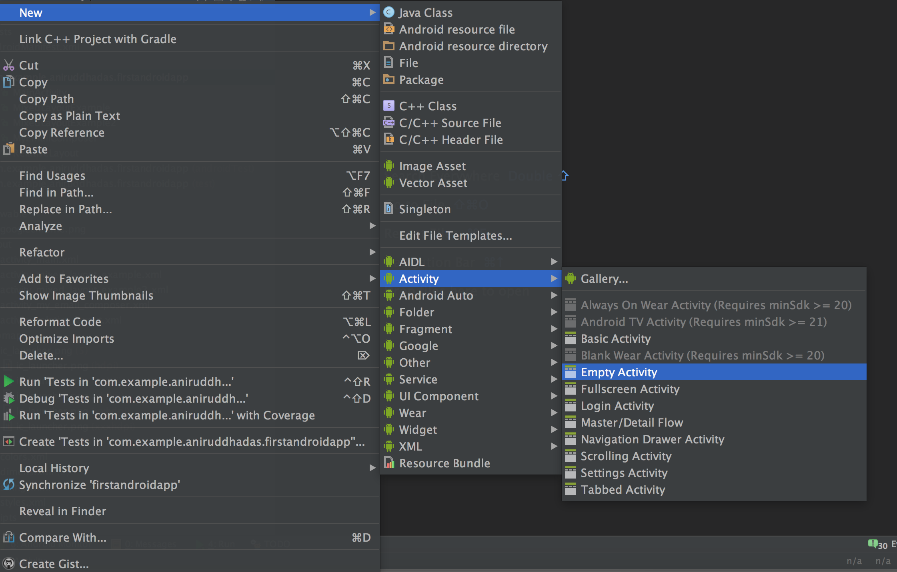

Name it `MyEmailComposer`. And inside `activity_my_email_composer.xml`, write this:

```
<?xml version="1.0" encoding="utf-8"?>
<LinearLayout xmlns:android="http://schemas.android.com/apk/res/android"
    xmlns:tools="http://schemas.android.com/tools"
    android:id="@+id/activity_my_email_composer"
    android:orientation="vertical"
    android:layout_width="match_parent"
    android:layout_height="match_parent"
    android:paddingBottom="@dimen/activity_vertical_margin"
    android:paddingLeft="@dimen/activity_horizontal_margin"
    android:paddingRight="@dimen/activity_horizontal_margin"
    android:paddingTop="@dimen/activity_vertical_margin"
    tools:context="com.example.aniruddhadas.firstandroidapp.MyEmailComposer">

    <TextView
        android:layout_width="match_parent"
        android:layout_height="wrap_content"
        android:text="Name"
        android:id="@+id/textview_message"/>

    <EditText
        android:layout_width="match_parent"
        android:layout_height="wrap_content"
        android:layout_gravity="top"
        android:lines="1"
        android:inputType="textEmailAddress"
        android:hint="From" />

    <EditText
        android:layout_width="match_parent"
        android:layout_height="wrap_content"
        android:layout_gravity="top"
        android:lines="1"
        android:inputType="textEmailAddress"
        android:hint="To" />

    <EditText
        android:layout_width="match_parent"
        android:layout_height="wrap_content"
        android:layout_gravity="top"
        android:lines="1"
        android:inputType="text"
        android:hint="Subject" />

    <EditText
        android:layout_width="match_parent"
        android:layout_height="wrap_content"
        android:gravity="top"
        android:layout_weight="1"
        android:hint="Compose Email" />

    <LinearLayout
        android:layout_width="match_parent"
        android:layout_height="wrap_content"
        android:orientation="horizontal">

        <Button
            android:layout_width="wrap_content"
            android:layout_height="wrap_content"
            android:layout_weight="1"
            android:text="Call" />

        <Button
            android:layout_width="wrap_content"
            android:layout_height="wrap_content"
            android:layout_weight="1"
            android:text="Save" />

        <Button
            android:layout_width="wrap_content"
            android:layout_height="wrap_content"
            android:layout_weight="1"
            android:text="Website" />

    </LinearLayout>


    <LinearLayout
        android:layout_width="match_parent"
        android:layout_height="wrap_content"
        android:orientation="horizontal">

        <Button
            android:layout_width="wrap_content"
            android:layout_height="wrap_content"
            android:layout_weight="1"
            android:text="Cancel" />

        <Button
            android:layout_width="wrap_content"
            android:layout_height="wrap_content"
            android:layout_weight="1"
            android:text="Send"
            android:onClick="sendBtnTapped"/>

    </LinearLayout>

</LinearLayout>
```

Inside `java -> com.example.aniruddhadas.firstandroidapp -> MyEmailComposer.java`, write this:

```
package com.example.aniruddhadas.firstandroidapp;

import android.content.Intent;
import android.support.v7.app.AppCompatActivity;
import android.os.Bundle;
import android.view.View;
import android.widget.TextView;

public class MyEmailComposer extends AppCompatActivity {

    @Override
    protected void onCreate(Bundle savedInstanceState) {
        super.onCreate(savedInstanceState);
        setContentView(R.layout.activity_my_email_composer);

        Intent intent = getIntent();
        String message = intent.getStringExtra(MainActivity.EXTRA_MESSAGE);
        TextView textView = (TextView) findViewById(R.id.textview_message);
        textView.setText(message);
    }


    /**
     * Called when the user clicks the Send button
     */
    public void sendBtnTapped(View view) {
        Intent intent = new Intent(this, RelativeLayout.class);
        startActivity(intent);
    }
}
```

### Screen 3

Create a new activity named `RelativeLayout`.

Inside the `activity_relative_layout.xml`, write this:

```
<?xml version="1.0" encoding="utf-8"?>
<RelativeLayout xmlns:android="http://schemas.android.com/apk/res/android"
    xmlns:tools="http://schemas.android.com/tools"
    android:id="@+id/activity_relative_layout"
    android:layout_width="match_parent"
    android:layout_height="match_parent"
    android:paddingBottom="@dimen/activity_vertical_margin"
    android:paddingLeft="@dimen/activity_horizontal_margin"
    android:paddingRight="@dimen/activity_horizontal_margin"
    android:paddingTop="@dimen/activity_vertical_margin"
    tools:context="com.example.aniruddhadas.firstandroidapp.RelativeLayout">

    <TextView
        android:id="@+id/txtLyla"
        android:layout_width="wrap_content"
        android:layout_height="wrap_content"
        android:layout_alignParentBottom="true"
        android:layout_alignParentLeft="true"
        android:background="@android:color/black"
        android:text="Lyla"
        android:textColor="@android:color/white"
        android:textSize="30sp" />

    <TextView
        android:id="@+id/txtJennie"
        android:layout_width="wrap_content"
        android:layout_height="wrap_content"
        android:layout_alignParentBottom="true"
        android:layout_alignParentRight="true"
        android:background="@android:color/black"
        android:text="Jennie"
        android:textColor="@android:color/white"
        android:textSize="30sp" />

    <TextView
        android:id="@+id/txtBen"
        android:layout_width="wrap_content"
        android:layout_height="wrap_content"
        android:layout_alignParentTop="true"
        android:layout_centerHorizontal="true"
        android:background="@android:color/darker_gray"
        android:text="Ben"
        android:textColor="@android:color/white"
        android:textSize="30sp" />

    <TextView
        android:id="@+id/txtKunal"
        android:layout_width="wrap_content"
        android:layout_height="wrap_content"
        android:layout_toLeftOf="@id/txtBen"
        android:background="@android:color/black"
        android:text="Kunal"
        android:textColor="@android:color/white"
        android:textSize="30sp" />

    <TextView
        android:id="@+id/txtKagure"
        android:layout_width="wrap_content"
        android:layout_height="wrap_content"
        android:layout_toRightOf="@id/txtBen"
        android:background="@android:color/black"
        android:text="Kagure"
        android:textColor="@android:color/white"
        android:textSize="30sp" />

    <TextView
        android:id="@+id/txtNatalie"
        android:layout_width="wrap_content"
        android:layout_height="wrap_content"
        android:layout_above="@id/txtLyla"
        android:background="@android:color/darker_gray"
        android:text="Natalie"
        android:textColor="@android:color/white"
        android:textSize="30sp" />

    <TextView
        android:id="@+id/txtOmoju"
        android:layout_width="wrap_content"
        android:layout_height="wrap_content"
        android:layout_above="@id/txtJennie"
        android:layout_alignRight="@id/txtJennie"
        android:background="@android:color/darker_gray"
        android:text="Omoju"
        android:textColor="@android:color/white"
        android:textSize="30sp" />

    <TextView
        android:id="@+id/txtSagar"
        android:layout_width="wrap_content"
        android:layout_height="wrap_content"
        android:layout_alignParentBottom="true"
        android:layout_toRightOf="@id/txtLyla"
        android:background="@android:color/darker_gray"
        android:text="SagarR"
        android:textColor="@android:color/white"
        android:textSize="30sp" />

    <Button
        android:id="@+id/btnNext"
        android:layout_width="wrap_content"
        android:layout_height="wrap_content"
        android:layout_centerInParent="true"
        android:background="@android:color/darker_gray"
        android:text="Next"
        android:textColor="@android:color/white"
        android:textSize="30sp"
        android:onClick="btnNextClicked"/>

</RelativeLayout>
```

And inside the `RelativeLayout.java`, write this:

```
package com.example.aniruddhadas.firstandroidapp;

import android.content.Intent;
import android.support.v7.app.AppCompatActivity;
import android.os.Bundle;
import android.view.View;

public class RelativeLayout extends AppCompatActivity {

    @Override
    protected void onCreate(Bundle savedInstanceState) {
        super.onCreate(savedInstanceState);
        setContentView(R.layout.activity_relative_layout);
    }

    /**
     * Called when the user clicks the Send button
     */
    public void btnNextClicked(View view) {
        Intent intent = new Intent(this, MixedLayoutExample.class);
        startActivity(intent);
    }
}
```

### Screen 4

Create a new activity named `MixedLayoutExample`.

Inside the `activity_mixed_layout_example.xml`, write this:

```
<?xml version="1.0" encoding="utf-8"?>
<LinearLayout xmlns:android="http://schemas.android.com/apk/res/android"
    xmlns:app="http://schemas.android.com/apk/res-auto"
    xmlns:tools="http://schemas.android.com/tools"
    android:id="@+id/activity_mixed_layout_example"
    android:layout_width="match_parent"
    android:layout_height="match_parent"
    android:paddingBottom="@dimen/activity_vertical_margin"
    android:paddingLeft="@dimen/activity_horizontal_margin"
    android:paddingRight="@dimen/activity_horizontal_margin"
    android:paddingTop="@dimen/activity_vertical_margin"
    android:orientation="vertical"
    tools:context="com.example.aniruddhadas.firstandroidapp.MixedLayoutExample">


    <LinearLayout
        android:layout_width="wrap_content"
        android:layout_height="wrap_content"
        android:orientation="horizontal">

        <ImageView
            android:layout_width="150dp"
            android:layout_height="150dp"
            app:srcCompat="@mipmap/ic_launcher"
            />


        <LinearLayout
            android:layout_width="wrap_content"
            android:layout_height="wrap_content"
            android:orientation="vertical">

            <TextView
                android:layout_width="match_parent"
                android:layout_height="wrap_content"
                android:text="@string/aniruddha"
                android:layout_weight="1"/>

            <TextView
                android:layout_width="match_parent"
                android:layout_height="wrap_content"
                android:text="@string/sagar"
                android:layout_weight="1"/>

            <TextView
                android:layout_width="match_parent"
                android:layout_height="wrap_content"
                android:text="@string/shridhar"
                android:id="@+id/textview_shridhar"
                android:layout_weight="1"/>


        </LinearLayout>


    </LinearLayout>

    <Button
        android:layout_width="wrap_content"
        android:layout_height="wrap_content"
        android:background="@android:color/darker_gray"
        android:text="Go Next"
        android:textColor="@android:color/white"
        android:textSize="30sp"
        android:onClick="btnGoNextClicked"/>


</LinearLayout>
```

And inside the `MixedLayoutExample.java`, write this:

```
package com.example.aniruddhadas.firstandroidapp;

import android.content.Intent;
import android.support.v7.app.AppCompatActivity;
import android.os.Bundle;
import android.view.View;

public class MixedLayoutExample extends AppCompatActivity {

    @Override
    protected void onCreate(Bundle savedInstanceState) {
        super.onCreate(savedInstanceState);
        setContentView(R.layout.activity_mixed_layout_example);
    }

    public void btnGoNextClicked(View view) {
        Intent intent = new Intent(this, MixedLayoutExample2.class);
        startActivity(intent);
    }
}
```

### Screen 5

Create a new activity named `MixedLayoutExample2`.

Inside the `activity_mixed_layout_example2.xml`, write this:

```
<?xml version="1.0" encoding="utf-8"?>
<LinearLayout xmlns:android="http://schemas.android.com/apk/res/android"
    xmlns:app="http://schemas.android.com/apk/res-auto"
    xmlns:tools="http://schemas.android.com/tools"
    android:id="@+id/activity_mixed_layout_example2"
    android:layout_width="match_parent"
    android:layout_height="match_parent"
    android:orientation="vertical"
    tools:context="com.example.aniruddhadas.firstandroidapp.MixedLayoutExample2">


    <RelativeLayout
            android:layout_width="match_parent"
            android:layout_height="0dp"
            android:layout_weight="1">

            <LinearLayout
                android:layout_width="match_parent"
                android:layout_height="wrap_content"
                android:padding="20dp"
                android:layout_gravity="center"
                android:layout_centerVertical="true"
                android:orientation="vertical">

                <TextView
                    android:layout_width="match_parent"
                    android:layout_height="wrap_content"
                    android:id="@+id/txtWelcome"
                    android:textSize="25sp"
                    android:textStyle="bold"
                    android:textAlignment="center"
                    android:padding="10dp"
                    android:text="Welcome to Chrome" />

                <ImageView
                    android:layout_width="200dp"
                    android:layout_height="200dp"
                    android:layout_gravity="center"
                    android:id="@+id/imageChrome"
                    android:padding="10dp"
                    android:background="@android:color/darker_gray"
                    android:src="@drawable/googlechrome" />

                <TextView
                    android:layout_width="match_parent"
                    android:layout_height="wrap_content"
                    android:text="By using this app, you agree to our terms and conditions"
                    android:textAlignment="center"
                    android:padding="10dp"
                    android:id="@+id/txtByUsingThisApp"
                    android:textSize="16sp" />

                <RelativeLayout
                    android:layout_width="match_parent"
                    android:layout_height="wrap_content"
                    android:orientation="horizontal"
                    android:padding="20dp">

                    <CheckBox
                        android:layout_width="wrap_content"
                        android:layout_height="wrap_content"
                        android:id="@+id/imageCheck"
                        android:layout_centerVertical="true"
                        />


                    <TextView
                        android:id="@+id/txtHelp"
                        android:layout_width="match_parent"
                        android:layout_height="wrap_content"
                        android:layout_gravity="center"
                        android:padding="10dp"
                        android:text="Help make Chrome better by sending usage statistics and crash reports to Google."
                        android:textSize="16sp"
                        android:layout_toRightOf="@id/imageCheck"/>

                </RelativeLayout>

            </LinearLayout>

        </RelativeLayout>

        <Button
            android:layout_width="match_parent"
            android:layout_height="wrap_content"
            android:text="Accept And Continue"
            android:background="#ffffff" />

</LinearLayout>
```

One more thing you need is a image for Google Chrome logo. Download one and save it as `googlechrome.png` under `drawable` folder, and then synchronize the folder. (**The file name should be saved in lower case**)

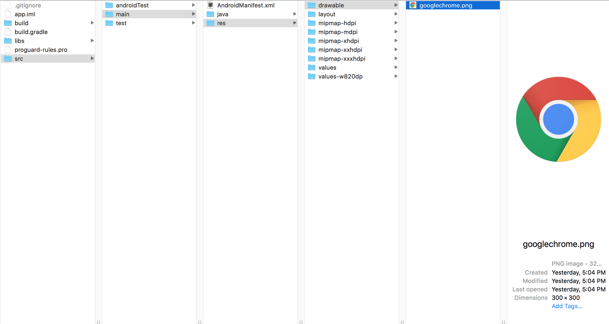

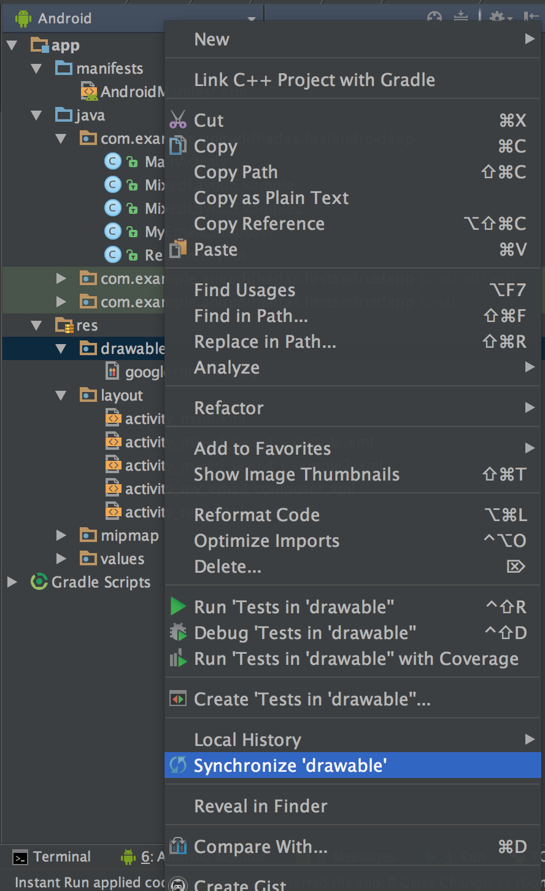

And inside the `MixedLayoutExample2.java`, leave it as it is by default, because we are not going to any new screen, as it is the last screen for our example.

### Output

When you run the app, you can see something like:

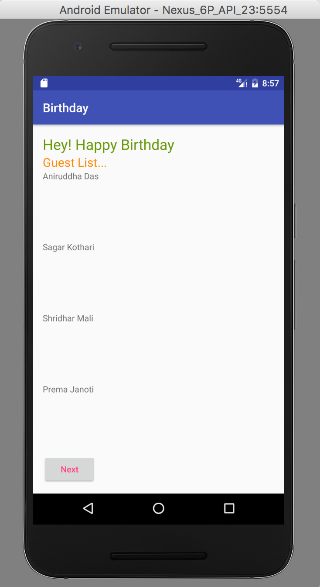

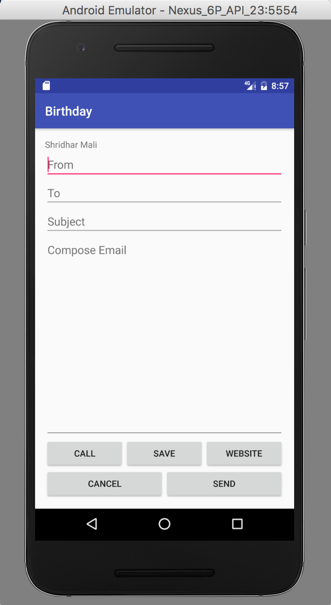

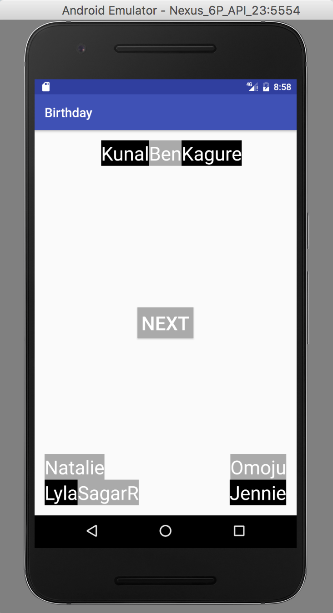

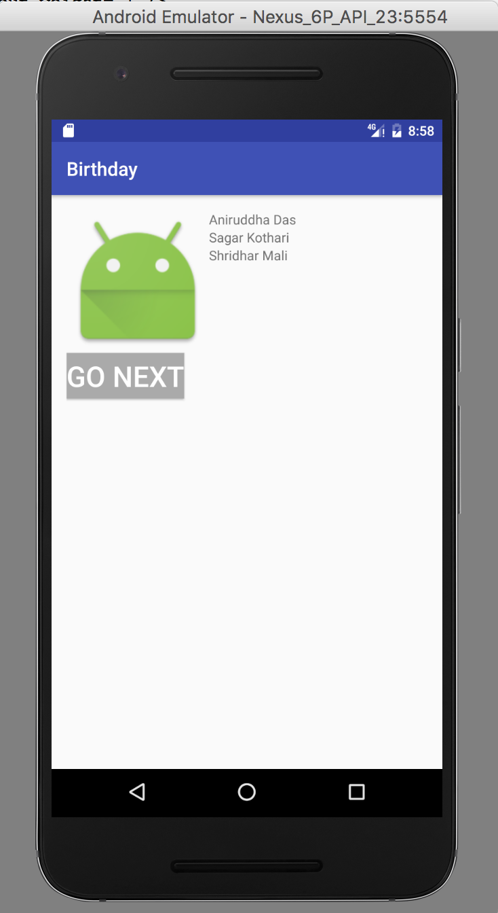

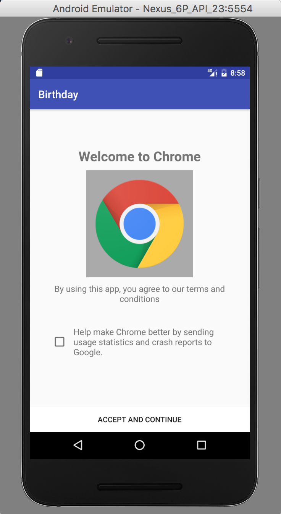