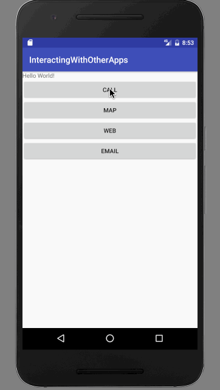

# Interacting with other apps

Create a project named `"InteractingWithOtherApps"`.

In the `activity_main.xml`, write this:

```
<?xml version="1.0" encoding="utf-8"?>
<LinearLayout xmlns:android="http://schemas.android.com/apk/res/android"
    xmlns:tools="http://schemas.android.com/tools"
    android:id="@+id/activity_main"
    android:layout_width="match_parent"
    android:layout_height="match_parent"
    android:orientation="vertical"
    tools:context="com.example.aniruddhadas.interactingwithotherapps.MainActivity">

    <TextView
        android:layout_width="wrap_content"
        android:layout_height="wrap_content"
        android:text="Hello World!" />

    <Button
        android:layout_width="match_parent"
        android:layout_height="wrap_content"
        android:text="CALL"
        android:onClick="callClicked"/>

    <Button
        android:layout_width="match_parent"
        android:layout_height="wrap_content"
        android:text="MAP"
        android:onClick="mapClicked"/>

    <Button
        android:layout_width="match_parent"
        android:layout_height="wrap_content"
        android:text="WEB"
        android:onClick="webClicked"/>

    <Button
        android:layout_width="match_parent"
        android:layout_height="wrap_content"
        android:text="EMAIL"
        android:onClick="emailClicked"/>
</LinearLayout>
```

In `MainActivity.java`, write this:

```
package com.example.aniruddhadas.interactingwithotherapps;

import android.content.Intent;
import android.content.pm.PackageManager;
import android.content.pm.ResolveInfo;
import android.net.Uri;
import android.support.v7.app.AppCompatActivity;
import android.os.Bundle;
import android.view.View;
import android.widget.Toast;

import java.util.List;


public class MainActivity extends AppCompatActivity {

    @Override
    protected void onCreate(Bundle savedInstanceState) {
        super.onCreate(savedInstanceState);
        setContentView(R.layout.activity_main);
    }

    public void callClicked(View view) {
        Toast.makeText(this, "Call Clicked", Toast.LENGTH_SHORT).show();
        Uri number = Uri.parse("tel:9876543210");
        Intent callIntent = new Intent(Intent.ACTION_DIAL, number);
        startActivity(callIntent);
    }

    public void mapClicked(View view) {
        Toast.makeText(this, "Map Clicked", Toast.LENGTH_SHORT).show();
        // Map point based on address
        Uri location = Uri.parse("geo:0,0?q=1600+Amphitheatre+Parkway,+Mountain+View,+California");
        // Or map point based on latitude/longitude
        // Uri location = Uri.parse("geo:37.422219,-122.08364?z=14"); // z param is zoom level
        Intent mapIntent = new Intent(Intent.ACTION_VIEW, location);

        // Verify it resolves
        PackageManager packageManager = getPackageManager();
        List<ResolveInfo> activities = packageManager.queryIntentActivities(mapIntent, 0);
        boolean isIntentSafe = activities.size() > 0;

// Start an activity if it's safe
        if (isIntentSafe) {
            startActivity(mapIntent);
        }
    }

    public void webClicked(View view) {
        Toast.makeText(this, "Web Clicked", Toast.LENGTH_SHORT).show();

        Uri webpage = Uri.parse("http://www.facebook.com");
        Intent webIntent = new Intent(Intent.ACTION_VIEW, webpage);
        startActivity(webIntent);
    }

    public void emailClicked(View view) {
        Toast.makeText(this, "Email Clicked", Toast.LENGTH_SHORT).show();

        Intent emailIntent = new Intent(Intent.ACTION_SEND);

        // The intent does not have a URI, so declare the "text/plain" MIME type
        emailIntent.setType("text/plain");
        emailIntent.putExtra(Intent.EXTRA_EMAIL, new String[] {"cse.anirudh@gmail.com"}); // recipients
        emailIntent.putExtra(Intent.EXTRA_SUBJECT, "Email subject");
        emailIntent.putExtra(Intent.EXTRA_TEXT, "Email message text");
        emailIntent.putExtra(Intent.EXTRA_STREAM, Uri.parse("content://path/to/email/attachment"));
        // You can also attach multiple items by passing an ArrayList of Uris

        startActivity(emailIntent);

        /*
        // Always use string resources for UI text.
        // This says something like "Share this photo with"
        String title = getResources().getString(R.string.chooser_title);
        // Create intent to show chooser
        Intent chooser = Intent.createChooser(emailIntent, title);

        // Verify the intent will resolve to at least one activity
        if (emailIntent.resolveActivity(getPackageManager()) != null) {
            startActivity(chooser);
        }
        */
    }

}
```

Inside `strings.xml`, write this:

```
<resources>
    <string name="app_name">InteractingWithOtherApps</string>
    <string name="chooser_title">Share this photo with</string>
</resources>
```

### Output

