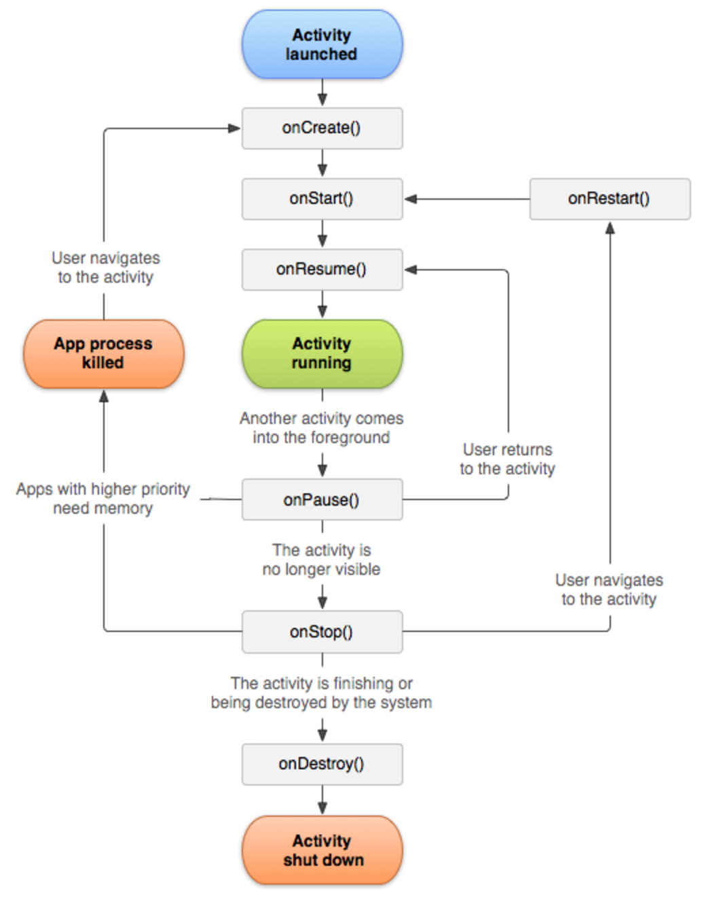

# Life cycle of Activity



**onCreate()**

- onCreate() method gets called when activity is first created.
 
``` 
 @Override
    protected void onCreate(Bundle savedInstanceState) {
        super.onCreate(savedInstanceState);
        setContentView(R.layout.activity_main);
        Log.d("onCreate()", "onCreate Involved");
 }
```

**onStart()**

- onStart() method gets called when activity get visible to user.
 
```
@Override
protected void onStart() {
    super.onStart();
    Log.d("onStart()", "onStart Involved");
} 
```

**onResume()**
 
- onResume() method gets called when user starts interacting with the activity.

```
@Override
protected void onResume() {
    super.onResume();
    Log.d("onResume", "onResume Involved");
}
```

**onPause()**
 
- onPause() method gets called when some other high prority app come in the foreground (like phone call), and it needs memory to execute, so current activity gets pushed into the onPause state.

```
@Override
protected void onPause() {
    super.onPause();
    Log.d("onPause()", "onPause Involved");
}
```
 
**onStop()**
 
- onStop() method gets called when activity is no longer visible to the user.

```
@Override
protected void onStop() {
    super.onStop();
    Log.d("onStop", "onStop Involved");
} 
```
 
**onRestart()**
 
- onRestart() method gets called after activity gets stopped and also prior to start.

```
@Override
protected void onRestart() {
    super.onRestart();
    Log.d("onStop", "onStop Involved");
}
```
 
**onDestroy()** 
 
- onDestroy() method gets called before activity is destroyed.

```
@Override
protected void onDestroy() {
    super.onDestroy();
    Log.d("onDestroy", "onDestroy Involved");
}
```

### To Do

Create a project.

Inside the `MainActivity.java`, write:

```
public class MainActivity extends AppCompatActivity {

    @Override
    protected void onCreate(Bundle savedInstanceState) {
        super.onCreate(savedInstanceState);
        setContentView(R.layout.activity_main);
        Log.d("onCreate()", "onCreate Involved");
    }

    @Override
    protected void onStart() {
        super.onStart();
        Log.d("onStart()", "onStart Involved");
    }

    @Override
    protected void onResume() {
        super.onResume();
        Log.d("onResume", "onResume Involved");
    }

    @Override
    protected void onPause() {
        super.onPause();
        Log.d("onPause()", "onPause Involved");
    }

    @Override
    protected void onStop() {
        super.onStop();
        Log.d("onStop", "onStop Involved");
    }

    @Override
    protected void onRestart() {
        super.onRestart();
        Log.d("onStop", "onStop Involved");
    }

    @Override
    protected void onDestroy() {
        super.onDestroy();
        Log.d("onDestroy", "onDestroy Involved");
    }
}
```