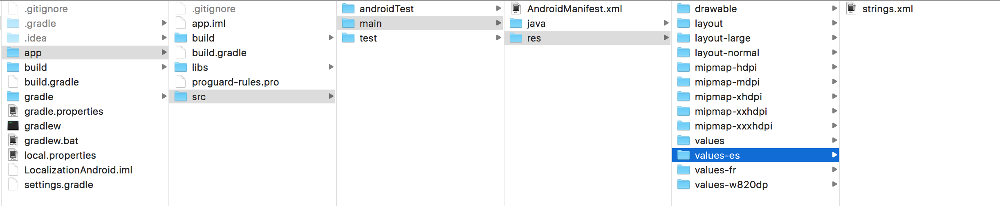
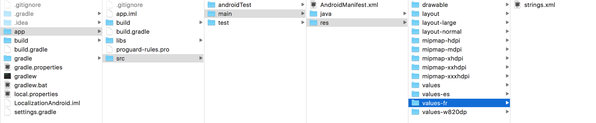
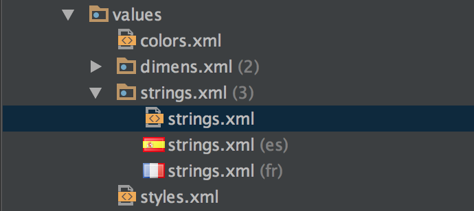
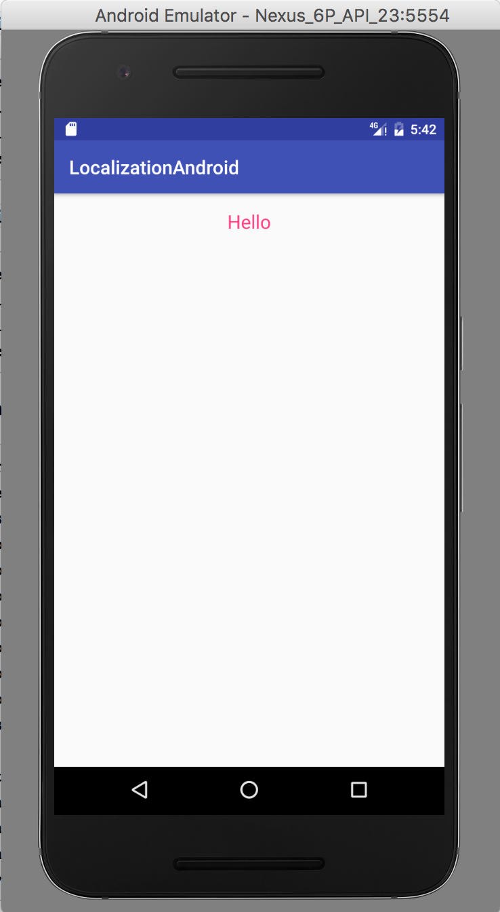
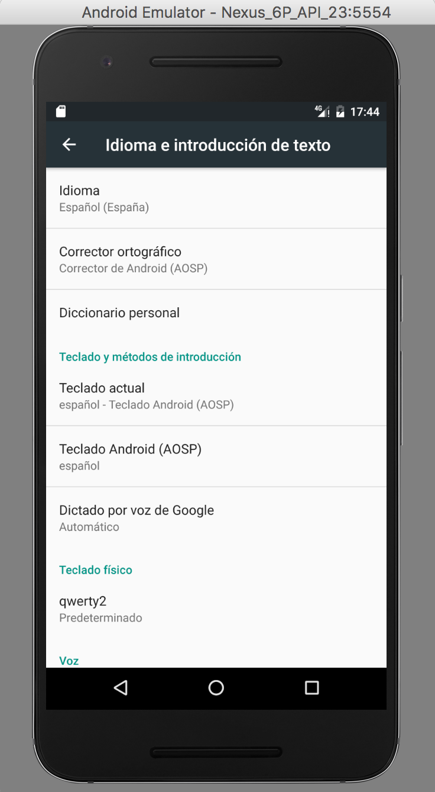
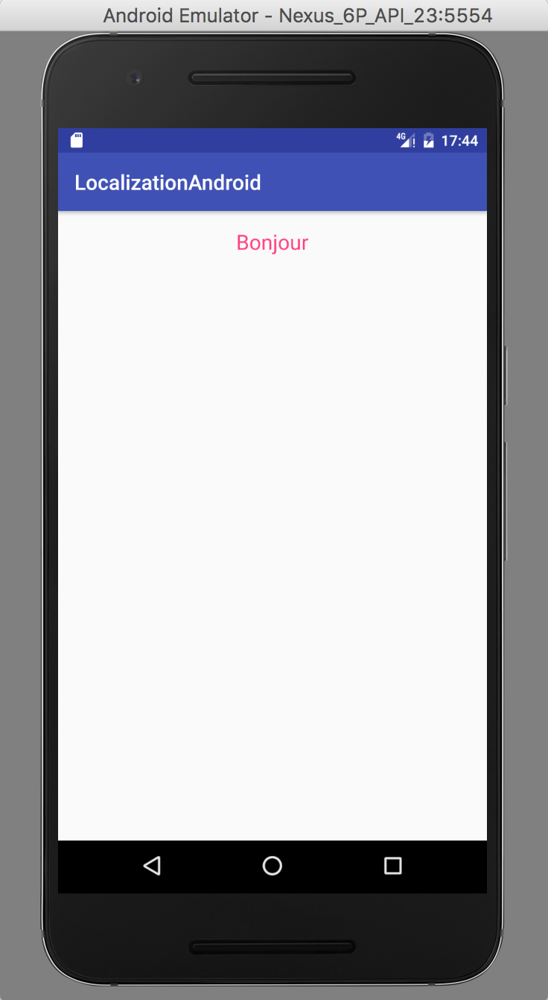
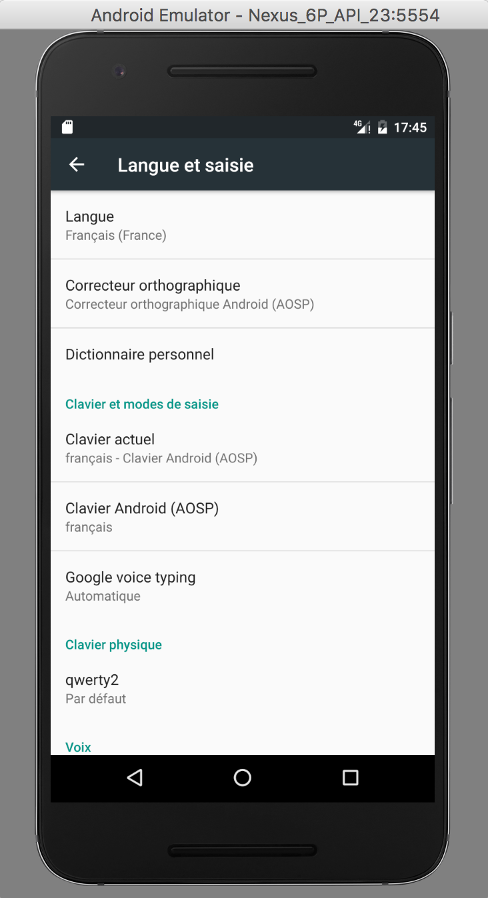
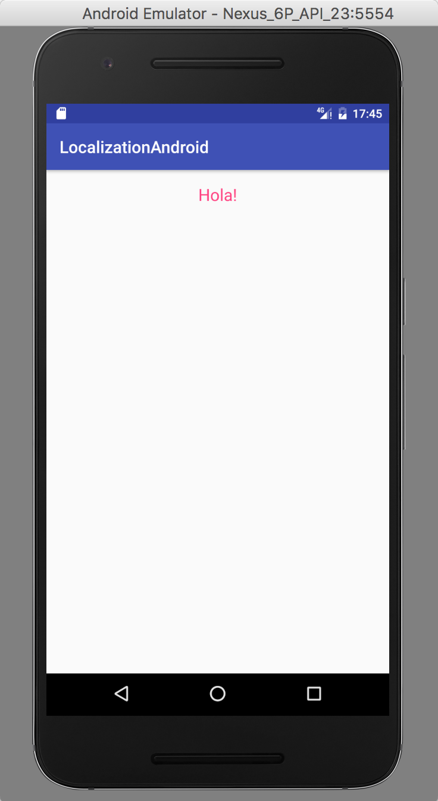

# Localization and Internationalization in Android

Create a project. Here, my project name is `LocalizationAndroid`.

Within the `res` folder, create one `values` folder for each language you want to support. Example, `values-es` and `values-fr`.

Just copy the strings file from the actual `values` folder into each of the newly created folders.





In Android Studio, you can see something like this:



Now, create define a key in the `strings.xml`. Let's say the key is `greetings`.

Inside `strings.xml`, write this:

```
<resources>
    <string name="app_name">LocalizationAndroid</string>
    <string name="greetings">Hello</string>
</resources>
```

For the same key, define some other value for each of the supported languages in their corresponding strings file.

Inside `strings.xml(es)`, write this:

```
<resources>
    <string name="app_name">LocalizationAndroid</string>
    <string name="greetings">Bonjour</string>
</resources>
```

Inside `strings.xml(fr)`, write this:

```
<resources>
    <string name="app_name">LocalizationAndroid</string>
    <string name="greetings">Hola!</string>
</resources>
```

And inside the `activity_main.xml`, write this:

```
<?xml version="1.0" encoding="utf-8"?>
<RelativeLayout xmlns:android="http://schemas.android.com/apk/res/android"
    xmlns:tools="http://schemas.android.com/tools"
    android:id="@+id/activity_main"
    android:layout_width="match_parent"
    android:layout_height="match_parent"
    android:paddingBottom="@dimen/activity_vertical_margin"
    android:paddingLeft="@dimen/activity_horizontal_margin"
    android:paddingRight="@dimen/activity_horizontal_margin"
    android:paddingTop="@dimen/activity_vertical_margin"
    tools:context="com.example.aniruddhadas.localizationandroid.MainActivity">

    <TextView
        android:layout_width="wrap_content"
        android:layout_height="wrap_content"
        android:text="@string/greetings" />
</RelativeLayout>
```

Now run the App. You will see this:



Next, change the language to Espanol from device settings.



This time you will see the app like this:



Likewise, you can try changing it to French.



