# RecyclerView In Android

### Introduction

RecyclerView is the replacement of ListView in Android. They are like TableView of iOS.

### Steps

**Step 1**

Create a new project named `RecyclerView`.

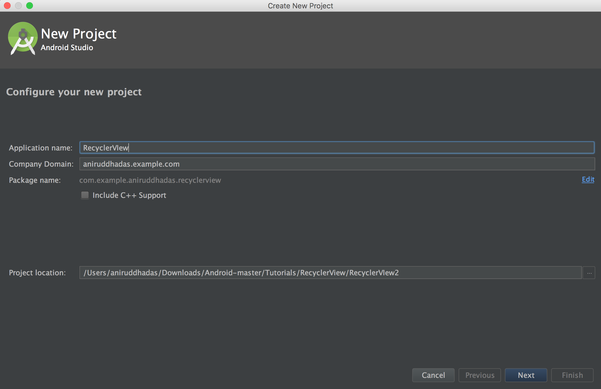

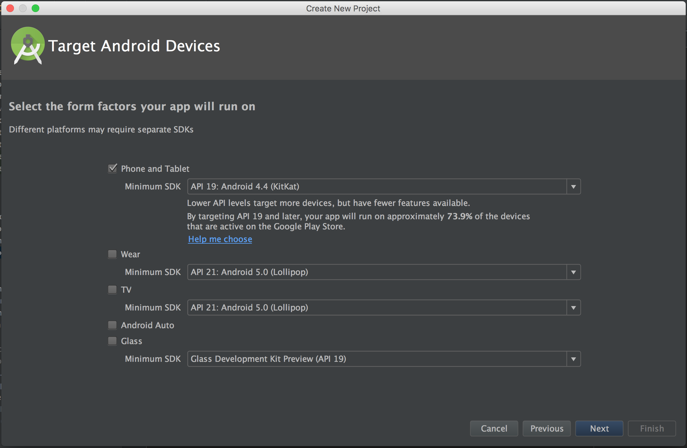

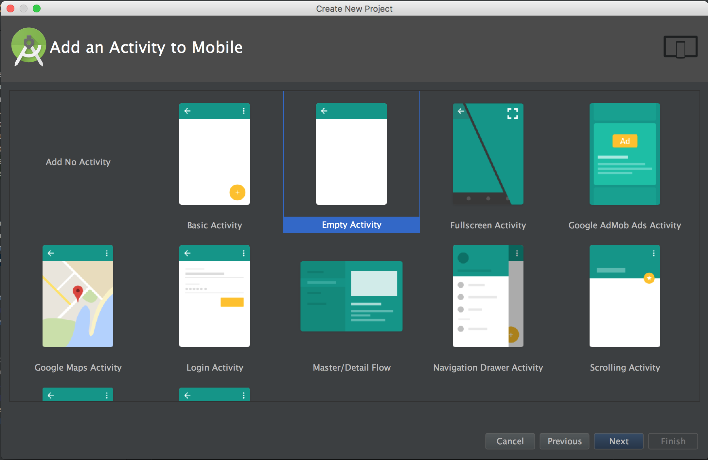
 
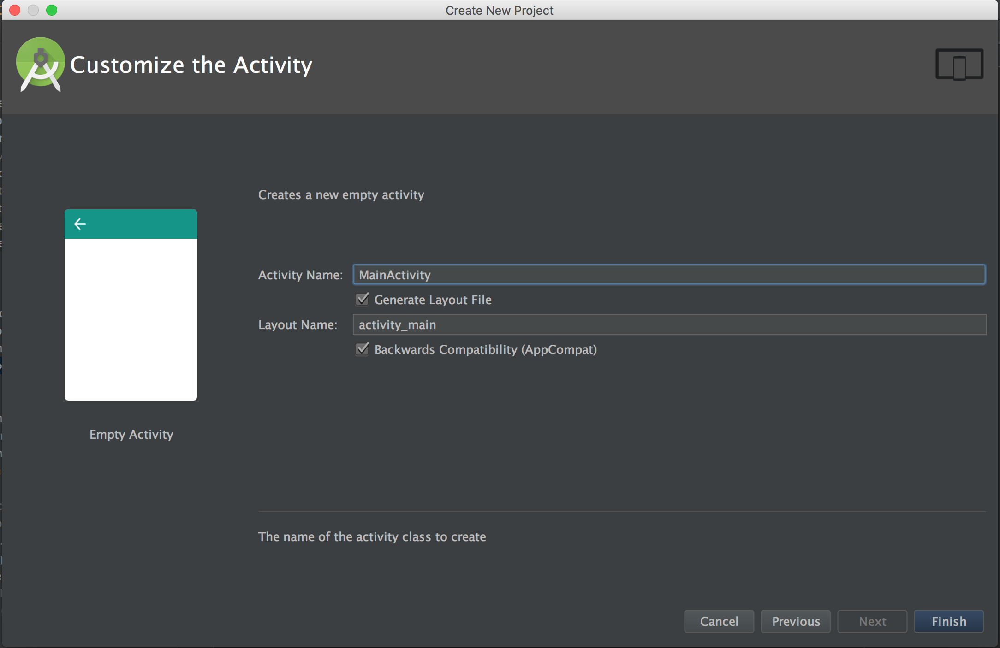

**Step 2**

Open `build.gradle(Module:app)` and add dependancy:

```
compile 'com.android.support:recyclerview-v7:+'
```

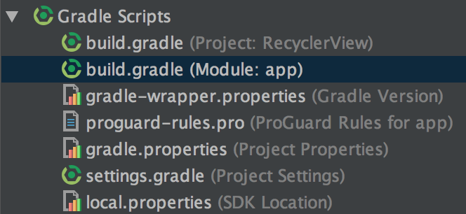

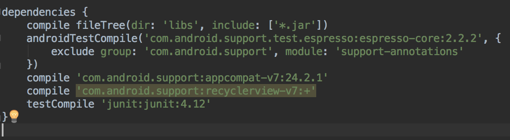

**Step 3**

In `activity_main.xml`, write: 

```
<?xml version="1.0" encoding="utf-8"?>
<RelativeLayout xmlns:android="http://schemas.android.com/apk/res/android"
    xmlns:tools="http://schemas.android.com/tools"
    android:id="@+id/activity_main"
    android:layout_width="match_parent"
    android:layout_height="match_parent"
    android:paddingBottom="@dimen/activity_vertical_margin"
    android:paddingLeft="@dimen/activity_horizontal_margin"
    android:paddingRight="@dimen/activity_horizontal_margin"
    android:paddingTop="@dimen/activity_vertical_margin"
    tools:context="com.example.aniruddhadas.recyclerview.MainActivity">

    <android.support.v7.widget.RecyclerView
        android:id="@+id/recycler_view"
        android:layout_width="match_parent"
        android:layout_height="match_parent"
        android:scrollbars="vertical" >
    </android.support.v7.widget.RecyclerView>

</RelativeLayout>
```

**Step 4**

Create layout resource file named `item_list` resource file. This resource file is used to create fields in the recycler view.

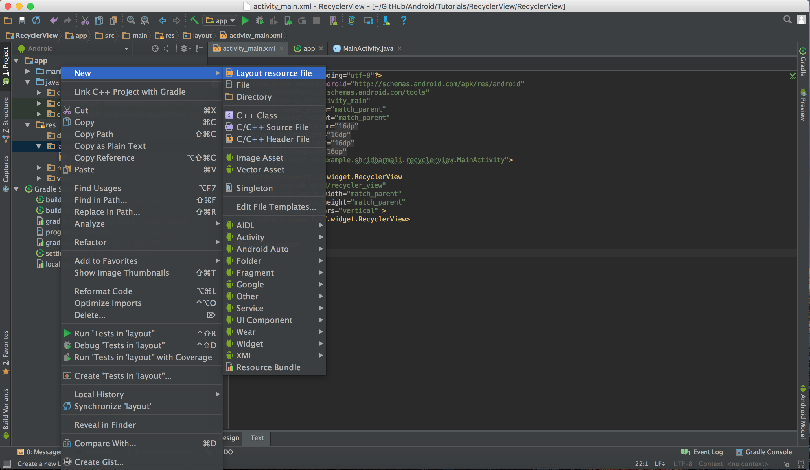

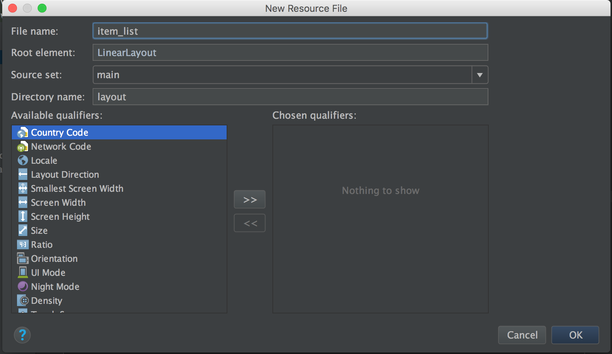

**Step 5**

In `item_list.xml`, write:

```
<?xml version="1.0" encoding="utf-8"?>
<RelativeLayout xmlns:android="http://schemas.android.com/apk/res/android"
    android:layout_width="match_parent"
    android:layout_height="wrap_content"
    android:focusable="true"
    android:paddingLeft="16dp"
    android:paddingRight="16dp"
    android:paddingTop="10dp"
    android:paddingBottom="10dp"
    android:clickable="true"
    android:background="?android:attr/selectableItemBackground"
    android:orientation="vertical">

    <TextView
        android:id="@+id/name"
        android:textColor="#c73164"
        android:textSize="16dp"
        android:textStyle="bold"
        android:layout_width="match_parent"
        android:layout_height="wrap_content"
        android:layout_alignParentTop="true"
        android:layout_alignParentStart="true" />
</RelativeLayout>
```

**Step 6**

Create a model java class named `Student`.

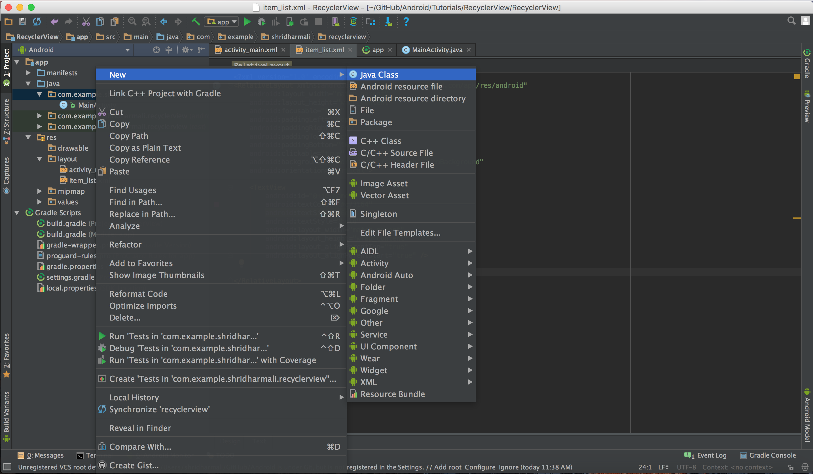

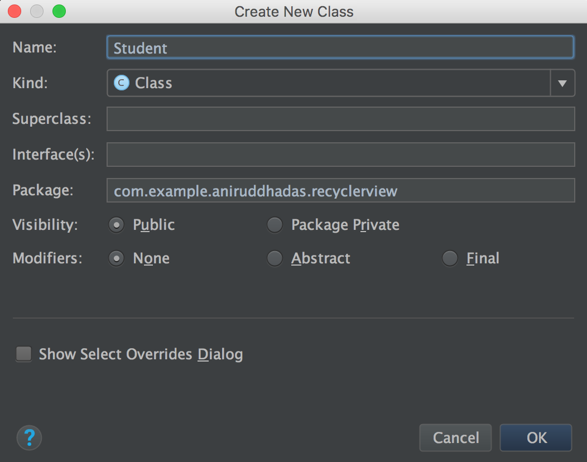

**Step 7**

Inside `Student.java`, write:

```
package com.example.aniruddhadas.recyclerview;

public class Student {

    private String name;


    public Student(String name) {
        this.name = name;
    }

    public String getName() {
        return this.name;
    }

    public void setName(String name) {
        this.name = name;
    }
}
```
	
**Step 8**

Now, create an Adapter class, which is a subclass of `RecyclerView.Adapter`, responsible for providing views that represent items in a data set.
	
`position` refers to the position of a data item within an Adapter.
	
`Recycling a View` means a view, previously used to display data for a specific adapter position, may be placed in a cache for reuse to display the same type of data again later. This can drastically improve performance by skipping initial layout inflation or construction.

Create a java class `StudentAdapter` and use it's superclass as `android.support.v7.widget.RecyclerView`.

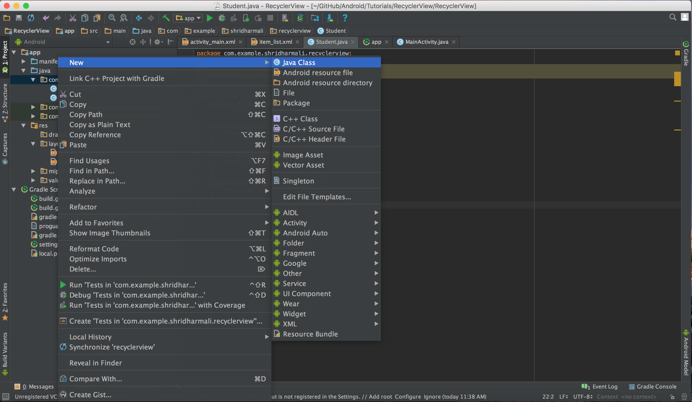

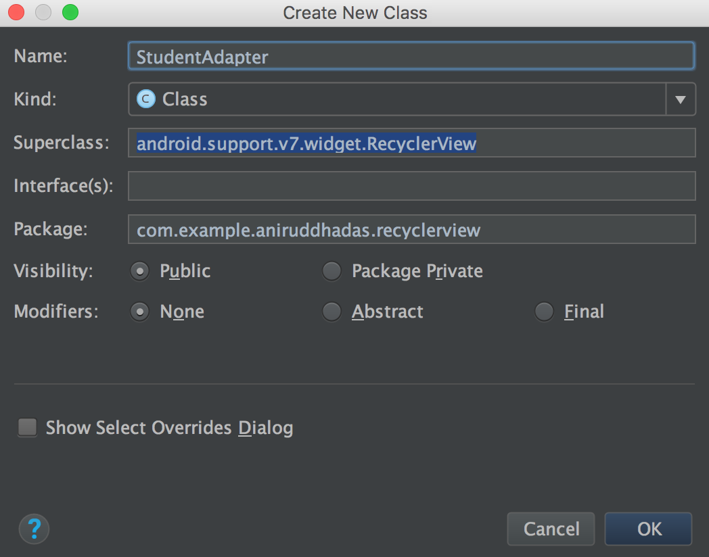


**Step 9**

Inside the `StudentAdapter.java`, write:

```
package com.example.aniruddhadas.recyclerview;

import android.support.v7.widget.RecyclerView;
import android.view.LayoutInflater;
import android.view.View;
import android.view.ViewGroup;
import android.widget.TextView;
import java.util.List;

public class StudentAdapter extends RecyclerView.Adapter<StudentAdapter.MyViewHolder>  {

    private List<Student> studentList;

    public StudentAdapter(List<Student> studentList) {
        // Constructor
        this.studentList = studentList;
    }

    // Override  onCreateViewHolder method
    @Override
    public MyViewHolder onCreateViewHolder(ViewGroup parent, int viewType) {
        View viewItem = LayoutInflater.from(parent.getContext()).inflate(R.layout.item_list, parent,false);
        return new MyViewHolder(viewItem);
    }

    @Override
    public void onBindViewHolder(MyViewHolder holder, int position) {
        Student stud = studentList.get(position);
        holder.name.setText(stud.getName());

    }

    @Override
    public int getItemCount() {
        return studentList.size();
    }

    public class MyViewHolder extends RecyclerView.ViewHolder {
        private TextView name;
        public MyViewHolder(View view) {
            super(view);
            name = (TextView)view.findViewById(R.id.name);
        }

    }
}
```

Here, we override `RecyclerView` methods:

- `onCreateViewHolder()` : used to create ListViewCell 
- `onBindViewHolder()` : used to bind ListView with data
- `getItemCount()` : used to get the size of the student list

**Step 10**

In `MainActivity.java`, write: 

```
package com.example.aniruddhadas.recyclerview;

import android.support.v7.app.AppCompatActivity;
import android.os.Bundle;
import android.support.v7.widget.DefaultItemAnimator;
import android.support.v7.widget.LinearLayoutManager;
import android.support.v7.widget.RecyclerView;

import java.util.ArrayList;
import java.util.List;

public class MainActivity extends AppCompatActivity {

    private List<Student> studentList = new ArrayList<>();
    private RecyclerView recyclerView;
    private StudentAdapter studentAdapter;

    @Override
    protected void onCreate(Bundle savedInstanceState) {
        super.onCreate(savedInstanceState);
        setContentView(R.layout.activity_main);

        recyclerView = (RecyclerView)findViewById(R.id.recycler_view);
        studentAdapter = new StudentAdapter(studentList);
        RecyclerView.LayoutManager patientLayoutManager = new LinearLayoutManager(getApplicationContext());
        recyclerView.setLayoutManager(patientLayoutManager);
        recyclerView.setHasFixedSize(true);


        recyclerView.addItemDecoration(new DividerItemDecoration(this, LinearLayoutManager.VERTICAL));
        recyclerView.setItemAnimator(new DefaultItemAnimator());

        recyclerView.setAdapter(studentAdapter);
        getStudentData();
    }

    public void getStudentData() {
        Student stud = new Student("Aniruddha");
        studentList.add(stud);

        stud = new Student("Taisung");
        studentList.add(stud);

        stud = new Student("Ajit");
        studentList.add(stud);
    }
} 
```

**Step 11**

If we run the app, in the output, we see a RecyclerView with some items, but it does not have separators between the cells. To add separator in list, we have to use `RecyclerView.ItemDecoration`.

Create a java class `DividerItemDecoration` and add it's subclass as `android.support.v7.widget.RecyclerView.ItemDecoration`.

Inside it, write:

```
package com.example.aniruddhadas.recyclerview;

import android.content.Context;
import android.content.res.TypedArray;
import android.graphics.Canvas;
import android.graphics.Rect;
import android.graphics.drawable.Drawable;
import android.support.v7.widget.LinearLayoutManager;
import android.support.v7.widget.RecyclerView;
import android.view.View;

public class DividerItemDecoration extends RecyclerView.ItemDecoration {
    private static final int[] ATTRS = new int[] {
            android.R.attr.listDivider
    };


    public static final int HORIZONTAL_LIST = LinearLayoutManager.HORIZONTAL;
    public static final int VERTICAL_LIST = LinearLayoutManager.VERTICAL;

    private Drawable pDevider;
    private int pOrientation;

    public DividerItemDecoration(Context context, int orientation) {
        final TypedArray a = context.obtainStyledAttributes(ATTRS);
        pDevider = a.getDrawable(0);
        a.recycle();
        setOrientation(orientation);
    }

    public void setOrientation(int orientation) {
        if (orientation != HORIZONTAL_LIST  && orientation != VERTICAL_LIST) {
            throw new IllegalArgumentException("Illegal Orientation");
        }

        pOrientation = orientation;
    }

    @Override
    public void onDrawOver(Canvas c, RecyclerView parent, RecyclerView.State state) {
        super.onDrawOver(c, parent, state);
        if (pOrientation == VERTICAL_LIST) {
            drawVertical(c, parent);
        } else {
            drawHorizontal(c, parent);
        }

    }

    public void drawVertical(Canvas c, RecyclerView parent) {
        final int left = parent.getPaddingLeft();
        final int right =  parent.getWidth() - parent.getPaddingRight();
        final int childCount = parent.getChildCount();
        for (int i = 0; i < childCount; i++) {
            final View child = parent.getChildAt(i);
            final RecyclerView.LayoutParams params = (RecyclerView.LayoutParams) child
                    .getLayoutParams();
            final int top = child.getBottom() + params.bottomMargin;
            final int bottom = top + pDevider.getIntrinsicHeight();
            pDevider.setBounds(left, top, right, bottom);
            pDevider.draw(c);
        }
    }

    public void drawHorizontal(Canvas c, RecyclerView parent) {
        final int top = parent.getPaddingTop();
        final int bottom = parent.getHeight() - parent.getPaddingBottom();

        final int childCount = parent.getChildCount();
        for (int i = 0; i < childCount; i++) {
            final View child = parent.getChildAt(i);
            final RecyclerView.LayoutParams params = (RecyclerView.LayoutParams) child
                    .getLayoutParams();
            final int left = child.getRight() + params.rightMargin;
            final int right = left + pDevider.getIntrinsicHeight();
            pDevider.setBounds(left, top, right, bottom);
            pDevider.draw(c);
        }
    }

    @Override
    public void getItemOffsets(Rect outRect, View view, RecyclerView parent, RecyclerView.State state) {
        super.getItemOffsets(outRect, view, parent, state);
        if (pOrientation == VERTICAL_LIST) {
            outRect.set(0, 0, 0, pDevider.getIntrinsicHeight());
        } else {
            outRect.set(0, 0, pDevider.getIntrinsicWidth(), 0);
        }
    }
}
```

### Output

