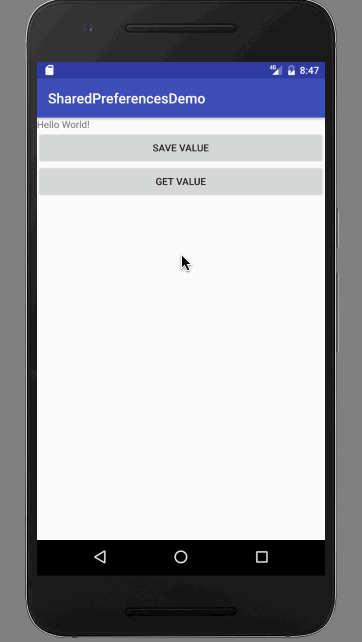

# SharedPreferences in Android (UserDefaults)

Create a project named "SharedPreferencesDemo".

In the `activity_main.xml`, write this:

```
<?xml version="1.0" encoding="utf-8"?>
<LinearLayout
    xmlns:android="http://schemas.android.com/apk/res/android"
    xmlns:tools="http://schemas.android.com/tools"
    android:id="@+id/activity_main"
    android:layout_width="match_parent"
    android:layout_height="match_parent"
    android:orientation="vertical"
    tools:context="com.example.aniruddhadas.sharedpreferencesdemo.MainActivity">

    <TextView
        android:layout_width="wrap_content"
        android:layout_height="wrap_content"
        android:text="Hello World!" />

    <Button
        android:layout_width="match_parent"
        android:layout_height="wrap_content"
        android:text="Save Value"
        android:onClick="saveClicked"
        />

    <Button
        android:layout_width="match_parent"
        android:layout_height="wrap_content"
        android:text="Get Value"
        android:onClick="getClicked"
        />
</LinearLayout>
```

In `MainActivity.java`, write this:

```
package com.example.aniruddhadas.sharedpreferencesdemo;

import android.content.Context;
import android.content.Intent;
import android.content.SharedPreferences;
import android.support.v7.app.AppCompatActivity;
import android.os.Bundle;
import android.view.View;

public class MainActivity extends AppCompatActivity {

    public final static String loginPreferenceKey = "Login";

    @Override
    protected void onCreate(Bundle savedInstanceState) {
        super.onCreate(savedInstanceState);
        setContentView(R.layout.activity_main);
    }


    public void saveClicked(View view) {
        SharedPreferences loginShared = getSharedPreferences(loginPreferenceKey, Context.MODE_PRIVATE);
        SharedPreferences.Editor editor = loginShared.edit();

        editor.putString("savedValue", "Aniruddha Das");

        editor.commit();

        Intent intent = new Intent(this, SubActivity.class);

        startActivity(intent);
    }

    public void getClicked(View view) {
        Intent intent = new Intent(this, SubActivity.class);

        startActivity(intent);
    }
}
```

Create a new activity named `"SubActivity"`.

Inside `activity_sub.xml`, write this:

```
<?xml version="1.0" encoding="utf-8"?>
<RelativeLayout xmlns:android="http://schemas.android.com/apk/res/android"
    xmlns:tools="http://schemas.android.com/tools"
    android:id="@+id/activity_sub"
    android:layout_width="match_parent"
    android:layout_height="match_parent"
    android:paddingBottom="@dimen/activity_vertical_margin"
    android:paddingLeft="@dimen/activity_horizontal_margin"
    android:paddingRight="@dimen/activity_horizontal_margin"
    android:paddingTop="@dimen/activity_vertical_margin"
    tools:context="com.example.aniruddhadas.sharedpreferencesdemo.SubActivity">

    <TextView
        android:layout_width="match_parent"
        android:layout_height="wrap_content"
        android:id="@+id/textValueStored"/>

</RelativeLayout>
```

Inside `SubActivity.java`, write this:

```
package com.example.aniruddhadas.sharedpreferencesdemo;

import android.content.Context;
import android.content.SharedPreferences;
import android.support.v7.app.AppCompatActivity;
import android.os.Bundle;
import android.widget.TextView;

public class SubActivity extends AppCompatActivity {

    public final static String loginPreferenceKey = "Login";

    @Override
    protected void onCreate(Bundle savedInstanceState) {
        super.onCreate(savedInstanceState);
        setContentView(R.layout.activity_sub);

        SharedPreferences loginShared = getSharedPreferences(loginPreferenceKey, Context.MODE_PRIVATE);

        String str = loginShared.getString("savedValue", "Default Name");

        TextView textView = (TextView) findViewById(R.id.textValueStored);
        textView.setText("Value is: " + str);
    }


}
```

### Output

