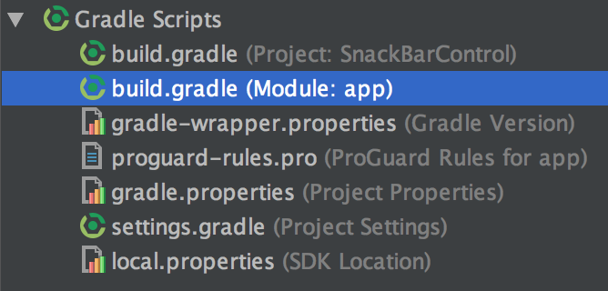
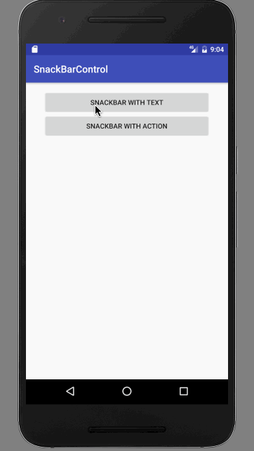

# SnackBarControl

Create a project named `"InteractingWithOtherApps"`.

In the `activity_main.xml`, change the RelativeLayout to `android.support.design.widget.CoordinatorLayout` and add id `myCoordinatorLayout `:

```
<?xml version="1.0" encoding="utf-8"?>
<android.support.design.widget.CoordinatorLayout xmlns:android="http://schemas.android.com/apk/res/android"
    xmlns:tools="http://schemas.android.com/tools"
    android:id="@+id/myCoordinatorLayout"
    android:layout_width="match_parent"
    android:layout_height="match_parent"
    android:paddingBottom="@dimen/activity_vertical_margin"
    android:paddingLeft="@dimen/activity_horizontal_margin"
    android:paddingRight="@dimen/activity_horizontal_margin"
    android:paddingTop="@dimen/activity_vertical_margin"
    tools:context="com.example.aniruddhadas.snackbarcontrol.MainActivity">

    <LinearLayout
        android:layout_width="match_parent"
        android:layout_height="match_parent"
        android:paddingLeft="20dp"
        android:paddingRight="20dp"
        android:orientation="vertical"
        >
        <Button
            android:layout_width="match_parent"
            android:layout_height="wrap_content"
            android:text="SnackBar with Text"
            android:onClick="simpleSnackBar"

            />

        <Button
            android:layout_width="match_parent"
            android:layout_height="wrap_content"
            android:text="SnackBar with action"
            android:onClick="snackBarWithAction"
            />

    </LinearLayout>
</android.support.design.widget.CoordinatorLayout>
```

In `MainActivity.java`, write this:

```
package com.example.aniruddhadas.snackbarcontrol;

import android.graphics.Color;
import android.support.v7.app.AppCompatActivity;
import android.os.Bundle;
import android.view.View;
import android.support.design.widget.Snackbar;
import android.widget.TextView;

public class MainActivity extends AppCompatActivity {

    @Override
    protected void onCreate(Bundle savedInstanceState) {
        super.onCreate(savedInstanceState);
        setContentView(R.layout.activity_main);
    }

    public void simpleSnackBar(View view) {
        //Simple snackbar with infinite duration
        Snackbar snackbar = Snackbar.make(findViewById(R.id.myCoordinatorLayout), "Welcome Ani", Snackbar.LENGTH_INDEFINITE);
        snackbar.show();
    }

    public void snackBarWithAction(View view) {
        Snackbar snackbar = Snackbar
                .make(findViewById(R.id.myCoordinatorLayout), "No Internet connection", Snackbar.LENGTH_INDEFINITE)
                .setAction("Retry", new View.OnClickListener() {
                    @Override
                    public void onClick(View v) {
                        Snackbar snack = Snackbar.make(findViewById(R.id.myCoordinatorLayout), "Welcome again Bhai", Snackbar.LENGTH_SHORT);
                        snack.show();
                    }
                });
        // Set Retry button color to red
        snackbar.setActionTextColor(Color.RED);

        // Set yellow color text of snackBar title.
        View sbView = snackbar.getView();
        TextView text = (TextView) sbView.findViewById(android.support.design.R.id.snackbar_text);
        text.setTextColor(Color.YELLOW);
        snackbar.show();
    }

}
```

Open `build.gradle (Module: app)`.



Add `compile 'com.android.support:design:23.0.1'` at the end:

```
apply plugin: 'com.android.application'

android {
    compileSdkVersion 24
    buildToolsVersion "24.0.2"
    defaultConfig {
        applicationId "com.example.aniruddhadas.snackbarcontrol"
        minSdkVersion 19
        targetSdkVersion 24
        versionCode 1
        versionName "1.0"
        testInstrumentationRunner "android.support.test.runner.AndroidJUnitRunner"
    }
    buildTypes {
        release {
            minifyEnabled false
            proguardFiles getDefaultProguardFile('proguard-android.txt'), 'proguard-rules.pro'
        }
    }
}

dependencies {
    compile fileTree(dir: 'libs', include: ['*.jar'])
    androidTestCompile('com.android.support.test.espresso:espresso-core:2.2.2', {
        exclude group: 'com.android.support', module: 'support-annotations'
    })
    compile 'com.android.support:appcompat-v7:24.2.1'
    testCompile 'junit:junit:4.12'

    compile 'com.android.support:design:23.0.1'
}
```

### Output

