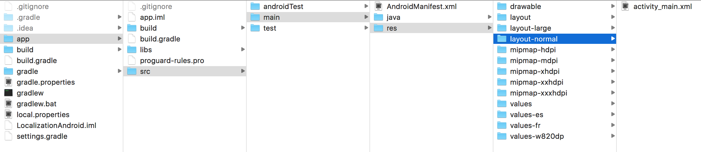

# Supporting different devices for Android

Let's say we have to support the same App for phones as well as tabs. We cannot have the same layout for differnt sized devices. So, we need to change the layouts accordingly.

To do this, create an app first. Here, my app's name is `LocalizationAndroid`.

Now, inside the `res`, copy the layout folder twice as `layout-normal` and `layout-large`. Make sure it has the `activity_main.xml`.




Inside the Studio, you will see:


Inside the `activity_main.xml(large)`, write this:

```
<?xml version="1.0" encoding="utf-8"?>
<RelativeLayout xmlns:android="http://schemas.android.com/apk/res/android"
    xmlns:tools="http://schemas.android.com/tools"
    android:id="@+id/activity_main"
    android:layout_width="match_parent"
    android:layout_height="match_parent"
    android:paddingBottom="@dimen/activity_vertical_margin"
    android:paddingLeft="@dimen/activity_horizontal_margin"
    android:paddingRight="@dimen/activity_horizontal_margin"
    android:paddingTop="@dimen/activity_vertical_margin"
    tools:context="com.example.aniruddhadas.localizationandroid.MainActivity">

    <TextView
        android:layout_width="match_parent"
        android:layout_height="wrap_content"
        android:text="@string/greetings"
        android:textSize="80sp"
        android:textAlignment="center"
        android:textColor="@color/colorAccent" />
</RelativeLayout>
```

Inside the `activity_main.xml(normal)`, write this:

```
<?xml version="1.0" encoding="utf-8"?>
<RelativeLayout xmlns:android="http://schemas.android.com/apk/res/android"
    xmlns:tools="http://schemas.android.com/tools"
    android:id="@+id/activity_main"
    android:layout_width="match_parent"
    android:layout_height="match_parent"
    android:paddingBottom="@dimen/activity_vertical_margin"
    android:paddingLeft="@dimen/activity_horizontal_margin"
    android:paddingRight="@dimen/activity_horizontal_margin"
    android:paddingTop="@dimen/activity_vertical_margin"
    tools:context="com.example.aniruddhadas.localizationandroid.MainActivity">

    <TextView
        android:layout_width="match_parent"
        android:layout_height="wrap_content"
        android:text="@string/greetings"
        android:textSize="20sp"
        android:textAlignment="center"
        android:textColor="@color/colorAccent" />
</RelativeLayout>
```

Now run the app. You will get two device options.


Let's say I run on Nexus 6P. The output is:


Next, let's say I run on Nexus 10. The output is:

