# Angular 1

### Introduction

Angular JS is a popular Javascript framework used to built dynamic client side applications.

**Example:**

Gmail. It's just a single page application (SPA). Anything that you do is done on the same page, without a full page refresh. It has a lot of Javascript scripts interacting with the server using REST API calls.

----

### Pre-Requisite Languages

1. HTML

	Whenever the client browser makes a request to the server, the server responses with a chunk of HTML code. The browser then parses this HTML and builds a DOM tree (Document Object Model). Every tag in the HTML is converted into node of the tree.

	Once the tree is formed, the browser uses it to render the view on the webpage.

	It defines the content of the document to be displayed.

2. CSS

	Used to override the default styles of the browser for a HTML page.

	It separates the presentation style or logic from the content of the document.

	3 modes to define CSS:

	1. Inline - Written inside the HTML tags.
	2. Block - Written inside a Style block above HTML code.
	3. File - Written in a separate file.

3. Javascript

	It is a dynamic programming language. It is both compiled and interpreted.
	
	It has scopes and closures.
	
	It is just used to modify the DOM on the browser. This is why a full page refresh is not required. Since, the DOM tree reflects the view. So, when the tree gets changes, the view gets effected.
	
	It enables interactivity and enables rich client SPAs.
	
----

### Need for Client Side Frameworks

What is the problem that these client side frameworks are trying to solve? Why we need Javascript?

HTMl being a static language cannot modify DOM tree and hence fails to achieve interactiblity.

Javascript on the other hand is dynamic and can modify the DOM tree using APIs/Functions.

**Example: To change the color of a button**


The button has an onClick event hook, where it passes a color to a Javascript API/function. The Javascript function gets the Element/Node from the DOM tree by it's ID, and makes changes in it. Now when the browser renders the view by parsing the DOM tree, the change gets reflected on the view. This is how dynamic feature works.

**Why this code sucks?**

- Messy code / Not elegant
- No separation of concerns. The Javascript code is tightly coupled to the code in HTML. It straight away assumes that there will be an element with `id = para1`
- Harder to maintain
- Harder to test

**We need something better.**

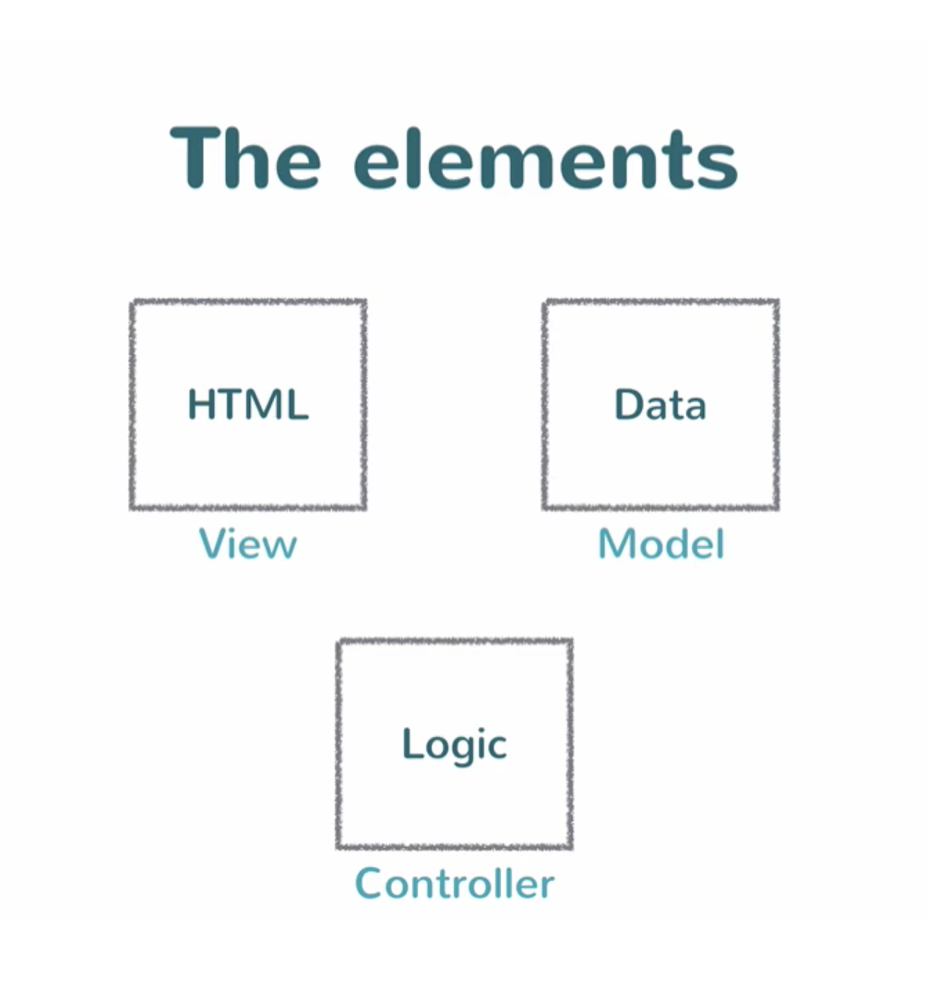

We need Client Side MVC frameworks. As long as we can separate out the 3 elements, we can have maintainable code base. And this is the same thing that all these several frameworks achieve to solve. They all bring in MVC approach to development.

----

### About Angular JS

Angular solves the problem of client side MVC. But in the Angular website and documentation, it never claims to be MVC. Infact it says `HTML enhanced for web apps`:


**Angular JS lets you extent HTML vocabulary for your app.**

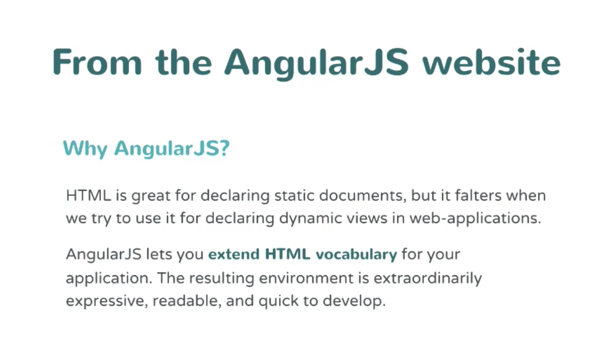

**What extending HTML means?**

Let's say we need to display current date on a page.

Now, HTML has no default element/tag to show date.

So, one way is using Javascript.

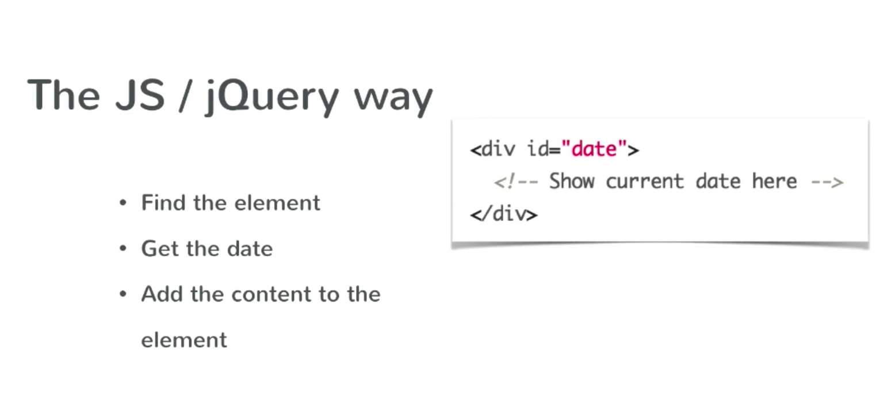

But wont it be cool if we had something like this:

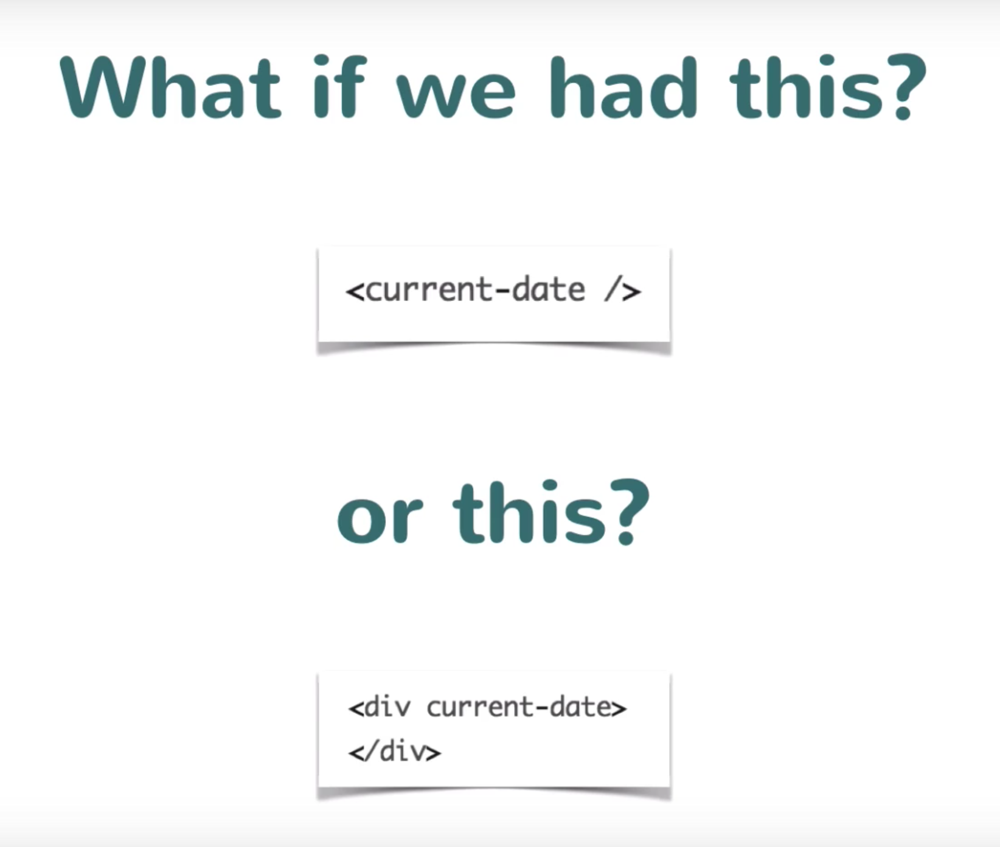

We can extend HTML and create our custom element/tag (component) to show date. We only need to write it once, and then we can use these components again and again at as many places within the HTML as we want. This is what Angular lets you do.

**Difference between Javascript and Angular JS**


----

### Declarative vs Imperative Programming

- **Imperative** - We write the logic to do something at every place we need it. There is a lot of repetitive code.

- **Declarative** - We write the logic only once in our component in an imperative way. From next time onwards, we just need to declare it or use the already created component.

`Angular uses declarative programming.`

**Custom Elements** in Angular can be created in two ways:

- `Directives`
- `Components`

----

### How an Angular Application Works

The browser has very limited vocabulary. It only understands default HTML tags.

**If we create our own custom element, how will the browser know how to interpret it?**


We write our HTML.

We load the Angular JS path in our HTML body.

For this we can either use CDN path:

```
<script src="https://ajax.googleapis.com/ajax/libs/angularjs/1.6.1/angular.min.js"></script>
```

Or, downloaded `Angular.js` path from System.

We then write logic for the custom directives/components and register them with Angular module. Next, we use these directives using custom tags in our HTML code.

**Angular itself comes with several custom directives by default. They start with prefix `ng-`.** Other than that, we also can write our own custom directives.

----

### Softwares Required

- Text Editor - Sublime Text / Visual Studio Code
- Web Browser - Google Chrome

----

### Your First Angular Application

Create a folder `Angular1Projects`.

Open this folder in Sublime Text.

Go to `https://angularjs.org/` and click on `Angular1`.


Choose branch `latest` and build `uncompressed` and then download.

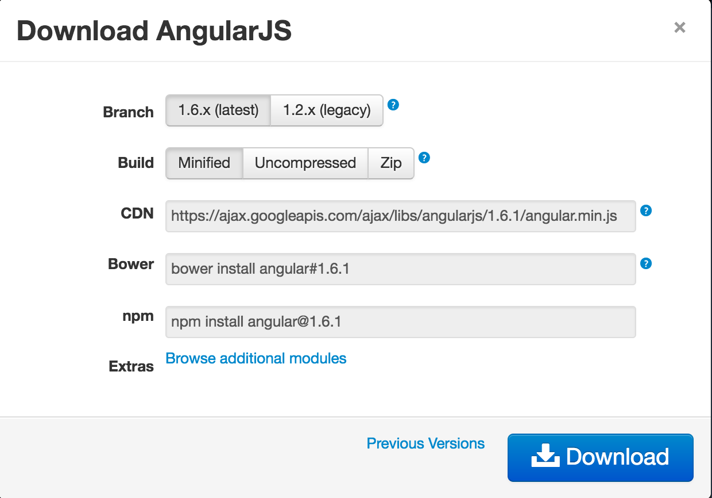

After `angular.js` is downloaded, move it to `Angular1Projects` folder.


Next create a file `index.html` inside the `Angular1Projects` folder.

Inside `index.html`, write:

```
<!DOCTYPE html>
<html>
<head>
	<title>My First Angular App</title>
	<script src="angular.js"></script>
</head>
<body>
	<h1>
		Hello Angular
	</h1>
</body>
</html>
```

Now, open `index.html` in a browser. Go to `Developer tools -> Network -> All`. We will see angular.js has loaded up in the browser.


Now, we can instruct angular do something using directives. (Declarative Programming)

Add the `ng-app` directive to the `<html>` element. This is a built-in directive.

We then use `ng-if` and give a condition. If condition is true, a paragraph is shown, otherwise not. So, even if the paragraph exists on the page, depending on the condition, Angular can remove it from or keep it in the DOM tree.

If we write:

```
<!DOCTYPE html>
<html ng-app>
<head>
	<title>My First Angular App</title>
	<script src="angular.js"></script>
</head>
<body>
	<h1>
		Hello Angular
	</h1>

	<p ng-if="true">
		Good Morning
	</p>
</body>
</html>
```

We will see:

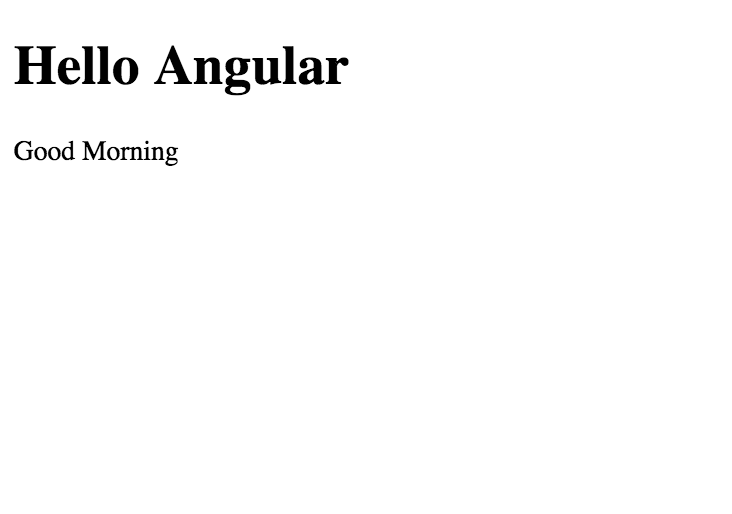

But, if we write:

```
<!DOCTYPE html>
<html ng-app>
<head>
	<title>My First Angular App</title>
	<script src="angular.js"></script>
</head>
<body>
	<h1>
		Hello Angular
	</h1>

	<p ng-if="false">
		Good Morning
	</p>
</body>
</html>
```

We will see:

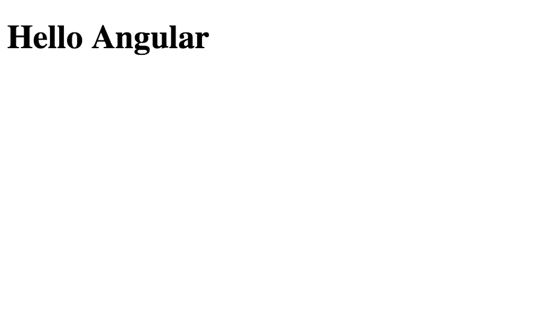

----

### Initializing and using variables

`ng-init` is a directive that lets you write initialization code directly in your HTML.

We don't use `var` keyword to declare variables. Instead, we just use it directly!

```
<!DOCTYPE html>
<html ng-app>
<head>
	<title>My First Angular App</title>
	<script src="angular.js"></script>
</head>
<body ng-init="hourOfDay = 14">
	<h1>
		Hello Angular
	</h1>

	<p ng-if="hourOfDay < 12">
		Good Morning
	</p>

	<p ng-if="hourOfDay > 12">
		Good Evening
	</p>


</body>
</html>
```

We see this on browser:

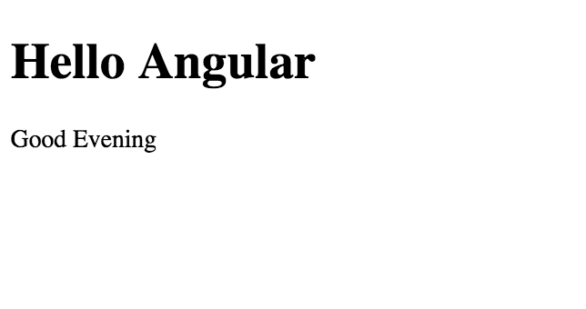

----

### Recap Of Three Directives that we already covered

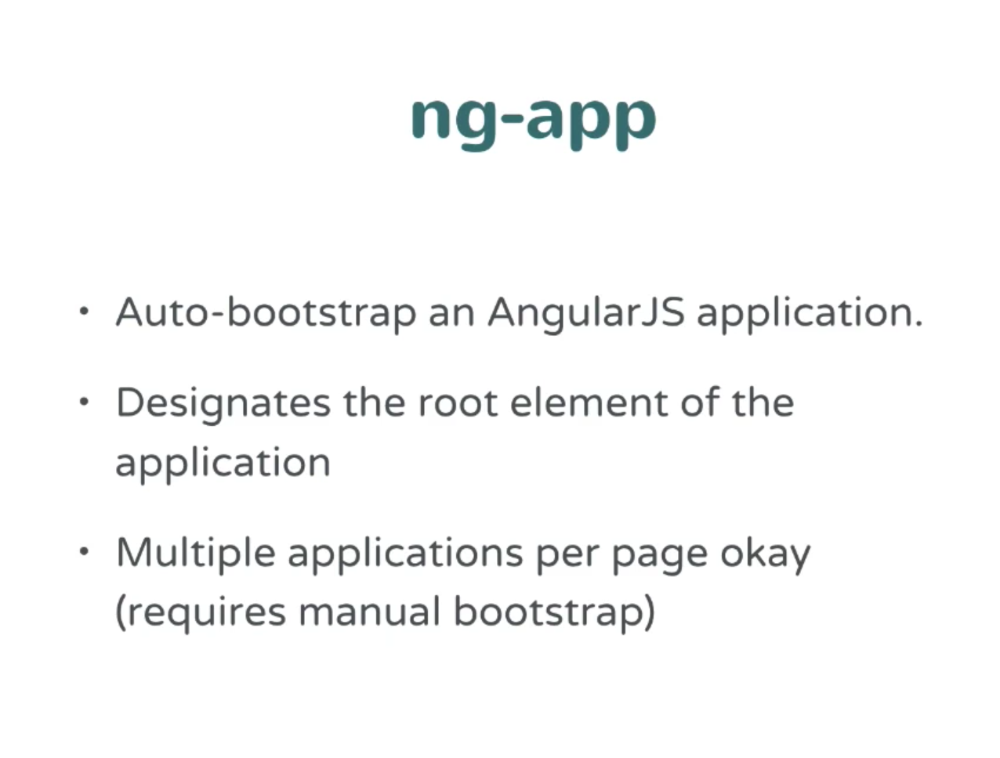

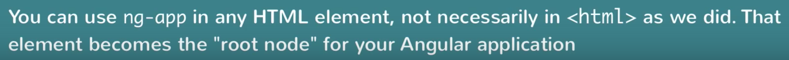

The DOM tree for Angular starts from the node where you add `ng-app` directive. It treats it as the root of the tree. It only affects that node and the children below it. Anything that you write outside the node or above or below it, is not affected.


It is not recommended way for initialization.


----

### Introducing Scope


We created a variable `hourOfDay` in the `ng-init` directive. But used that variable in some other directive `ng-if`. But, how did it still work? How does the directives talk to each other?

They do so by using a `scope`. Scope is a container in memory in any Angular app, where variables are created. So, from whichever directive you use the variable, it will anyway refer to the same scope.

So, internally it does something like this:

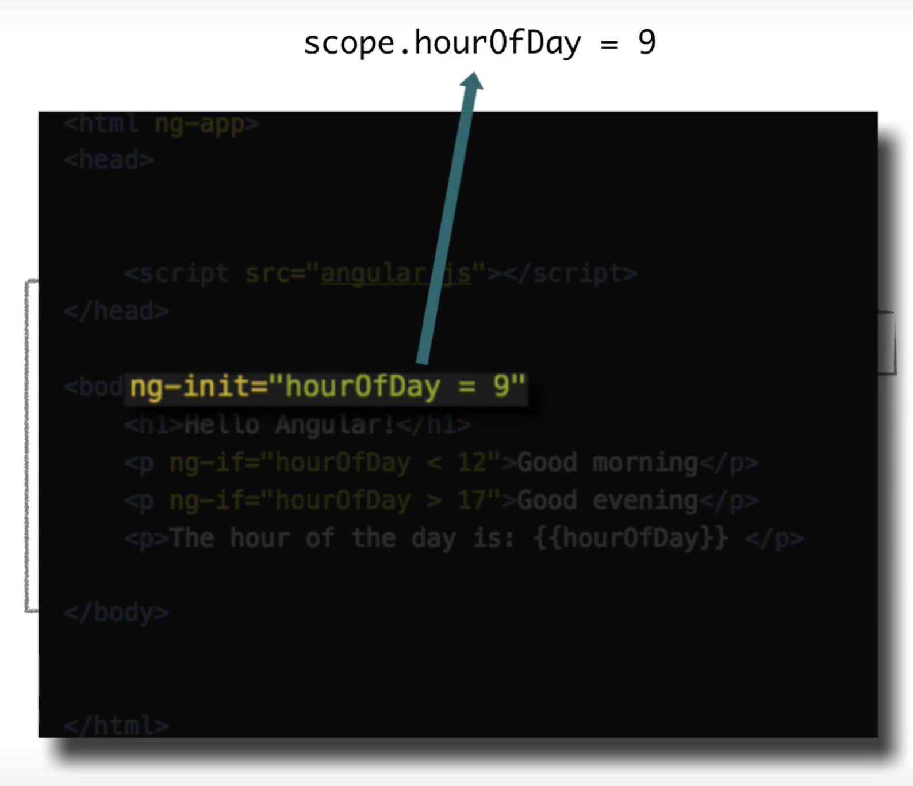

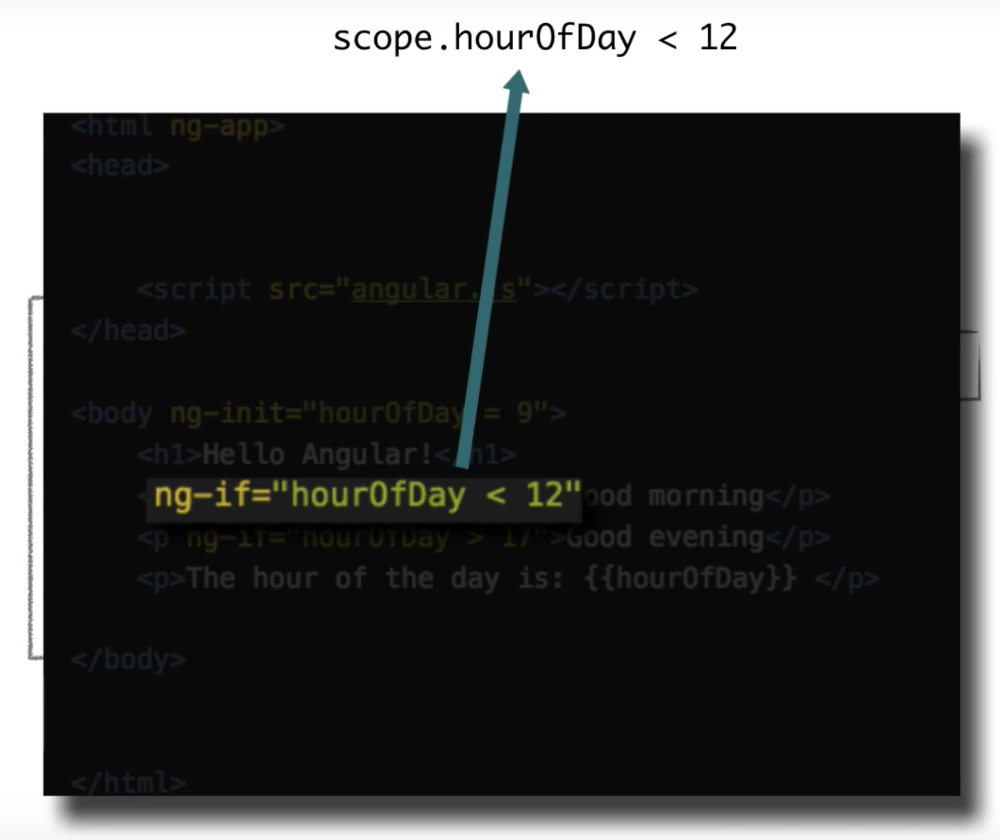

----

### ng-bind and Angular Expressions

```
<!DOCTYPE html>
<html ng-app>
<head>
	<title>My First Angular App</title>
	<script src="angular.js"></script>
</head>
<body ng-init="hourOfDay = 14">
	<h1>
		Hello Angular
	</h1>

	<p ng-if="hourOfDay < 12">
		Good Morning
	</p>

	<p ng-if="hourOfDay > 12">
		Good Afternoon
	</p>

	<p>The hour of day is: {{hourOfDay}}</p>


	<p>The hour of day is: <span ng-bind="hourOfDay + 1"></span></p>

</body>
</html>
```

The output is:

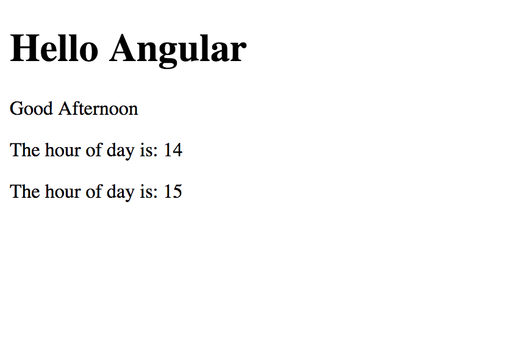

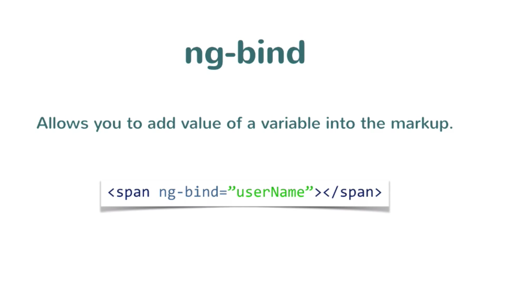


At runtime, it substitutes the value of the variable in the HTML script. **(Variable Value Resolution)**

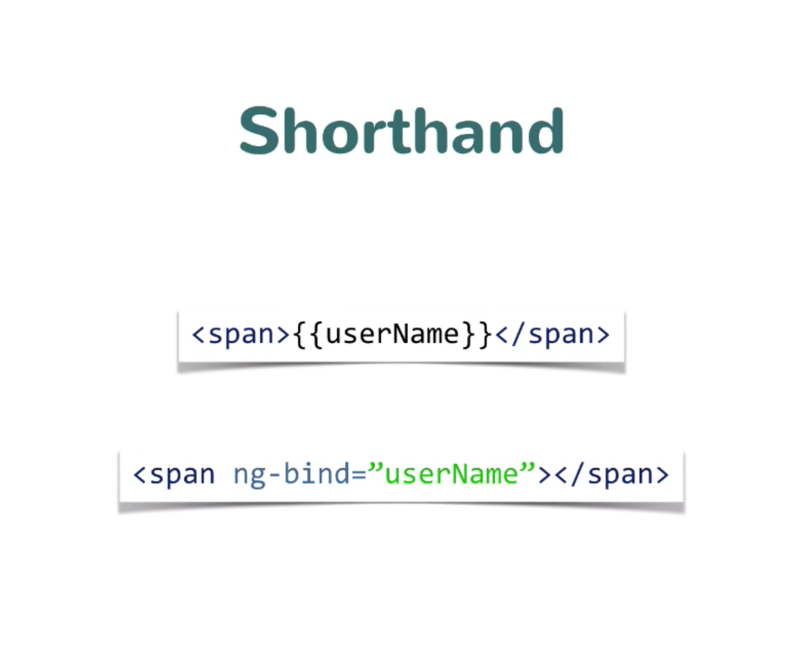

Both these are actually same.

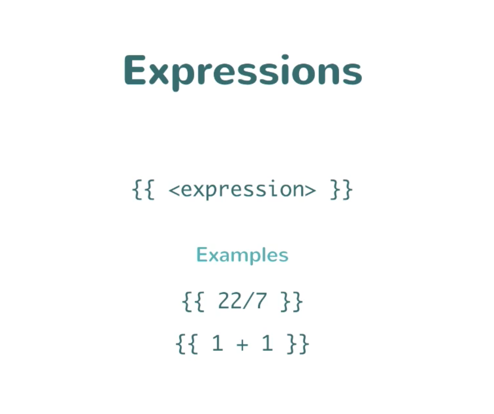

It also lets you evaluate an expression. **(Expression Evaluation)**

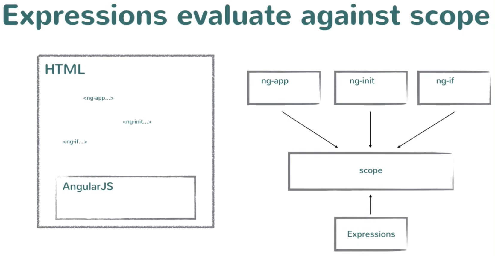

Expressions also refer to scope. **(Expression Scope Resolution)**

**What happens when there is already some content in the paragraph, and we try to use a ng-bind with it?**

```
<!DOCTYPE html>
<html ng-app>
<head>
	<title>My First Angular App</title>
	<script src="angular.js"></script>
</head>
<body ng-init="hourOfDay = 14">
	<h1>
		Hello Angular
	</h1>

	<p ng-if="hourOfDay < 12">
		Good Morning
	</p>

	<p ng-if="hourOfDay > 12">
		Good Afternoon
	</p>

	<p ng-bind="hourOfDay">The hour of day is: </p>

</body>
</html>
```

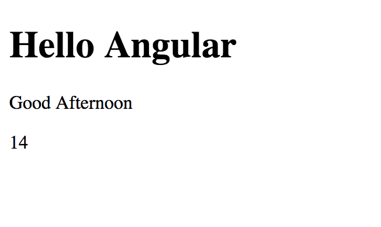

We see `ng-bind` replaces the previous content of the paragraph, with the value of the variable.

That is why we need to use `ng-bind` in a `separate span or paragraph`.

But with `double braces` syntax, we need to use a separate span or paragraph.

**Note:** So far whatever directive we have seen, is an HTML extension. But `double braces` is the first `non-HTML based directive`.

----

### Introducing the Angular Controller

The code that we have seen so far is not a good way of coding as there is no seperation of concerns, i.e. the business logic is not separated from the HTML view.

Also, `ng-init` is not efficient in data processing for complex business logic.

**Solution:** `ng-controller`

```
<!DOCTYPE html>
<html ng-app>
<head>
	<title>My First Angular App</title>
	<script src="angular.js"></script>
</head>
<body>
	<div ng-controller="Main">
		<h1>
			Hello Angular
		</h1>
	</div>
	<script>
		function Main() {
			console.log("Before rendering the div, this function is called. If we need some data, we can process it here.")
		}
	</script>
</body>
</html>
```

This code won't work. This is just at a very high level the purpose of ng-controller.

Also, this is not a good way of declaring a controller, because the `ng-controller` points to a global function `Main`. And global functions are not recommended.

Instead, we need to declare a method and register it as a controller with Angular first and then start using it. We need to have this extra step of registering a method as a controller.

----

### Creating and Using Angular Modules

How do we register a method as controller?

We do it by using a concept of modules.

There is a global object `angular`, using which we can access a method `module` to create our custom modules.

```
<!DOCTYPE html>
<html ng-app="myModule">
<head>
	<title>My First Angular App</title>
	<script src="angular.js"></script>
</head>
<body ng-init="hourOfDay = 14">

	<div ng-controller="myMainController">
		<h1>
			Hello Angular
		</h1>

		<p ng-if="hourOfDay < 12">
			Good Morning
		</p>

		<p ng-if="hourOfDay > 12">
			Good Afternoon
		</p>

		<p>The hour of day is: {{hourOfDay}}</p>

	</div>

	<script>
		var module = angular.module("myModule", []); //We create a module called "myModule"
		module.controller("myMainController", Main); //We register our "Main" method to a controller and give the controller a name "myMainController"

		function Main() {
			console.log("Main Called")
		}
	</script>

</body>
</html>
```

The output is:

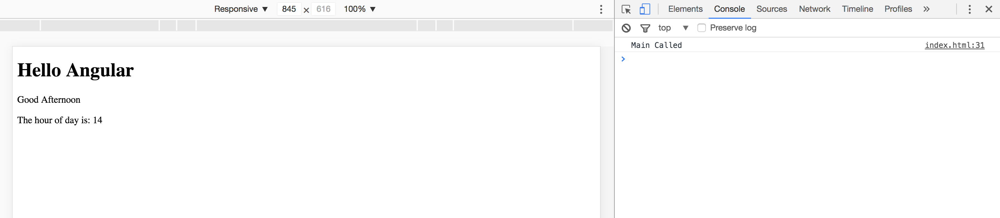

**It has 3 steps:**

- We create a module called "myModule"
- We register our "Main" method to a controller and give the controller a name "myMainController"
- We tell Angular to point to our module "myModule" by `ng-app="myModule"`

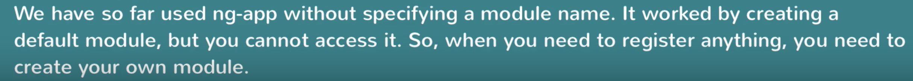

----

### Summary of Angular Controllers

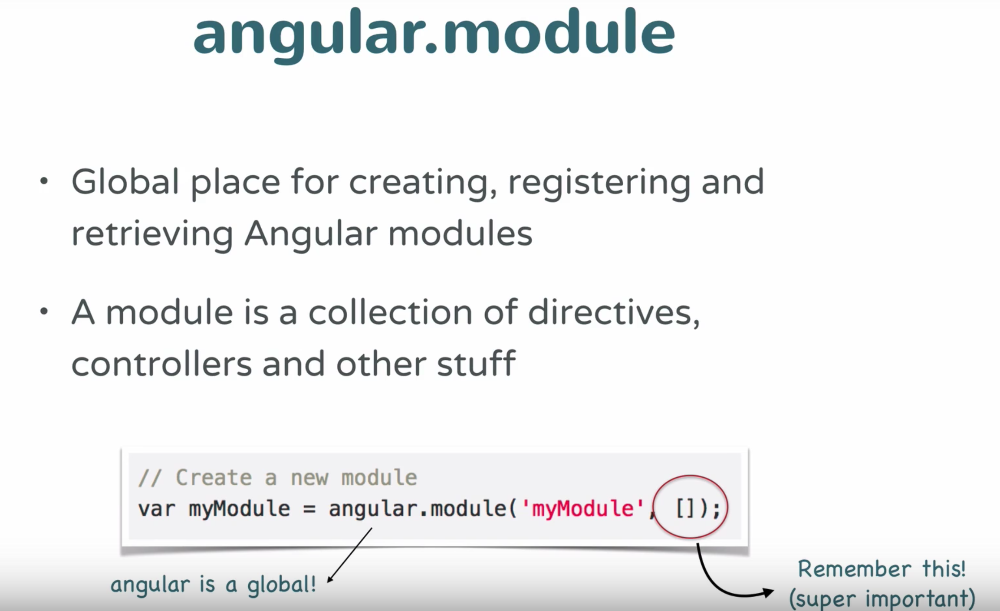

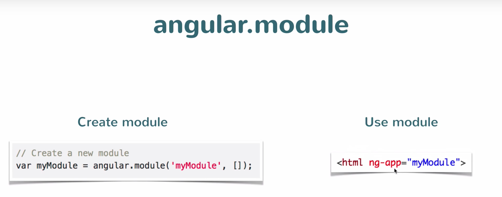

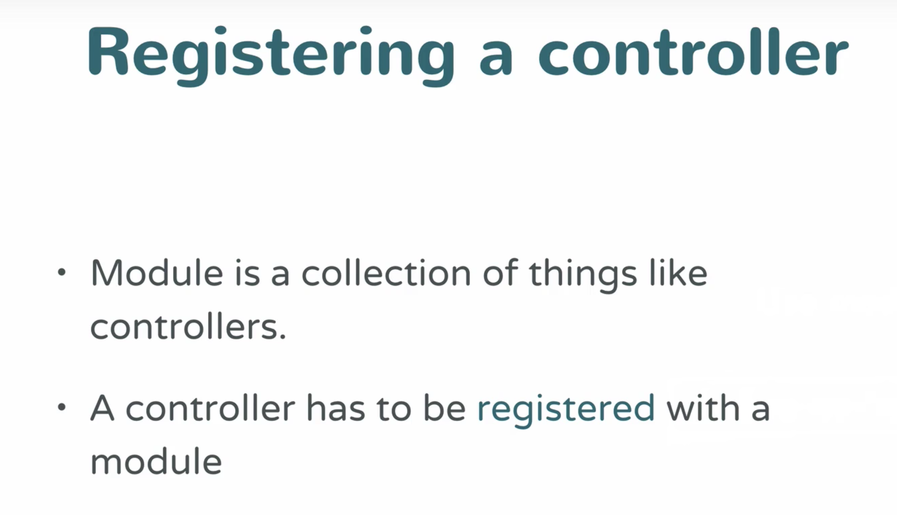

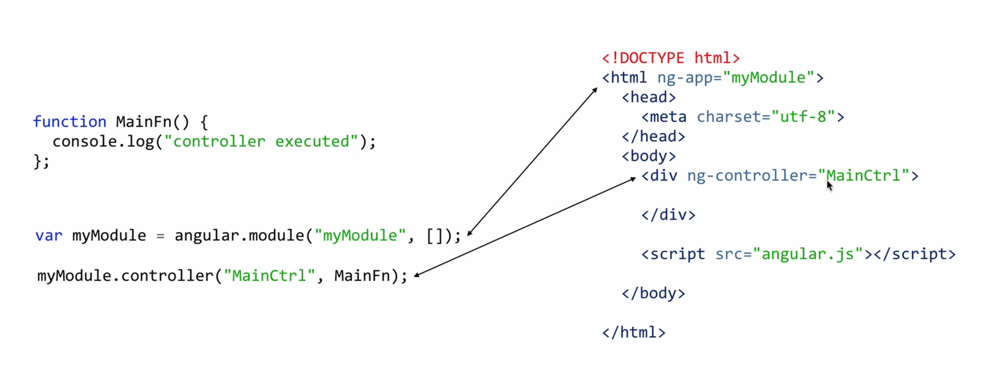

----

### Dependency Injection And Scope - Setting the model data in the controller

Earlier we had seen `ng-init` to do initialization of variable `hourOfDay`.

We will now see how to do some data processing (for example: initialization of a variable) inside the controller, and the access that variable from the view.

To do this, we need to set the variable in the scope inside the controller.

To get the scope variable inside the controller, we need **Dependency Injection**. **It declares the `$scope` variable in the method parameter list**, and when Angular calls the method, it passes the scope object to the controller.

```
<!DOCTYPE html>
<html ng-app="myModule">
<head>
	<title>My First Angular App</title>
	<script src="angular.js"></script>
</head>
<body>

	<div ng-controller="myMainController">
		<h1>
			Hello Angular
		</h1>

		<p ng-if="hourOfDay < 12">
			Good Morning
		</p>

		<p ng-if="hourOfDay > 12">
			Good Afternoon
		</p>

		<p>The hour of day is: {{hourOfDay}}</p>

	</div>

	<script>
		var module = angular.module("myModule", []); //We create a module called "myModule"
		module.controller("myMainController", Main); //We register our "Main" method to a controller and give the controller a name "myMainController"

		function Main($scope) {
			$scope.hourOfDay = 14;
			console.log("Main Called")
		}
	</script>

</body>
</html>
```

The output is:


----

### Clock App

Get the project structure up like this:

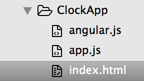

Inside `index.html`, write this:

```
<!DOCTYPE html>
<html ng-app="myClockModule">
<head>
	<title>My Clock App</title>
	<script src="angular.js"></script>
	<script src="app.js"></script>
</head>
<body>

	<div ng-controller="myTimeController">

		<p>The hour of day is: {{timeString}}</p>

	</div>

</body>
</html>
```

Inside `app.js`, write this:

```
var module = angular.module("myClockModule", []);
module.controller("myTimeController", TimeController);

function TimeController($scope) {
	var currentDate = new Date();
	$scope.timeString = currentDate.toTimeString();
}
```

The output is:

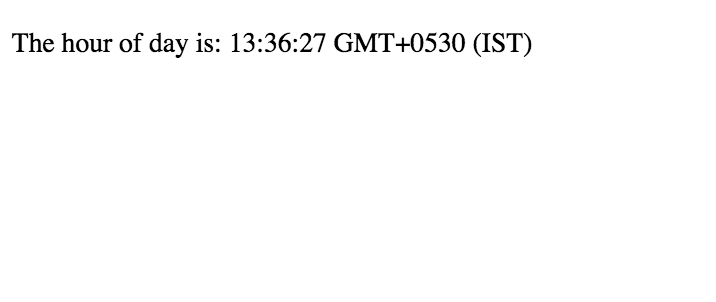

----

### ng-click and data binding

We are now gonna have a refresh button.

The traditional Javascript way of doing this is:

```
<button onclick="updateTime()">Update Time</button>
```

But we will use the angular directive `ng-click`.

On click of the button, we update the value of the variable on the scope, and Angular automatically syncs it with the view using `binding`.

Inside `index.html`, write this:

```
<!DOCTYPE html>
<html ng-app="myClockModule">
<head>
	<title>My Clock App</title>
	<script src="angular.js"></script>
	<script src="app.js"></script>
</head>
<body>

	<div ng-controller="myTimeController">

		<p>The hour of day is: {{timeString}}</p>
		<button ng-click="updateTime()">Update Time</button>
	</div>

</body>
</html>
```

Inside `app.js`, write this:

```
var module = angular.module("myClockModule", []);
module.controller("myTimeController", TimeController);

function TimeController($scope) {
	var currentDate = new Date();
	$scope.timeString = currentDate.toTimeString();

	$scope.updateTime = function() {
		var currentDate = new Date();
		$scope.timeString = currentDate.toTimeString();
	}
}
```

The output is:

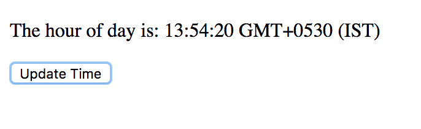

----

### Two Way Data Binding

Previously, we have seen one-way binding using `ng-bind`, which was used to send data from controller to the view.

Now we will see two-way binding.

In a client-server application, when we have to send data from the client to the server (for example, send data of a form/textbox using HTTP Request).

We need to send the data from view to the controller, for a client-side application. It is done using `ng-model`.

Create a project structure like this:

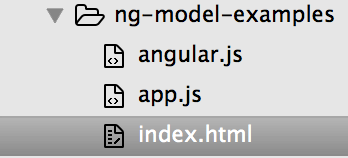

In `index.html`, write:

```
<!DOCTYPE html>
<html ng-app="myNgModelModule">
<head>
	<title>NgModelExamples</title>
	<script src="angular.js"></script>
	<script src="app.js"></script>
</head>
<body>

	<div ng-controller="myNgModelController">

		Please enter your name: <input ng-model="userName" type="text"></input>

		<p>Your name is: {{userName}}</p>
	</div>

</body>
</html>
```

In `app.js`, write:

```
var module = angular.module("myNgModelModule", []);
module.controller("myNgModelController", NgModelController);

function NgModelController($scope) {
	
}
```

The output is:

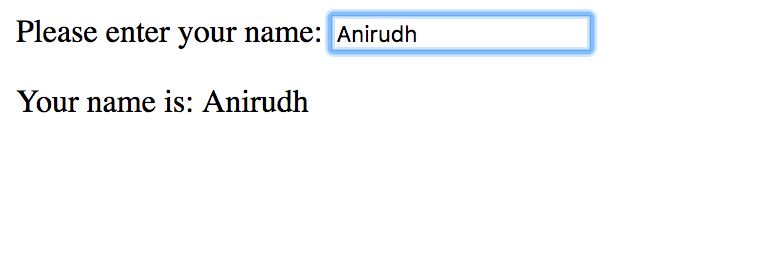

Whenever the scope object is updated, the view is automatically updated by Angular.

----

### More Input Controls with ng-model

```
<!DOCTYPE html>
<html ng-app="myNgModelModule">
<head>
	<title>NgModelExamples</title>
	<script src="angular.js"></script>
	<script src="app.js"></script>
</head>
<body ng-controller="myNgModelController">
	
		<h1>ng-model Examples</h1>
		
		<p>Textbox: <input ng-model="textString" type="text"></input></p>

		<p>Checkbox: <input type="checkbox" ng-model="booleanValue"></input></p>

		<p>Date: <input type="date" ng-model="dateValue"></input></p>

		<p>Radiobox:

		<input type="radio" value="opt1value" ng-model="radioValue">Option 1</input>

		<input type="radio" value="opt2value" ng-model="radioValue">Option 2</input>

		<input type="radio" value="opt3value" ng-model="radioValue">Option 3</input>

		</p>

		<div>
			<p>
				Textbox Input: {{textString}}
			</p>

			<p>
				Checkbox Input: {{booleanValue}}
			</p>

			<p>
				Date Input: {{dateValue}}
			</p>

			<p>
				Radio Input: {{radioValue}}
			</p>

		</div>

</body>
</html>
```

The output is:

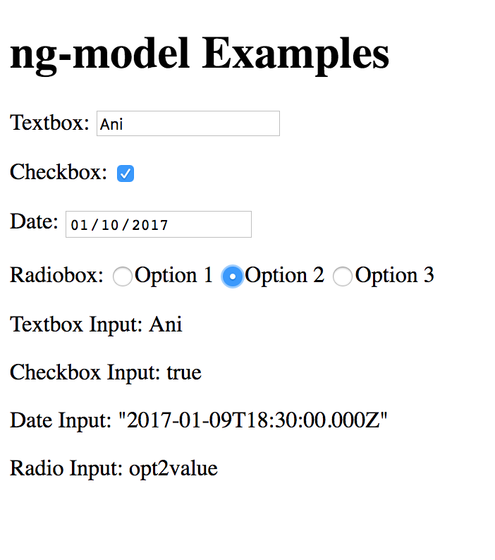

**Note:** All 3 options of Radiobox are wired to the same ng-model `radioValue`. Their values, i.e. `opt1value`, `opt2value` and `opt3value` gets bound to the html using double braces `{{radioValue}}`.

----

### ng-change

Whenever a model value changes, we can invoke a method using `ng-change`.

In `index.html`, write:

```
<!DOCTYPE html>
<html ng-app="myNgModelModule">
<head>
	<title>NgModelExamples</title>
	<script src="angular.js"></script>
	<script src="app.js"></script>
</head>
<body ng-controller="myNgModelController">
	
		<h1>ng-model Examples</h1>
		
		<p>Textbox: <input ng-model="textString" type="text" ng-change="textBoxChange()"></input></p>

		<p>Checkbox: <input type="checkbox" ng-model="booleanValue"></input></p>

		<p>Date: <input type="date" ng-model="dateValue"></input></p>

		<p>Radiobox:

		<input type="radio" value="opt1value" ng-model="radioValue">Option 1</input>

		<input type="radio" value="opt2value" ng-model="radioValue">Option 2</input>

		<input type="radio" value="opt3value" ng-model="radioValue">Option 3</input>

		</p>

		<div>
			<p>
				Textbox Input: {{textString}}
			</p>

			<p>
				Checkbox Input: {{booleanValue}}
			</p>

			<p>
				Date Input: {{dateValue}}
			</p>

			<p>
				Radio Input: {{radioValue}}
			</p>

		</div>

</body>
</html>
```

In `app.js`, write:

```
var module = angular.module("myNgModelModule", []);
module.controller("myNgModelController", NgModelController);

function NgModelController($scope) {
	$scope.textBoxChange = function() {
		console.log("Text Box Value Changed");
	}
}
```

The output is:

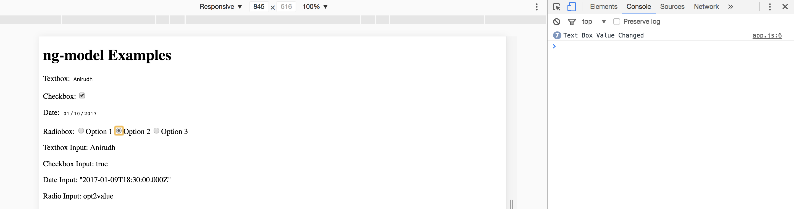

----

### Multiple controls wired with the same ng-model

Let us say we use 3 textboxes with same ng-model `textString `.

Example:

```
<!DOCTYPE html>
<html ng-app="myNgModelModule">
<head>
	<title>NgModelExamplesp</title>
	<script src="angular.js"></script>
	<script src="app.js"></script>
</head>
<body ng-controller="myNgModelController">
	
		<h1>ng-model Examples</h1>
		
		<p>Textbox: <input ng-model="textString" type="text" ng-change="textBoxChange()"></input></p>

		<p>Textbox: <input ng-model="textString" type="text" ng-change="textBoxChange()"></input></p>

		<p>Textbox: <input ng-model="textString" type="text" ng-change="textBoxChange()"></input></p>
		

		<p>Checkbox: <input type="checkbox" ng-model="booleanValue"></input></p>

		<p>Date: <input type="date" ng-model="dateValue"></input></p>

		<p>Radiobox:

		<input type="radio" value="opt1value" ng-model="radioValue">Option 1</input>

		<input type="radio" value="opt2value" ng-model="radioValue">Option 2</input>

		<input type="radio" value="opt3value" ng-model="radioValue">Option 3</input>

		</p>

		<div>
			<p>
				Textbox Input: {{textString}}
			</p>

			<p>
				Checkbox Input: {{booleanValue}}
			</p>

			<p>
				Date Input: {{dateValue}}
			</p>

			<p>
				Radio Input: {{radioValue}}
			</p>

		</div>

</body>
</html>
```

The output is:

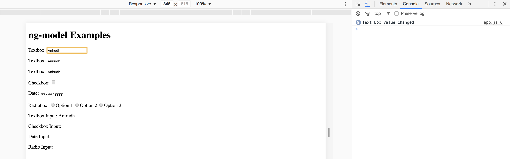

We see as soon as we type something in the first textbox, it is reflected in all other textboxes as also the paragraph below. This correctly shows two-way binding. The view modifies the scope, and the scope triggers back the view.

----

### Multiple Controllers

Sometimes we need multiple controllers in the same Angular application. Also, sometimes we need them to be nested.

To demonstrate, let us create a project structure like:

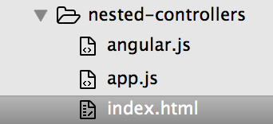

In `app.js`, write:

```
var module = angular.module("myNestedControllerModule", []);

module.controller("Controller1", Controller1);
module.controller("Controller2", Controller2);

function Controller1($scope) {
	//Scope of controller 1 is diffrent from scope of controller 2
	$scope.testProp = "From Controller1"
}

function Controller2($scope) {
	//Scope of controller 2 is diffrent from scope of controller 1
	$scope.testProp = "From Controller2"
}
```

In `index.html`, write:

```
<!DOCTYPE html>
<html ng-app="myNestedControllerModule">
<head>
	<title>Nested Controllers</title>
	<script src="angular.js"></script>
	<script src="app.js"></script>
</head>

<body>
	
	<h1>Nested Controllers App</h1>

		<div ng-controller="Controller1">
			<p ng-bind="testProp"></p>

		</div>

		<div ng-controller="Controller2">
			<p ng-bind="testProp"></p>

		</div>

</body>
</html>
```

There is a different `scope` object for every controller of the app.

It means scope of controller 2 is diffrent from scope of controller 1. So, even if we use same named variable to bind in different controllers, it is still valid, as they refer to different scope.

Output:

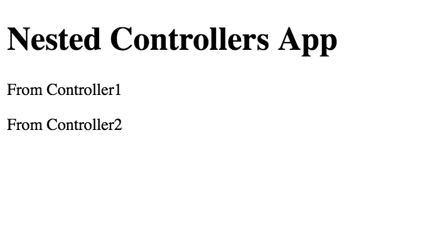

**Note:**

Let's say we write:

```
<!DOCTYPE html>
<html ng-app="myNestedControllerModule">
<head>
	<title>Nested Controllers</title>
	<script src="angular.js"></script>
	<script src="app.js"></script>
</head>

<body>
	<h1>Nested Controllers App</h1>
	<div ng-init="testProp = 10">
	</div>

</body>
</html>
```

When we don't declare any controller, even if there is no controller, there is a global scope object that comes by-default with `ng-app`. This global scope is called `"root scope"`.

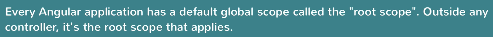

But when we create an explicit controller, we get a separate scope object.

We can have different controllers to separate out the business logic, and separate out the context.

----

### Nested Controllers and Scope Hierarchy

Inside `index.html`, write:

```
<!DOCTYPE html>
<html ng-app="myNestedControllerModule">
<head>
	<title>Nested Controllers</title>
	<script src="angular.js"></script>
	<script src="app.js"></script>
</head>

<body>
	
	<h1>Nested Controllers App</h1>

		<div ng-controller="Controller1">
			<p ng-bind="testProp"></p>
			
			<div ng-controller="Controller2">
				<p ng-bind="testProp"></p>
			</div>
		</div>

</body>
</html>
```

Inside `app.js`, write:

```
var module = angular.module("myNestedControllerModule", []);

module.controller("Controller1", Controller1);
module.controller("Controller2", Controller2);

function Controller1($scope) {
	$scope.testProp = "From Controller1"
}

function Controller2($scope) {
	$scope.testProp = "From Controller2"
}
```

We can see:


Now, comment out scope of Controller1.

```
var module = angular.module("myNestedControllerModule", []);

module.controller("Controller1", Controller1);
module.controller("Controller2", Controller2);

function Controller1($scope) {
	//$scope.testProp = "From Controller1"
}

function Controller2($scope) {
	$scope.testProp = "From Controller2"
}
```

We can see:

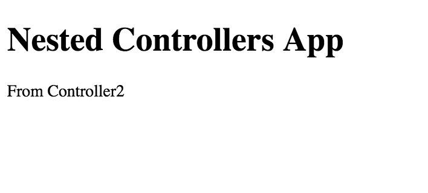

The first ng-bind does not have any value now. So, the paragraph itself is skipped. We only see paragraph for second ng-bind.

Now, comment out scope of Controller2.

```
var module = angular.module("myNestedControllerModule", []);

module.controller("Controller1", Controller1);
module.controller("Controller2", Controller2);

function Controller1($scope) {
	$scope.testProp = "From Controller1"
}

function Controller2($scope) {
	//$scope.testProp = "From Controller2"
}
```

We can see:

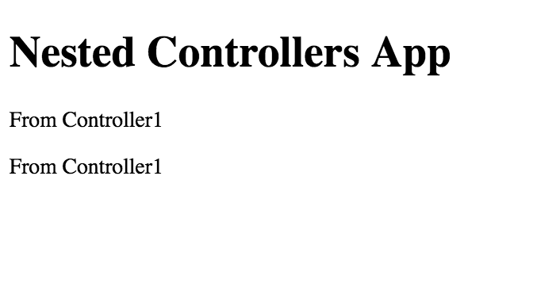

When angular was not able to find the value for `testProp`, it looks up to its parent. Since these controllers are nested, it actually forms a scope hierarchy.

Both controllers still have different scopes. Only thing is they are nested. The inner controller's scope is a child of outer controller's scope.

So, if the inner controller is accessing a value on it's scope, which is available, it gets the value. If not available, it looks for the value in its parent's scope. If the value is not available in the parent scope as well, then the search continues in the global root scope.


It goes up the scope hierarchy until it reaches the root scope to find the value. If it finds the value in one of it's parent's scopes, it will use it. But **there is no way to find out from which parent exactly the value came from**, as and when the application grows complex. So, using `ng-controller="ControllerName"` is not recommended.

**Solution:** `ng-controller="ControllerName as AliasName"` lets you know which exact scope you are referring to.

----

### Using `Controller as` Syntax

We create an alias for every controller with syntax `as` in `index.html`. We use this alias name explicitly before every variable we want to use.

```
<!DOCTYPE html>
<html ng-app="myNestedControllerModule">
<head>
	<title>Nested Controllers</title>
	<script src="angular.js"></script>
	<script src="app.js"></script>
</head>

<body>
	
	<h1>Nested Controllers App</h1>

		<div ng-controller="Controller1 as c1">
			<p ng-bind="c1.testProp"></p>
			
			<div ng-controller="Controller2 as c2">
				<p ng-bind="c2.testProp"></p>
			</div>
		</div>

</body>
</html>
```

We remove the `$scope` from parameter list of the method, and instead use `this` to refer to the current scope in the `app.js`.


```
var module = angular.module("myNestedControllerModule", []);

module.controller("Controller1", Controller1);
module.controller("Controller2", Controller2);

function Controller1() {
	this.testProp = "From Controller1"
}

function Controller2() {
	this.testProp = "From Controller2"
}
```

We see:


Now, if we use `c1.testProp` in the inner controller:

```
<!DOCTYPE html>
<html ng-app="myNestedControllerModule">
<head>
	<title>Nested Controllers</title>
	<script src="angular.js"></script>
	<script src="app.js"></script>
</head>

<body>
	
	<h1>Nested Controllers App</h1>

		<div ng-controller="Controller1 as c1">
			<p ng-bind="c1.testProp"></p>
			
			<div ng-controller="Controller2 as c2">
				<p ng-bind="c1.testProp"></p>
			</div>
		</div>

</body>
</html>
```

The inner controller pulls the value from outer controller's scope, since we mentioned it explicitly.

We see:


**Two advantages of using aliases:**

- Flexible
- Clarity as to which exact controller's scope it is referring to

### The Calculator App

Project Structure:

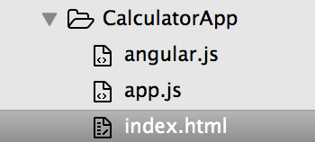

Inside `index.html`, write:

```
<!DOCTYPE html>
<html ng-app="myCalculatorModule">
<head>
	<title>Calculator App</title>
	<script src="angular.js"></script>
	<script src="app.js"></script>
</head>
<body>
<h1>Calculator App</h1>
	<div ng-controller="myCalculatorController as cal">

		<input type="text" ng-model="cal.input1"></input>
		<span ng-bind="cal.selectedOperation"></span>
		<input type="text" ng-model="cal.input2"></input>
		<button ng-click="cal.computeResult()">=</button>
		<span ng-bind="cal.resultValue"></span>
		<p>
			Choose Operation:
			<button ng-click="cal.BtnClicked('+')">+</button>
			<button ng-click="cal.BtnClicked('-')">-</button>
			<button ng-click="cal.BtnClicked('*')">*</button>
			<button ng-click="cal.BtnClicked('/')">/</button>
		</p>
		<p>
		{{cal.input1}}
		</p>
		<p>
		{{cal.input2}}
		</p>
	</div>


</body>
</html>
```

Inside `app.js`, write:

```
var module = angular.module("myCalculatorModule", []);
module.controller("myCalculatorController", CalculatorController);

function CalculatorController() {
	this.resultValue = 0;

	this.computeResult = function() {
		var number1 = parseFloat(this.input1); //Convert String type input to float number
		var number2 = parseFloat(this.input2); //Convert String type input to float number

		if (this.selectedOperation === '+') {
			this.resultValue = number1 + number2;
		}

		else if (this.selectedOperation === '-') {
			this.resultValue = number1 - number2;
		}

		else if (this.selectedOperation === '*') {
			this.resultValue = number1 * number2;
		}

		else if (this.selectedOperation === '/') {
			this.resultValue = number1 / number2;
		}
	}

	this.BtnClicked = function(button) {
		this.selectedOperation = button;
	}
}
```

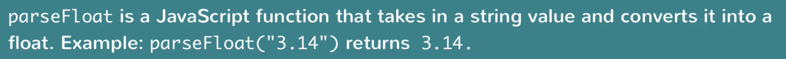

Output:

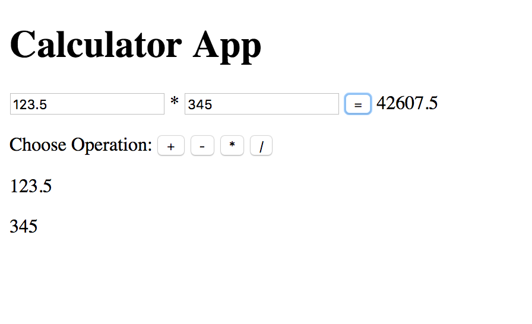

If we enter a string, the output is `NaN`.

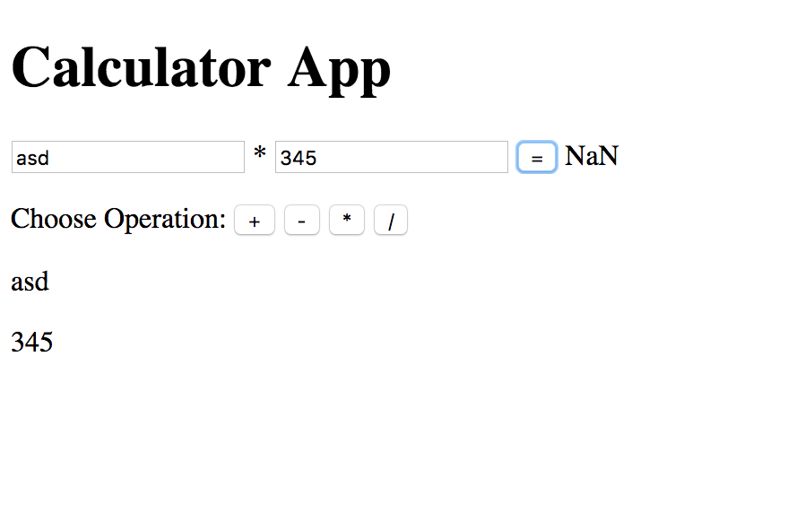

----

### ng-show and ng-hide

Create a project structure as:

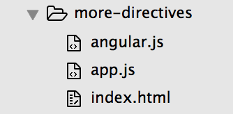

Imagine we have a checkbox, and depending on whether it's checked or not, we have to either show or hide some paragraph.

We can do in the traditional way by using `ng-if`.

Inside `index.html`, write:

```
<!DOCTYPE html>
<html ng-app="MoreDirectivesModule">
<head>
	<title>MoreDirectives</title>
	<script src="angular.js"></script>
	<script src="app.js"></script>
</head>

<body>
	
	<h1>More Directives App</h1>

	<div ng-controller="Controller as ctrl">
		<input type="checkbox" ng-model="ctrl.checked"></input>

		<p ng-if="ctrl.checked">Some Content</p>

	</div>
</body>
</html>
```

Inside `app.js`, write:

```
angular.module("MoreDirectivesModule", []).controller("Controller", Controller);

function Controller() {
}
```

When not checked, we see:

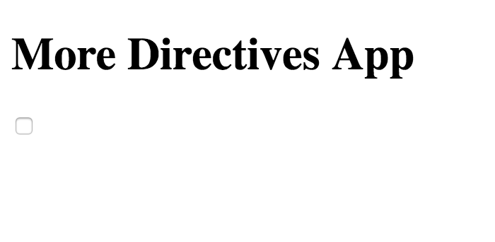

When checked, we see:

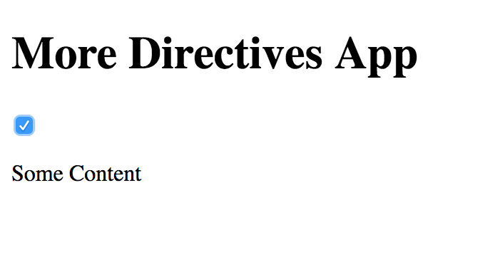

**But we can achieve the same functionality using two other angular directives `ng-hide` and `ng-show`. Let's see that now.**

`ng-hide` is just the opposite of `ng-show`. If a condition is true, `ng-show` shows it, but `ng-hide` hides it.

So, instead of writing,

**`<p ng-if="ctrl.checked">Some Content</p>`**

We can write,

**`<p ng-show="ctrl.checked">Some Content</p>`**

Or

**`<p ng-hide="!ctrl.checked">Some Content</p>`**

**All three does the same thing.**

Now, **what is the difference between these three then?**

There is actually some difference.

When we use `ng-if`, if we do `inspect element` from `developer tools` of the browser.

When unchecked, we will see:

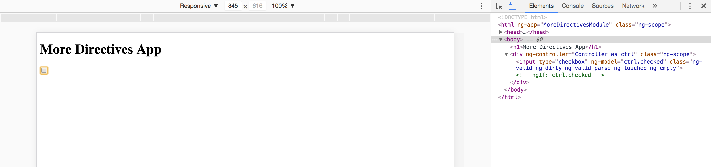

When checked, we will see:

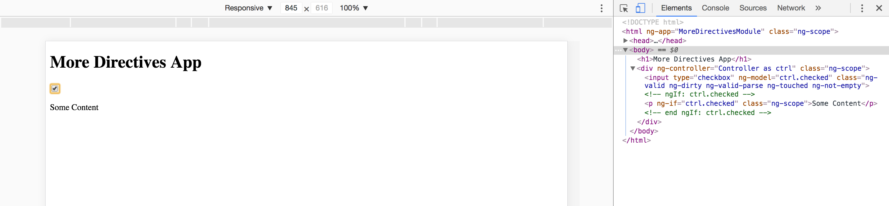

So, `ng-if` actually removes the paragraph node from the DOM if condition is false, and when condition is true, it inserts the node into DOM again.

When we use `ng-show`, if we do `inspect element` from `developer tools` of the browser.

When unchecked, we will see:


When checked, we will see:

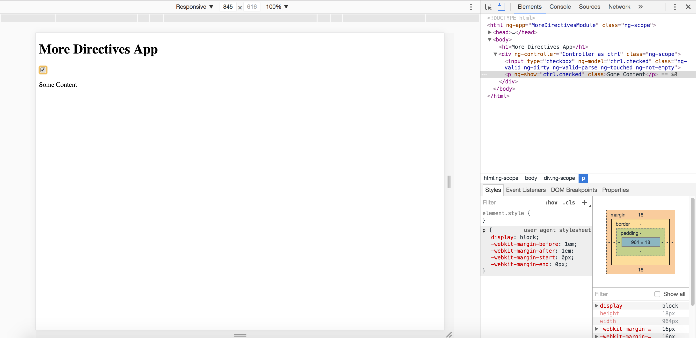

So, `ng-show` actually does not remove the paragraph node from the DOM if condition is false, it only adds a class `ng-hide` to the paragraph tag. And this `ng-hide` class has a CSS property `display = none`, which is why the paragraph is not shown, while the node is still in the tree. And when the condition is true, it removes the class `ng-hide` from the paragraph tag.

`ng-hide` does the same thing, just the other way round.

**When to use what?**

When we are sure that once an element is removed from DOM, we don't need it again, we use `ng-if`. But if we might need to show the element later, we use `ng-show` or `ng-hide`.

----

### Looping with ng-repeat

Inside `app.js`, we declare an array:

```
angular.module("MoreDirectivesModule", []).controller("Controller", Controller);

function Controller() {
	this.myList = [13, 32, 45, 89];
}
```

Here, the array has a count of `4`.

Inside `index.html`, write:

```
<!DOCTYPE html>
<html ng-app="MoreDirectivesModule">
<head>
	<title>MoreDirectives</title>
	<script src="angular.js"></script>
	<script src="app.js"></script>
</head>

<body>
	
	<h1>More Directives App</h1>

	<div ng-controller="Controller as ctrl">
		
	<p ng-repeat="i in ctrl.myList">Hello</p>
	</div>
</body>
</html>
```

Output:

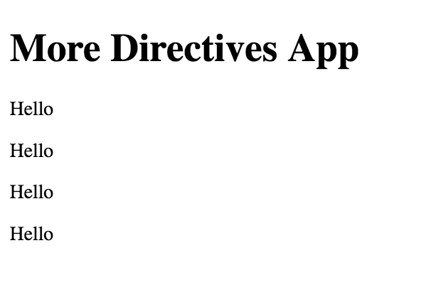

The loop iterates till the count of the array, and repeats the paragraph `4` times.

If we use `ng-repeat` with a `div` having several paragraphs, it repeats the entire `div` 4 times.

Inside `index.html`, write:

```
<!DOCTYPE html>
<html ng-app="MoreDirectivesModule">
<head>
	<title>MoreDirectives</title>
	<script src="angular.js"></script>
	<script src="app.js"></script>
</head>

<body>
	
	<h1>More Directives App</h1>

	<div ng-controller="Controller as ctrl">
		
	<div ng-repeat="i in ctrl.myList">
	<p>Hello</p>
	<p>Anirudh</p>
	</div>
	</div>
</body>
</html>
```

We see:


The loop variable `i` contains the value of the array.

To demonstrate, inside `index.html`, we write:

```
<!DOCTYPE html>
<html ng-app="MoreDirectivesModule">
<head>
	<title>MoreDirectives</title>
	<script src="angular.js"></script>
	<script src="app.js"></script>
</head>

<body>
	
	<h1>More Directives App</h1>

	<div ng-controller="Controller as ctrl">
		
	<div ng-repeat="i in ctrl.myList">
	<p>{{i}}</p>
	</div>
	</div>
</body>
</html>
```

We see:

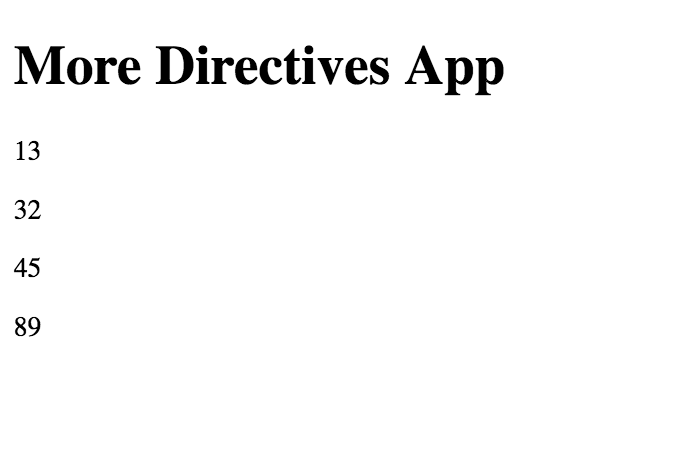

This can be used to show content of objects as well.

To demonstrate, inside `app.js`, we write:

```
angular.module("MoreDirectivesModule", []).controller("Controller", Controller);

function Controller() {
	this.myList = [

		{ 'name': "Ani", 'age': 23},
		{ 'name': "Hari", 'age': 34},
		{ 'name': "Sally", 'age': 18}

	];
}
```

Inside `index.html`, write:

```
<!DOCTYPE html>
<html ng-app="MoreDirectivesModule">
<head>
	<title>MoreDirectives</title>
	<script src="angular.js"></script>
	<script src="app.js"></script>
</head>

<body>
	
	<h1>More Directives App</h1>

	<div ng-controller="Controller as ctrl">
		
	<div ng-repeat="obj in ctrl.myList">
	<p>

	Name: {{obj.name}}

	</p>

	<p>

	Age: {{obj.age}}

	</p>
	
	</hr>

	</div>
	</div>
</body>
</html>
```

We see:

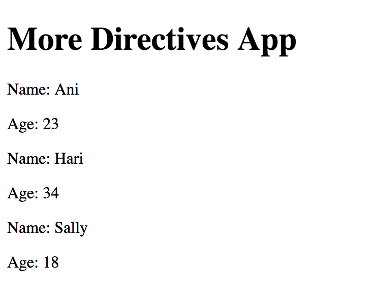

----

### Scopes in ng-repeat

Just like `ng-controller`, Angular adds scopes for `ng-repeat` as well.


We see for each `div` in `ng-repeat`, it created a class `ng-scope`. It shows Angular creates a scope object for each `div`.


`obj` cannot be part of main controller scope.

Unlike a traditional `for(i=0;i<10;i++)`, where `i` is the same variable holding different values at different points of time. So, a single scope solves the problem.

But with `ng-repeat` loop, `obj` contains multiple values of same variable at the same time. And all the objects exists simultaneously. So, multiple scopes are required.


Let's now check some other variables of `ng-repeat`.

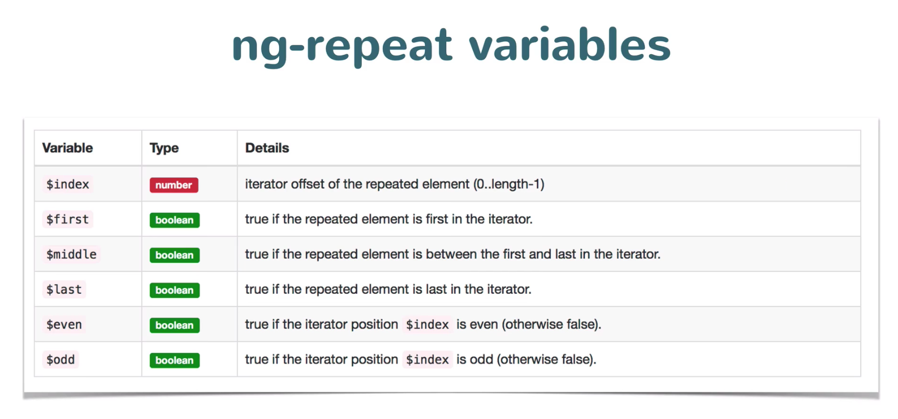

**Examples:**

```
<!DOCTYPE html>
<html ng-app="MoreDirectivesModule">
<head>
	<title>MoreDirectives</title>
	<script src="angular.js"></script>
	<script src="app.js"></script>
</head>

<body>
	
	<h1>More Directives App</h1>

	<div ng-controller="Controller as ctrl">
		
	<div ng-repeat="obj in ctrl.myList">

	<p>

	Element: {{ $index + 1 }}

	</p>

	<p>

	First: {{ $first }}

	</p>

	<p>

	Name: {{ obj.name }}

	</p>

	<p>

	Age: {{ obj.age }}

	</p>

	</hr>

	</div>
	</div>
</body>
</html>
```

We see:

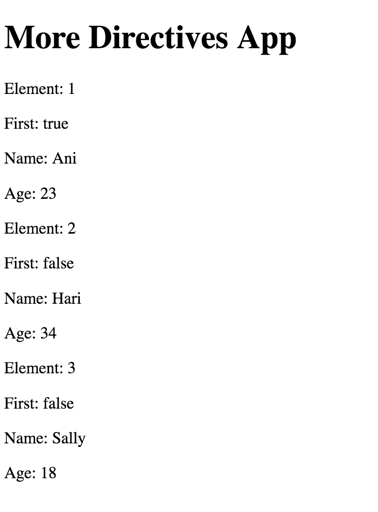

----

### Angular Modules

Sometimes, we might not want to have all the controllers and directives within the same module. We might want to split them up into different modules.

We will create a custom `reusable module` with some important functionality and let other people import it.

Project Structure:

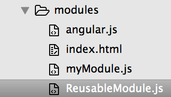

Let us first create a reusable module. Inside `ReusableModule.js`, write:

```
var reusableModule = angular.module("ReusableModule", []);
reusableModule.controller("HelloController", HelloController);

function HelloController() {
	this.message = "Hello from the Reusable Module";
}
```

Next, inside `myModule.js`, write:

```
var myModule = angular.module("myModule", ["ReusableModule"]); //We add list of dependecies of reusable modules in the array
```

So far we left the dependencies array as empty. But now we want to import `ReusableModule` as a dependency. So, we add it in the array. We can add several others too.

Now, in `index.html`, write:

```
<!DOCTYPE html>
<html ng-app="myModule">
<head>
	<title>Modules</title>
	<script src="angular.js"></script>
	<script src="myModule.js"></script>
	<script src="ReusableModule.js"></script>
</head>

<body>
	
	<h1>Modules App</h1>

	<div ng-controller="HelloController as ctrl">
		{{ctrl.message}}
	</div>
</body>
</html>
```

We include both `Reusable.js` and `myModule.js` in `script` tags.

We use `ng-app="myModule"`. When Angular encounters `ng-controller="HelloController as ctrl"` and `{{ctrl.message}}`, it first looks up for it in `myModule`. But it can't find any controller or variable in `myModule`. It then looks for them in it's list of dependencies, i.e. `ReusableModule`, where it finds the necessary controllers and the variables.

Output:

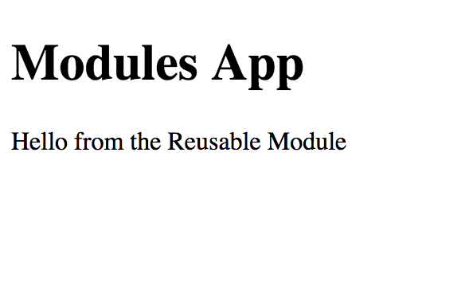

----

### Using an External Module

We will now try to use third party modules, written by other developers, which are open-source and can be found online. I usually refer to `ngmodules.org`.

We will be using a module named `ngTagsInput`. You can read more about it [here](http://ngmodules.org/modules/ngTagsInput)

In the [demos](http://mbenford.github.io/ngTagsInput/demos) section, under `index.html` you can find the `script` tag with path to include it.

```
<script src="http://mbenford.github.io/ngTagsInput/js/ng-tags-input.min.js"></script>
```

There is also a CSS path in one of the `script` tags.

```
<link rel="stylesheet" href="http://mbenford.github.io/ngTagsInput/css/ng-tags-input.min.css" />
```

Under `app.js`, you can find the name of the tag `ngTagsInput`, to be used in the dependencies array.

I am gonna copy these over and use in my app.

We declare the model array `tagsArray` in `myModule.js` inside a function of a controller.

To use this `tagsArray` model array in the `index.html`, we need to use the directive `<tags-input></tags-input>`, that comes along with the `ngTagsInput` module.

Inside `index.html`, write:

```
<!DOCTYPE html>
<html ng-app="myModule">
<head>
	<title>External Modules</title>
	<script src="angular.js"></script>
	<script src="myModule.js"></script>
	<script src="http://mbenford.github.io/ngTagsInput/js/ng-tags-input.min.js"></script>
	<link rel="stylesheet" href="http://mbenford.github.io/ngTagsInput/css/ng-tags-input.min.css" />
</head>

<body>
	
	<h1>External Modules App</h1>

	<div ng-controller="TagsDemoCtrl as ctrl">
		<tags-input ng-model="ctrl.tagsArray"></tags-input>
	</div>
</body>
</html>
```

Inside `myModule.js`, write:

```
var myModule = angular.module("myModule", ["ngTagsInput"]);

myModule.controller('TagsDemoCtrl', TagsDemoCtrl);


function TagsDemoCtrl() {
  this.tagsArray = [
    { text: 'Tag1' },
    { text: 'Tag2' },
    { text: 'Tag3' }
  ];
}
```

Output:

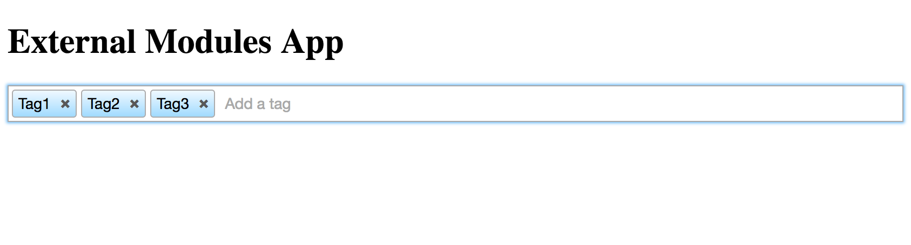

----

### The Todo App

Project Structure:

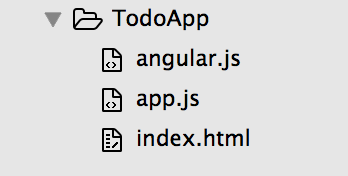

Inside `index.html`, write:

```
<!DOCTYPE html>
<html ng-app="todoApp">
<head>
	<title>Calculator App</title>
	<script src="angular.js"></script>
	<script src="app.js"></script>
</head>
<body>
<h1>Todo App</h1>
	<div ng-controller="TodoController as ctrl">


	<div>
		<p>Add a Todo:</p>
		<input type="text" ng-model="ctrl.newTodo"></input>
		<button ng-click="ctrl.addNewTodo()">Add</button>
	</div>

		<div>
			
			<p>Your Todos:</p>
			<button ng-hide="ctrl.editMode" ng-click="ctrl.triggerEditMode()">Edit</button>

			<button ng-show="ctrl.editMode" ng-click="ctrl.triggerEditMode()">Done</button>

			<ol>
			<li ng-repeat="todo in ctrl.todos">

				<span ng-hide="ctrl.editMode" ng-bind="todo"></span>

				<input ng-show="ctrl.editMode" ng-model="todo" type="text"></input>

				<button ng-hide="ctrl.editMode" ng-click="ctrl.deleteTodo($index)">Delete</button>

			</li>
			</ol>
		</div>
		
	</div>


</body>
</html>
```

Inside `app.js`, write:

```
var module = angular.module("todoApp", []);
module.controller("TodoController", TodoController);

function TodoController() {

	this.editMode = false;

	this.todos = [
		"Learn Angular 1",
		"Try examples",
		"Learn Angular 2 as well"
	];

	this.addNewTodo = function() {
		this.todos.push(this.newTodo);
		this.newTodo = "";
	}

	this.triggerEditMode = function() {
		this.editMode = !this.editMode;

	}

	this.deleteTodo = function(index) {
		this.todos.splice(index, 1);
	}

}
```

Output:

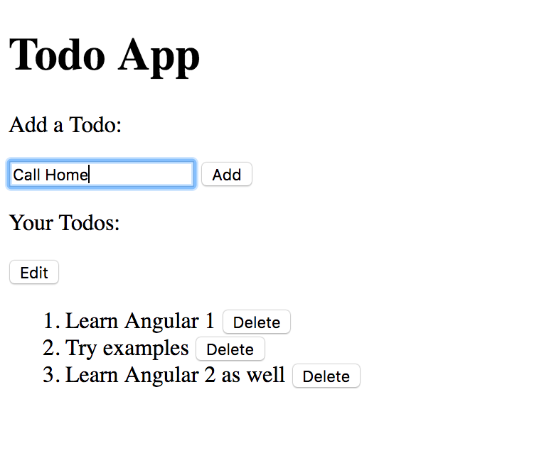

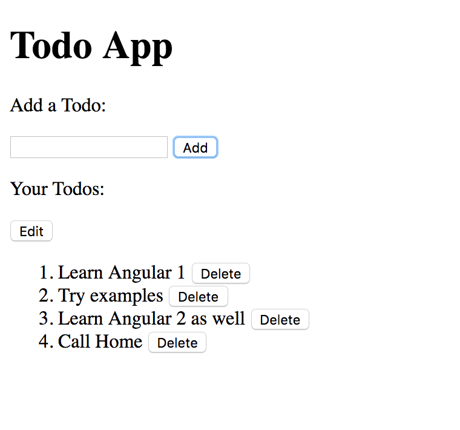

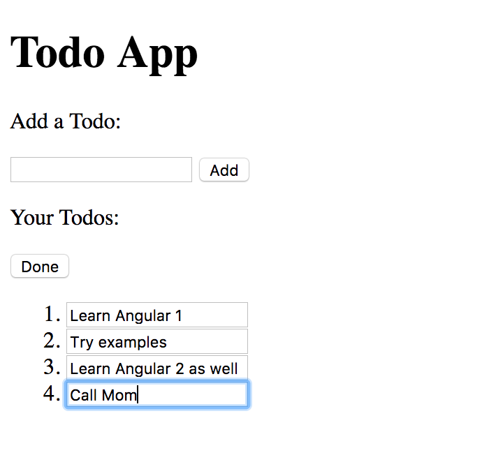

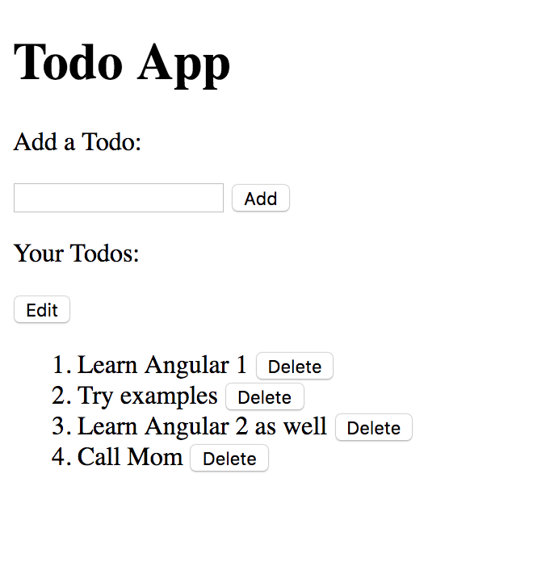

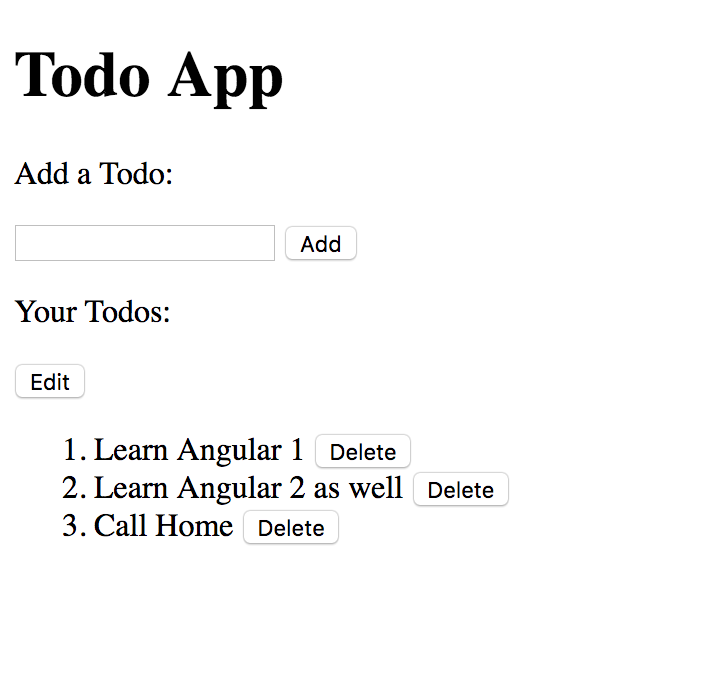

**Note:**

`array.push(element)` is used to insert an element at the end of the array.

`array.splice(startIndex, count)` is used to delete elements starting from a index till `count` times.

Arrays can't hold duplicate values in Angular. If we add same string again, it gives some error.

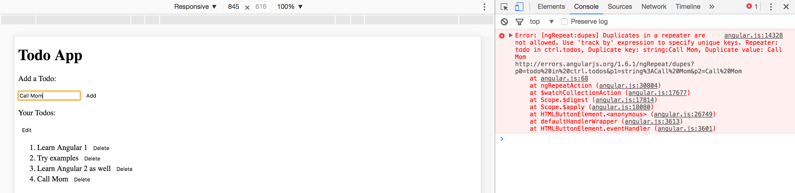

To overcome this, we can either convert the string as an object at runtime, as objects are always unique. Or as an alternative, we can use `track by $index` in the `ng-repeat`.

```
ng-repeat="todo in ctrl.todos track by $index"
```

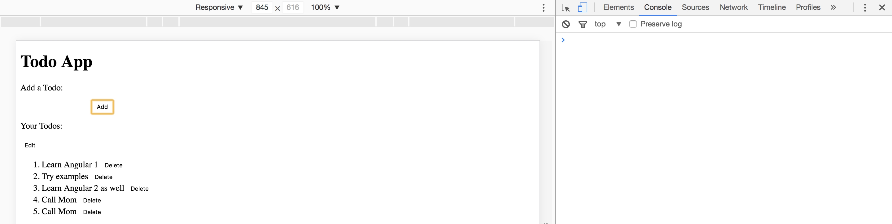

----

### Where to go from here?

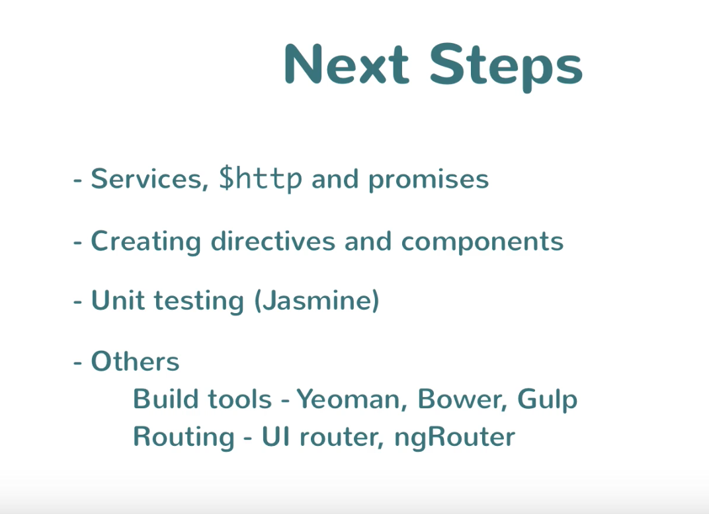