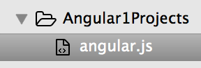

# Angular 1

### Introduction

Angular JS is a popular Javascript framework used to built dynamic client side applications.

**Example:**

Gmail. It's just a single page application (SPA). Anything that you do is done on the same page, without a full page refresh. It has a lot of Javascript scripts interacting with the server using REST API calls.

----

### Pre-Requisite Languages

1. HTML

	Whenever the client browser makes a request to the server, the server responses with a chunk of HTML code. The browser then parses this HTML and builds a DOM tree (Document Object Model). Every tag in the HTML is converted into node of the tree.

	Once the tree is formed, the browser uses it to render the view on the webpage.

	It defines the content of the document to be displayed.

2. CSS

	Used to override the default styles of the browser for a HTML page.

	It separates the presentation style or logic from the content of the document.

	3 modes to define CSS:

	1. Inline - Written inside the HTML tags.
	2. Block - Written inside a Style block above HTML code.
	3. File - Written in a separate file.

3. Javascript

	It is a dynamic programming language. It is both compiled and interpreted.
	
	It has scopes and closures.
	
	It is just used to modify the DOM on the browser. This is why a full page refresh is not required. Since, the DOM tree reflects the view. So, when the tree gets changes, the view gets effected.
	
	It enables interactivity and enables rich client SPAs.
	
----

### Need for Client Side Frameworks

What is the problem that these client side frameworks are trying to solve? Why we need Javascript?

HTMl being a static language cannot modify DOM tree and hence fails to achieve interactiblity.

Javascript on the other hand is dynamic and can modify the DOM tree using APIs/Functions.

**Example: To change the color of a button**


The button has an onClick event hook, where it passes a color to a Javascript API/function. The Javascript function gets the Element/Node from the DOM tree by it's ID, and makes changes in it. Now when the browser renders the view by parsing the DOM tree, the change gets reflected on the view. This is how dynamic feature works.

**Why this code sucks?**

- Messy code / Not elegant
- No separation of concerns. The Javascript code is tightly coupled to the code in HTML. It straight away assumes that there will be an element with `id = para1`
- Harder to maintain
- Harder to test

**We need something better.**


We need Client Side MVC frameworks. As long as we can separate out the 3 elements, we can have maintainable code base. And this is the same thing that all these several frameworks achieve to solve. They all bring in MVC approach to development.

----

### About Angular JS

Angular solves the problem of client side MVC. But in the Angular website and documentation, it never claims to be MVC. Infact it says `HTML enhanced for web apps`:


**Angular JS lets you extent HTML vocabulary for your app.**


**What extending HTML means?**

Let's say we need to display current date on a page.

Now, HTML has no default element/tag to show date.

So, one way is using Javascript.


But wont it be cool if we had something like this:


We can extend HTML and create our custom element/tag (component) to show date. We only need to write it once, and then we can use these components again and again at as many places within the HTML as we want. This is what Angular lets you do.

**Difference between Javascript and Angular JS**


----

### Declarative vs Imperative Programming

- **Imperative** - We write the logic to do something at every place we need it. There is a lot of repetitive code.

- **Declarative** - We write the logic only once in our component in an imperative way. From next time onwards, we just need to declare it or use the already created component.

`Angular uses declarative programming.`

**Custom Elements** in Angular can be created in two ways:

- `Directives`
- `Components`

----

### How an Angular Application Works

The browser has very limited vocabulary. It only understands default HTML tags.

**If we create our own custom element, how will the browser know how to interpret it?**


We write our HTML.

We load the Angular JS path in our HTML body.

For this we can either use CDN path:

```
<script src="https://ajax.googleapis.com/ajax/libs/angularjs/1.6.1/angular.min.js"></script>
```

Or, downloaded `Angular.js` path from System.

We then write logic for the custom directives/components and register them with Angular module. Next, we use these directives using custom tags in our HTML code.

**Angular itself comes with several custom directives by default. They start with prefix `ng-`.** Other than that, we also can write our own custom directives.

----

### Softwares Required

- Text Editor - Sublime Text / Visual Studio Code
- Web Browser - Google Chrome

----

### Your First Angular Application

Create a folder `Angular1Projects`.

Open this folder in Sublime Text.

Go to `https://angularjs.org/` and click on `Angular1`.


Choose branch `latest` and build `uncompressed` and then download.


After `angular.js` is downloaded, move it to `Angular1Projects` folder.



Next create a file `index.html` inside the `Angular1Projects` folder.

Inside `index.html`, write:

```
<!DOCTYPE html>
<html>
<head>
	<title>My First Angular App</title>
	<script src="angular.js"></script>
</head>
<body>
	<h1>
		Hello Angular
	</h1>
</body>
</html>
```

Now, open `index.html` in a browser. Go to `Developer tools -> Network -> All`. We will see angular.js has loaded up in the browser.


Now, we can instruct angular do something using directives. (Declarative Programming)

Add the `ng-app` directive to the `<html>` element. This is a built-in directive.

We then use `ng-if` and give a condition. If condition is true, a paragraph is shown, otherwise not. So, even if the paragraph exists on the page, depending on the condition, Angular can remove it from or keep it in the DOM tree.

If we write:

```
<!DOCTYPE html>
<html ng-app>
<head>
	<title>My First Angular App</title>
	<script src="angular.js"></script>
</head>
<body>
	<h1>
		Hello Angular
	</h1>

	<p ng-if="true">
		Good Morning
	</p>
</body>
</html>
```

We will see:


But, if we write:

```
<!DOCTYPE html>
<html ng-app>
<head>
	<title>My First Angular App</title>
	<script src="angular.js"></script>
</head>
<body>
	<h1>
		Hello Angular
	</h1>

	<p ng-if="false">
		Good Morning
	</p>
</body>
</html>
```

We will see:


----

### Initializing and using variables

`ng-init` is a directive that lets you write initialization code directly in your HTML.

We don't use `var` keyword to declare variables. Instead, we just use it directly!

```
<!DOCTYPE html>
<html ng-app>
<head>
	<title>My First Angular App</title>
	<script src="angular.js"></script>
</head>
<body ng-init="hourOfDay = 14">
	<h1>
		Hello Angular
	</h1>

	<p ng-if="hourOfDay < 12">
		Good Morning
	</p>

	<p ng-if="hourOfDay > 12">
		Good Evening
	</p>


</body>
</html>
```

We see this on browser:


----

### Recap Of Three Directives that we already covered


The DOM tree for Angular starts from the node where you add `ng-app` directive. It treats it as the root of the tree. It only affects that node and the children below it. Anything that you write outside the node or above or below it, is not affected.


It is not recommended way for initialization.


----

### Introducing Scope


We created a variable `hourOfDay` in the `ng-init` directive. But used that variable in some other directive `ng-if`. But, how did it still work? How does the directives talk to each other?

They do so by using a `scope`. Scope is a container in memory in any Angular app, where variables are created. So, from whichever directive you use the variable, it will anyway refer to the same scope.

So, internally it is something like this:


----

### ng-bind and Angular Expressions