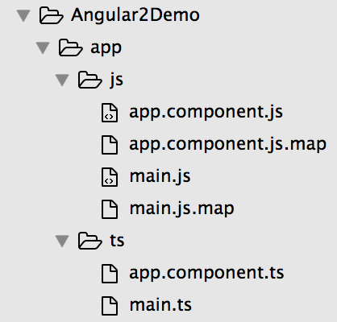

# Angular 2

### Setup

**Step 1**

Download and install [NodeJS](https://nodejs.org/en/).

Once it's installed, we can use `npm` command that comes with it, to download libraries and packages.

**Step 2**

Download the starter project `Angular2Demo`.

**Step 3**

Open the project folder using `SublimeText`.

**Step 4**

We have written all the dependencies that we are gonna be needing in `packages.json` file.

To download these dependencies, go to the project directory using Terminal and use command:

```
npm install
```

**Step 5**

```
npm start
```

It is gonna open the browser and start running the server on `port 3000`.

Refresh the browser. It will show something like this:


----

### Core Concepts

We are going to code in a new language called `typescript`.

Now, browsers only understand javascript. So, the typescript that we write needs to be converted into javascript using some transpilers. But I have already done that setup for you. You need not worry about that.

Project Structure:



`app` contains our source code for our application. We are going to work mostly in the `ts` folder. **Do not touch the `js` folder.** It gets generated automatically. The `ts` file gets converted into a corresponding `js` file.

**What is the .map file for?**

They basically help in debugging, as in they tell us what line of `.ts` file is equivalent of what line in `.js` file.

**Do not touch the `node_modules` folder.** They got downloaded as a result of `npm install`.

**Do not touch the `typings` folder.** They help the compiler to understand new Javascript syntax. It works hand-in-hand with `typings.json`.

`tsconfig.json` gives the rules how to convert typescript into javascript.

Example:

```
"outDir": "app/js"
```

It tells the transpiler to place the `js` files after converting from `ts`, into `js` folder of `app` directory.

----

### Components

Components are building blocks of our application (simple parts of our website). They are created individually and seperately. Later, they would all be assembled into a single application.

Example:

Facebook Application has a video player component, friends list component, chatting component.

Refer `app.components.ts`.

To define our own component, we import `Component` from the main `angular2/core` package that we downloaded.

```
import {Component} from 'angular2/core';
```

Within selector, we declare our own custom tag `my-app`, which we later use in our `index.html`.

```
selector: 'my-app'
```

Within template, we write the html code that we want to include in our component.

```
template: '<h1>Angular 2 Template</h1>'
```

We define our class as type **`export`**, to make it public, so that it can be used at other places in our application. This is mandatory.

```
export class AppComponent {}
```

Inside `index.html`, we use this component as:

```
<my-app>Loading...</my-app>
```

The `Loading...` text appears only for a few seconds. After that the browser substitutes it with the component code.

----

### SystemJS and main.ts

Remember that we named our component class as `AppComponent`, which is our root component.

Inside `main.js`, we bootstrap that component.

```
bootstrap(AppComponent);
```

Bootstraping means to load the root component. Every app has a root component.

Notice there is a difference in the way we import a system component, and a custom component.

For system component, we just mention the component path. It looks in the `node_modules` folder for the component.

```
import {bootstrap} from 'angular2/platform/browser';
```

For custom component, we mention relative path preceded by `./`. If we don't mention `./`, it by default looks in the `node_modules` folder for the component. We don't mention the file extension as `.ts` or `.js`, as the `SystemJS` automactically adds `.js` extension at the end of all such imported components.

```
import {AppComponent} from './app.component';
```

We see somewhere in `index.html` something like:

```
<!-- Configure SystemJS -->
<script>
        System.config({
            packages: {
                app: {
                    format: 'register',
                    defaultExtension: 'js'
                }
            }
        });
        System.import('app/js/main').then(null, console.error.bind(console));
</script>
```

Now, this is for module loading. All the code that we write gets included automatically. The `SystemJS` takes care of this at the background.

The `packages` tells `SystemJS` what to do when it gets a new request for a file.

We write `defaultExtension: 'js'` for the `SystemJS` to automactically add `.js` extension at the end of all such imported components. We don't need to mention file extension manually everytime while importing a component.

```
System.import('app/js/main').then(null, console.error.bind(console));
```

This calls the `main.js` file, which is the starting point of your application.

----

### Data Binding and Variables

Inside `ts` folder, create a file `config.service.ts`, and inside this write all the constants.

```
export class Config {
	static MAIN_HEADING: string = "My Fav Videos";
}
```

Inside `app.component.ts`, write:

```
import {Component} from 'angular2/core';
import {Config} from './config.service';

@Component({
    selector: 'my-app',
    template: '<h1>{{mainHeading}}</h1>'
})

export class AppComponent {
	
	mainHeading = Config.MAIN_HEADING;
}
```

Output:


----

### Creating our First Component

Inside `ts` folder, create a file **`video.ts`**, and inside it write:

```
export class Video {
	id:number;
	title:string;
	videoCode:string;
	desc:string;

	constructor(id:number, title:string, videoCode:string, desc:string) {
		this.id = id;
		this.title = title;
		this.videoCode = videoCode;
		this.desc = desc;
	}
}
```

Create a file **`playlist.component.html`**, and inside it write:

```
<table class="table table-hover">
	<thead>
		<tr>
			<td>Id</td>
			<td>Title</td>
			<td>Description</td>
		</tr>
	</thead>

	<thead>
		<tr *ngFor="#v of videos" (click)="onSelect(v)">
			<td>{{v.id}}</td>
			<td>{{v.title}}</td>
			<td>{{v.desc}}</td>
		</tr>
	</thead>

</table>
```

`*ngFor="#v of videos"` is used to iterate through the `videos` model array.

`(click)="onSelect(v)"` hooks a click event, which triggers a method `onSelect()` inside `playlist.component.ts`.

Next create a file **`playlist.component.ts`**, and inside it write:

```
import {Component} from 'angular2/core';
import {Video} from './video';

@Component({
    selector: 'playlist',
    templateUrl: 'app/ts/playlist.component.html',
    inputs: ['videos']
})

export class PlaylistComponent {
	onSelect(vid:Video) {
		console.log(JSON.stringify(vid));
	}
}
```

Inside `@Component` decorator, we mention the `selector` and `templateUrl` and `inputs`.

`onSelect(vid:Video)` accepts a `vid` object of type `Video`, and  `JSON.stringify(vid)` converts that object into JSON format.

`inputs: ['videos']` accepts data inputs to this component, which is of type `videos`.

It's not a good practice to write HTML code inside typescript. We must write separate `.html` files, and include them in our typescript file using `templateUrl`.

Since while bootstraping, it loads only the root component `AppComponent`. So, inside our root component, we must import all other components that we are gonna use in our app.

Inside **`app.component.ts`**, write:

```
import {Component} from 'angular2/core';
import {Config} from './config.service';
import {Video} from './video';
import {PlaylistComponent} from './playlist.component';

@Component({
    selector: 'my-app',
    templateUrl: 'app/ts/app.component.html',
    directives: [PlaylistComponent]
})

export class AppComponent {

	mainHeading = Config.MAIN_HEADING;

	videos:Array<Video>;

	constructor() {
		this.videos = [
			new Video(1, "Nested Components", "f8qBeaGe2S4", "Angular 2 for Beginners - Tutorial 7 - Nested Components"),
			new Video(2, "The Big Question", "3acwuNrHwN4", "SnG: What Were Our Favourite TV Shows Growing Up (Part 2) Ft Tanmay & Rahul | The Big Question Ep 39")
		]
	}
}
```

`directives: [PlaylistComponent]` tells the browser that don't freak out when you see a tag like `<playlist></playlist>`. So, we mention the class name for the custom directive.

We also create **`app.component.html`** to separate out the HTML code. Inside it, we write:

```
<h1>Hi {{ mainHeading }}</h1>

<playlist [videos]="videos">

</playlist>
```

`<playlist [videos]="videos"></playlist>` defines an attribute "videos", which is an array of `videos` that we need to pass to the component.

Inside **`config.service.ts`**, write:

```
export class Config {
	static MAIN_HEADING: string = "My Fav Videos";
}
```

The **`main.ts`** is untouched since beginning, as should look something like:

```
import {bootstrap} from 'angular2/platform/browser';
import {AppComponent} from './app.component';

bootstrap(AppComponent);
```

Final Project Structure:


Output:


**Note:**

If you need to stop the server, press `Ctrl + C`, and to start it again, use `npm start`.