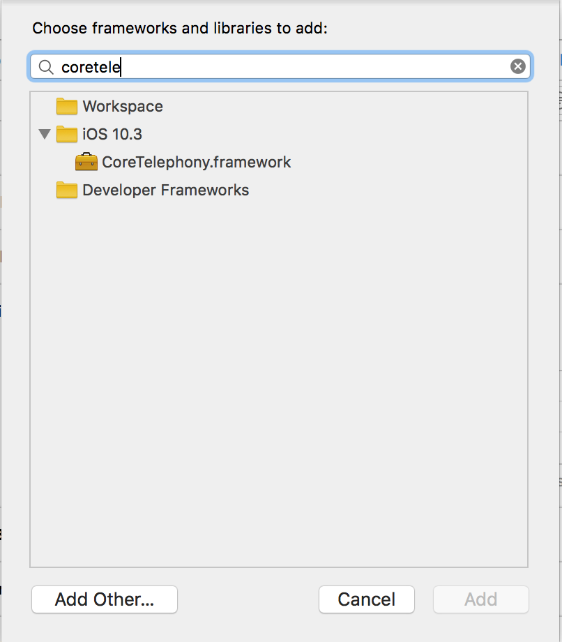

# How to check if phone is 3g or 4g enabled?

Go to Project Target -> Build Settings -> Link Binary with Libraries -> Add CoreTelephony.framework



Now,

```
let networkInfo = CTTelephonyNetworkInfo() 
let networkString = telefonyInfo.currentRadioAccessTechnology 
if networkString == CTRadioAccessTechnologyLTE { 
	// LTE (4G) 
} else if networkString == CTRadioAccessTechnologyWCDMA { 
	// 3G
} else if networkString == CTRadioAccessTechnologyEdge {
 	// EDGE (2G)
}
```
