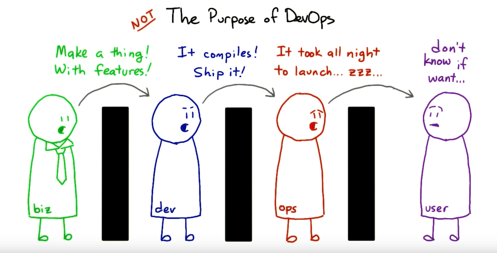
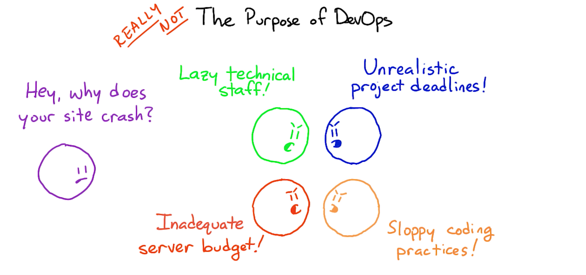
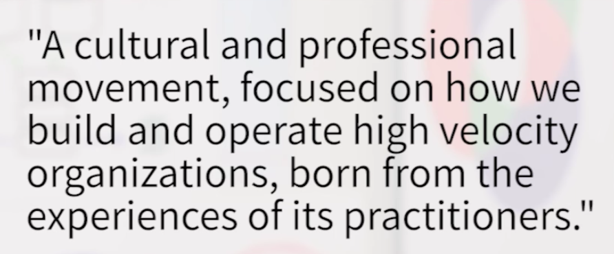
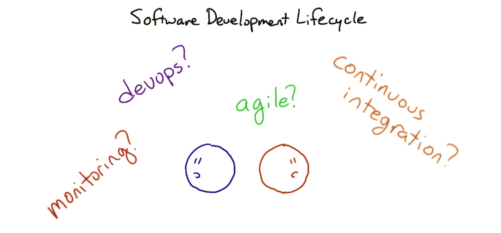
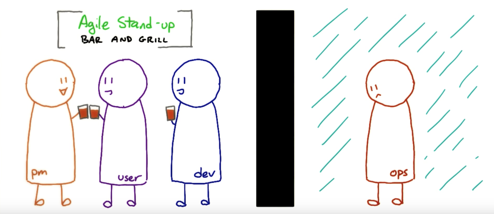
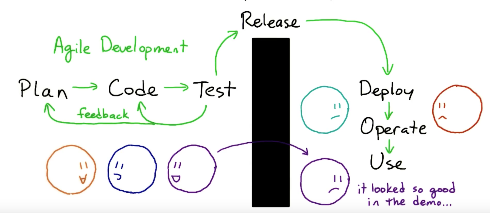

# DevOps

### Introduction

Let's see a common scenerio in IT software development.

Everyone seems to do their job within their deadline, and pass on the responsiblities to the next team, saying "We have done our part; now it's not our responsiblity anymore."

As a result, we often get to hear the blame game:

----

### The game has changed

Instead of shipping one major version every couple of years, software companies are continuously updating their features and services on a sprint basis (Agile Methodology). Customers also can give their feedback and ask for a fix, while the product is still in development stage.

Roadblocks because of access to infrastrucutre has pretty much been eliminated. Virtualization has changed the game for operational teams. Now, you can create server in minutes and harness the full power of those physical resources.

Development teams have more oppurtunity to create templates, clone, snapshots, roll back and destroy whole environments. There's also online services like AWS where you can go and test your code.

A development process with long detail design phase, long planning phase and long implementation phase is slow, inefficient and error prone.

To get over this problem, Agile methodology was born. Constant feedback with an iterative approach allows to find problems quickly for both developers and operations teams.

----

### Definition of DevOps

DevOps is just not about using a bunch of tools for deploying or monitoring. It's more about the culture change in the software development process.

They key point of DevOps is CAMS:

- `C` for Culture
- `A` for Automation
- `M` for Measurement
- `S` for Sharing

----

### DevOps in SDLC

How does Agile fit into the SDLC and relate to things like:

In Agile Development, requirements and solutiins evolve via collaboration between self-organized and cross functional teams.

Usually in Agile Stand-up meetings, operations team is not involved.

This is because Agile only deals with Plan, Code and Test, but not with Deployment and Release.

Then we start to improve this by automating build and unit test process. This is covered by `continuous intefration`.

The automation process helps with the iterative development and makes sure that changes do not break other functionality.

Automating the process all the way till the release it called `continuous delivery`. It makes it control user testing and release the software when all the tests pass.

Now to make sure its possible to deploy all these releases into production to thousands of users, there has to be an automated scalable way to run operations.

Adding automation to this system is good, but it's only when you combine it with a culture of communication and collaboration between teams that you have the DevOps approach to the SDLC.

----

### Refer

[https://www.udacity.com/course/intro-to-devops--ud611](https://www.udacity.com/course/intro-to-devops--ud611)