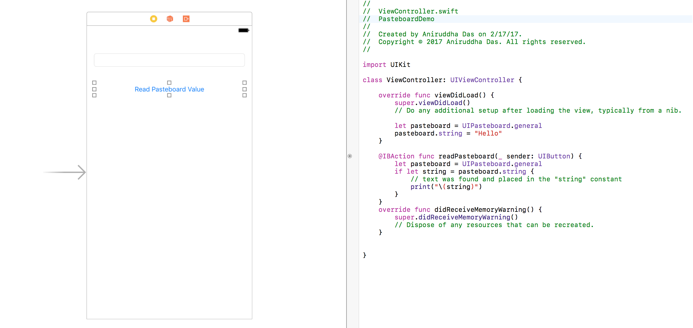
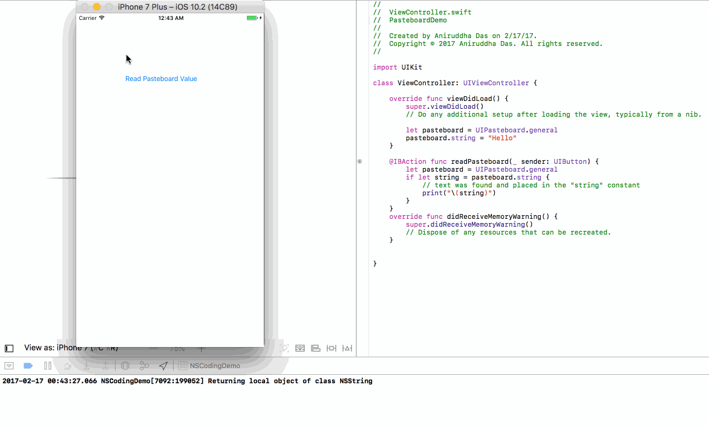

# How To Copy Text To The Clipboard Using UIPasteboard

### Step 1

Design a UI with a text field and button like this:



Inside the `ViewController.swift`, write:

```
import UIKit

class ViewController: UIViewController {

    override func viewDidLoad() {
        super.viewDidLoad()
        // Do any additional setup after loading the view, typically from a nib.

        let pasteboard = UIPasteboard.general
        pasteboard.string = "Hello"
    }

    @IBAction func readPasteboard(_ sender: UIButton) {
        let pasteboard = UIPasteboard.general
        if let string = pasteboard.string {
            // text was found and placed in the "string" constant
            print("\(string)")
        }
    }
    override func didReceiveMemoryWarning() {
        super.didReceiveMemoryWarning()
        // Dispose of any resources that can be recreated.
    }
}
```

### Output

