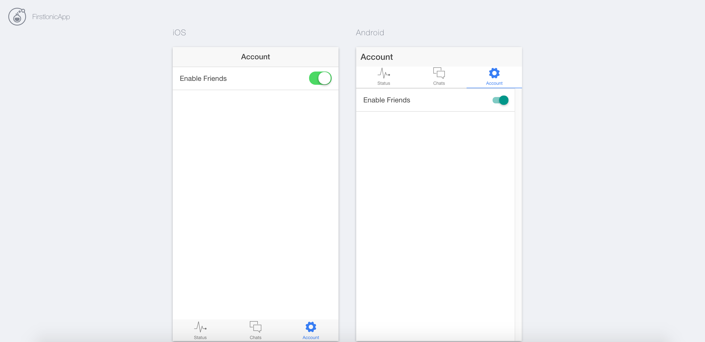
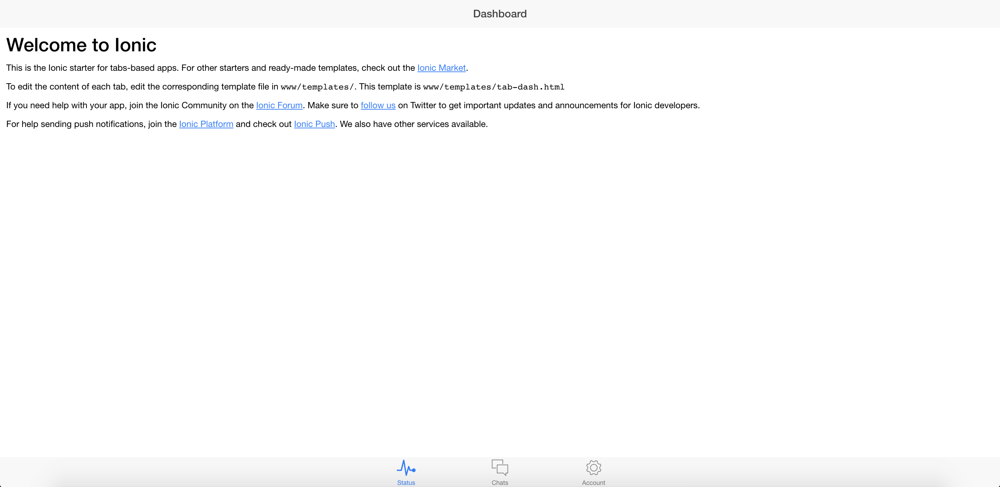
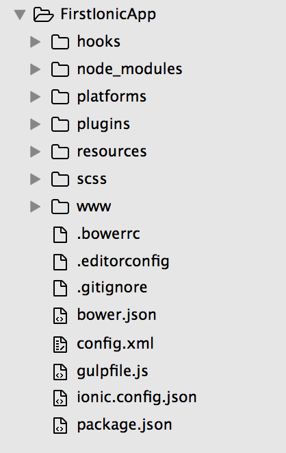
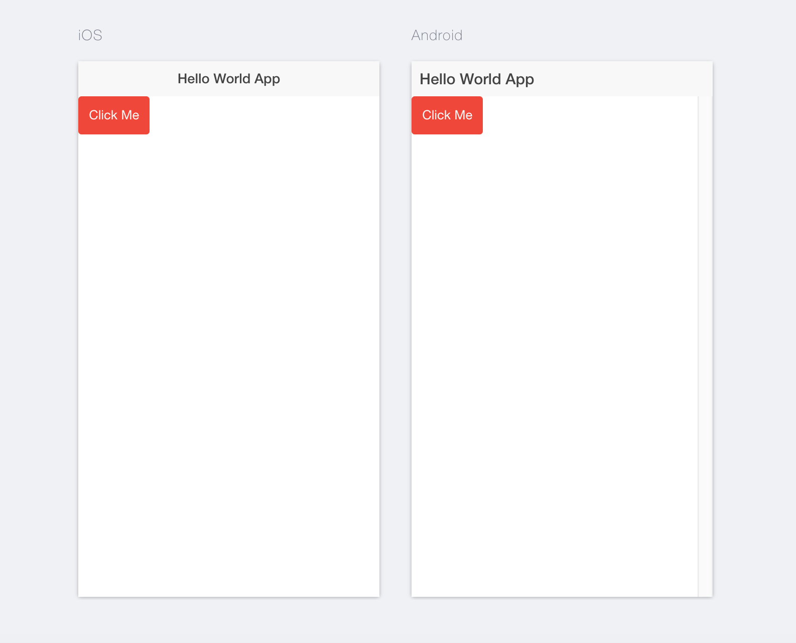
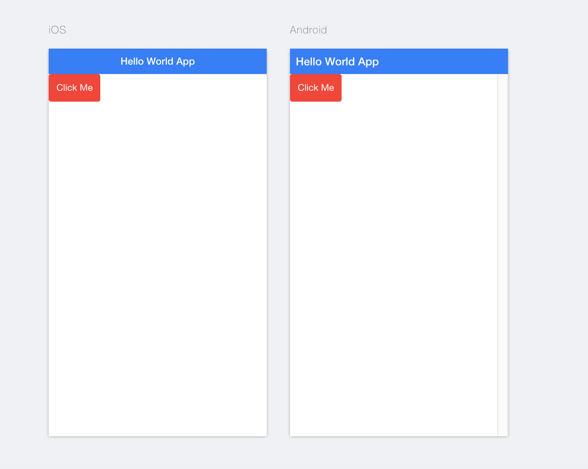
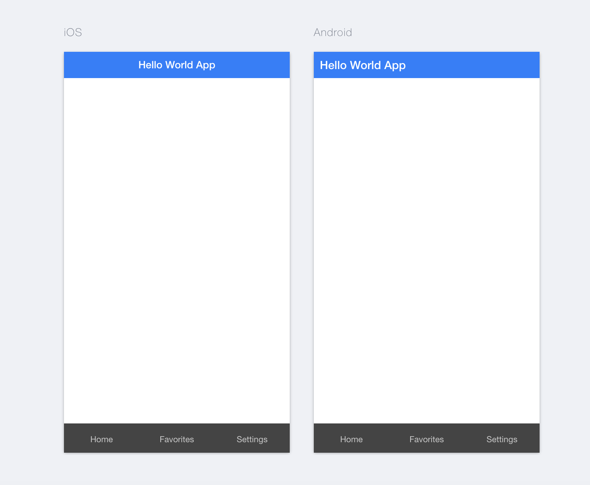
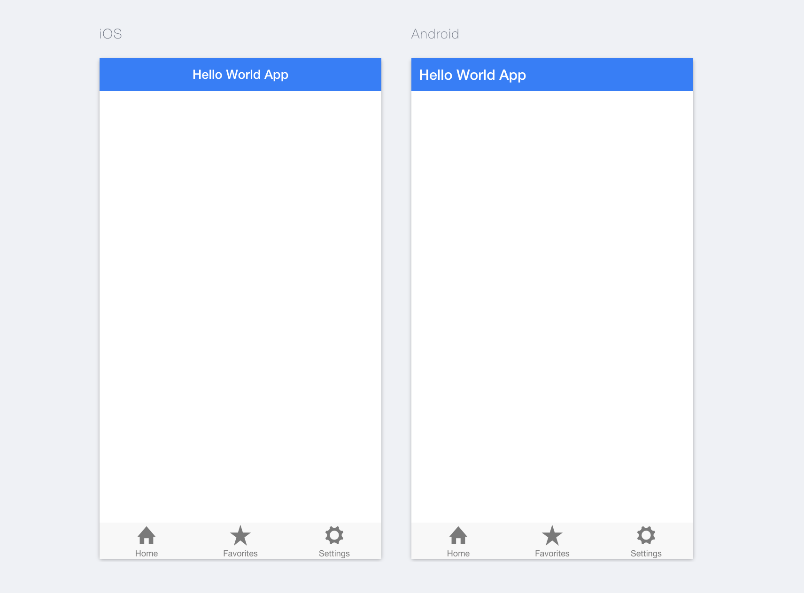

# Learning Ionic Framework

### Introduction

We can create a website and it can be accessed on a phone, which will give it a native look and feel.

Platforms covered:

- Web
- iOS
- Android
- Windows

It uses AngularJS, HTML, CSS and Javascript.

Refer to these [slides](https://ionicframework.com/present-ionic/slides/#/) before you start with this tutorial.

There are two versions of Ionic:

- Version 1
- Version 2

In this tutorial, we will stick to Version 1.

----

### Installing Ionic

- Install [NodeJS](https://nodejs.org/en/).

- Next use command:

	```
	npm install -g ionic cordova
	```

- Get inside your project repository `IonicProjects`.

- Use command:

	```
	npm install -g ionic cordova
	```

- Use command to create you project named `FirstIonicApp`.

	```
	ionic start FirstIonicApp tabs
	```

- Use command:

	```
	cd FirstIonicApp
	```

	```
	ionic serve
	```

	or

	```
	ionic serve --lab
	```
	
We can see:





----

### Project Structure Overview



The `www/index.html` displays the landing screen of the app.

The `hooks` folder is related to cordova, which helps us get the native API support for the platform of device. We don't usually touch these folder.

The `plugins` folder has Ionic and Cordova Plugins.

The `scss` has CSS related code in SCSS Tiles.

The `www` folder is the public HTML directory, visible to the user. It has CSS files, Javascript files, Images, Controllers, Services and Templates.

The `bower.json` is a package manager to handle dependencies.

The `config.xml` has user name, description of project.

The `gulpfile.js` is the automator for Javascript, when tracks changes that you make on your app, and accordingly refreshes the browser. It complies SCSS code to CSS code.

The `package.json` is used to handle dependencies.

----

### Hello World Project

Get into project repository.

```
ionic start HelloWorld blank
```

```
cd HelloWorld
```

```
ionic serve --lab
```

In `www/index.html`, make changes:

```
<body ng-app="starter">

    <ion-pane>
      <ion-header-bar class="bar-stable">
        <h1 class="title">Hello World App</h1>
      </ion-header-bar>
      <ion-content>

        <button class="button button-assertive">
          Click Me
        </button>

      </ion-content>
   </ion-pane>
</body>
```

Refer components documentation. Copy and paste code within `<ion-content></ion-content>` directive.

Since we have `gulp` running at the background, we can immediately see this change being reflected at the browser. It also gets logged in the terminal.



----

### Adding Headers

```
<ion-header-bar class="bar-positive">
        <h1 class="title">Hello World App</h1>
</ion-header-bar>
```



----

### Tabs

```
<body ng-app="starter">

    <ion-pane>
      <ion-header-bar class="bar-positive">
        <h1 class="title">Hello World App</h1>
      </ion-header-bar>
      
      <div class="tabs tabs-dark">
  <a class="tab-item">
    Home
  </a>
  <a class="tab-item">
    Favorites
  </a>
  <a class="tab-item">
    Settings
  </a>
</div>

    </ion-pane>
  </body>
```



```
<div class="tabs tabs-icon-top">
  <a class="tab-item">
    <i class="icon ion-home"></i>
    Home
  </a>
  <a class="tab-item">
    <i class="icon ion-star"></i>
    Favorites
  </a>
  <a class="tab-item">
    <i class="icon ion-gear-a"></i>
    Settings
  </a>
</div>
```



If you wish to use more such icons, visit [http://ionicons.com/](http://ionicons.com/)

In place of `ion-home` or `ion-star`, use any of those options.

In the `href`, place link to pages for other screens.

----

