# Collection Framework In Java

### Need of Collection Framework

If I need to represent three integer values, we go for:

```
int x = 10;
int y = 20;
int z = 30;
```

But, if I need to represent 10000 integer values, then declaring 10000 variable is worst kind of  programming practice. We can't keep track which variable represents which value. Hence, readablity of the code is gonna be down.

**Solution: Arrays**

We can represent 10000 values by a single variable, distinguished by their indexes. So, readablity of code improves.

```
Student [] s = new Student[10000];
```

**Limitations of Arrays:**

- Arrays are fixed in size. Once created with some size, there is no scope to increase or decrease the size, based on our requirement. We must know the size in advance, which is not always possible.

- Arrays can hold only homogeneous elements.

	```
Student [] s = new Student[10000];
s[0] = new Student();
s[1] = new Customer(); //Compile-Time Error. Incompatible types. Found: Customer. Required: Student.
	```

	Here, array `s` can hold only `Student` type objects.

	But, **we can solve this problem by using `Object` type arrays.**
	
	```
Object [] a = new Object[10000];
a[0] = new Student();
a[1] = new Customer();
	```

- Arrays is not implemented using some standard underlying Data Structures. So, we do not get `ready-made method support` with arrays. For every requirement, we need to implement logic of our own.

	**Example:** If we need to insert elements into the array, and all elements should be inserted in some sorting order. We have no method to perform this sorting logic for us. We need to write our own.
	
**Solution: Collections**

- Collections are growable in nature. We can increase or decrease the size.
- Collections can hold homogeneous and heterogeneous objects.
- Every collection class is implemented based on some standard Data Structures and it comes with ready-made methods. We need not implement on our own.

----

### Collections in Java

**Collections in java** is a framework that provides an architecture to store and manipulate the group of objects.

All the operations that you perform on a data such as searching, sorting, insertion, manipulation, deletion etc. can be performed by Java Collections.

Java Collection simply means a single unit of objects. Java Collection framework provides many interfaces (Set, List, Queue, Deque etc.) and classes (ArrayList, Vector, LinkedList, PriorityQueue, HashSet, LinkedHashSet, TreeSet etc).

### What is Collection framework

Collection framework represents a unified architecture for storing and manipulating group of objects. 

It has:

- Interfaces and its implementations i.e. classes
- Algorithm

### Hierarchy of Collection Framework

The **java.util** package contains all the classes and interfaces for Collection framework.


### Methods of Collection interface

There are many methods declared in the Collection interface. They are as follows:

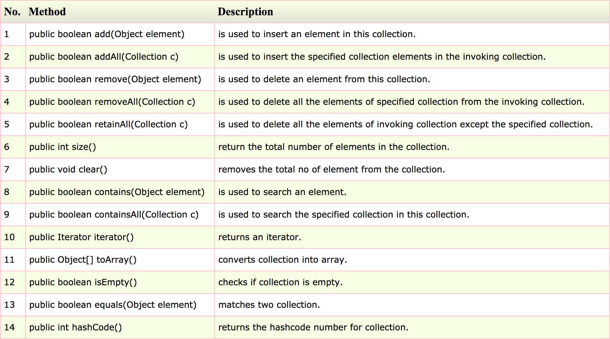

### Iterator interface

Iterator interface provides the facility of iterating the elements in forward direction only.

### Methods of Iterator interface

There are only three methods in the Iterator interface. They are:

- public boolean hasNext() - It returns true if iterator has more elements.
- public object next() - It returns the element and moves the cursor pointer to the next element.
- public void remove() - It removes the last elements returned by the iterator. It is rarely used.

----

### ArrayList

Java ArrayList class uses a dynamic array for storing the elements. It inherits AbstractList class and implements List interface.

The important points about Java ArrayList class are:

- Java ArrayList class can contain duplicate elements.
- Java ArrayList class maintains insertion order.
- Java ArrayList class is non synchronized.
- Java ArrayList allows random access because array works at the index basis.
- In Java ArrayList class, manipulation is slow because a lot of shifting needs to be occurred if any element is removed from the array list.

### Hierarchy of ArrayList class


### ArrayList class declaration

```
public class ArrayList<E> extends AbstractList<E> implements List<E>, RandomAccess, Cloneable, Serializable
```

### Constructors of Java ArrayList

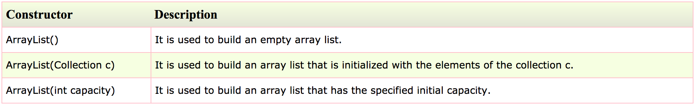

### Methods of Java ArrayList

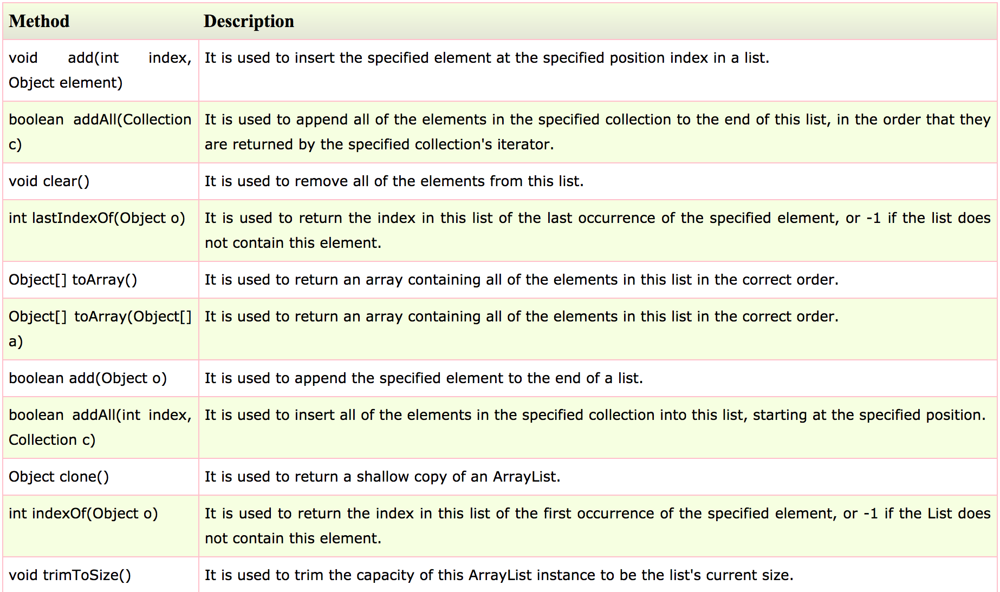

### Java Non-generic Vs Generic Collection

Java collection framework was non-generic before JDK 1.5. Since 1.5, it is generic.

Java new generic collection allows you to have only one type of object in collection. Now it is type safe so typecasting is not required at run time.

Let's see the old non-generic example of creating java collection:

```
ArrayList al=new ArrayList();//creating old non-generic arraylist
```
 
Let's see the new generic example of creating java collection:

```
ArrayList<String> al=new ArrayList<String>();//creating new generic arraylist  
```

In generic collection, we specify the type in angular braces. Now ArrayList is forced to have only specified type of objects in it. If you try to add another type of object, it gives **compile time error**.

### Java ArrayList Example

```
import java.util.*;  
class TestCollection1{  
 public static void main(String args[]){  
  ArrayList<String> list=new ArrayList<String>();//Creating arraylist  
  list.add("Ravi");//Adding object in arraylist  
  list.add("Vijay");  
  list.add("Ravi");  
  list.add("Ajay");  
  //Traversing list through Iterator  
  Iterator itr=list.iterator();  
  while(itr.hasNext()){  
   System.out.println(itr.next());  
  }  
 }  
}  
```

**Output:**

```
Ravi
Vijay
Ravi
Ajay
```

### Two ways to iterate the elements of collection in java

There are two ways to traverse collection elements:

- By Iterator interface.
- By for-each loop.

In the above example, we have seen traversing ArrayList by Iterator. Let's see the example to traverse ArrayList elements using for-each loop.

### Iterating Collection through for-each loop

```
import java.util.*;  
class TestCollection2{  
 public static void main(String args[]){  
  ArrayList<String> al=new ArrayList<String>();  
  al.add("Ravi");  
  al.add("Vijay");  
  al.add("Ravi");  
  al.add("Ajay");  
  for(String obj:al)  
    System.out.println(obj);  
 }  
}
```

**Output:**

```
Ravi
Vijay
Ravi
Ajay
```

### User-defined class objects in Java ArrayList

Let's see an example where we are storing Student class object in array list.

```
class Student{  
  int rollno;  
  String name;  
  int age;  
  Student(int rollno,String name,int age){  
   this.rollno=rollno;  
   this.name=name;  
   this.age=age;  
  }  
}
```

```  
import java.util.*;  
public class TestCollection3{  
 public static void main(String args[]){  
  //Creating user-defined class objects  
  Student s1=new Student(101,"Sonoo",23);  
  Student s2=new Student(102,"Ravi",21);  
  Student s2=new Student(103,"Hanumat",25);  
  //creating arraylist  
  ArrayList<Student> al=new ArrayList<Student>();  
  al.add(s1);//adding Student class object  
  al.add(s2);  
  al.add(s3);  
  //Getting Iterator  
  Iterator itr=al.iterator();  
  //traversing elements of ArrayList object  
  while(itr.hasNext()){  
    Student st=(Student)itr.next();  
    System.out.println(st.rollno+" "+st.name+" "+st.age);  
  }  
 }  
}
```

**Output:**

```
101 Sonoo 23
102 Ravi 21
103 Hanumat 25
```

### Example of addAll(Collection c) method

```
import java.util.*;  
class TestCollection4{  
 public static void main(String args[]){  
  ArrayList<String> al=new ArrayList<String>();  
  al.add("Ravi");  
  al.add("Vijay");  
  al.add("Ajay");  
  ArrayList<String> al2=new ArrayList<String>();  
  al2.add("Sonoo");  
  al2.add("Hanumat");  
  al.addAll(al2);//adding second list in first list  
  Iterator itr=al.iterator();  
  while(itr.hasNext()){  
   System.out.println(itr.next());  
  }  
 }  
}
```

**Output:**

```
Ravi
Vijay
Ajay
Sonoo
Hanumat
```

### Example of removeAll() method

```
import java.util.*;  
class TestCollection5{  
 public static void main(String args[]){  
  ArrayList<String> al=new ArrayList<String>();  
  al.add("Ravi");  
  al.add("Vijay");  
  al.add("Ajay");  
  ArrayList<String> al2=new ArrayList<String>();  
  al2.add("Ravi");  
  al2.add("Hanumat");  
  al.removeAll(al2);  
  System.out.println("iterating the elements after removing the elements of al2...");  
  Iterator itr=al.iterator();  
  while(itr.hasNext()){  
   System.out.println(itr.next());  
  }  
  
  }  
}
```

**Output:**

```
iterating the elements after removing the elements of al2...
Vijay
Ajay
```

### Example of retainAll() method

```
import java.util.*;  
class TestCollection6{  
 public static void main(String args[]){  
  ArrayList<String> al=new ArrayList<String>();  
  al.add("Ravi");  
  al.add("Vijay");  
  al.add("Ajay");  
  ArrayList<String> al2=new ArrayList<String>();  
  al2.add("Ravi");  
  al2.add("Hanumat");  
  al.retainAll(al2);  
  System.out.println("iterating the elements after retaining the elements of al2...");  
  Iterator itr=al.iterator();  
  while(itr.hasNext()){  
   System.out.println(itr.next());  
  }  
 }  
}
```

**Output:**

```
iterating the elements after retaining the elements of al2...
Ravi
```

----

### LinkedList

Java LinkedList class uses doubly linked list to store the elements. It provides a linked-list data structure. It inherits the AbstractList class and implements List and Deque interfaces.

The important points about Java LinkedList are:

- Java LinkedList class can contain duplicate elements.
- Java LinkedList class maintains insertion order.
- Java LinkedList class is non synchronized.
- In Java LinkedList class, manipulation is fast because no shifting needs to be occurred.
- Java LinkedList class can be used as list, stack or queue.

### Hierarchy of LinkedList class


### Doubly Linked List

In case of doubly linked list, we can add or remove elements from both side.


### LinkedList class declaration

```
public class LinkedList<E> extends AbstractSequentialList<E> implements List<E>, Deque<E>, Cloneable, Serializable
```

### Constructors of Java LinkedList

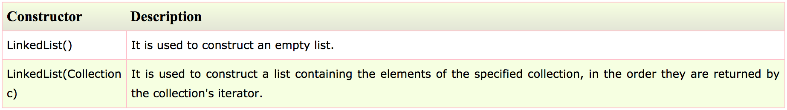

### Methods of Java LinkedList

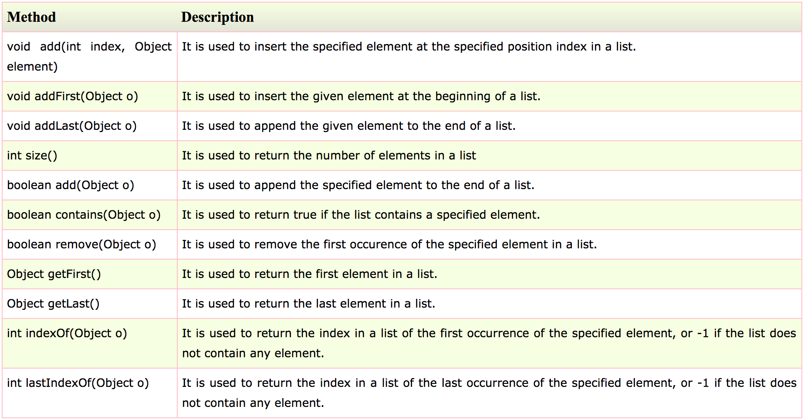

### Java LinkedList Example: Book

```
import java.util.*;  
class Book {  
int id;  
String name,author,publisher;  
int quantity;  
public Book(int id, String name, String author, String publisher, int quantity) {  
    this.id = id;  
    this.name = name;  
    this.author = author;  
    this.publisher = publisher;  
    this.quantity = quantity;  
}  
}  
public class LinkedListExample {  
public static void main(String[] args) {  
    //Creating list of Books  
    List<Book> list=new LinkedList<Book>();  
    //Creating Books  
    Book b1=new Book(101,"Let us C","Yashwant Kanetkar","BPB",8);  
    Book b2=new Book(102,"Data Communications & Networking","Forouzan","Mc Graw Hill",4);  
    Book b3=new Book(103,"Operating System","Galvin","Wiley",6);  
    //Adding Books to list  
    list.add(b1);  
    list.add(b2);  
    list.add(b3);  
    //Traversing list  
    for(Book b:list){  
    System.out.println(b.id+" "+b.name+" "+b.author+" "+b.publisher+" "+b.quantity);  
    }  
}  
}
```

**Output:**

```
101 Let us C Yashwant Kanetkar BPB 8
102 Data Communications & Networking Forouzan Mc Graw Hill 4
103 Operating System Galvin Wiley 6
```

----

### Difference between ArrayList and LinkedList

ArrayList and LinkedList both implements List interface and maintains insertion order. Both are non synchronized classes.

But there are many differences between ArrayList and LinkedList classes that are given below.

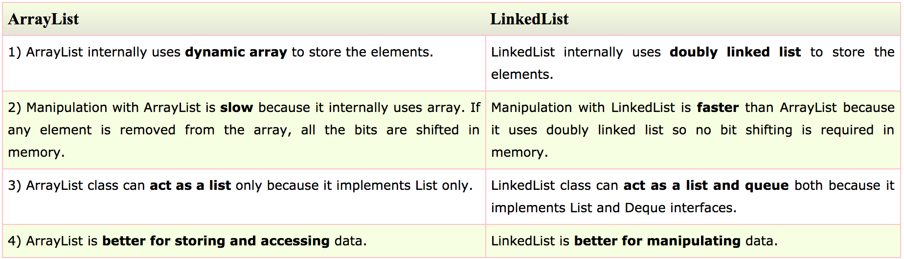

### Example of ArrayList and LinkedList in Java

```
import java.util.*;    
class TestArrayLinked{    
 public static void main(String args[]){    
     
  List<String> al=new ArrayList<String>();//creating arraylist    
  al.add("Ravi");//adding object in arraylist    
  al.add("Vijay");    
  al.add("Ravi");    
  al.add("Ajay");    
    
  List<String> al2=new LinkedList<String>();//creating linkedlist    
  al2.add("James");//adding object in linkedlist    
  al2.add("Serena");    
  al2.add("Swati");    
  al2.add("Junaid");    
    
  System.out.println("arraylist: "+al);  
  System.out.println("linkedlist: "+al2);  
 }    
}
```

**Output:**

```
arraylist: [Ravi,Vijay,Ravi,Ajay]
linkedlist: [James,Serena,Swati,Junaid]
```

----

### List

List Interface is the subinterface of Collection.It contains methods to insert and delete elements in index basis.It is a factory of ListIterator interface.

### List Interface declaration

```
public interface List<E> extends Collection<E>  
```

### Methods of Java List Interface

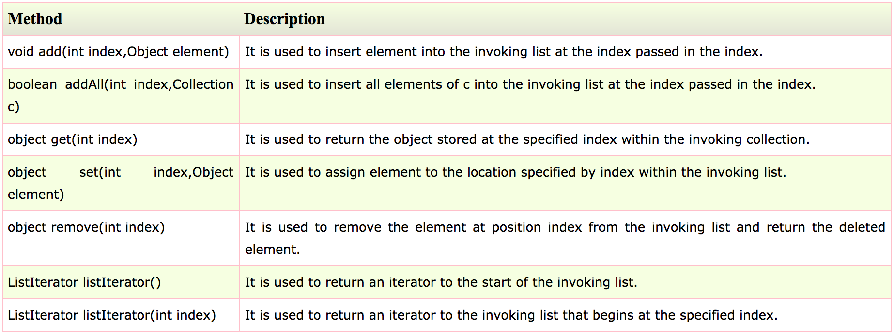

### Java List Example

```
import java.util.*;  
public class ListExample{  
public static void main(String args[]){  
ArrayList<String> al=new ArrayList<String>();  
al.add("Amit");  
al.add("Vijay");  
al.add("Kumar");  
al.add(1,"Sachin");  
System.out.println("Element at 2nd position: "+al.get(2));  
for(String s:al){  
 System.out.println(s);  
}  
}  
}  
```

**Output:**

```
Element at 2nd position: Vijay
Amit
Sachin
Vijay
Kumar
```

### Java ListIterator Interface

ListIterator Interface is used to traverse the element in backward and forward direction.

### ListIterator Interface declaration

```
public interface ListIterator<E> extends Iterator<E>  
```

### Methods of Java ListIterator Interface

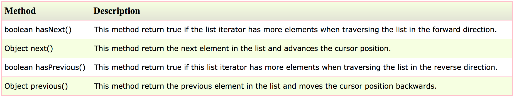

### Example of ListIterator Interface

```
import java.util.*;  
public class TestCollection8{  
public static void main(String args[]){  
ArrayList<String> al=new ArrayList<String>();  
al.add("Amit");  
al.add("Vijay");  
al.add("Kumar");  
al.add(1,"Sachin");  
System.out.println("element at 2nd position: "+al.get(2));  
ListIterator<String> itr=al.listIterator();  
System.out.println("traversing elements in forward direction...");  
while(itr.hasNext()){  
System.out.println(itr.next());  
}  
System.out.println("traversing elements in backward direction...");  
while(itr.hasPrevious()){  
System.out.println(itr.previous());  
}  
}  
}
```

**Output:**

```
element at 2nd position: Vijay
traversing elements in forward direction...
Amit
Sachin
Vijay
Kumar
traversing elements in backward direction...
Kumar
Vijay
Sachin
Amit
```

----

### HashSet

Java HashSet class is used to create a collection that uses a hash table for storage. It inherits the AbstractSet class and implements Set interface.

The important points about Java HashSet class are:

- HashSet stores the elements by using a mechanism called hashing.
- HashSet contains unique elements only.

### Difference between List and Set

List can contain duplicate elements whereas Set contains unique elements only.

### Hierarchy of HashSet class


### HashSet class declaration

```
public class HashSet<E> extends AbstractSet<E> implements Set<E>, Cloneable, Serializable
```

### Constructors of Java HashSet class

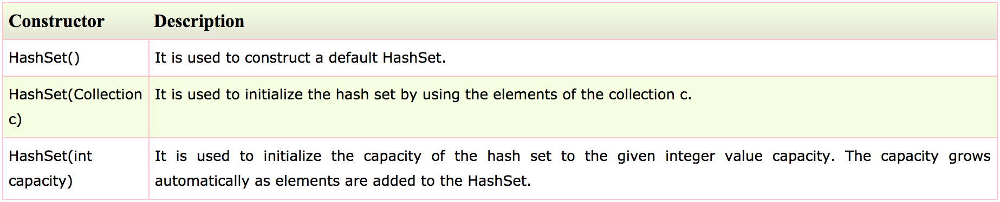

### Methods of Java HashSet class

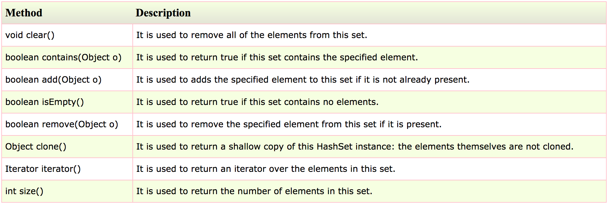

### Java HashSet Example: Book

```
import java.util.*;  
class Book {  
int id;  
String name,author,publisher;  
int quantity;  
public Book(int id, String name, String author, String publisher, int quantity) {  
    this.id = id;  
    this.name = name;  
    this.author = author;  
    this.publisher = publisher;  
    this.quantity = quantity;  
}  
}  
public class HashSetExample {  
public static void main(String[] args) {  
    HashSet<Book> set=new HashSet<Book>();  
    //Creating Books  
    Book b1=new Book(101,"Let us C","Yashwant Kanetkar","BPB",8);  
    Book b2=new Book(102,"Data Communications & Networking","Forouzan","Mc Graw Hill",4);  
    Book b3=new Book(103,"Operating System","Galvin","Wiley",6);  
    //Adding Books to HashSet  
    set.add(b1);  
    set.add(b2);  
    set.add(b3);  
    //Traversing HashSet  
    for(Book b:set){  
    System.out.println(b.id+" "+b.name+" "+b.author+" "+b.publisher+" "+b.quantity);  
    }  
}  
}
```

**Output:**

```
101 Let us C Yashwant Kanetkar BPB 8
102 Data Communications & Networking Forouzan Mc Graw Hill 4
103 Operating System Galvin Wiley 6
```

----

### LinkedHashSet

Java LinkedHashSet class is a Hash table and Linked list implementation of the set interface. It inherits HashSet class and implements Set interface.

The important points about Java LinkedHashSet class are:

- Contains unique elements only like HashSet.
- Provides all optional set operations, and permits null elements.
- Maintains insertion order.

### Hierarchy of LinkedHashSet class


### LinkedHashSet class declaration

```
public class LinkedHashSet<E> extends HashSet<E> implements Set<E>, Cloneable, Serializable
```

### Constructors of Java LinkedHashSet class

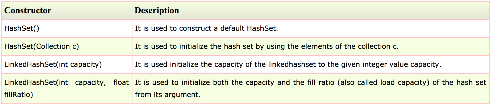

### Example of LinkedHashSet class

```
import java.util.*;  
class TestCollection10{  
 public static void main(String args[]){  
  LinkedHashSet<String> al=new LinkedHashSet<String>();  
  al.add("Ravi");  
  al.add("Vijay");  
  al.add("Ravi");  
  al.add("Ajay");  
  Iterator<String> itr=al.iterator();  
  while(itr.hasNext()){  
   System.out.println(itr.next());  
  }  
 }  
}  
```

**Output:**

```
Ravi
Vijay
Ajay
```

----

### TreeSet

Java TreeSet class implements the Set interface that uses a tree for storage. It inherits AbstractSet class and implements NavigableSet interface. The objects of TreeSet class are stored in ascending order.

The important points about Java TreeSet class are:

- Contains unique elements only like HashSet.
- Access and retrieval times are quiet fast.
- Maintains ascending order.

### Hierarchy of TreeSet class


### TreeSet class declaration

```
public class TreeSet<E> extends AbstractSet<E> implements NavigableSet<E>, Cloneable, Serializable 
```

### Constructors of Java TreeSet class

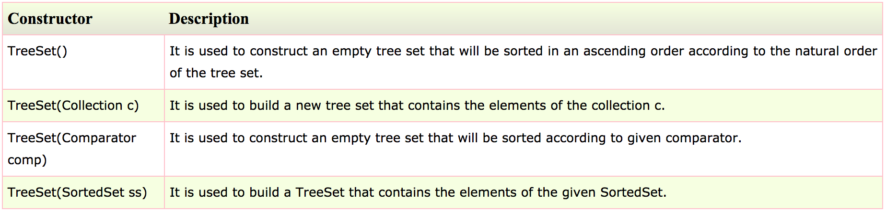

### Methods of Java TreeSet class

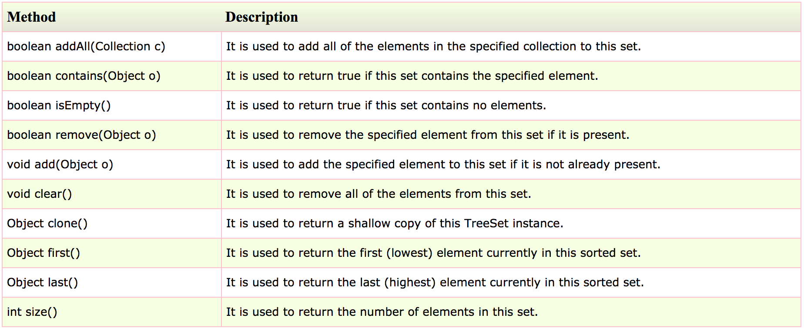

### Java TreeSet Example

```
import java.util.*;  
class TestCollection11{  
 public static void main(String args[]){  
  //Creating and adding elements  
  TreeSet<String> al=new TreeSet<String>();  
  al.add("Ravi");  
  al.add("Vijay");  
  al.add("Ravi");  
  al.add("Ajay");  
  //Traversing elements  
  Iterator<String> itr=al.iterator();  
  while(itr.hasNext()){  
   System.out.println(itr.next());  
  }  
 }  
}
```

**Output:**

```
Ajay
Ravi
Vijay
```

----

### Queue

Java Queue interface orders the element in FIFO(First In First Out) manner. In FIFO, first element is removed first and last element is removed at last.

### Queue Interface declaration

```
public interface Queue<E> extends Collection<E>
```

### Methods of Java Queue Interface

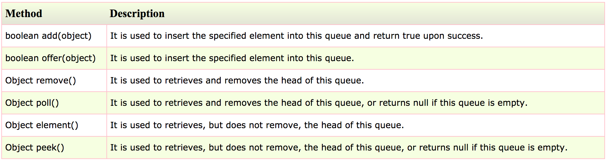

### PriorityQueue class

The PriorityQueue class provides the facility of using queue. But it does not orders the elements in FIFO manner. It inherits AbstractQueue class.

### PriorityQueue class declaration

```
public class PriorityQueue<E> extends AbstractQueue<E> implements Serializable  
```

### Java PriorityQueue Example

```
import java.util.*;  
class TestCollection12{  
public static void main(String args[]){  
PriorityQueue<String> queue=new PriorityQueue<String>();  
queue.add("Amit");  
queue.add("Vijay");  
queue.add("Karan");  
queue.add("Jai");  
queue.add("Rahul");  
System.out.println("head:"+queue.element());  
System.out.println("head:"+queue.peek());  
System.out.println("iterating the queue elements:");  
Iterator itr=queue.iterator();  
while(itr.hasNext()){  
System.out.println(itr.next());  
}  
queue.remove();  
queue.poll();  
System.out.println("after removing two elements:");  
Iterator<String> itr2=queue.iterator();  
while(itr2.hasNext()){  
System.out.println(itr2.next());  
}  
}  
}  
```

**Output:**

```
head:Amit
head:Amit
iterating the queue elements:
Amit
Jai
Karan
Vijay
Rahul
after removing two elements:
Karan
Rahul
Vijay
```

----

### Deque

Java Deque Interface is a linear collection that supports element insertion and removal at both ends. Deque is an acronym for **"double ended queue"**.

### Deque Interface declaration

```
public interface Deque<E> extends Queue<E>  
```

### Methods of Java Deque Interface

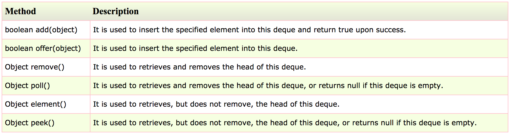

### ArrayDeque class

The ArrayDeque class provides the facility of using deque and resizable-array. It inherits AbstractCollection class and implements the Deque interface.

The important points about ArrayDeque class are:

- Unlike Queue, we can add or remove elements from both sides.
- Null elements are not allowed in the ArrayDeque.
- ArrayDeque is not thread safe, in the absence of external synchronization.
- ArrayDeque has no capacity restrictions.
- ArrayDeque is faster than LinkedList and Stack.

### ArrayDeque Hierarchy


### ArrayDeque class declaration

```
public class ArrayDeque<E> extends AbstractCollection<E> implements Deque<E>, Cloneable, Serializable  
```

### Java ArrayDeque Example

```
import java.util.*;  
public class ArrayDequeExample {  
   public static void main(String[] args) {  
   //Creating Deque and adding elements  
   Deque<String> deque = new ArrayDeque<String>();  
   deque.add("Ravi");    
   deque.add("Vijay");     
   deque.add("Ajay");    
   //Traversing elements  
   for (String str : deque) {  
   System.out.println(str);  
   }  
   }  
}
```
  
**Output:**

```
Ravi
Vijay
Ajay
```

### Java ArrayDeque Example: offerFirst() and pollLast()

```
import java.util.*;  
public class DequeExample {  
public static void main(String[] args) {  
    Deque<String> deque=new ArrayDeque<String>();  
    deque.offer("arvind");  
    deque.offer("vimal");  
    deque.add("mukul");  
    deque.offerFirst("jai");  
    System.out.println("After offerFirst Traversal...");  
    for(String s:deque){  
        System.out.println(s);  
    }  
    //deque.poll();  
    //deque.pollFirst();//it is same as poll()  
    deque.pollLast();  
    System.out.println("After pollLast() Traversal...");  
    for(String s:deque){  
        System.out.println(s);  
    }  
}  
}
```
 
**Output:**

```
After offerFirst Traversal...
jai
arvind
vimal
mukul
After pollLast() Traversal...
jai
arvind
vimal
```

----

### Map

A map contains values on the basis of key i.e. key and value pair. Each key and value pair is known as an entry. Map contains only unique keys.

Map is useful if you have to search, update or delete elements on the basis of key.

### Useful methods of Map interface

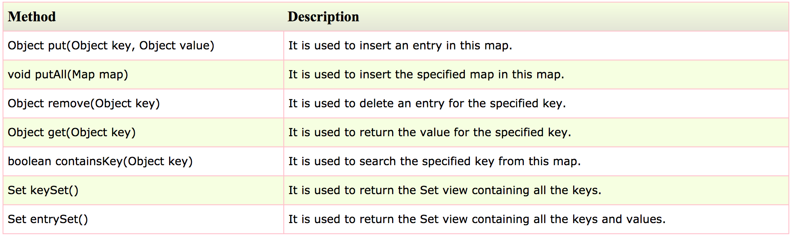

### Map.Entry Interface

Entry is the sub interface of Map. So we will be accessed it by Map.Entry name. It provides methods to get key and value.

### Methods of Map.Entry interface

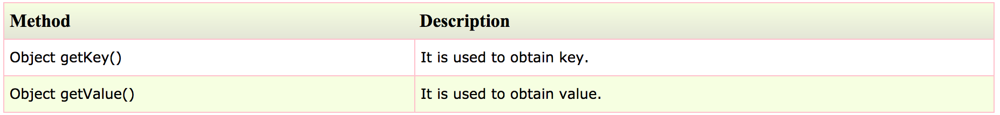

### Java Map Example: Generic (New Style)

```
import java.util.*;  
class MapInterfaceExample{  
 public static void main(String args[]){  
  Map<Integer,String> map=new HashMap<Integer,String>();  
  map.put(100,"Amit");  
  map.put(101,"Vijay");  
  map.put(102,"Rahul");  
  for(Map.Entry m:map.entrySet()){  
   System.out.println(m.getKey()+" "+m.getValue());  
  }  
 }  
}  
```

**Output:**

```
102 Rahul
100 Amit
101 Vijay
```

### Java Map Example: Non-Generic (Old Style)

```
//Non-generic  
import java.util.*;  
public class MapExample1 {  
public static void main(String[] args) {  
    Map map=new HashMap();  
    //Adding elements to map  
    map.put(1,"Amit");  
    map.put(5,"Rahul");  
    map.put(2,"Jai");  
    map.put(6,"Amit");  
    //Traversing Map  
    Set set=map.entrySet();//Converting to Set so that we can traverse  
    Iterator itr=set.iterator();  
    while(itr.hasNext()){  
        //Converting to Map.Entry so that we can get key and value separately  
        Map.Entry entry=(Map.Entry)itr.next();  
        System.out.println(entry.getKey()+" "+entry.getValue());  
    }  
}  
}  
```

**Output:**

```
1 Amit
2 Jai
5 Rahul
6 Amit
```

----

### HashMap

Java HashMap class implements the map interface by using a hashtable. It inherits AbstractMap class and implements Map interface.

The important points about Java HashMap class are:

- A HashMap contains values based on the key.
- It contains only unique elements.
- It may have one null key and multiple null values.
- It maintains no order.

### Hierarchy of HashMap class


### HashMap class declaration

```
public class HashMap<K,V> extends AbstractMap<K,V> implements Map<K,V>, Cloneable, Serializable
```

### HashMap class Parameters

- **K:** It is the type of keys maintained by this map.
- **V:** It is the type of mapped values.

### Constructors of Java HashMap class

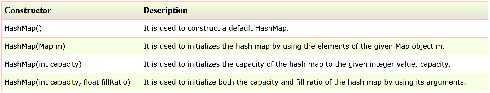

### Methods of Java HashMap class

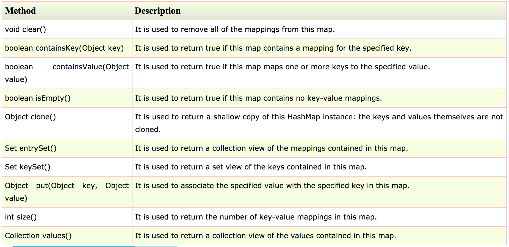

### Java HashMap Example

```
import java.util.*;  
class TestCollection13{  
 public static void main(String args[]){  
  HashMap<Integer,String> hm=new HashMap<Integer,String>();  
  hm.put(100,"Amit");  
  hm.put(101,"Vijay");  
  hm.put(102,"Rahul");  
  for(Map.Entry m:hm.entrySet()){  
   System.out.println(m.getKey()+" "+m.getValue());  
  }  
 }  
}
```

**Output:**

```
102 Rahul
100 Amit
101 Vijay
```

### Java HashMap Example: remove()

```
import java.util.*;  
public class HashMapExample {  
   public static void main(String args[]) {  
   // create and populate hash map  
   HashMap<Integer, String> map = new HashMap<Integer, String>();           
   map.put(101,"Let us C");  
   map.put(102, "Operating System");  
   map.put(103, "Data Communication and Networking");  
   System.out.println("Values before remove: "+ map);    
   // Remove value for key 102  
   map.remove(102);  
   System.out.println("Values after remove: "+ map);  
   }      
} 
```
 
**Output:**

```
Values before remove: {102=Operating System, 103=Data Communication and Networking, 101=Let us C}
Values after remove: {103=Data Communication and Networking, 101=Let us C}
```

### Difference between HashSet and HashMap

HashSet contains only values whereas HashMap contains entry(key and value).

----

### LinkedHashMap

Java LinkedHashMap class is Hash table and Linked list implementation of the Map interface, with predictable iteration order. It inherits HashMap class and implements the Map interface.

The important points about Java HashMap class are:

- A LinkedHashMap contains values based on the key.
- It contains only unique elements.
- It may have one null key and multiple null values.
- It is same as HashMap instead maintains insertion order.

### Hierarchy


### LinkedHashMap class declaration

```
public class LinkedHashMap<K,V> extends HashMap<K,V> implements Map<K,V>
```

### LinkedHashMap class Parameters

- **K:** It is the type of keys maintained by this map.
- **V:** It is the type of mapped values.

### Constructors of Java LinkedHashMap class

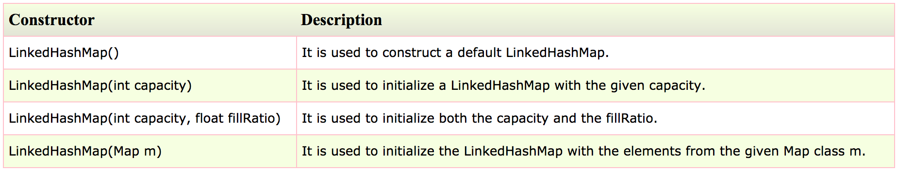

### Methods of Java LinkedHashMap class

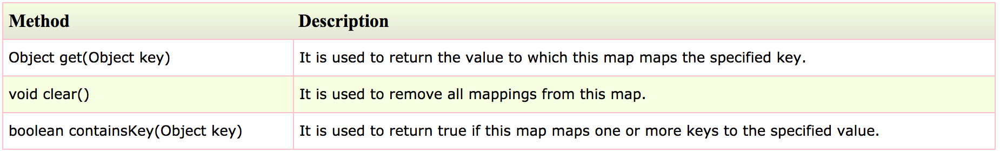

### Java LinkedHashMap Example

```
import java.util.*;  
class TestCollection14{  
 public static void main(String args[]){  
   
  LinkedHashMap<Integer,String> hm=new LinkedHashMap<Integer,String>();  
  
  hm.put(100,"Amit");  
  hm.put(101,"Vijay");  
  hm.put(102,"Rahul");  
  
for(Map.Entry m:hm.entrySet()){  
   System.out.println(m.getKey()+" "+m.getValue());  
  }  
 }  
}  
```

**Output:**

```
100 Amit
101 Vijay
102 Rahul
```

### Java LinkedHashMap Example:remove()

```
import java.util.*;  
public class LinkedHashMapExample {  
   public static void main(String args[]) {  
   // Create and populate linked hash map  
   Map<Integer, String> map = new LinkedHashMap<Integer, String>();           
   map.put(101,"Let us C");  
   map.put(102, "Operating System");  
   map.put(103, "Data Communication and Networking");  
   System.out.println("Values before remove: "+ map);    
   // Remove value for key 102  
   map.remove(102);  
   System.out.println("Values after remove: "+ map);  
   }      
}
```
 
**Output:**

```
Values before remove: {101=Let us C, 102=Operating System, 103=Data Communication and Networking}
Values after remove: {101=Let us C, 103=Data Communication and Networking}
```

----

### TreeMap

Java TreeMap class implements the Map interface by using a tree. It provides an efficient means of storing key/value pairs in sorted order.

The important points about Java TreeMap class are:

- A TreeMap contains values based on the key. It implements the NavigableMap interface and extends AbstractMap class.
- It contains only unique elements.
- It cannot have null key but can have multiple null values.
- It is same as HashMap instead maintains ascending order.

### Hierarchy


### TreeMap class declaration

```
public class TreeMap<K,V> extends AbstractMap<K,V> implements NavigableMap<K,V>, Cloneable, Serializable
```
 
### TreeMap class Parameters

- **K:** It is the type of keys maintained by this map.
- **V:** It is the type of mapped values.

### Constructors of Java TreeMap class

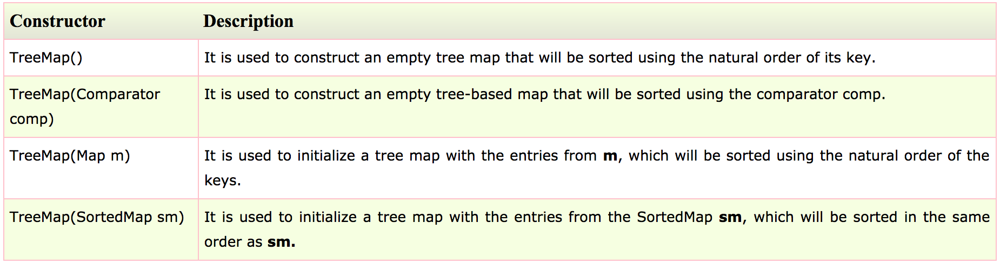

### Methods of Java TreeMap class

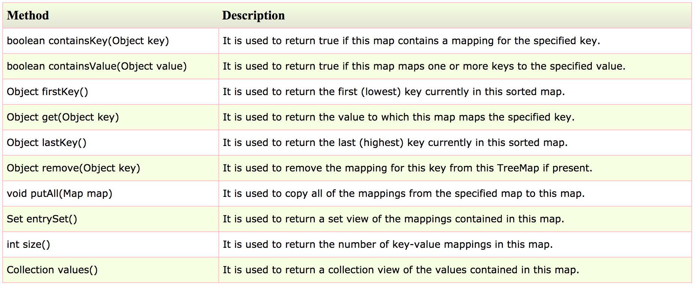

### Java TreeMap Example:

```
import java.util.*;  
class TestCollection15{  
 public static void main(String args[]){  
  TreeMap<Integer,String> hm=new TreeMap<Integer,String>();  
  hm.put(100,"Amit");  
  hm.put(102,"Ravi");  
  hm.put(101,"Vijay");  
  hm.put(103,"Rahul");  
  for(Map.Entry m:hm.entrySet()){  
   System.out.println(m.getKey()+" "+m.getValue());  
  }  
 }  
}  
```

**Output:**

```
100 Amit
101 Vijay
102 Ravi
103 Rahul
```

### Java TreeMap Example: remove()

```
import java.util.*;  
public class TreeMapExample {  
   public static void main(String args[]) {  
   // Create and populate tree map  
   Map<Integer, String> map = new TreeMap<Integer, String>();           
   map.put(102,"Let us C");  
   map.put(103, "Operating System");  
   map.put(101, "Data Communication and Networking");  
   System.out.println("Values before remove: "+ map);    
   // Remove value for key 102  
   map.remove(102);  
   System.out.println("Values after remove: "+ map);  
   }      
}  
```

**Output:**

```
Values before remove: {101=Data Communication and Networking, 102=Let us C, 103=Operating System}
Values after remove: {101=Data Communication and Networking, 103=Operating System}
```

### What is difference between HashMap and TreeMap?

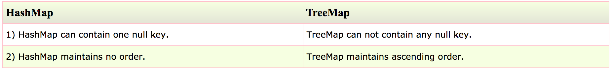

----

### Hashtable

Java Hashtable class implements a hashtable, which maps keys to values. It inherits Dictionary class and implements the Map interface.

The important points about Java Hashtable class are:

- A Hashtable is an array of list. Each list is known as a bucket. The position of bucket is identified by calling the hashcode() method. A Hashtable contains values based on the key.
- It contains only unique elements.
- It may have not have any null key or value.
- It is synchronized.

### Hashtable class declaration

```
public class Hashtable<K,V> extends Dictionary<K,V> implements Map<K,V>, Cloneable, Serializable  
```

### Hashtable class Parameters

- **K:** It is the type of keys maintained by this map.
- **V:** It is the type of mapped values.

### Constructors of Java Hashtable class

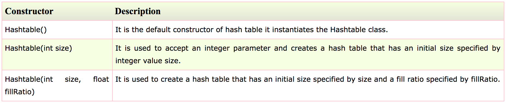

### Methods of Java Hashtable class

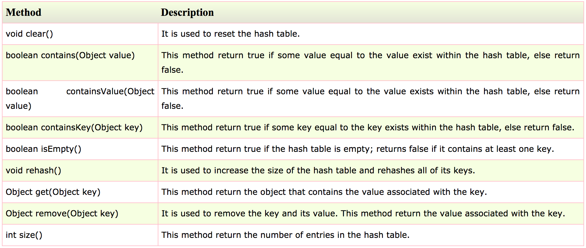

### Java Hashtable Example

```
import java.util.*;  
class TestCollection16{  
 public static void main(String args[]){  
  Hashtable<Integer,String> hm=new Hashtable<Integer,String>();  
  
  hm.put(100,"Amit");  
  hm.put(102,"Ravi");  
  hm.put(101,"Vijay");  
  hm.put(103,"Rahul");  
  
  for(Map.Entry m:hm.entrySet()){  
   System.out.println(m.getKey()+" "+m.getValue());  
  }  
 }  
}  
```

**Output:**

```
103 Rahul
102 Ravi
101 Vijay
100 Amit
```
    
### Java Hashtable Example: remove()

```
import java.util.*;  
public class HashtableExample {  
   public static void main(String args[]) {  
   // create and populate hash table  
   Hashtable<Integer, String> map = new Hashtable<Integer, String>();           
   map.put(102,"Let us C");  
   map.put(103, "Operating System");  
   map.put(101, "Data Communication and Networking");  
   System.out.println("Values before remove: "+ map);    
   // Remove value for key 102  
   map.remove(102);  
   System.out.println("Values after remove: "+ map);  
   }      
}
```
 
**Output:**

```
Values before remove: {103=Operating System, 102=Let us C, 101=Data Communication and Networking}
Values after remove: {103=Operating System, 101=Data Communication and Networking}
```

----

### Difference between HashMap and Hashtable

HashMap and Hashtable both are used to store data in key and value form. Both are using hashing technique to store unique keys.

But there are many differences between HashMap and Hashtable classes that are given below:

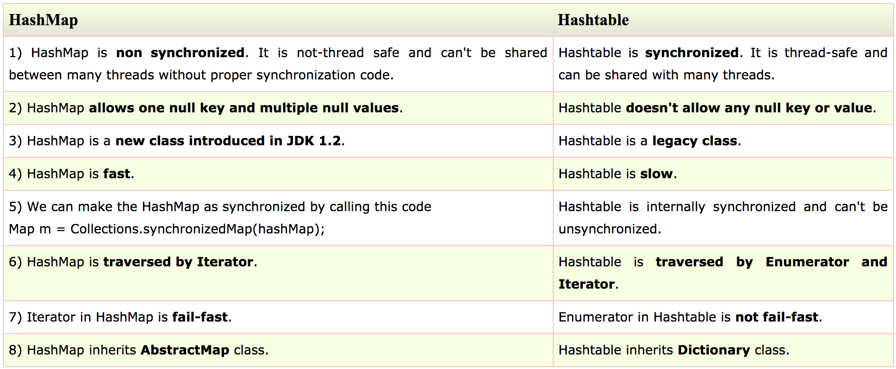

----

### EnumSet

Java EnumSet class is the specialized Set implementation for use with enum types. It inherits AbstractSet class and implements the Set interface.

### EnumSet class Hierarchy


### EnumSet class declaration

```
public abstract class EnumSet<E extends Enum<E>> extends AbstractSet<E> implements Cloneable, Serializable
```

### Methods of Java EnumSet class

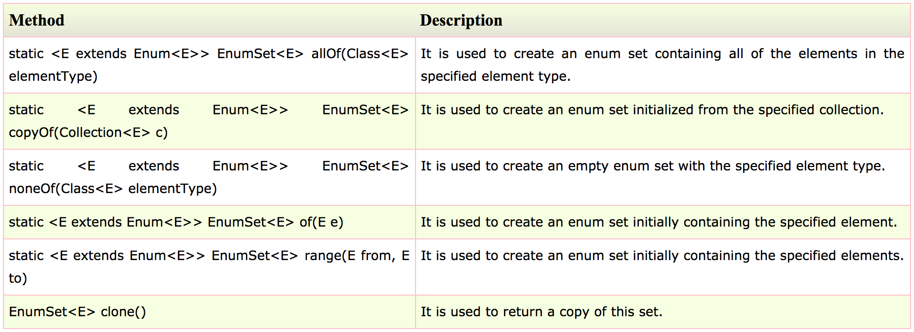

### Java EnumSet Example

```
import java.util.*;  
enum days {  
  SUNDAY, MONDAY, TUESDAY, WEDNESDAY, THURSDAY, FRIDAY, SATURDAY  
}  
public class EnumSetExample {  
  public static void main(String[] args) {  
    Set<days> set = EnumSet.of(days.TUESDAY, days.WEDNESDAY);  
    // Traversing elements  
    Iterator<days> iter = set.iterator();  
    while (iter.hasNext())  
      System.out.println(iter.next());  
  }  
}
```
  
**Output:**

```
TUESDAY
WEDNESDAY
```

### Java EnumSet Example: allOf() and noneOf()

```
import java.util.*;  
enum days {  
  SUNDAY, MONDAY, TUESDAY, WEDNESDAY, THURSDAY, FRIDAY, SATURDAY  
}  
public class EnumSetExample {  
  public static void main(String[] args) {  
    Set<days> set1 = EnumSet.allOf(days.class);  
      System.out.println("Week Days:"+set1);  
      Set<days> set2 = EnumSet.noneOf(days.class);  
      System.out.println("Week Days:"+set2);     
  }  
}  
```

**Output:**

```
Week Days:[SUNDAY, MONDAY, TUESDAY, WEDNESDAY, THURSDAY, FRIDAY, SATURDAY]
Week Days:[]
```

----

### EnumMap

Java EnumMap class is the specialized Map implementation for enum keys. It inherits Enum and AbstractMap classes.

### EnumMap class hierarchy


### EnumMap class declaration

```
public class EnumMap<K extends Enum<K>,V> extends AbstractMap<K,V> implements Serializable, Cloneable
```

### EnumMap class Parameters

- **K:** It is the type of keys maintained by this map.
- **V:** It is the type of mapped values.

### Constructors of Java EnumMap class

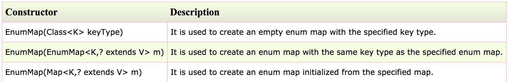

### Methods of Java EnumMap class

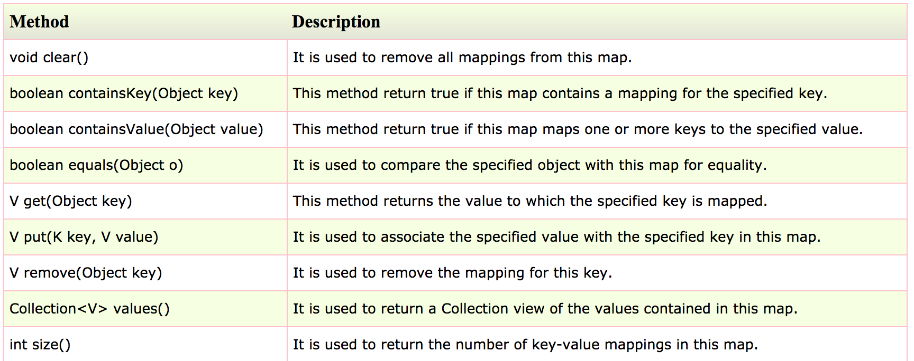

### Java EnumMap Example

```
import java.util.*;  
public class EnumMapExample {  
   // create an enum  
   public enum Days {  
   Monday, Tuesday, Wednesday, Thursday  
   };  
   public static void main(String[] args) {  
   //create and populate enum map  
   EnumMap<Days, String> map = new EnumMap<Days, String>(Days.class);  
   map.put(Days.Monday, "1");  
   map.put(Days.Tuesday, "2");  
   map.put(Days.Wednesday, "3");  
   map.put(Days.Thursday, "4");  
   // print the map  
   for(Map.Entry m:map.entrySet()){    
       System.out.println(m.getKey()+" "+m.getValue());    
      }   
   }  
}
```
 
**Output:**

```
Monday 1
Tuesday 2
Wednesday 3
Thursday 4
```

----

### Collections class

Java collection class is used exclusively with static methods that operate on or return collections. It inherits Object class.

The important points about Java Collections class are:

- Java Collection class supports the **polymorphic algorithms** that operate on collections.
- Java Collection class throws a **NullPointerException** if the collections or class objects provided to them are null.

### Collections class declaration

```
public class Collections extends Object
```

### Methods of Java Collections class

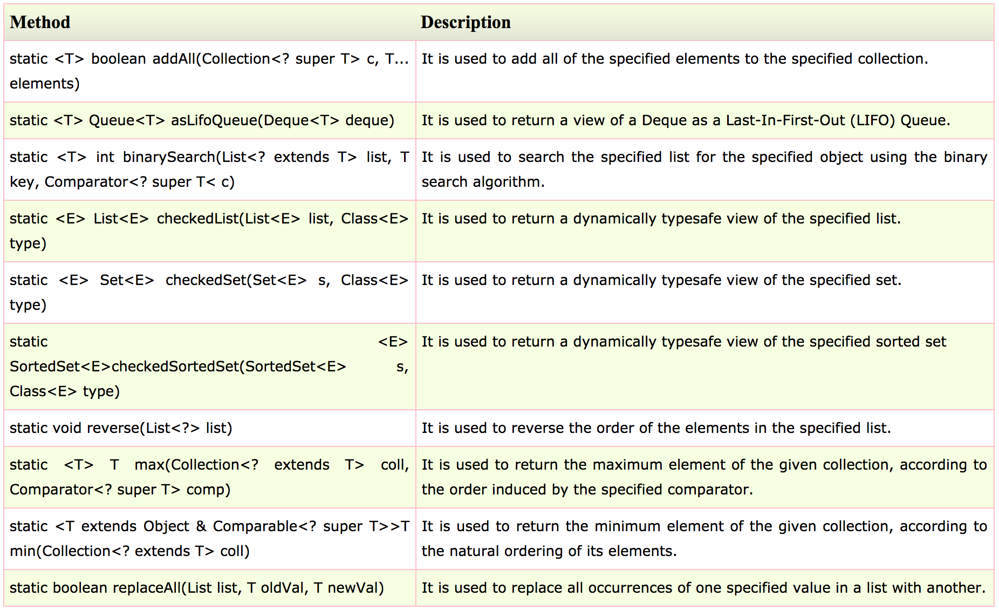

### Java Collections Example

```
import java.util.*;  
public class CollectionsExample {  
    public static void main(String a[]){      
        List<String> list = new ArrayList<String>();  
        list.add("C");  
        list.add("Core Java");  
        list.add("Advance Java");  
        System.out.println("Initial collection value:"+list);  
        Collections.addAll(list, "Servlet","JSP");  
        System.out.println("After adding elements collection value:"+list);  
        String[] strArr = {"C#", ".Net"};  
        Collections.addAll(list, strArr);  
        System.out.println("After adding array collection value:"+list);  
    }  
}
```
  
**Output:**

```
Initial collection value:[C, Core Java, Advance Java]
After adding elements collection value:[C, Core Java, Advance Java, Servlet, JSP]
After adding array collection value:[C, Core Java, Advance Java, Servlet, JSP, C#, .Net]
```

### Java Collections Example: max()

```
import java.util.*;  
public class CollectionsExample {  
    public static void main(String a[]){         
        List<Integer> list = new ArrayList<Integer>();  
        list.add(46);  
        list.add(67);  
        list.add(24);  
        list.add(16);  
        list.add(8);  
        list.add(12);  
        System.out.println("Value of maximum element from the collection: "+Collections.max(list));  
    }  
}
```

**Output:**

```
Value of maximum element from the collection: 67
```

### Java Collections Example: min()

```
import java.util.*;  
public class CollectionsExample {  
    public static void main(String a[]){         
        List<Integer> list = new ArrayList<Integer>();  
        list.add(46);  
        list.add(67);  
        list.add(24);  
        list.add(16);  
        list.add(8);  
        list.add(12);  
        System.out.println("Value of minimum element from the collection: "+Collections.min(list));  
    }  
}
```
 
**Output:**

```
Value of minimum element from the collection: 8
```

----

### Sorting in Collection

We can sort the elements of:

- String objects
- Wrapper class objects
- User-defined class objects

**Collections** class provides static methods for sorting the elements of collection. If collection elements are of `Set` type, we can use `TreeSet`. But we cannot sort the elements of List. Collections class provides methods for sorting the elements of List type elements.

### Method of Collections class for sorting List elements

**public void sort(List list)**: is used to sort the elements of List. List elements must be of `Comparable` type.

**Note:** `String` class and `Wrapper` classes implements the `Comparable` interface. So, if you store the objects of string or wrapper classes, it will be Comparable.

### Example of Sorting the elements of List that contains string objects

```
import java.util.*;  
class TestSort1{  
public static void main(String args[]){  
  
ArrayList<String> al=new ArrayList<String>();  
al.add("Viru");  
al.add("Saurav");  
al.add("Mukesh");  
al.add("Tahir");  
  
Collections.sort(al);  
Iterator itr=al.iterator();  
while(itr.hasNext()){  
System.out.println(itr.next());  
 }  
}  
}
```

**Output:**

```
Mukesh
Saurav
Tahir
Viru
```
    
### Example of Sorting the elements of List that contains Wrapper class objects

```
import java.util.*;  
class TestSort2{  
public static void main(String args[]){  
  
ArrayList al=new ArrayList();  
al.add(Integer.valueOf(201));  
al.add(Integer.valueOf(101));  
al.add(230);//internally will be converted into objects as Integer.valueOf(230)  
  
Collections.sort(al);  
  
Iterator itr=al.iterator();  
while(itr.hasNext()){  
System.out.println(itr.next());  
 }  
}  
}
```

**Output:**

```
101
201
230
```

----

### Comparable interface

Java `Comparable` interface is used to order the objects of user-defined class. This interface is found in `java.lang` package and contains only one method named `compareTo(Object)`. It provide single sorting sequence only i.e. you can sort the elements on based on single data member only. For example, it may be `rollno`, `name`, `age` or anything else.

### compareTo(Object obj) method

**public int compareTo(Object obj)**: is used to compare the current object with the specified object.

We can sort the elements of:

- String objects
- Wrapper class objects
- User-defined class objects

### Collections class

**Collections** class provides static methods for sorting the elements of collections. If collection elements are of Set or Map, we can use `TreeSet` or `TreeMap`. But we cannot sort the elements of List. Collections class provides methods for sorting the elements of List type elements.

### Method of Collections class for sorting List elements

**public void sort(List list):** is used to sort the elements of List. List elements must be of Comparable type.

**Note:** String class and Wrapper classes implements Comparable interface by default. So if you store the objects of string or wrapper classes in list, set or map, it will be Comparable by default.

### Java Comparable Example

```
class Student implements Comparable<Student>{  
int rollno;  
String name;  
int age;  
Student(int rollno,String name,int age){  
this.rollno=rollno;  
this.name=name;  
this.age=age;  
}  
  
public int compareTo(Student st){  
if(age==st.age)  
return 0;  
else if(age>st.age)  
return 1;  
else  
return -1;  
}  
}
```

```
import java.util.*;  
import java.io.*;  
public class TestSort3{  
public static void main(String args[]){  
ArrayList<Student> al=new ArrayList<Student>();  
al.add(new Student(101,"Vijay",23));  
al.add(new Student(106,"Ajay",27));  
al.add(new Student(105,"Jai",21));  
  
Collections.sort(al);  
for(Student st:al){  
System.out.println(st.rollno+" "+st.name+" "+st.age);  
}  
}  
}
```

**Output:**

```
105 Jai 21
101 Vijay 23
106 Ajay 27
```

----

### Comparator interface

Java `Comparator` interface is used to order the objects of user-defined class.

This interface is found in java.util package and contains 2 methods `compare(Object obj1,Object obj2)` and `equals(Object element)`.

It provides multiple sorting sequence i.e. you can sort the elements on the basis of any data member, for example rollno, name, age or anything else.

### compare() method

**public int compare(Object obj1,Object obj2)**: compares the first object with second object.

### Collections class

**Collections** class provides static methods for sorting the elements of collection. If collection elements are of Set or Map, we can use TreeSet or TreeMap. But we cannot sort the elements of List. Collections class provides methods for sorting the elements of List type elements also.

### Method of Collections class for sorting List elements

**public void sort(List list, Comparator c)**: is used to sort the elements of List by the given Comparator.

### Java Comparator Example (Non-generic Style)

```
class Student{  
int rollno;  
String name;  
int age;  
Student(int rollno,String name,int age){  
this.rollno=rollno;  
this.name=name;  
this.age=age;  
}  
}
```

```
import java.util.*;  
class AgeComparator implements Comparator{  
public int compare(Object o1,Object o2){  
Student s1=(Student)o1;  
Student s2=(Student)o2;  
  
if(s1.age==s2.age)  
return 0;  
else if(s1.age>s2.age)  
return 1;  
else  
return -1;  
}  
} 
```

```
import java.util.*;  
class NameComparator implements Comparator{  
public int compare(Object o1,Object o2){  
Student s1=(Student)o1;  
Student s2=(Student)o2;  
  
return s1.name.compareTo(s2.name);  
}  
}
```

```
import java.util.*;  
import java.io.*;  
  
class Simple{  
public static void main(String args[]){  
  
ArrayList al=new ArrayList();  
al.add(new Student(101,"Vijay",23));  
al.add(new Student(106,"Ajay",27));  
al.add(new Student(105,"Jai",21));  
  
System.out.println("Sorting by Name...");  
  
Collections.sort(al,new NameComparator());  
Iterator itr=al.iterator();  
while(itr.hasNext()){  
Student st=(Student)itr.next();  
System.out.println(st.rollno+" "+st.name+" "+st.age);  
}  
  
System.out.println("sorting by age...");  
  
Collections.sort(al,new AgeComparator());  
Iterator itr2=al.iterator();  
while(itr2.hasNext()){  
Student st=(Student)itr2.next();  
System.out.println(st.rollno+" "+st.name+" "+st.age);  
}
}  
}
```

**Output:**

```
Sorting by Name...
106 Ajay 27
105 Jai 21
101 Vijay 23
   
Sorting by age...       
105 Jai 21
101 Vijay 23
106 Ajay 27
```

### Java Comparator Example (Generic Style)

```
class Student{  
int rollno;  
String name;  
int age;  
Student(int rollno,String name,int age){  
this.rollno=rollno;  
this.name=name;  
this.age=age;  
}  
}
```

```
import java.util.*;  
class AgeComparator implements Comparator<Student>{  
public int compare(Student s1,Student s2){  
if(s1.age==s2.age)  
return 0;  
else if(s1.age>s2.age)  
return 1;  
else  
return -1;  
}  
}
```

```
import java.util.*;  
class NameComparator implements Comparator<Student>{  
public int compare(Student s1,Student s2){  
return s1.name.compareTo(s2.name);  
}  
}
```

```
import java.util.*;  
import java.io.*;  
class Simple{  
public static void main(String args[]){  
  
ArrayList<Student> al=new ArrayList<Student>();  
al.add(new Student(101,"Vijay",23));  
al.add(new Student(106,"Ajay",27));  
al.add(new Student(105,"Jai",21));  
  
System.out.println("Sorting by Name...");  
  
Collections.sort(al,new NameComparator());  
for(Student st: al){  
System.out.println(st.rollno+" "+st.name+" "+st.age);  
}  
  
System.out.println("sorting by age...");  
  
Collections.sort(al,new AgeComparator());  
for(Student st: al){  
System.out.println(st.rollno+" "+st.name+" "+st.age);  
}  
  
}  
}
```

**Output:**

```
Sorting by Name...
106 Ajay 27
105 Jai 21
101 Vijay 23

Sorting by age...       
105 Jai 21
101 Vijay 23
106 Ajay 27
```

----

### Difference between ArrayList and Vector

ArrayList and Vector both implements List interface and maintains insertion order.

But there are many differences between ArrayList and Vector classes that are given below:

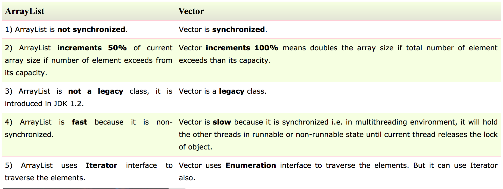

### Example of Java ArrayList

```
import java.util.*;    
class TestArrayList21{    
 public static void main(String args[]){    
     
  List<String> al=new ArrayList<String>();//creating arraylist    
  al.add("Sonoo");//adding object in arraylist    
  al.add("Michael");    
  al.add("James");    
  al.add("Andy");    
  //traversing elements using Iterator  
  Iterator itr=al.iterator();  
  while(itr.hasNext()){  
   System.out.println(itr.next());  
  }    
 }    
} 
```

**Output:**

```
Sonoo
Michael
James
Andy
```

### Example of Java Vector

```
import java.util.*;      
class TestVector1{      
 public static void main(String args[]){      
  Vector<String> v=new Vector<String>();//creating vector  
  v.add("umesh");//method of Collection  
  v.addElement("irfan");//method of Vector  
  v.addElement("kumar");  
  //traversing elements using Enumeration  
  Enumeration e=v.elements();  
  while(e.hasMoreElements()){  
   System.out.println(e.nextElement());  
  }  
 }      
}
```

**Output:**

```
umesh
irfan
kumar
```