# MEAN Stack

- MongoDB - Database
- ExpressJS - Framework for NodeJS, which makes server side coding easy
- AngularJS - Frontend/Client Side
- NodeJS - Backend/Server Side

We will build a Contact List App, which uses RESTful APIs to perform CRUD operations.

### Step 1:

Download [NodeJS](https://nodejs.org/en/) and install it.

### Step 2:

Create a folder `"ContactListApp"`.

### Step 3:

Create a file `server.js` inside this folder.

### Step 4:

Open `server.js` using `Sublime Text` text editor.

### Step 5:

Navigate to this project folder using terminal.

### Step 6:

We will install `ExpressJS`. To do that use command:

```
npm install express
```

### Step 7:

We require this `express` in our `server.js`. We need to test if `server.js` is running properly. For that we write:

```
var express = require('express');
var app = express();

app.get('/', function (req, res) {
	res.send("Hello world from Server")
});

app.listen(3000);
console.log("Server running on port 3000");
```

### Step 8:

Use command:

```
node server
```

We see in the terminal:

```
Server running on port 3000
```

### Step 9:

In the browser, open `http://localhost:3000/`.

We can see:

```
Hello world from Server
```

### Step 10:

We need an `index.html` as the base webpage of our app. For that, we need to specify where to look for the `index.html` file. We keep it within a folder `public`. We first need to create this folder. And within the `public` folder, create a file called `index.html`.

We delete `app.get()` snippet and instead of it, we write `app.use(express.static(__dirname + '/public'));`.

`static` refers to static files like html, css, image files.

The `server.js` file now looks like:

```
var express = require('express');
var app = express();

app.use(express.static(__dirname + '/public'));

app.listen(3000);
console.log("Server running on port 3000");
```

### Step 11:

In the `index.html`, write:

```
<!DOCTYPE>
<html>
<head>
  <title>Contact List App</title>
</head>

<body>
  <h1>Contact List App</h1>
</body>
</html>
```

Go to browser and refresh the page.

### Step 12:

Next, we will install `AngularJS `. Go to [AngularJS Website](https://angularjs.org/).

Click on `AngularJS 1`. Copy the `CDN Link`.

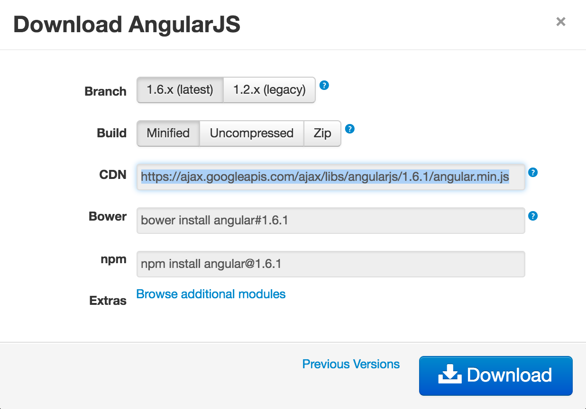

### Step 13:

Paste the link to load AngularJS within `<script></script>` tag at the bottom of the `index.html`. Also we need to use angular's two way binding by using `ng` tags.

```
<!DOCTYPE>
<html ng-app>
<head>
  <title>Contact List App</title>
</head>

<body>
  <h1>Contact List App</h1>

  <input ng-model="test">
  {{test}}

<script src="https://ajax.googleapis.com/ajax/libs/angularjs/1.6.1/angular.min.js"></script>
</body>
</html>
```

Now refresh the browser. We see a text field. Go ahead and type something in the text field. We see the input text immediately appears beside the text field, without having a full page refresh again and again.

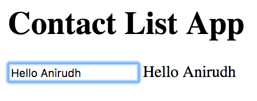

This means Angular is working and that's the power of AngularJS. It is hence used to build dynamic UIs.

### Step 14:

Next, we will set up `BootStrap`. It will make our UI responsive and will make it look a lot better.

Go to [http://getbootstrap.com/getting-started/](http://getbootstrap.com/getting-started/).

You will see CDN Links:

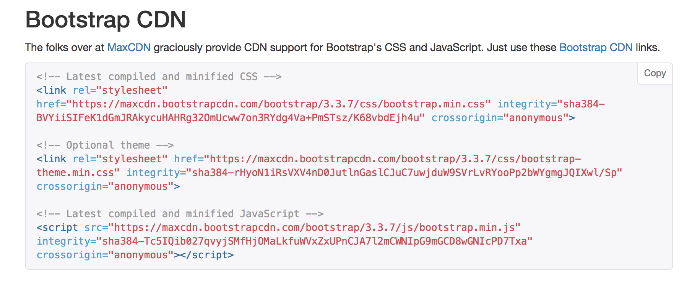

Copy the first two links and paste it at the top of `index.html`.

```
<!DOCTYPE>
<html ng-app>
<head>

<!-- Latest compiled and minified CSS -->
<link rel="stylesheet" href="https://maxcdn.bootstrapcdn.com/bootstrap/3.3.7/css/bootstrap.min.css" integrity="sha384-BVYiiSIFeK1dGmJRAkycuHAHRg32OmUcww7on3RYdg4Va+PmSTsz/K68vbdEjh4u" crossorigin="anonymous">

<!-- Optional theme -->
<link rel="stylesheet" href="https://maxcdn.bootstrapcdn.com/bootstrap/3.3.7/css/bootstrap-theme.min.css" integrity="sha384-rHyoN1iRsVXV4nD0JutlnGaslCJuC7uwjduW9SVrLvRYooPp2bWYgmgJQIXwl/Sp" crossorigin="anonymous">
  <title>Contact List App</title>
</head>

<body>
  <h1>Contact List App</h1>

  <input ng-model="test">
  {{test}}

<script src="https://ajax.googleapis.com/ajax/libs/angularjs/1.6.1/angular.min.js"></script>
</body>
</html>
```

To test if BootStrap is working, refresh the browser. We will see the UI has visually changed a bit.

### Step 15:

We are not going to create the general layout for our app. It is basic HTML. Also to manage interactions between Model and View, we will use Controllers.

We create a folder `controllers` inside `public`. Inside it, we create a file `controller.js`.

Inside `index.html`, write:

```
<!DOCTYPE>
<html ng-app="myApp">
<head>

<!-- Latest compiled and minified CSS -->
<link rel="stylesheet" href="https://maxcdn.bootstrapcdn.com/bootstrap/3.3.7/css/bootstrap.min.css" integrity="sha384-BVYiiSIFeK1dGmJRAkycuHAHRg32OmUcww7on3RYdg4Va+PmSTsz/K68vbdEjh4u" crossorigin="anonymous">

<!-- Optional theme -->
<link rel="stylesheet" href="https://maxcdn.bootstrapcdn.com/bootstrap/3.3.7/css/bootstrap-theme.min.css" integrity="sha384-rHyoN1iRsVXV4nD0JutlnGaslCJuC7uwjduW9SVrLvRYooPp2bWYgmgJQIXwl/Sp" crossorigin="anonymous">
  <title>Contact List App</title>
</head>

<body>

<div class="container" ng-controller="AppCtrl">
  <h1>Contact List App</h1>
<table class="table">
      <thead>
        <tr>
          <th>Name</th>         
          <th>Email</th>
          <th>Number</th>
        </tr>
      </thead>
 </table>

  </div>
<script src="https://ajax.googleapis.com/ajax/libs/angularjs/1.6.1/angular.min.js"></script>

<script src="controllers/controller.js"></script>
</body>
</html>
```

Inside `controller.js`, write:

```
var myApp = angular.module('myApp', []);

myApp.controller('AppCtrl', ['$scope', '$http', function($scope, $http) {
    console.log("Hello World from controller");
}]);
```

Go to browser, and refresh the page. Open developer tools to see Console Log.

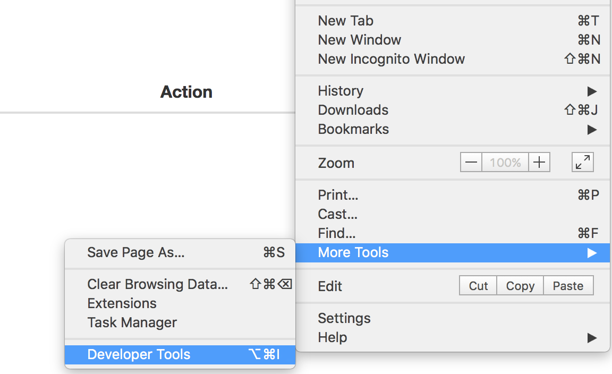

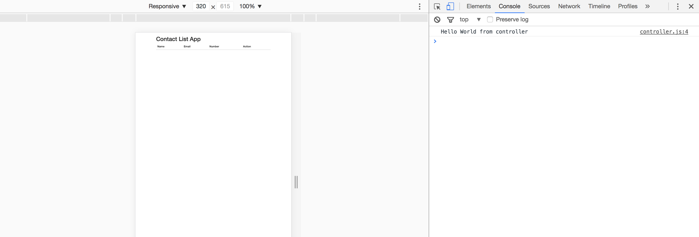

### Step 16:

We will now show some dummy hardcoded data.

Inside `controller.js`, write:

```
var myApp = angular.module('myApp', []);

myApp.controller('AppCtrl', ['$scope', '$http', function($scope, $http) {
    console.log("Hello World from controller");

    person1 = {
    	name: 'Anirudh',
    	email: 'cse.anirudh@gmail.com',
    	number: '9876543210'
    };

    person2 = {
    	name: 'Sahana',
    	email: 'sahana@gmail.com',
    	number: '7654321098'
    };

    person3 = {
    	name: 'Mohit',
    	email: 'mohit@gmail.com',
    	number: '5432109876'
    };

    var contactlist = [person1, person2, person3];
    $scope.contactlist = contactlist;
}]);
```

Here, `$scope` is the glue between View and Controller.

Inside `index.html`, write:

```
<!DOCTYPE>
<html ng-app="myApp">
<head>

<!-- Latest compiled and minified CSS -->
<link rel="stylesheet" href="https://maxcdn.bootstrapcdn.com/bootstrap/3.3.7/css/bootstrap.min.css" integrity="sha384-BVYiiSIFeK1dGmJRAkycuHAHRg32OmUcww7on3RYdg4Va+PmSTsz/K68vbdEjh4u" crossorigin="anonymous">

<!-- Optional theme -->
<link rel="stylesheet" href="https://maxcdn.bootstrapcdn.com/bootstrap/3.3.7/css/bootstrap-theme.min.css" integrity="sha384-rHyoN1iRsVXV4nD0JutlnGaslCJuC7uwjduW9SVrLvRYooPp2bWYgmgJQIXwl/Sp" crossorigin="anonymous">
  <title>Contact List App</title>
</head>

<body>

<div class="container" ng-controller="AppCtrl">
  <h1>Contact List App</h1>
<table class="table">
      <thead>
        <tr>
          <th>Name</th>         
          <th>Email</th>
          <th>Number</th>
        </tr>
      </thead>

      <tbody>
        <tr ng-repeat="contact in contactlist">
          	<td>{{contact.name}}</td>
          	<td>{{contact.email}}</td>
          	<td>{{contact.number}}</td>
        </tr>
       </tbody>
 </table>

  </div>
<script src="https://ajax.googleapis.com/ajax/libs/angularjs/1.6.1/angular.min.js"></script>

<script src="controllers/controller.js"></script>
</body>
</html>
```

Here, `ng-repeat="contact in contactlist"` is equivalent to a loop statement in Angular.

Refresh the browser. You will see:

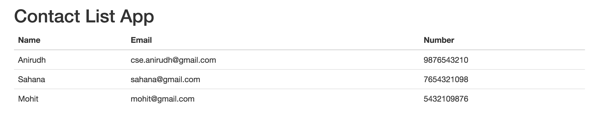

### Step 17:

Now let's use a HTTP Get Request to retrieve dummy data from server. For this, we will keep the data in `server.js`, and create a route `/contactlist`. So, the endpoint api is `http://localhost:3000/contactlist`. The controller hits this api for the GET request.

It gives the response in JSON format:

```
[
  {
    "name": "Anirudh",
    "email": "cse.anirudh@gmail.com",
    "number": "9876543210"
  },
  {
    "name": "Sahana",
    "email": "sahana@gmail.com",
    "number": "7654321098"
  },
  {
    "name": "Mohit",
    "email": "mohit@gmail.com",
    "number": "5432109876"
  }
]
```

Inside `controller.js`, write:

```
var myApp = angular.module('myApp', []);

myApp.controller('AppCtrl', ['$scope', '$http', function($scope, $http) {
    console.log("Hello World from controller");

    $http.get('http://localhost:3000/contactlist').then(function(response) {
    	console.log("I got the data I requested");
    	$scope.contactlist = response.data;
  	});

}]);
```

Inside `server.js`, write:

```
var express = require('express');
var app = express();

app.use(express.static(__dirname + "/public"))

app.get('/contactlist', function (req, res) {
  console.log('I received a GET request');
person1 = {
    	name: 'Anirudh',
    	email: 'cse.anirudh@gmail.com',
    	number: '9876543210'
    };

    person2 = {
    	name: 'Sahana',
    	email: 'sahana@gmail.com',
    	number: '7654321098'
    };

    person3 = {
    	name: 'Mohit',
    	email: 'mohit@gmail.com',
    	number: '5432109876'
    };

    var contactlist = [person1, person2, person3];
    res.json(contactlist); //The server responses to the GET Request in JSON Format, which the controller can then use.
});

app.listen(3000);
console.log("Server running on port 3000");
```

Refresh the browser. We can see:

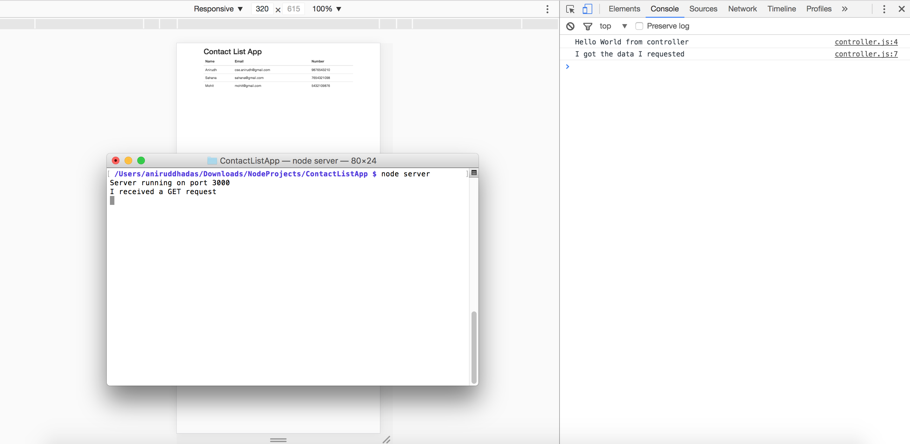

What happens in background when we refresh the page, the view requests controller for data by using scope. The controller then requests the server for data with a GET request. The server has the data hardcoded in it. The server on receiving the GET request sends back data to controller in JSON format. The controller after getting the data it requested for, sends it back to view to be displayed on the webpage.

### Step 18:

Now, we will use MongoDB to store and retrieve data. It is a `NO-SQL` database, i.e. instead of storing data in structured tables, it stores in `JSON-like` documents. Hence, it is faster.

To do that, we first need to [download](https://fastdl.mongodb.org/osx/mongodb-osx-ssl-x86_64-3.4.1.tgz) and [install](https://docs.mongodb.com/manual/tutorial/install-mongodb-on-os-x/) MongoDB.

Extract the zip, and rename the folder to `mongodb`. Place this folder in the User Root Directory, i.e. inside `~/`. Inside `~/`, create a folder `data`, and within `data`, create another folder `db`.

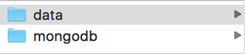

### Step 19:

Since first terminal is already running the `server`, open a second terminal and go inside the `mongodb/bin` folder.

```
cd /Users/aniruddhadas/mongodb/bin
```

Mention path to `mongo binary` directory.

```
export PATH=/Users/aniruddhadas/mongodb/bin:$PATH
```

**Note:** You should type the same command by going to `~/` if needed.

----

Start mongodb by using commands:

```
mongod --dbpath /Users/aniruddhadas/data
```

Here, we mention path to `data` directory.

If everything goes right, you should see:

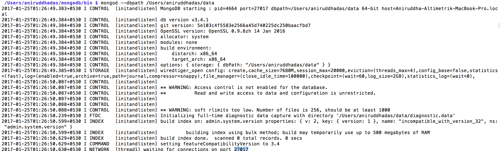

### Step 20:

Since first terminal is running the `server` and second terminal is running the `mongodb sever`, open a third terminal now, and go inside the `mongodb/bin` folder.

```
cd /Users/aniruddhadas/mongodb/bin/
```

Use command:

```
mongo
```

You should see:

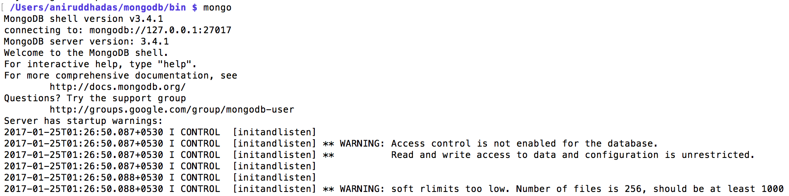

### Step 21:


----

To see the current databases, use:

```
show dbs
```

It shows:

```
admin  0.000GB
local  0.000GB
```

----

Create a database named `contactlist`.

```
use contactlist
```

It shows:

```
switched to db contactlist
```

----

To insert a single tuple:

```
db.contactlist.insert({name: 'Anirudh', email: 'cse.anirudh@gmail.com', number: '9876543210'})
```

It shows:

```
WriteResult({ "nInserted" : 1 })
```

----

To see contents of db:

```
db.contactlist.find()
```

It shows:

```
{ "_id" : ObjectId("5887b70941c3f776a27974b7"), "name" : "Anirudh", "email" : "cse.anirudh@gmail.com", "number" : "9876543210" }
```

To see in human readable form, use:

```
db.contactlist.find().pretty()
```

It shows:

```
{
	"_id" : ObjectId("5887b70941c3f776a27974b7"),
	"name" : "Anirudh",
	"email" : "cse.anirudh@gmail.com",
	"number" : "9876543210"
}
```

**We see it returns back exactly the same JSON we passed as input during insert, but only with an extra key-value pair, i.e. `_id : ObjectID`**

----

To insert multiple entries into database at the same time:

```
db.contactlist.insert([{name: 'Ani', email: 'adas@gmail.com', number: '8765432109'}, {name: 'Vibhor', email: 'vibhor@gmail.com', number: '7865432109'}])
```

It shows:

```
BulkWriteResult({
	"writeErrors" : [ ],
	"writeConcernErrors" : [ ],
	"nInserted" : 2,
	"nUpserted" : 0,
	"nMatched" : 0,
	"nModified" : 0,
	"nRemoved" : 0,
	"upserted" : [ ]
})
```

Now to see contents:

```
db.contactlist.find().pretty()
```

It shows:

```
{
	"_id" : ObjectId("5887b70941c3f776a27974b7"),
	"name" : "Anirudh",
	"email" : "cse.anirudh@gmail.com",
	"number" : "9876543210"
}
{
	"_id" : ObjectId("5887b7af41c3f776a27974b8"),
	"name" : "Ani",
	"email" : "adas@gmail.com",
	"number" : "8765432109"
}
{
	"_id" : ObjectId("5887b7af41c3f776a27974b9"),
	"name" : "Vibhor",
	"email" : "vibhor@gmail.com",
	"number" : "7865432109"
}
```

### Step 22:

We now need to make the server interact with the mongodb using REST APIs.

Go back to the first terminal, and close down the server by using `Cntrl + C`.

Use command:

```
npm install mongojs
```

**Note:**

`npm` downloads packages into `node_modules` folder in `~/`, where the nodejs was installed. So, earlier when we installed `expressjs` and now `mongojs`, it checked out the code into this `node_modules` folder.

### Step 23:

We delete the hardcoded data in the server. And import `mongojs` and pass the database name to it.

```
var express = require('express');
var app = express();

var mongojs = require('mongojs');
var db = mongojs('contactlist', ['contactlist']);

app.use(express.static(__dirname + "/public"))

app.get('/contactlist', function (req, res) {
  console.log('I received a GET request');

  db.contactlist.find(function (err, docs) {
    console.log(docs);
    res.json(docs);
  });
});

app.listen(3000);
console.log("Server running on port 3000");
```

Start the server by using `node server`. Refresh the page.

We will see:

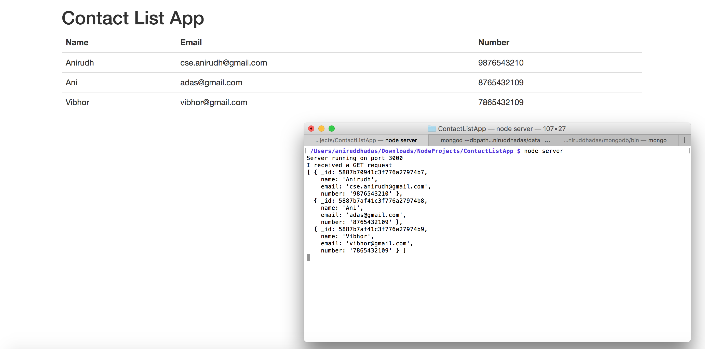

What happens in background when we refresh the page, the view requests controller for data by using scope. The controller then requests the server for data with a GET request. The server on receiving the GET request interacts with the mongodb database, gets the data, converts into JSON format and sends back data to controller. The controller after getting the data it requested for, sends it back to view to be displayed on the webpage.

### Step 24:

The server after getting the request data from POST request doesn't know how to interpret it. For that we need to install a package `body-parser`.

Go to the first terminal. Close the server.

```
npm install body-parser
```

### Step 25:

We will now see **all 4 CRUD operations using GET, POST, DELETE, PUT**.

In `index.html`, write:

```
<!DOCTYPE>
<html ng-app="myApp">
<head>

<!-- Latest compiled and minified CSS -->
<link rel="stylesheet" href="https://maxcdn.bootstrapcdn.com/bootstrap/3.3.7/css/bootstrap.min.css" integrity="sha384-BVYiiSIFeK1dGmJRAkycuHAHRg32OmUcww7on3RYdg4Va+PmSTsz/K68vbdEjh4u" crossorigin="anonymous">

<!-- Optional theme -->
<link rel="stylesheet" href="https://maxcdn.bootstrapcdn.com/bootstrap/3.3.7/css/bootstrap-theme.min.css" integrity="sha384-rHyoN1iRsVXV4nD0JutlnGaslCJuC7uwjduW9SVrLvRYooPp2bWYgmgJQIXwl/Sp" crossorigin="anonymous">
  <title>Contact List App</title>
</head>

<body>

<div class="container" ng-controller="AppCtrl">
  <h1>Contact List App</h1>
<table class="table">
      <thead>
        <tr>
          <th>Name</th>         
          <th>Email</th>
          <th>Number</th>
          <th>Action</th>
          <th>&nbsp;</th>
        </tr>
      </thead>

      <tbody>

        <tr>
          <td><input class="form-control" ng-model="contact.name"></td>
          <td><input class="form-control" ng-model="contact.email"></td>
          <td><input class="form-control" ng-model="contact.number"></td>
          <td><button class="btn btn-primary" ng-click="addContact()">Add Contact</button></td>
          <td><button class="btn btn-info" ng-click="update()">Update</button>&nbsp;&nbsp;<button class="btn btn-info" ng-click="deselect()">Clear</button></td>
        </tr>

        <tr ng-repeat="contact in contactlist">
          	<td>{{contact.name}}</td>
          	<td>{{contact.email}}</td>
          	<td>{{contact.number}}</td>
            <td><button class="btn btn-danger" ng-click="remove(contact._id)">Remove</button></td>
          <td><button class="btn btn-warning" ng-click="edit(contact._id)">Edit</button></td>
        </tr>
       </tbody>
 </table>

  </div>
<script src="https://ajax.googleapis.com/ajax/libs/angularjs/1.6.1/angular.min.js"></script>

<script src="controllers/controller.js"></script>
</body>
</html>
```

In `controller.js`, write:

```
var myApp = angular.module('myApp', []);

myApp.controller('AppCtrl', ['$scope', '$http', function($scope, $http) {
    console.log("Hello World from controller");


// After adding a contact the new inserted contact is not immediately visible, unless we manually refresh. So, we need to programatically refresh it.
var refresh = function() {
    $http.get('http://localhost:3000/contactlist').then(function(response) {
    	console.log("I got the data I requested");
    	$scope.contactlist = response.data;

    	$scope.contact = ""; //To clear the text fields after we refresh
  	});
};

refresh();


//From the index.html scope, it glues to addContact() method.
  $scope.addContact = function() {
  	console.log($scope.contact); //It prints the text field data onto console.

  	//We then send the data to server as POST request.
  	$http.post('/contactlist', $scope.contact).then(function(response) {
    console.log(response.data);
  });
};

$scope.remove = function(id) {
  console.log(id);
  $http.delete('/contactlist/' + id).then(function(response) {
    refresh();
  });
};

$scope.edit = function(id) {
  console.log(id);
  $http.get('/contactlist/' + id).then(function(response) {
    $scope.contact = response.data;
  });
};  

$scope.update = function() {
  console.log($scope.contact._id);
  $http.put('/contactlist/' + $scope.contact._id, $scope.contact).then(function(response) {
    refresh();
  })
};

$scope.deselect = function() {
  $scope.contact = "";
}

}]);
```

In `server.js`, write:

```
var express = require('express');
var app = express();

//Fetch mongodb and configure the database called "contactlist"
var mongojs = require('mongojs');
var db = mongojs('contactlist', ['contactlist']);
var bodyParser = require('body-parser');

app.use(express.static(__dirname + "/public"))
app.use(bodyParser.json());

//Server listens for GET Request
app.get('/contactlist', function (req, res) {
  console.log('I received a GET request');

//Gets data from database and sends it back to controller
  db.contactlist.find(function (err, docs) {
    console.log(docs);
    res.json(docs);
  });
});

//Server listens for POST Request
app.post('/contactlist', function (req, res) {
//Using body-parser the server parses the received request
  console.log(req.body);

  //Inserts data into database, and sends the new data back to controller
  db.contactlist.insert(req.body, function(err, doc) {
    res.json(doc);
  });
});

app.delete('/contactlist/:id', function (req, res) {
  var id = req.params.id;
  console.log(id);
  db.contactlist.remove({_id: mongojs.ObjectId(id)}, function (err, doc) {
    res.json(doc);
  });
});

app.get('/contactlist/:id', function (req, res) {
  var id = req.params.id;
  console.log(id);
  db.contactlist.findOne({_id: mongojs.ObjectId(id)}, function (err, doc) {
    res.json(doc);
  });
});

app.put('/contactlist/:id', function (req, res) {
  var id = req.params.id;
  console.log(req.body.name);
  db.contactlist.findAndModify({
    query: {_id: mongojs.ObjectId(id)},
    update: {$set: {name: req.body.name, email: req.body.email, number: req.body.number}},
    new: true}, function (err, doc) {
      res.json(doc);
    }
  );
});

app.listen(3000);
console.log("Server running on port 3000");
```

### Step 26:

The app now will look like:

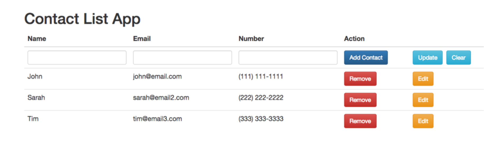

Next time onwards, if you have to restart server:

```
cd /Users/aniruddhadas/Downloads/NodeProjects/ContactListApp
```

```
node server
```

And if you need to restart mongodb:

```
cd /Users/aniruddhadas/mongodb/bin
```

```
mongod --dbpath /Users/aniruddhadas/data
```