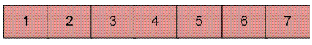
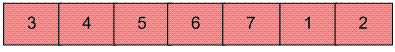
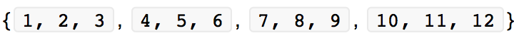
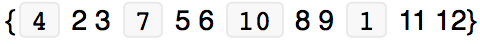
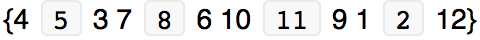
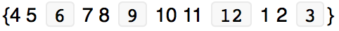

# Rotate an array of size 'n' by 'd' elements

**Problem Statement:**

Let's say there's an array:



Rotation of the above array by `2` will make array:



#### METHOD 1 (Use temp array)

```
Input arr[] = [1, 2, 3, 4, 5, 6, 7], d = 2, n =7
1) Store d elements in a temp array
   temp[] = [1, 2]
2) Shift rest of the arr[]
   arr[] = [3, 4, 5, 6, 7, 6, 7]
3) Store back the d elements
   arr[] = [3, 4, 5, 6, 7, 1, 2]
```

**Time complexity:** `O(n)`

**Auxiliary Space:** `O(d)`

### METHOD 2 (Rotate one by one)

```
leftRotate(arr[], d, n)
start
  For i = 0 to i < d
    Left rotate all elements of arr[] by one
end
```

To rotate by one, store arr[0] in a temporary variable temp, move arr[1] to arr[0], arr[2] to arr[1]… and finally temp to arr[n-1].

**Implementation in Java:**

```
class RotateArray 
{
    /*Function to left rotate arr[] of size n by d*/
    void leftRotate(int arr[], int d, int n) 
    {
        int i;
        for (i = 0; i < d; i++)
            leftRotatebyOne(arr, n);
    }
 
    void leftRotatebyOne(int arr[], int n) 
    {
        int i, temp;
        temp = arr[0];
        for (i = 0; i < n - 1; i++)
            arr[i] = arr[i + 1];
        arr[i] = temp;
    }
 
    /* utility function to print an array */
    void printArray(int arr[], int size) 
    {
        int i;
        for (i = 0; i < size; i++)
            System.out.print(arr[i] + " ");
    }
 
    // Driver program to test above functions
    public static void main(String[] args) 
    {
        RotateArray rotate = new RotateArray();
        int arr[] = {1, 2, 3, 4, 5, 6, 7};
        rotate.leftRotate(arr, 2, 7);
        rotate.printArray(arr, 7);
    }
}
```

**Output:**

```
3 4 5 6 7 1 2
```

**Time complexity:** `O(n*d)`

**Auxiliary Space:** `O(1)`

### METHOD 3 (A Juggling Algorithm)

This is an extension of method 2. Instead of moving one by one, divide the array in different sets, where number of sets is equal to GCD of n and d and move the elements within sets.

If GCD is 1 as is for the above example array (n = 7 and d = 2), then elements will be moved within one set only, like in method 2.

Here is an example for n = 12 and d = 3. So, GCD is 3. It means the set size will be 3.


Let arr[] be:



The array is divided into `4 different sets`.

a)	Elements are first moved in first set, i.e. first element of every set is moved.

arr[] after this step is:



b)	Then in second set, i.e. second element of every set is moved.

arr[] after this step is:



c)	Finally in third set.

arr[] after this step is:



**Implementation in Java:**

```
class RotateArray 
{
    /*Function to left rotate arr[] of siz n by d*/
    void leftRotate(int arr[], int d, int n) 
    {
        int i, j, k, temp;
        for (i = 0; i < gcd(d, n); i++) 
        {
            /* move i-th values of blocks */
            temp = arr[i];
            j = i;
            while (1 != 0) 
            {
                k = j + d;
                if (k >= n) 
                    k = k - n;
                if (k == i) 
                    break;
                arr[j] = arr[k];
                j = k;
            }
            arr[j] = temp;
        }
    }
 
    /*UTILITY FUNCTIONS*/
     
    /* function to print an array */
    void printArray(int arr[], int size) 
    {
        int i;
        for (i = 0; i < size; i++)
            System.out.print(arr[i] + " ");
    }
 
    /*Fuction to get gcd of a and b*/
    int gcd(int a, int b) 
    {
        if (b == 0)
            return a;
        else
            return gcd(b, a % b);
    }
 
    // Driver program to test above functions
    public static void main(String[] args) {
        RotateArray rotate = new RotateArray();
        int arr[] = {1, 2, 3, 4, 5, 6, 7};
        rotate.leftRotate(arr, 2, 7);
        rotate.printArray(arr, 7);
    }
}
```

**Output:**

```
3 4 5 6 7 1 2
```

**Time complexity:** `O(n)`

**Auxiliary Space:** `O(1)`