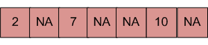
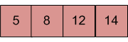
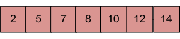

# Merge an array of size 'n' into another array of size 'm+n'

**Problem Statement:**

There are two sorted arrays. First one is of size m+n containing only m elements. Another one is of size n and contains n elements. Merge these two arrays into the first array of size m+n such that the output is sorted.

**Input:** array with m+n elements (mPlusN[]).



Here, `NA` refers to value is not filled/available in array mPlusN[]. There should be `n` such array blocks.

**Input:** array with n elements (N[]).



**Output:**

N[] merged into mPlusN[] now looks this:



**Algorithm:**

```
Let first array be mPlusN[] and other array be N[]
1) Move m elements of mPlusN[] to end.
2) Start from nth element of mPlusN[] and 0th element of N[] and merge them 
    into mPlusN[].
```

**Implementation in Java:**

```
class MergeArrays 
{
    /* Function to move m elements at the end of array mPlusN[] */
    void moveToEnd(int mPlusN[], int size) 
    {
        int i, j = size - 1;
        for (i = size - 1; i >= 0; i--) 
        {
            if (mPlusN[i] != -1) 
            {
                mPlusN[j] = mPlusN[i];
                j--;
            }
        }
    }
 
    /* Merges array N[] of size n into array mPlusN[]
       of size m+n*/
    void merge(int mPlusN[], int N[], int m, int n) 
    {
        int i = n;
         
        /* Current index of i/p part of mPlusN[]*/
        int j = 0;
         
        /* Current index of N[]*/
        int k = 0;
         
        /* Current index of of output mPlusN[]*/
        while (k < (m + n)) 
        {
            /* Take an element from mPlusN[] if
            a) value of the picked element is smaller and we have
                not reached end of it
            b) We have reached end of N[] */
            if ((i < (m + n) && mPlusN[i] <= N[j]) || (j == n)) 
            {
                mPlusN[k] = mPlusN[i];
                k++;
                i++;
            } 
            else // Otherwise take element from N[]
            {
                mPlusN[k] = N[j];
                k++;
                j++;
            }
        }
    }
 
    /* Utility that prints out an array on a line */
    void printArray(int arr[], int size) 
    {
        int i;
        for (i = 0; i < size; i++) 
            System.out.print(arr[i] + " ");
 
        System.out.println("");
    }
 
    public static void main(String[] args) 
    {
        MergeArrays mergearray = new MergeArrays();
         
        /* Initialize arrays */
        int mPlusN[] = {2, 8, -1, -1, -1, 13, -1, 15, 20};
        int N[] = {5, 7, 9, 25};
        int n = N.length;
        int m = mPlusN.length - n;
 
        /*Move the m elements at the end of mPlusN*/
        mergearray.moveToEnd(mPlusN, m + n);
 
        /*Merge N[] into mPlusN[] */
        mergearray.merge(mPlusN, N, m, n);
 
        /* Print the resultant mPlusN */
        mergearray.printArray(mPlusN, m + n);
    }
}
```

**Output:**

```
2 5 7 8 9 13 15 20 25
```

**Time Complexity:** `O(m+n)`