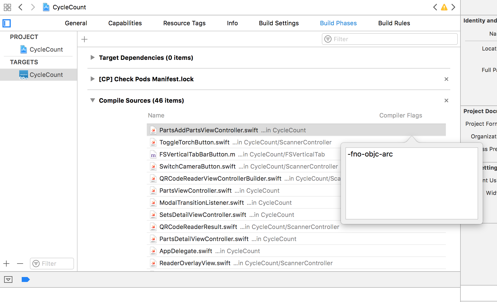
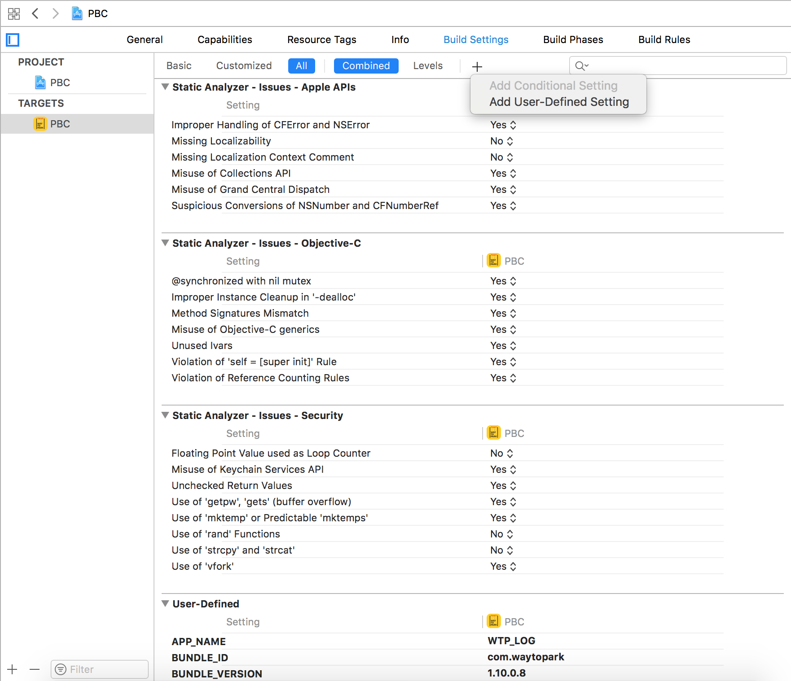
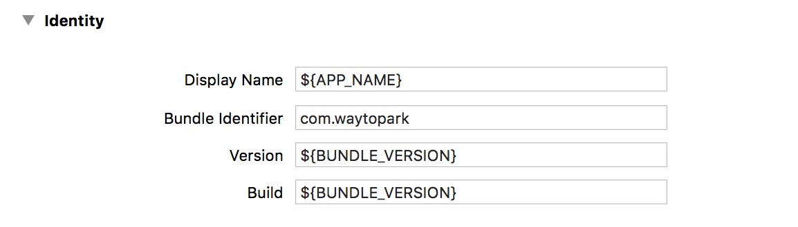
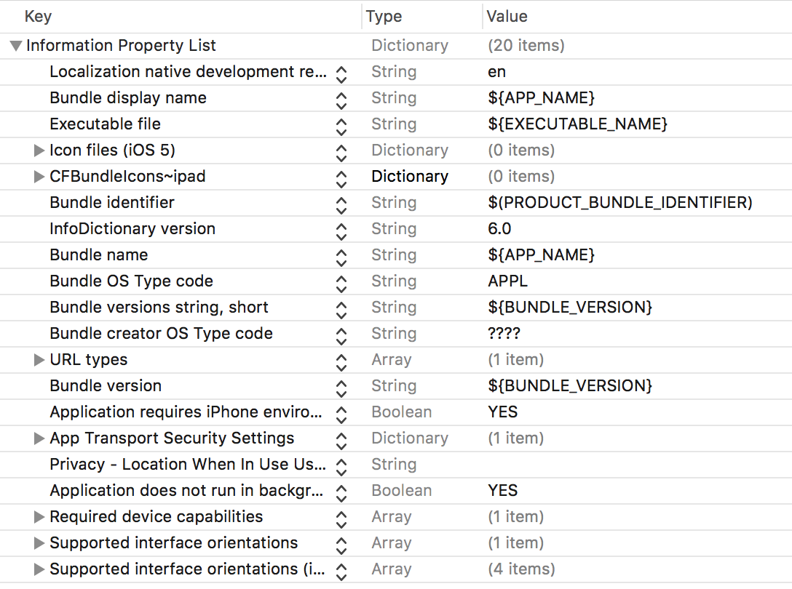

# How to set compiler flags
We can set compiler flags inside `Compiled Sources` section of project settings.

### what compiler flags you’ve used?

I used flags for:
- Disabling ARC
- Setting up BitCode
- “user defined” build settings

### How to disable ARC to specific set of files?

Go to Build Phases -> Complied Sources -> Double click the file -> `-fno-objc-arc`

### How can I add a custom setting under xcode-project setting & what is advantage of doing so?

We can add in a “user defined” section in build settings. Click on “+” option -> Add user defined settings.

### How to use ARC and non-ARC module together in the same project?

By setting ARC flags