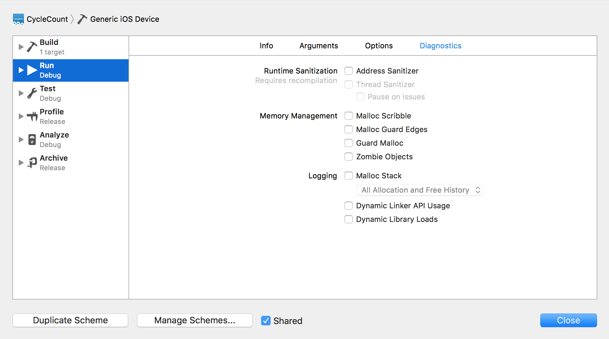
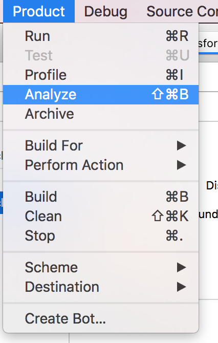
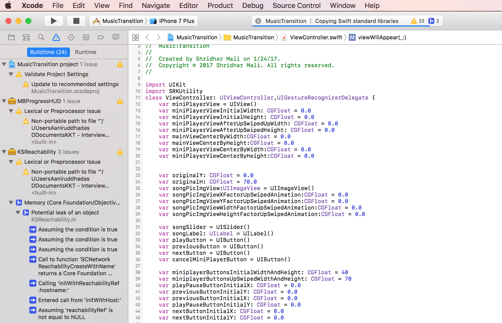

### What is Thread Sanitizer and Static analyser?

Thread Sanitizer is used to find memory leaks caused by threads in race condition due to improper synchronization for the same memory resource.

To turn thread santizer on, go to edit schemes:

In the `Requires Recompilation`, check the thread sanitizer option.

----

To turn on static analyzer for memory leaks, go to `Product -> Analyze`.

It shows warnings with blue symbols.

