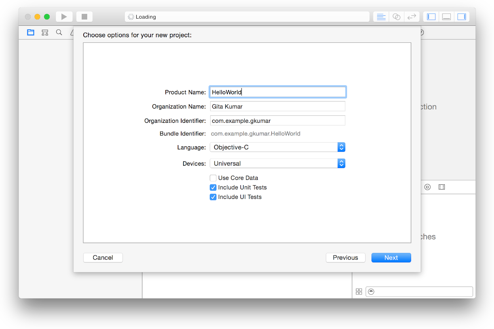

# Bundle Id VS App Id in iOS

### Bundle Id

* Your bundle ID can be found in Xcode and it identifies your app.

* For iOS apps, a dialog similar to this appears when you create an Xcode project from a template:

* The bundle identifier is an ID for your application used by the system as a domain for which it can store settings and reference your application uniquely. It is represented in reverse DNS notation and it is recommended that you use your company name and application name to create it.

* A bundle ID precisely identifies a single app. A bundle ID is used during the development process to provision devices and by the operating system when the app is distributed to customers. For example, Game Center and In-App Purchase use a bundle ID to identify your app when using these app services. The preferences system uses this string to identify the app for which a given preference applies. Similarly, Launch Services uses the bundle ID to locate an app capable of opening a particular file, using the first app it finds with the given identifier. The bundle ID is also used to validate an app’s signature.

* The bundle ID string must be a uniform type identifier (UTI) that contains only alphanumeric characters (A-Z,a-z,0-9), hyphen (-), and period (.). The string should be in reverse-DNS format. For example, if your organization’s domain is Acme.com and you create an app named Hello, you could assign the string com.Acme.Hello as your app’s bundle ID.

* During the development process, you use an app’s bundle ID in many different places to identify the app.

* Specifically, the bundle ID is located and used as follows:

	1. In the Xcode project, the bundle ID is stored in the information property list file (Info.plist). This file is later copied into your app’s bundle when you build the project.
	2. In iTunes Connect, you enter the bundle ID to identify your app. After your first build is uploaded to iTunes Connect, you can’t change your bundle ID or delete the associated explicit App ID.
	3. In your developer account, Xcode creates an App ID that matches the app’s bundle ID. If the App ID is an explicit App ID, it exactly matches the bundle ID. However, unlike domain names, bundle IDs are case sensitive. If the App ID is lowercase, your bundle ID needs to be lowercase, too.
	4. In iCloud, the container IDs you specify in your Xcode project are based on the bundle IDs of one or more apps.

### App Id

* Your App ID can be found in the apple developer center (it's used for provisioning profiles).

* An app ID is a string used to specify an app, or set of apps. An app ID's primary use is to specify which apps are authorized to be signed and launched. An app ID has two parts: the team ID followed by the bundle ID search string. The team ID is a 10-character string generated by Apple.

* An App ID is a two-part string used to identify one or more apps from a single development team. The string consists of a Team ID and a bundle ID search string, with a period (.) separating the two parts. The Team ID is supplied by Apple and is unique to a specific development team, while the bundle ID search string is supplied by you to match either the bundle ID of a single app or a set of bundle IDs for a group of your apps.

* There are two types of App IDs: an explicit App ID, used for a single app, and wildcard App IDs, used for a set of apps.

	1. An Explicit App ID Matches a Single App
For an explicit App ID to match an app, the Team ID in the App ID must equal the Team ID associated with the app, and the bundle ID search string must equal the bundle ID for the app. The bundle ID is a unique identifier that identifies a single app and cannot be used by other teams.

	2. Wildcard App IDs Match Multiple Apps
A wildcard App ID contains an asterisk as the last part of its bundle ID search string. The asterisk replaces some or all of the bundle ID in the search string.

