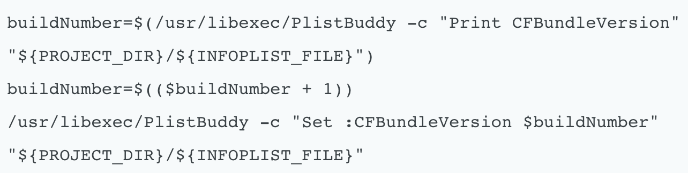
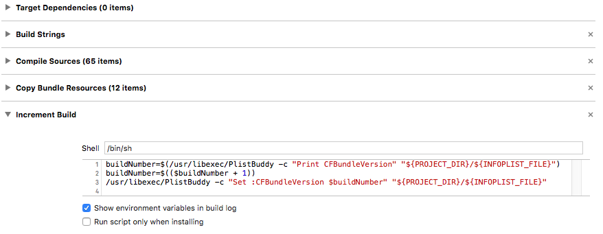
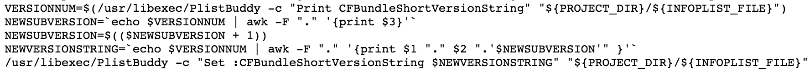
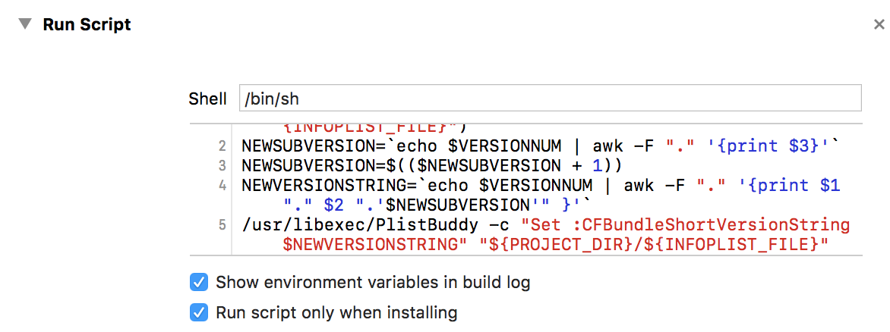
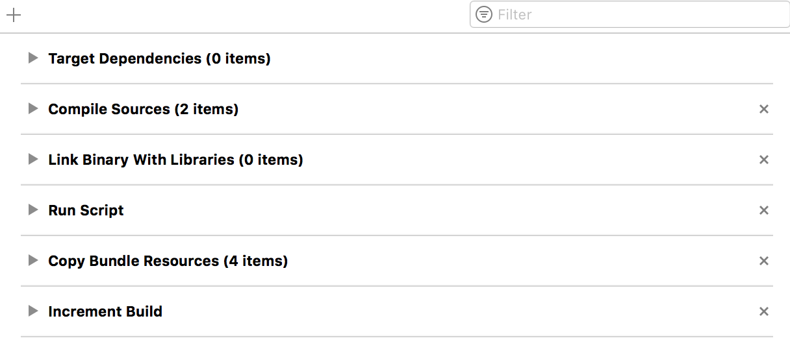

# Version Number VS Build Number in XCode Projects

iTunes use the build number as an identifier for your app. However, when you distribute people will only see the version number.

The new build number must be larger than the build number previously submitted. You can increment build number forever or put in the build number field as a combined build number + version number and reset the build number to 0. Example: ```version 1.0.0 , build number 1.0.0.100```, ```version 1.0.1 , build number 1.0.1.1```.

For example, Release 1.0.0 might be build 542. It means it took 542 builds to get to a 1.0.0 release.

Other developers, including Apple, have a Build number comprised of a major version + minor version + number of builds for the release. These are the actual software version numbers, as opposed to the values used for marketing.

* The marketing release number is for the customers, called ```version number```. It starts with 1.0 and goes up for major updates to 2.0, 3.0, for minor updates to 1.1, 1.2 and for bug fixes to 1.0.1, 1.0.2 . This number is oriented about releases and new features. It does not have to stop at 9, 1.11.23 is a reasonable version number.

```
let appVersionString: String = NSBundle.mainBundle().objectForInfoDictionaryKey("CFBundleShortVersionString") as! String
```

* The ```build number``` is mostly the internal number of builds that have been made until then. But some use other numbers like the branch number of the repository or its commit number. This number should be unique to distinguish the different builds, which only have minor incremental changes.

```
let buildNumber: String = NSBundle.mainBundle().objectForInfoDictionaryKey("CFBundleVersion") as! String
```

Many developers start the Build number at 0, and every time they build, they increase the number by one, increasing forever. In my projects, I have a script that automatically increases the build number every time I build. You can do the same for version number as well.

### Script to increase Build Number:


To use this script, follow these steps:

1. Select your app target in the project overview.
2. Select Build Phases.
3. Add a new build phase ("New Run Script Phase").
4. Enter the below script in the appropriate field.

5. In your Info.plist, ensure the current build number is numeric (e.g. 1).
6. Run the project.

### Script to increase Version Number:



To use this script, follow these steps:

1. Select: your Target in Xcode.
2. Select: Build Phases Tab.
3. Select: Add Build Phase -> Add Run Script.
4. Paste code below in to new "Run Script" section.
5. Check the checkbox "Run script only when installing".

6. Drag the "Run Script" below "Link Binaries With Libraries".

7. Insure your starting version number is in SemVer format (e.g. 1.0.0)
8. Run the app.