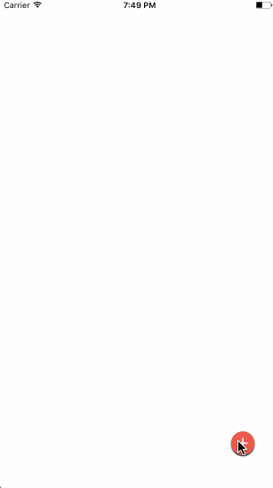

# ADBubbleMenu

### Introduction

It gives an animation with a bubble of menus.

### Requirements Specifications

```
1. Target OS: iOS

2. Supported OS Versions: iOS 9.0+

3. Written in: Swift

4. Supports: Swift 3.0

5. IDE: Xcode 8

6. Architectures Supported: armv7, armv7s, arm64

7. Supported devices: iPhone 5s, iPhone6 and above, and all iPads
```

### Install Guide

##### Using CocoaPods

Steps to add `ADBubbleMenu` iOS Component to your iOS Xcode project:

1. Install Cocoa Pods

	If you have already installed Cocoa Pods then you can skip this step.

	```
$ [sudo] gem install cocoapods
$ pod setup
	```

2. Install `ADBubbleMenu` pod

	Once Cocoa Pods has been installed, you can add `ADBubbleMenu` iOS Component to your project by adding a dependency entry to the Podfile in your project root directory.

	```
	target "YourAppName" do
		use_frameworks!
		pod 'ADBubbleMenu'
	end
	```

	This sample shows a minimal Podfile that you can use to add `ADBubbleMenu` iOS Component dependency to your project. 
You can include any other dependency as required by your project.

3. Now you can install the dependencies in your project:

	```
$ pod install
	```

4. Once you install a pod dependency in your project, make sure to always open the Xcode workspace instead of the project file when building your project:

	```
$ open YourAppName.xcworkspace
	```

5. Now you can import `ADBubbleMenu` in your source files:

	```swift
import ADBubbleMenu
	```

### Usage Guide

Make sure you have the necessary assets for menu icons. In my case, I am using the following assets.


In your `ViewController.swift`, write this:

```
import UIKit
import ADBubbleMenu

class ViewController: UIViewController {
    
    var upMenuView: ADBubbleMenuButton!

    override func viewDidLoad() {
        super.viewDidLoad()
        // Do any additional setup after loading the view, typically from a nib.
    }

    override func didReceiveMemoryWarning() {
        super.didReceiveMemoryWarning()
        // Dispose of any resources that can be recreated.
    }

    override func viewDidAppear(_ animated: Bool) {
        
        // Create up menu button
        if upMenuView == nil {
            
            let homeLabel2 =  self.createHomeButtonView()
            upMenuView = ADBubbleMenuButton(frame: CGRect(x: self.view.frame.size.width - homeLabel2.frame.size.width - 30.0, y: self.view.frame.size.height - homeLabel2.frame.size.height - 50.0,
                                                          width: homeLabel2.frame.size.width, height: homeLabel2.frame.size.height), expansionDirection: .directionUp)
            upMenuView.homeButtonView = homeLabel2
            upMenuView.addButtons(self.createDemoButtonArray())
            self.view.addSubview(upMenuView)
        }
    }
    
    func createHomeButtonView() -> UILabel {
        let label = UILabel(frame: CGRect(x: 0.0, y: 0.0, width: 40.0, height: 40.0))
        label.layer.cornerRadius = label.frame.size.height / 2.0
        let button = UIButton(frame: CGRect(x: 0.0, y: 0.0, width: 40.0, height: 40.0))
        button.layer.cornerRadius = button.frame.size.height / 2.0
        button.setBackgroundImage(UIImage(named: "fab_icon"), for: .normal)
        label.addSubview(button)
        return label
    }
    
    func createDemoButtonArray() -> [UIButton] {
        var buttons: [UIButton]=[]
        var i = 0
        for str in ["help screen_mail_icon", "help screen_call_icon"] {
            let button: UIButton = UIButton(type: UIButtonType.custom)
            button.setBackgroundImage(UIImage(named: str), for: .normal)
            button.frame = CGRect(x: 0.0, y: 0.0, width: 40.0, height: 40.0)
            button.contentMode = .scaleAspectFit
            button.layer.cornerRadius = button.frame.size.height / 2.0
            i += 1
            button.tag = i
            button.addTarget(self, action: #selector(self.buttonTap(_:)), for: UIControlEvents.touchUpInside)
            buttons.append(button)
        }
        return buttons
    }
    
    func buttonTap(_ sender: UIButton) {
        switch sender.tag {
        case 1:
            print("Mail Pressed")
        case 2:
            print("Call Pressed")
        default: break
            
        }
    }

}
```
    
### Output

