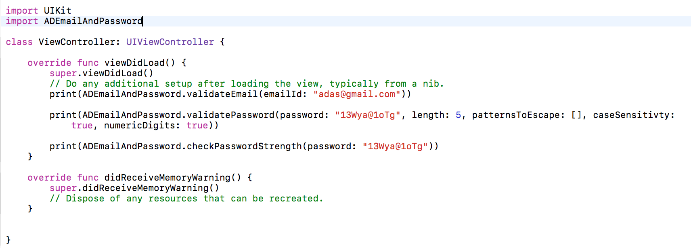

# ADEmailAndPassword

### Introduction

This component helps to validate Email and Password, and also check password strength.

### Requirements Specifications

```
1. Target OS: iOS

2. Supported OS Versions: iOS 9.0+

3. Written in: Swift

4. Supports: Swift 3.0

5. IDE: Xcode 8

6. Architectures Supported: armv7, armv7s, arm64

7. Supported devices: iPhone 5s, iPhone6 and above, and all iPads
```

### Install Guide

##### Using CocoaPods

Steps to add `ADEmailAndPassword` iOS Component to your iOS Xcode project:

1. Install Cocoa Pods

	If you have already installed Cocoa Pods then you can skip this step.

	```
$ [sudo] gem install cocoapods
$ pod setup
	```

2. Install `ADEmailAndPassword ` pod

	Once Cocoa Pods has been installed, you can add `ADEmailAndPassword ` iOS Component to your project by adding a dependency entry to the Podfile in your project root directory.

	```
	target "YourAppName" do
		use_frameworks!
		pod 'ADEmailAndPassword'
	end
	```

	This sample shows a minimal Podfile that you can use to add `ADEmailAndPassword ` iOS Component dependency to your project. 
You can include any other dependency as required by your project.

3. Now you can install the dependencies in your project:

	```
$ pod install
	```

4. Once you install a pod dependency in your project, make sure to always open the Xcode workspace instead of the project file when building your project:

	```
$ open YourAppName.xcworkspace
	```

5. Now you can import `ADEmailAndPassword` in your source files:

	```swift
import ADEmailAndPassword
	```
	
##### Using Carthage

Steps to add `ADEmailAndPassword` iOS Component to your iOS Xcode project:

1. Install Carthage

	If you have already installed Carthage then you can skip this step.

	```
$ brew update
$ brew install carthage
	```

2. Create `Cartfile`

	Create this file inside your project folder.

	```
vi Cartfile
	```
	
3. Inside the `Cartfile`, write:

	```
github "AnirudhDas/ADEmailAndPassword"
	```
	
	Then run ```carthage update``` to build the framework and drag the built ```ADEmailAndPassword.framework``` into your Xcode project.
	
	
### Usage Guide
	
