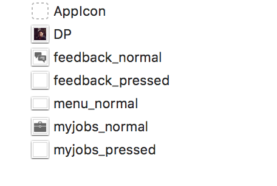

# ADSlidePanels
It shows a sliding menu, which is customizable. You can also display the user pic at the top.

### Requirements Specifications

```
1. Target OS: iOS

2. Supported OS Versions: iOS 9.0+

3. Written in: Swift

4. Supports: Swift 3.0

5. IDE: Xcode 8

6. Architectures Supported: armv7, armv7s, arm64

7. Supported devices: iPhone 5s, iPhone6 and above, and all iPads
```

### Install Guide

##### Using CocoaPods

Steps to add `ADSlidePanels ` iOS Component to your iOS Xcode project:

1. Install Cocoa Pods

	If you have already installed Cocoa Pods then you can skip this step.

	```
$ [sudo] gem install cocoapods
$ pod setup
	```

2. Install `ADSlidePanels` pod

	Once Cocoa Pods has been installed, you can add `ADSlidePanels ` iOS Component to your project by adding a dependency entry to the Podfile in your project root directory.

	```
	target "YourAppName" do
		use_frameworks!
		pod 'ADSlidePanels'
	end
	```

	This sample shows a minimal Podfile that you can use to add `ADSlidePanels ` iOS Component dependency to your project. 
You can include any other dependency as required by your project.

3. Now you can install the dependencies in your project:

	```
$ pod install
	```

4. Once you install a pod dependency in your project, make sure to always open the Xcode workspace instead of the project file when building your project:

	```
$ open YourAppName.xcworkspace
	```

5. Now you can import `ADSlidePanels` in your source files:

	```swift
import ADSlidePanels
	```
	
### Usage Guide

**Step 1.**

Embed your view controller in a navigation view controller from the storyboard. To do this, `Editor -> Embed In -> Navigation Controller`.

**Step 2.**

Make sure you add a few necessary assets for the menus.



**Step 3.**

Inside your `ViewController.swift`, write this:

```
import UIKit
import ADSlidePanels

class ViewController: UIViewController, ADSlidePanelViewDelegate {

     var slideView: ADSlidePanelView?
    
    override func viewDidLoad() {
        super.viewDidLoad()
        // Do any additional setup after loading the view, typically from a nib.
        self.addSidePanel()
        self.leftBarButton()
    }

    override func didReceiveMemoryWarning() {
        super.didReceiveMemoryWarning()
        // Dispose of any resources that can be recreated.
    }
    
    func leftBarButton() {
        var leftBarButtons = [UIBarButtonItem]()
        let barButtonItem = UIBarButtonItem.init(image: UIImage(named: "menu_normal"), style: UIBarButtonItemStyle.plain, target: self, action: #selector(self.menuButtonTapped))
        leftBarButtons.append(barButtonItem)
        if leftBarButtons.count > 0 {
            self.navigationItem.leftBarButtonItems = leftBarButtons
        }
        let backButton = UIBarButtonItem(title: "Back", style: .plain, target: self, action: nil)
        self.navigationItem.backBarButtonItem = backButton
    }
    
    func menuButtonTapped() {
        self.showSidePanel()
    }
    
    func addSidePanel() {
        if self.slideView != nil {
            self.slideView?.removeFromSuperview()
            self.slideView = nil
        }
        
        let contents = self.sidePanelContents()
        self.slideView = ADSlidePanelView.initMenuView(contents, slideDirection: .left, delegate: self)
        self.slideView?.isHidden = true
        self.slideView?.backGroundColor = UIColor.white
        self.slideView?.separatorColor = UIColor.init(colorLiteralRed: 86.0/255.0, green: 119.0/255.0, blue: 133.0/255.0, alpha: 1.0)
        self.slideView?.separatorType = UITableViewCellSeparatorStyle.singleLine
        self.slideView?.transparentViewMargin = 120
        self.view.addSubview(self.slideView!)
        self.slideView?.setupInitialConstraintWRTView(self.view, containerView: nil)
    }
    
    func sidePanelContents() -> [Item] {
        var sideContents = [Item]()
        let item1 = Item.init(title: "Feedback", iconName: "feedback", isSelected: false)
        sideContents.append(item1)
        let item2 = Item.init(title: "My Job", iconName: "myjobs", isSelected: false)
        sideContents.append(item2)
        
        return sideContents
    }
    
    
    func showSidePanel() {
        self.slideView?.lblUserName.text = "Aniruddha Das"
        self.slideView?.userIView.image = UIImage(named: "DP")
        self.slideView?.menuTView.reloadData()
        self.slideView?.showSidePanelWithoutSlideEffectOnSuperView()
    }
    
    func removeSidePanel() {
        self.slideView?.removeSidePanelWithoutSlideEffectOnSuperView()
    }
    
    override func touchesBegan(_ touches: Set<UITouch>, with event: UIEvent?) {
        self.removeSidePanel()
    }
    
    func didSelectItem(_ item: Item) {
        
        if item.title.caseInsensitiveCompare("Feedback") == ComparisonResult.orderedSame {
            
        } else if item.title.caseInsensitiveCompare("My Jobs") == ComparisonResult.orderedSame {
            
        }
        
        self.removeSidePanel()
    }

}
```

### Note:

You can set the different properties of ADSlidePanels like `backGroundColor`, `separatorColor `, `separatorType `, `transparentViewMargin ` etc., if you need to customize it, otherwise it will take default values.

### Output:

 
