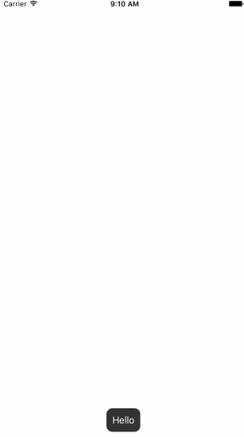

# ADToast

### Introduction

It displays a message in Toast style, with an Android-like effect.

### Requirements Specifications

```
1. Target OS: iOS

2. Supported OS Versions: iOS 9.0+

3. Written in: Swift

4. Supports: Swift 3.0

5. IDE: Xcode 8

6. Architectures Supported: armv7, armv7s, arm64

7. Supported devices: iPhone 5s, iPhone6 and above, and all iPads
```

### Install Guide

##### Using CocoaPods

Steps to add `ADToast` iOS Component to your iOS Xcode project:

1. Install Cocoa Pods

	If you have already installed Cocoa Pods then you can skip this step.

	```
$ [sudo] gem install cocoapods
$ pod setup
	```

2. Install `ADToast` pod

	Once Cocoa Pods has been installed, you can add `ADToast` iOS Component to your project by adding a dependency entry to the Podfile in your project root directory.

	```
	target "YourAppName" do
		use_frameworks!
		pod 'ADToast'
	end
	```

	This sample shows a minimal Podfile that you can use to add `ADToast ` iOS Component dependency to your project. 
You can include any other dependency as required by your project.

3. Now you can install the dependencies in your project:

	```
$ pod install
	```

4. Once you install a pod dependency in your project, make sure to always open the Xcode workspace instead of the project file when building your project:

	```
$ open YourAppName.xcworkspace
	```

5. Now you can import `ADToast` in your source files:

	```swift
import ADToast
	```

### Usage Guide

```
import UIKit
import ADToast

class ViewController: UIViewController {

    override func viewDidLoad() {
        super.viewDidLoad()
        // Do any additional setup after loading the view, typically from a nib.
        //self.view.makeToast("Hello") //By default, the duration is 3.0 ms and position is bottom
        self.view.makeToast("Hello", duration: 5.0, position: .bottom)
    }

    override func didReceiveMemoryWarning() {
        super.didReceiveMemoryWarning()
        // Dispose of any resources that can be recreated.
    }


}
```

**Parameters:**

- message - a string that you want to display
- duration - in milliseconds
- position - top, center or bottom
    
### Output

