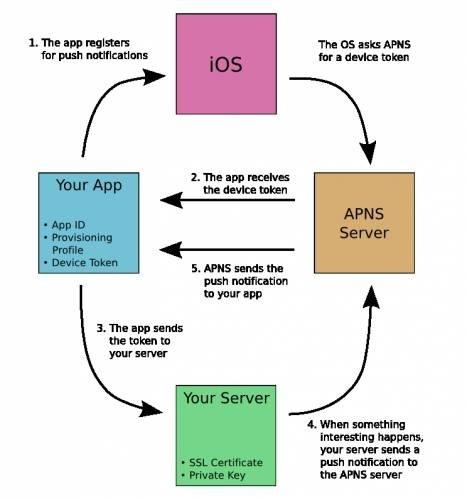

# How does Apple Push Notification Services (APNS) work?

### Flow chart



### Explaination

- Create App Id/Bundle Id
- Create Provisioning Profile which is configured with Push Notification Services, and install it into KeyChain
- Create a .CSR (Code Signing Request) file using Key Chain Access, where the provisioning certificate is installed
- Create SSL Certificates (Development and Distribution/Production) with this App Id, using .CSR file
- The SSL certificate has a private and public key
- Extract the .p12 (Personal Information Exchange) file
- We can convert .p12 to .pem (privacy enhanced mail) format
- We provide this .pem file to our own server
- The server can now send push notifications to all registered devices
- We now implement ```applicationDidRegisterForDeviceToken``` in ```AppDelegate```. Using this method, the device sends a request to APNS server to register for a device token. This request is send only once, during the first time when the app is installed and run.
- We receive a 64-bit device token from APNS. This token is then stored inside the device for further use. We can now register our device to our own server, using this device token.
- We can read the notification message in the method ```applicationDidReceiveRemoteNotifications```. It receives the message in form of a dictionary.
- The server doesn't send data directly to devices. It uses the .pem file to identify which devices to send data. It then sends the data to APNS server, and the APNS server in turn sends the data to devices.

### How many bytes we can send to apple push notification server (Remote Notification Length)?

1. For regular remote notifications, the maximum size is 4KB (4096 bytes)
2. For Voice over Internet Protocol (VoIP) notifications, the maximum size is 5KB (5120 bytes)
3. If you are using the legacy APNs binary interface to send notifications instead of an HTTP/2 request, the maximum payload size is 2KB (2048 bytes)

### If internet connection set to off, does APNS provides us device token in this condition? If yes, how?

For the first time, the device needs internet connection to send request to APNS server for device token. This token is then stored inside the device for further use. Next time onwards, it doesn't request again. So internet connection is not required.

### Steps

1. [Register for Push notification](http://sagarrkothari.com/projects/publicwikipages/wiki/Register_for_push_notification_on_iOS_10_or_below)
2. [Generating P12 file and certificates](http://sagarrkothari.com/projects/publicwikipages/wiki/Generating_p12_file_for_Google_Cloud_messaging)

### Refer

1. [Raywenderlich Article on Push Notifications](https://www.raywenderlich.com/123862/push-notifications-tutorial)
2. [More about APNS](http://sagarrkothari.com/projects/publicwikipages/wiki/Apple_Push_notification)

### Note

1. These steps have been made much easier using ```Firebase Push Notifications```.
2. There is no guarantee that we will receive a message using APNS. It may have delay or may get discarded. So, it is uncertain.