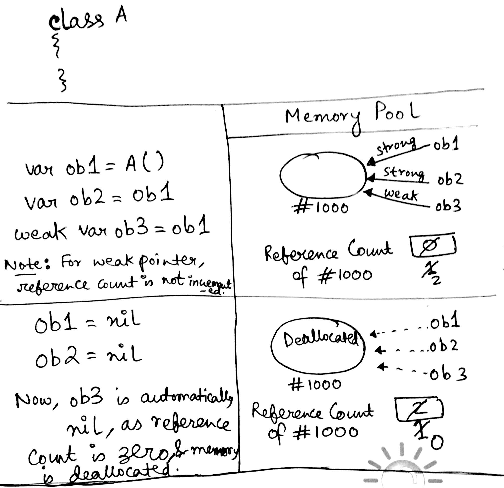
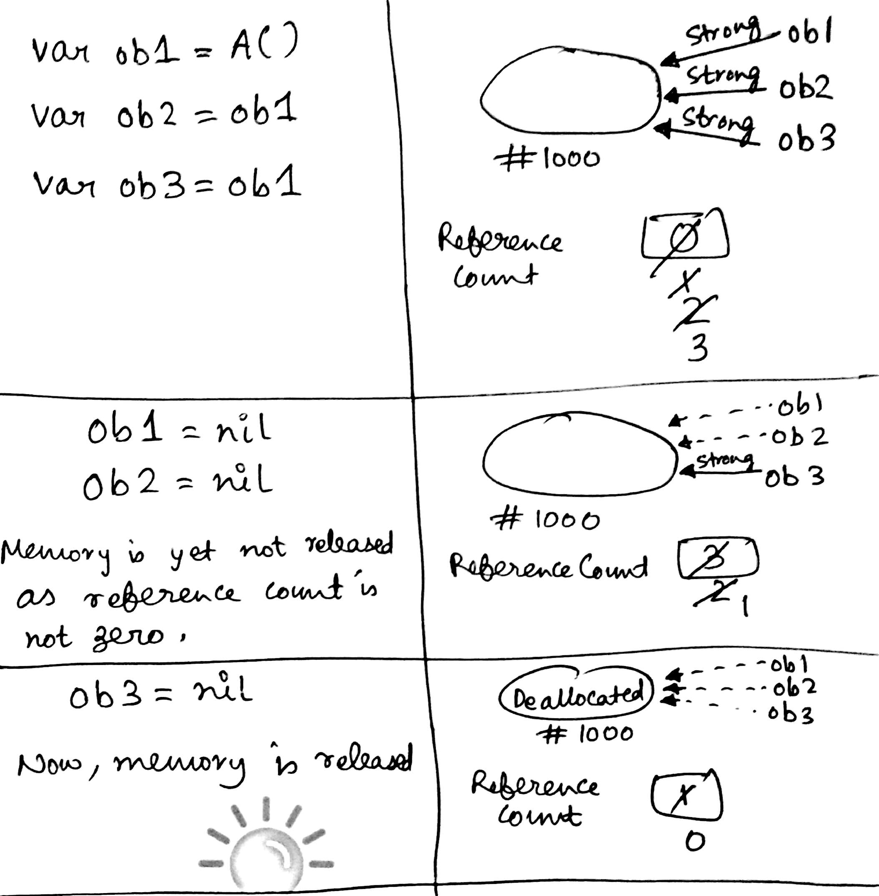

# Automatic Reference Counting (Memory Management in Swift)

`Automatic Reference Counting (ARC)` is one of the abstractions over managing memory. It’s the methodology Apple employs to free up memory when class instances are finished using it.

ARC **only applies to classes (not structs or enums)**, because Automatic Reference Counting applies only to `Reference Types`. Structs & Enums are value Types; So ARC does not manage the memory associated with instances of those types.

### How ARC works?

Every time you create a new instance of a class, ARC allocates a chunk of memory to store information about that instance. This memory holds information about the type of the instance, together with the values of any stored properties associated with that instance.

Additionally, when an instance is no longer needed, ARC frees up the memory used by that instance so that the memory can be used for other purposes instead. This ensures that class instances do not take up space in memory when they are no longer needed.

However, if ARC were to deallocate an instance that was still in use, it would no longer be possible to access that instance’s properties, or call that instance’s methods. Indeed, if you tried to access the instance, your app would most likely crash.

To make sure that instances don’t disappear while they are still needed, ARC tracks how many properties, constants, and variables are currently referring to each class instance. ARC will not deallocate an instance as long as at least one active reference to that instance still exists.

To make this possible, whenever you assign a class instance to a property, constant, or variable, that property, constant, or variable makes a strong reference to the instance. The reference is called a “strong” reference because it keeps a firm hold on that instance, and does not allow it to be deallocated for as long as that strong reference remains.

### Examples:

Here, `ob3` has a weak reference to the object at memory address `1000`.

----

Here, `ob3` has a strong reference to the object at memory address `1000`.

----

ARC only maintains **reference counts** for `strong type references`, `not weak or unowned types`. It keeps a memory for an object only till there is atleast one strong reference to it, i.e. the reference count is atleast `1`.

Whenever the reference count becomes zero, it deallocates the memory for the object.

### Refer

[Apple Documentation on ARC](https://developer.apple.com/library/content/documentation/Swift/Conceptual/Swift_Programming_Language/AutomaticReferenceCounting.html)