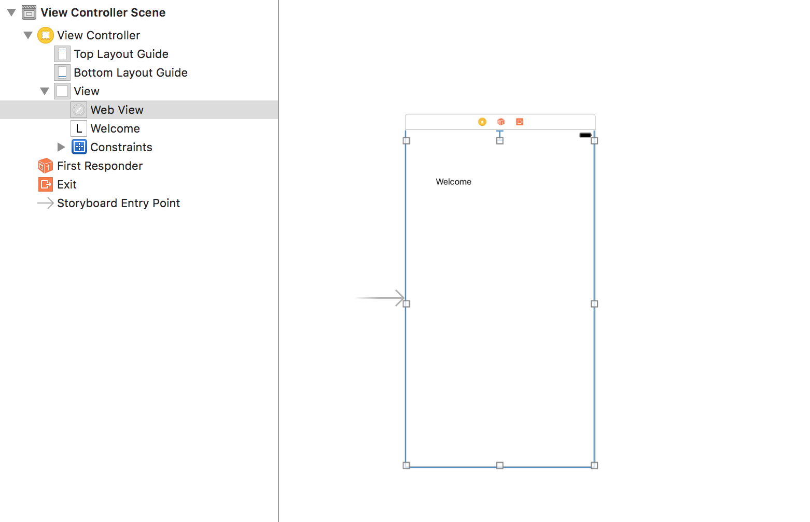
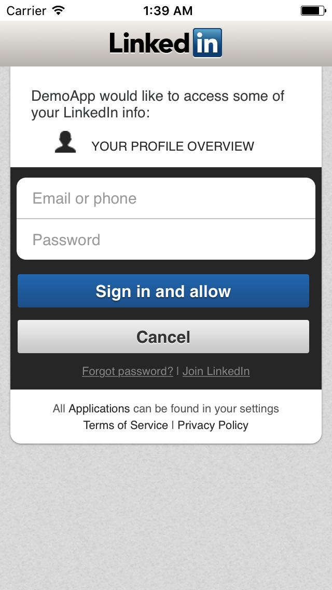

# Authorizing using LinkedIn Sign-In

Create a project `LinkedInAuth`.

Register your app in LinkedIn Developer Console.

You get a `client_key` and a `secret_key` after the registration.

In your storyboard, add a WebView and a Label over the ViewController.



**Note:** The Label is not added as a subview of the WebView.

Inside the `ViewController.swift`, write:

```
import UIKit

class ViewController: UIViewController, UIWebViewDelegate {
    
    let linkedInKey = "81jgffhfdjhgdfsjfk9" // Get after create app on developer linkedin
    let linkedInSecret = "NjGfgdhdhfjfudjdjhIFA" // Get after create app on developer linkedin
    
    @IBOutlet weak var webView: UIWebView!
    
    // keep as it is
    let authorizationEndPoint = "https://www.linkedin.com/uas/oauth2/authorization"
    let accessTokenEndPoint = "https://www.linkedin.com/uas/oauth2/accessToken"
    override func viewDidLoad() {
        super.viewDidLoad()
        // Do any additional setup after loading the view, typically from a nib.
        startAuthorization()
    }
    override func viewWillAppear(_ animated: Bool) {
        super.viewWillAppear(animated)
        checkForExistingAccessToken()
    }
    func checkForExistingAccessToken() {
        if UserDefaults.standard.object(forKey: "LIAccessToken") != nil {
            self.webView.isHidden = true
            self.getProfileInfo()
        } else {
            self.webView.isHidden = false
        }
    }
    func startAuthorization() {
        // Specify the response type which should always be "code".
        let responseType = "code"
        // Set the redirect URL. Adding the percent escape characthers is necessary.
        let redirectURL: String? = "https://com.altimetrik.linkedin.oauth/oauth".addingPercentEncoding(withAllowedCharacters: .alphanumerics)
        // stringByAddingPercentEncodingWithAllowedCharacters(NSCharacterSet.alphanumericCharacterSet())!
        
        // Create a random string based on the time interval (it will be in the form linkedin12345679).
        let state = "linkedin\(Int(NSDate().timeIntervalSince1970))"
        
        // Set preferred scope.
        let scope = "r_basicprofile"
        
        // Create the authorization URL string.
        var authorizationURL = "\(authorizationEndPoint)?"
        authorizationURL += "response_type=\(responseType)&"
        authorizationURL += "client_id=\(linkedInKey)&"
        authorizationURL += "redirect_uri=\(redirectURL!)&"
        authorizationURL += "state=\(state)&"
        authorizationURL += "scope=\(scope)"
        
        //print(authorizationURL)
        let url = URL(string: authorizationURL)
        //print("url is:\(url)")
        let request = URLRequest(url: url!)
        self.webView.delegate = self
        self.view.addSubview(webView)
        self.webView.loadRequest(request)
        
    }
    override func didReceiveMemoryWarning() {
        super.didReceiveMemoryWarning()
        // Dispose of any resources that can be recreated.
    }
    func webView(_ webView: UIWebView, shouldStartLoadWith request: URLRequest, navigationType: UIWebViewNavigationType) -> Bool {
        let url = request.url!
        //print(url)
        
        if url.host == "com.altimetrik.linkedin.oauth" {
            if let _ = url.absoluteString.range(of: "code") {
                let urlPatrs = url.absoluteString.components(separatedBy: "?")
                let code = urlPatrs[1].components(separatedBy: "=")[1]
                //print("code is:\(code)")
                requestForAccessToken(authorizationCode: code)
            } else {
                // Error problem getting code show msg here 
            }
        }
        
        return true
    }
    
    func requestForAccessToken(authorizationCode: String) {
        let grantType = "authorization_code"
        let redirectURL = "https://com.altimetrik.linkedin.oauth/oauth".addingPercentEncoding(withAllowedCharacters:CharacterSet.alphanumerics)
        // Set the POST parameters.
        var postParams = "grant_type=\(grantType)&"
        postParams += "code=\(authorizationCode)&"
        postParams += "redirect_uri=\(redirectURL!)&"
        postParams += "client_id=\(linkedInKey)&"
        postParams += "client_secret=\(linkedInSecret)"
        let postData = postParams.data(using: String.Encoding.utf8)
        // Initialize a mutable URL request object using the access token endpoint URL string.
        var request = URLRequest(url: URL(string: accessTokenEndPoint)! as URL)
        // Indicate that we're about to make a POST request.
        request.httpMethod = "POST"
        // Set the HTTP body using the postData object created above.
        request.httpBody = postData
        // Add the required HTTP header field.
        request.addValue("application/x-www-form-urlencoded;", forHTTPHeaderField: "Content-Type")
        // Initialize a NSURLSession object.
        let session = URLSession(configuration: URLSessionConfiguration.default)
        
        // Make the request.
        let task: URLSessionDataTask = session.dataTask(with: request) { (data, response, error) -> Void in
            
            // Get the HTTP status code of the request.
            let statusCode = (response as! HTTPURLResponse).statusCode
            
            if statusCode == 200 {
                // Convert the received JSON data into a dictionary.
                do {
                    let dataDictionary = try JSONSerialization.jsonObject(with: data!, options: .mutableContainers) as? [String: AnyObject]
                    let accessToken = dataDictionary?["access_token"] as! String
                    UserDefaults.standard.set(accessToken, forKey: "LIAccessToken")
                    UserDefaults.standard.synchronize()
                    
                    let queue = DispatchQueue.main
                    queue.async {
                        self.getProfileInfo()
                    }
                }
                catch {
                    print("Could not convert JSON data into a dictionary.")
                }
            }
        }
        task.resume()
    }
    
    func getProfileInfo() {
        if let accessToken = UserDefaults.standard.object(forKey:"LIAccessToken") {
            // Specify the URL string that we'll get the profile info from.
            let targetURLString = "https://api.linkedin.com/v1/people/~?format=json"
            
            var request = URLRequest(url: URL(string: targetURLString)! as URL)
            // Indicate that we're about to make a POST request.
            request.httpMethod = "GET"
            
            request.addValue("Bearer \(accessToken)", forHTTPHeaderField: "Authorization")
            
            // Initialize a NSURLSession object.
            let session = URLSession(configuration: URLSessionConfiguration.default)
            
            // Make the request.
            let task: URLSessionDataTask = session.dataTask(with: request) { (data, response, error) -> Void in
                
                // Get the HTTP status code of the request.
                let statusCode = (response as! HTTPURLResponse).statusCode
                
                if statusCode == 200 {
                    // Convert the received JSON data into a dictionary.
                    do {
                        let dataDictionary = try JSONSerialization.jsonObject(with: data!, options: .mutableContainers) as? [String: AnyObject]
                        print("Info \(dataDictionary)")
                        let firstName = dataDictionary?["firstName"] as Any
                        print(firstName)
                        let lastName = dataDictionary?["lastName"] as Any
                        print(lastName)
                        let url = dataDictionary?["url"] as Any
                        print(url)
                        let queue = DispatchQueue.main
                        queue.async {
                            self.webView.removeFromSuperview()
                        }
                    } catch {
                        
                    }
                }
            }
            task.resume()
        }
    }
}
```

### Output



