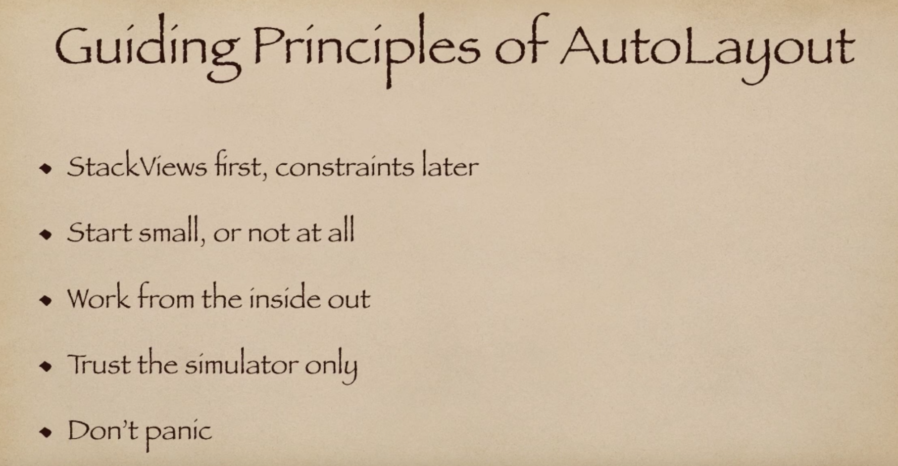
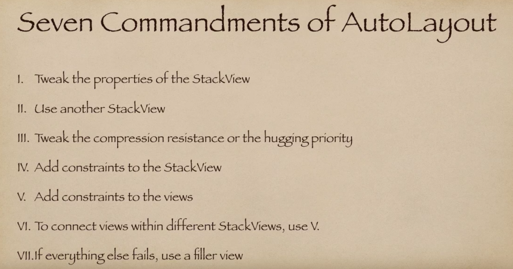
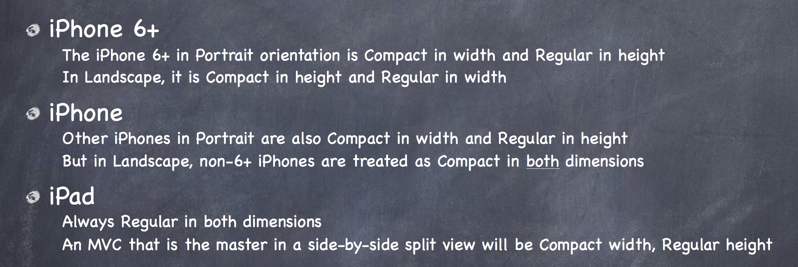
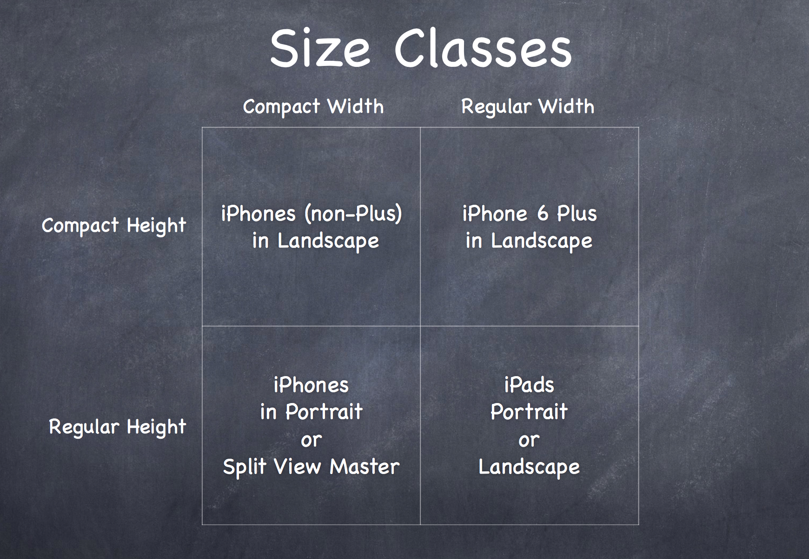
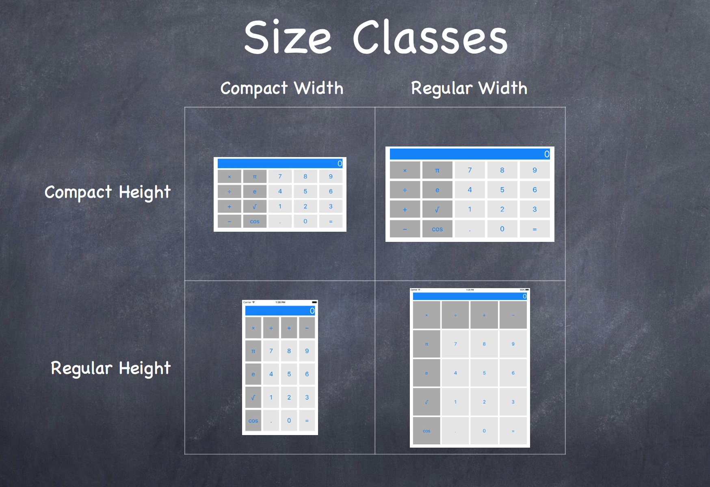
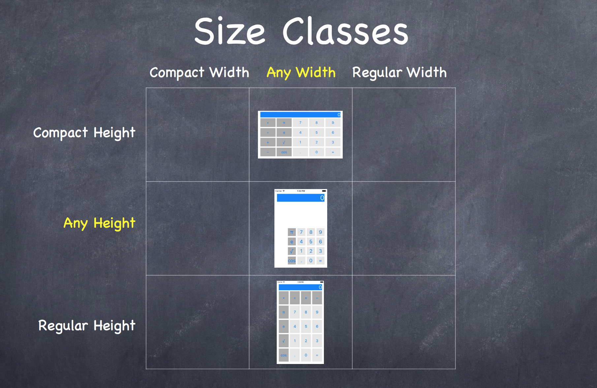

# Auto Layout and Size Classes

### What is Auto Layout?

Auto layout is a constraint-based layout system, where we can set `Leading`, `Trailing`, `Top`, `Bottom`, `Height` and `Width` to some element or control in interface builder.

It can be achieved using 3 ways:

1. NSLayoutConstraints (programatically)
2. Creating constraints in Interface Builder
3. StackViews

**Things to remember:**

**Why AutoLayout is not enough?**

Sometimes rotation of the device changes the geometry so drastically that autolayout is not enough. You actually need to reposition the views to make them fit properly in both Potrait and Landspace mode.

**The solution?**

Size Classes

### What are Size Classes and Adaptive Classes?

Size Classes are **different height-width environments where view controllers reside for different screen sizes**.

There are 5 types of Size Classes:

 - Regular Height and Regular Width = iPad Portrait 
 - Regular Height and Regular Width = iPad Landscape
 - Regular Height and Compact Width = iPhone Portrait 
 - Compact Height and Compact Width = iPhone Landscape
 - Any Height and Any Width

Let's take the example of a calculator, which has 20 buttons.
In Landscape, it's better to have the buttons 5 across and 4 down and in Portrait, it's better to have them 4 across and 5 down.

### What is Adaptive UI in AutoLayout?

AutoLayouting provides Adaptive-UI to change constraints as per devices. It helps you to show the same content in different sized devices. In other words, adaptive UI refers to **Responsive UI Design**.