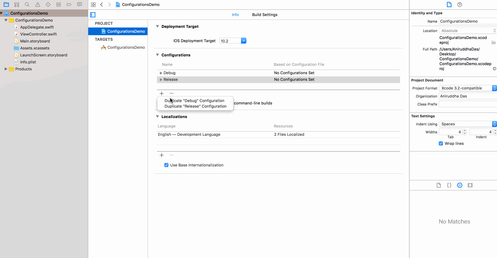
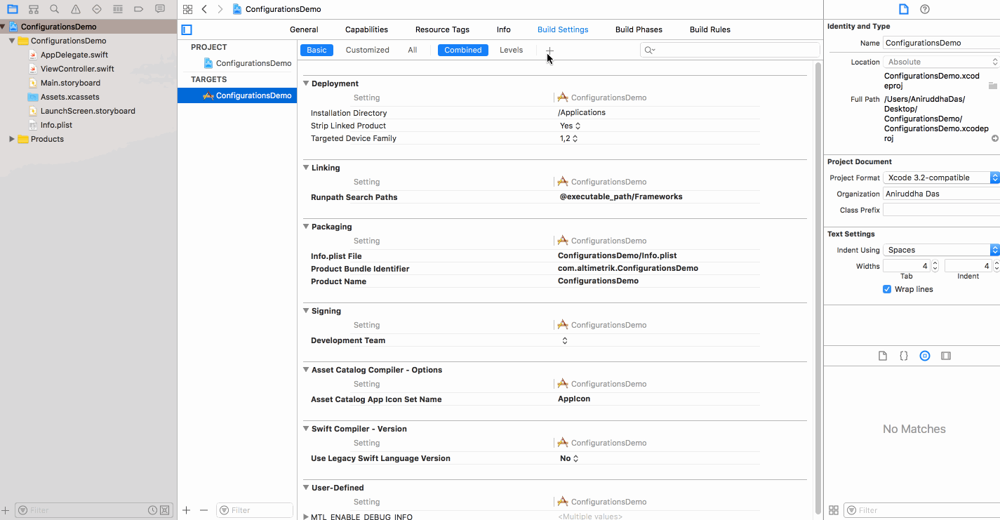
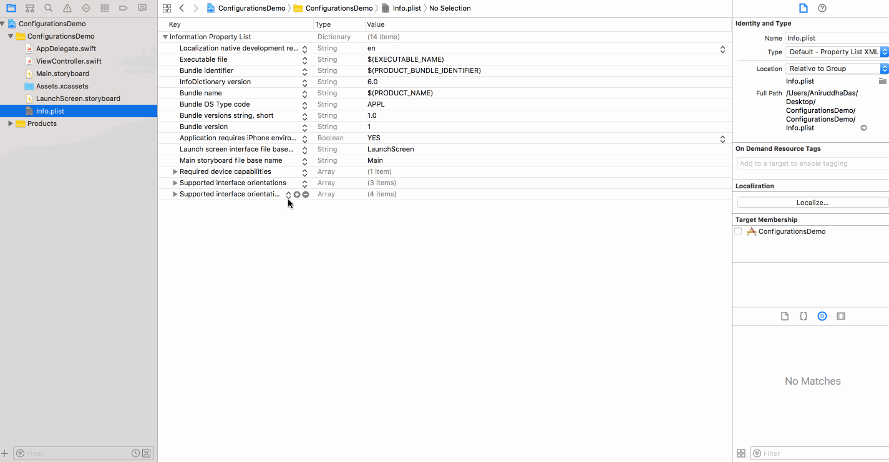
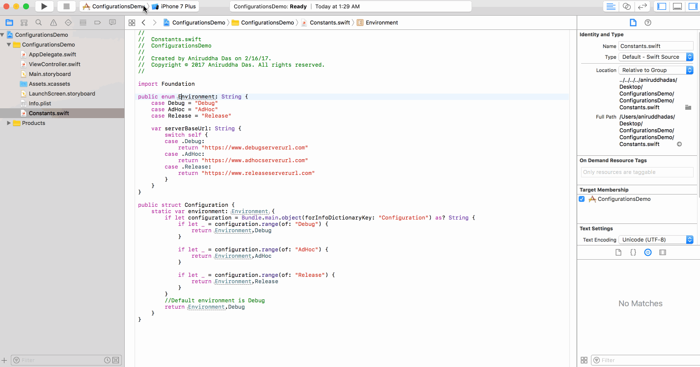
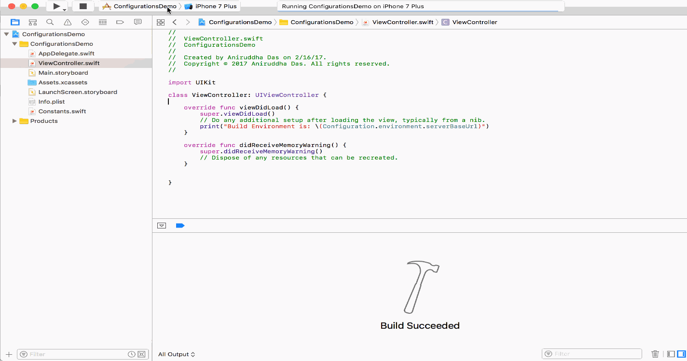

# Build Configurations

### Introduction

Often, as an iOS developer, you might find yourself working on an App that communicates with an API. This API might be an internal API built by the company you are working with so there are probably a few environments in the wild. This means that you will most likely be tasked with making builds that point at each one of these environments/endpoints.
What we don’t want to do is put these endpoints in our code so that every time we need to make a build pointing to a particular environment, we need to make a code change. If you want to be really helpful, you will allow those in your organisation to run these different builds concurrently. This means that testers can have their staging/dev/live builds installed on the same device at the same time.

Most mobile applications connect to one or more services in the cloud. The services you connect to can differ depending on the development phase the project is in. For example, you may be using a staging environment during development, a testing environment during beta testing, and a production environment for the App Store. Switching between environments can be cumbersome and prone to errors.

The best solution I have come across to do this are configurations, also known as build configurations. Configurations are defined at the project level, which means that you can use them for every target of your project and leverage schemes to define the configuration for a particular build.

Every Xcode project includes two default configurations, `Debug` and `Release`. For some projects, these configurations are sufficient. However, assume for a moment that you are building an application that interacts with a web service. The web service defines two environments, Staging and Production. Configurations can help you to quickly switch between these environments with very little effort.

So, whenever the environment changes, we do not need to make changes to the `base url` in our source code. We only need to change the build configuration from the Xcode and roll out another build to the testing team.

Another way is to enable this option in `Settings Bundle`. For this article, we will not focus in this method.

----

### Step 1

Create a project `ConfigurationsDemo`.

### Step 2



### Step 3



### Step 4



### Step 5

Create a swift file named `Constants.swift`. Inside it add:

```
import Foundation

public enum Environment: String {
    case Debug = "Debug"
    case AdHoc = "AdHoc"
    case Release = "Release"
    
    var serverBaseUrl: String {
        switch self {
        case .Debug:
            return "https://www.debugserverurl.com"
        case .AdHoc:
            return "https://www.adhocserverurl.com"
        case .Release:
            return "https://www.releaseserverurl.com"
        }
    }
}

public struct Configuration {
    static var environment: Environment {
        if let configuration = Bundle.main.object(forInfoDictionaryKey: "Configuration") as? String {
            if let _ = configuration.range(of: "Debug") {
                return Environment.Debug
            }
            
            if let _ = configuration.range(of: "AdHoc") {
                return Environment.AdHoc
            }
            
            if let _ = configuration.range(of: "Release") {
                return Environment.Release
            }
        }
        //Default environment is Debug
        return Environment.Debug
    }
}
```

### Step 6

Inside `ViewController.swift`, add:

```
import UIKit

class ViewController: UIViewController {

    override func viewDidLoad() {
        super.viewDidLoad()
        // Do any additional setup after loading the view, typically from a nib.
        print("Build Environment is: \(Configuration.environment.serverBaseUrl)")
    }

    override func didReceiveMemoryWarning() {
        super.didReceiveMemoryWarning()
        // Dispose of any resources that can be recreated.
    }
}
```

### Step 7



Make sure for `Debug` configuration, every settings is set to `Debug`. Similarly for `Release` configuration, every settings is set to `Release`, and for `AdHoc` configuration, every settings is set to `AdHoc`.

### Step 8

When we run the app by changing the build config each time, we see it switches the Base URL of the server accordingly.



### Refer

- [https://cocoacasts.com/switching-environments-with-configurations/](https://cocoacasts.com/switching-environments-with-configurations/)
- [https://medium.com/@danielgalasko/change-your-api-endpoint-environment-using-xcode-configurations-in-swift-c1ad2722200e#.2rqah7yk5](https://medium.com/@danielgalasko/change-your-api-endpoint-environment-using-xcode-configurations-in-swift-c1ad2722200e#.2rqah7yk5)