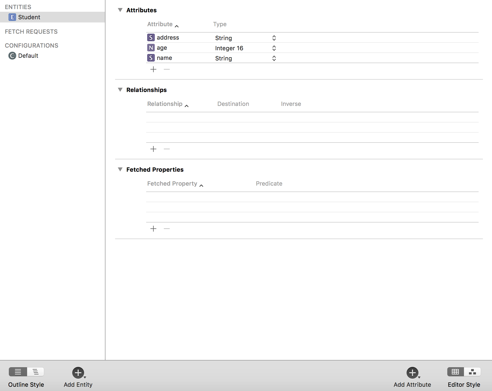
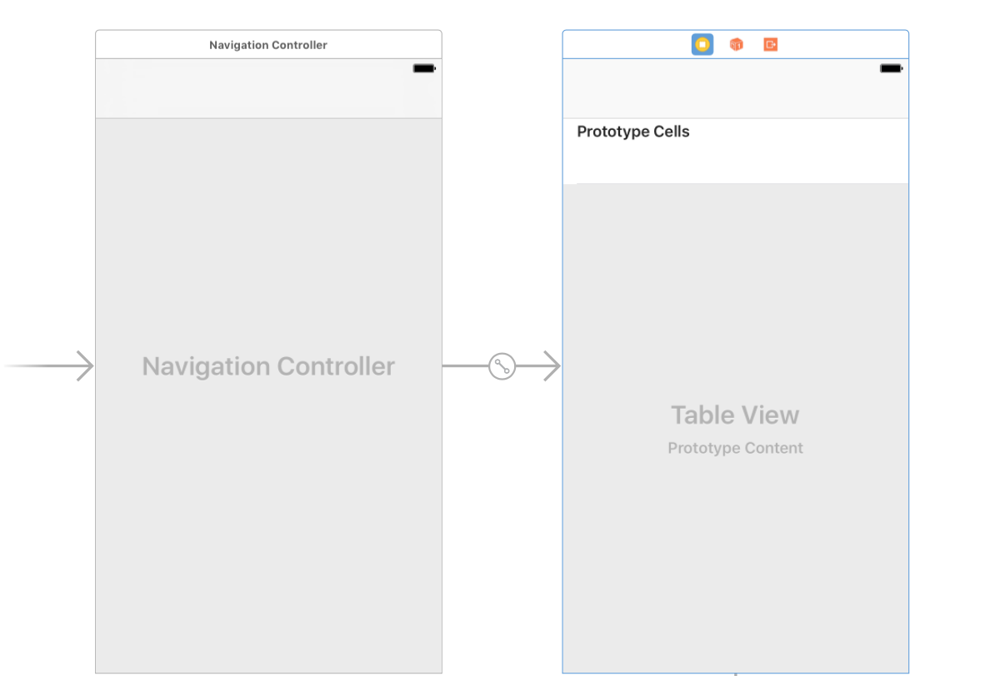
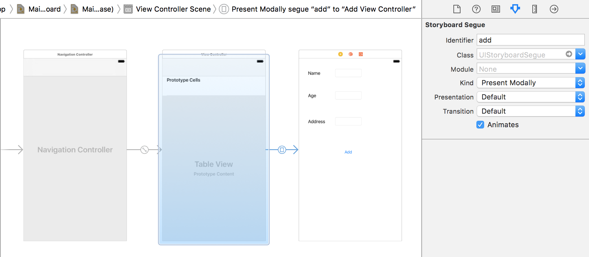
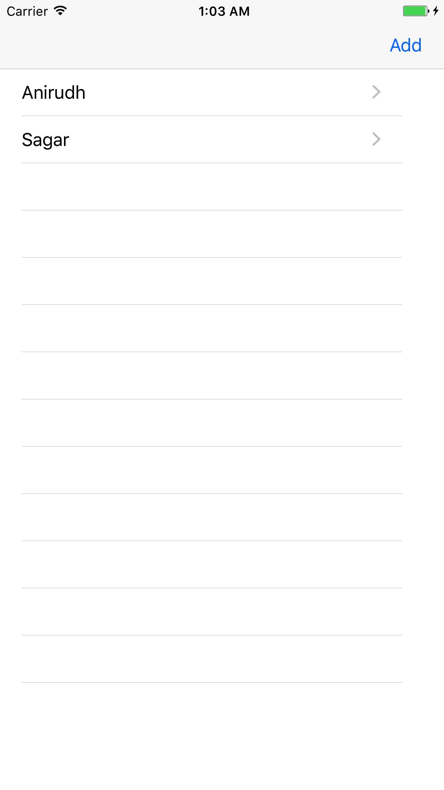
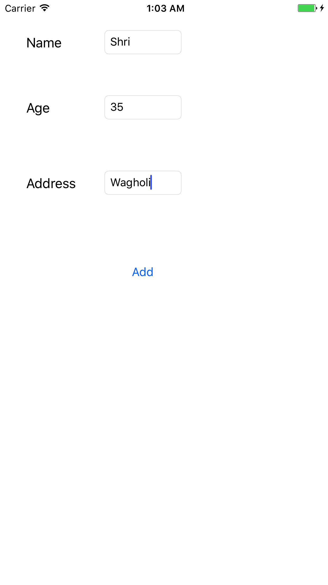
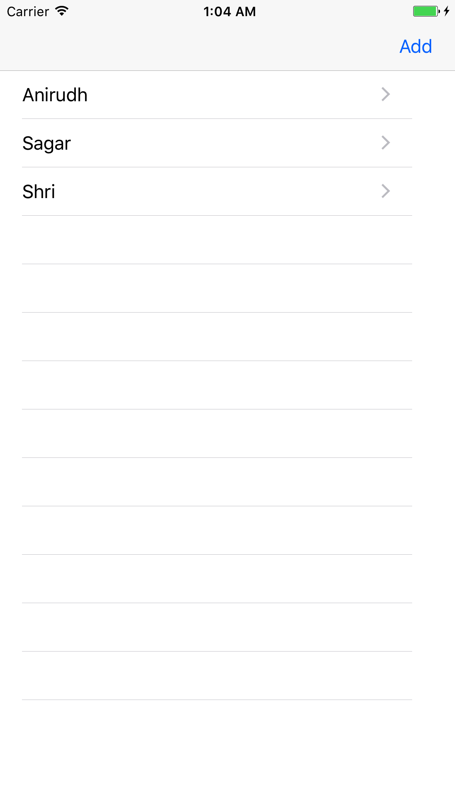
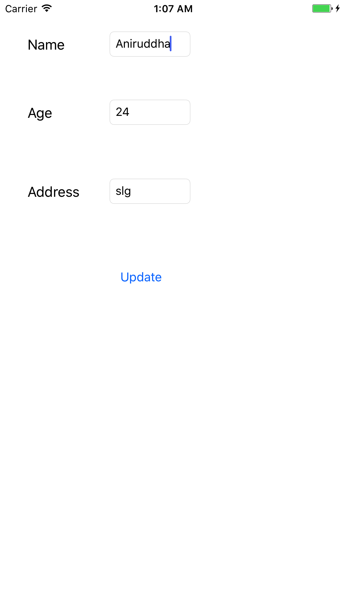
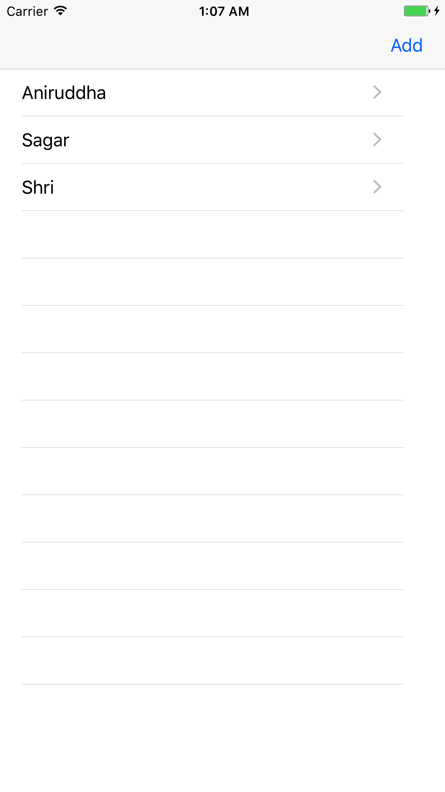
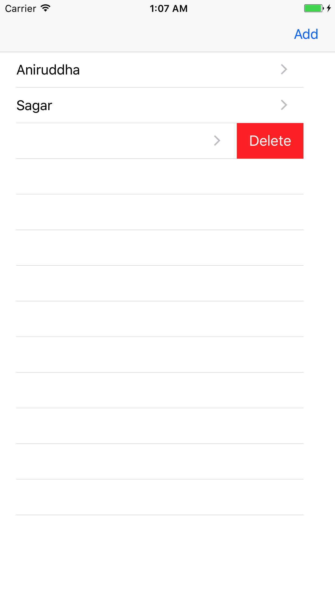

# CRUD Operations using Core Data

For any DB Operations, we need a `NSMangedObjectContext`, which is present as `viewContext` in `NSPersistentContainer`.

`NSPersistentStoreCoordinator` now became `NSPersistentContainer`, and it manages persistent store types like SQLite, XML, In-Memory and Binary.

`NSPersistentContainer` creates a Database Container inside the App Sandbox. So, we need to provide the name of the app while creating the container.

```
let container = NSPersistentContainer(name: "CoreDataDemoApp")
```

Every record/tuple in the Core Data database is of type `NSManagedObject`.

----

### Example

**Step 1**

Create a project `CoreDataDemoApp `.

**Step 2**

In the datamodel (database), add an entity (table) `Student` with attributes as:



**Step 3**

From the Storyboard, embed the `ViewController` in a `NavigationController`.

And then drag a `TableView` onto the `ViewController`.



**Step 4**

Add a new UIViewController class `AddViewController`.

**Step 5**

In the storyboard, drag out a ViewController, and make it's class as `AddViewController` from the attributes inspector.

Create a segue from the ViewController to the AddViewController. Give the segue an identifier `add`.

Design the AddViewController as:



Add appropiate @IBOutlet and @IBAction for each element into their respective ViewControllers.

**Step 6**

Inside `ViewController.swift`, write:

```
import UIKit
import CoreData

class ViewController: UIViewController {
    var studData = [NSManagedObject]()
    
    @IBOutlet weak var tblStudent: UITableView!
    
    override func viewDidLoad() {
        super.viewDidLoad()
        self.navigationItem.rightBarButtonItem = UIBarButtonItem(title: "Add", style: .plain, target: self, action: #selector(self.addRecord))
        
        // Do any additional setup after loading the view, typically from a nib.
    }
    override func viewWillAppear(_ animated: Bool) {
        super.viewWillAppear(animated)
        read()
    }
    func read() {
        studData.removeAll()
        let context = appDel.getContext()
        let request = NSFetchRequest<NSFetchRequestResult>(entityName: "Student")
        //let request: NSFetchRequest<Student> = Student.fetchRequest()
        do {
            let data = try context.fetch(request)
            for stud in data as! [NSManagedObject] {
                print(stud.value(forKey: "name")!)
                studData.append(stud)
            }
            tblStudent.reloadData()
        } catch let error as NSError {
            print("errors while reading data \(error)")
        }
    }
    
    func addRecord() {
        appDel.isAddStudent = true
        self.performSegue(withIdentifier: "add", sender: self)
    }
    
    
    override func didReceiveMemoryWarning() {
        super.didReceiveMemoryWarning()
        // Dispose of any resources that can be recreated.
    }

}

extension ViewController: UITableViewDataSource {
    func tableView(_ tableView: UITableView, numberOfRowsInSection section: Int) -> Int {
        return studData.count
    }
    
    func tableView(_ tableView: UITableView, cellForRowAt indexPath: IndexPath) -> UITableViewCell {
        let cell = tableView.dequeueReusableCell(withIdentifier: "cell", for: indexPath)
        cell.accessoryType = .disclosureIndicator
        cell.textLabel?.text = studData[indexPath.row].value(forKey: "name") as? String
        return cell
    }
    
}

extension ViewController: UITableViewDelegate {
    
    func tableView(_ tableView: UITableView, didSelectRowAt indexPath: IndexPath) {
        appDel.selectedObject = studData[indexPath.row]
        appDel.isAddStudent = false
        self.performSegue(withIdentifier: "add", sender: self)
    }
    
    func tableView(_ tableView: UITableView, commit editingStyle: UITableViewCellEditingStyle, forRowAt indexPath: IndexPath) {
        if editingStyle == .delete {
            let object = studData[indexPath.row] as NSManagedObject
            let context = appDel.getContext()
            context.delete(object)
            do {
                try context.save()
                studData.remove(at: indexPath.row)
                tblStudent.reloadData()
            } catch let error as NSError {
                print(error)
            }
        }
    }
    
}
```

**Step 7**

Inside `AddViewController.swift`, write:

```
import UIKit
import CoreData
class AddViewController: UIViewController {
    @IBOutlet weak var txtName: UITextField!
    @IBOutlet weak var txtAge: UITextField!
    @IBOutlet weak var txtAddress: UITextField!

    @IBOutlet weak var btnAddEdit: UIButton!
    override func viewDidLoad() {
        super.viewDidLoad()

        // Do any additional setup after loading the view.
    }
    
    override func viewWillAppear(_ animated: Bool) {
        super.viewWillAppear(animated)
        if !appDel.isAddStudent {
            btnAddEdit.setTitle("Update", for: .normal)
            txtName.text = appDel.selectedObject.value(forKey: "name") as? String
            print(appDel.selectedObject.value(forKey: "age")!)
            let age: Int = appDel.selectedObject.value(forKey: "age") as! Int
            txtAge.text =  String(describing: age)
            txtAddress.text = appDel.selectedObject.value(forKey: "address") as? String
        } else {
            btnAddEdit.setTitle("Add", for: .normal)
        }
    }

    @IBAction func confirmBtnClicked(_ sender: Any) {
        let context = appDel.getContext()
        let entity = NSEntityDescription.entity(forEntityName: "Student", in: context)
        
        if appDel.isAddStudent {
            let newRecordManagedObject = NSManagedObject(entity: entity!, insertInto: context)
            newRecordManagedObject.setValue(txtName.text, forKey:"name")
            newRecordManagedObject.setValue(Int(txtAge.text!), forKey:"age")
            newRecordManagedObject.setValue(txtAddress.text, forKey:"address")
        } else {
            appDel.selectedObject.setValue(txtName.text, forKey:"name")
            appDel.selectedObject.setValue(Int(txtAge.text!), forKey:"age")
            appDel.selectedObject.setValue(txtAddress.text, forKey:"address")
        }
    
        do {
            try context.save()
            self.dismiss(animated: true, completion: nil)
        } catch let error as NSError {
            print(error)
        }
        
        // appDel.saveContext()
        // We can write custom save context method to display custom error messages for different CRUD operations
        
    }
    override func didReceiveMemoryWarning() {
        super.didReceiveMemoryWarning()
        // Dispose of any resources that can be recreated.
    }

}
```

**Step 8**

Inside `AppDelegate.swift`, write:

```
import UIKit
import CoreData

let appDel = UIApplication.shared.delegate as! AppDelegate

@UIApplicationMain
class AppDelegate: UIResponder, UIApplicationDelegate {

    var window: UIWindow?
    var selectedObject = NSManagedObject()
    var isAddStudent: Bool = false
    func application(_ application: UIApplication, didFinishLaunchingWithOptions launchOptions: [UIApplicationLaunchOptionsKey: Any]?) -> Bool {
        // Override point for customization after application launch.
        return true
    }

    func applicationWillResignActive(_ application: UIApplication) {
        // Sent when the application is about to move from active to inactive state. This can occur for certain types of temporary interruptions (such as an incoming phone call or SMS message) or when the user quits the application and it begins the transition to the background state.
        // Use this method to pause ongoing tasks, disable timers, and invalidate graphics rendering callbacks. Games should use this method to pause the game.
    }

    func applicationDidEnterBackground(_ application: UIApplication) {
        // Use this method to release shared resources, save user data, invalidate timers, and store enough application state information to restore your application to its current state in case it is terminated later.
        // If your application supports background execution, this method is called instead of applicationWillTerminate: when the user quits.
    }

    func applicationWillEnterForeground(_ application: UIApplication) {
        // Called as part of the transition from the background to the active state; here you can undo many of the changes made on entering the background.
    }

    func applicationDidBecomeActive(_ application: UIApplication) {
        // Restart any tasks that were paused (or not yet started) while the application was inactive. If the application was previously in the background, optionally refresh the user interface.
    }

    func applicationWillTerminate(_ application: UIApplication) {
        // Called when the application is about to terminate. Save data if appropriate. See also applicationDidEnterBackground:.
        // Saves changes in the application's managed object context before the application terminates.
        self.saveContext()
    }

    // MARK: - Core Data stack

    lazy var persistentContainer: NSPersistentContainer = {
        /*
         The persistent container for the application. This implementation
         creates and returns a container, having loaded the store for the
         application to it. This property is optional since there are legitimate
         error conditions that could cause the creation of the store to fail.
        */
        let container = NSPersistentContainer(name: "CoreDataDemoApp")
        container.loadPersistentStores(completionHandler: { (storeDescription, error) in
            if let error = error as NSError? {
                // Replace this implementation with code to handle the error appropriately.
                // fatalError() causes the application to generate a crash log and terminate. You should not use this function in a shipping application, although it may be useful during development.
                 
                /*
                 Typical reasons for an error here include:
                 * The parent directory does not exist, cannot be created, or disallows writing.
                 * The persistent store is not accessible, due to permissions or data protection when the device is locked.
                 * The device is out of space.
                 * The store could not be migrated to the current model version.
                 Check the error message to determine what the actual problem was.
                 */
                fatalError("Unresolved error \(error), \(error.userInfo)")
            }
        })
        return container
    }()

    // MARK: - Core Data Saving support

    func saveContext () {
        let context = persistentContainer.viewContext
        if context.hasChanges {
            do {
                try context.save()
            } catch {
                // Replace this implementation with code to handle the error appropriately.
                // fatalError() causes the application to generate a crash log and terminate. You should not use this function in a shipping application, although it may be useful during development.
                let nserror = error as NSError
                fatalError("Unresolved error \(nserror), \(nserror.userInfo)")
            }
        }
    }
    
    
    func getContext() -> NSManagedObjectContext {
        return persistentContainer.viewContext
    }

}
```

### Output











