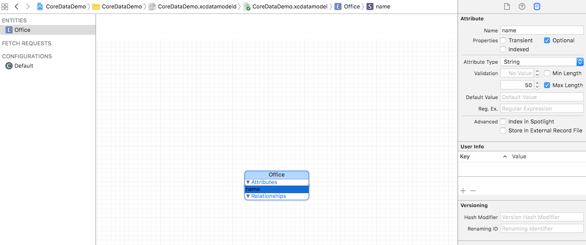

# Core Data in iOS 10 and Swift 3.0

### Step 1: Create Data model

Create Data model as specified below.



### Step 2: Put following code in AppDelegate

Make sure you change name of Data Model as per your project's data-model file. In my case, it is "CoreDataDemo".

```
import UIKit
import CoreData

let appDel = (UIApplication.shared.delegate as? AppDelegate)!

@UIApplicationMain
class AppDelegate: UIResponder, UIApplicationDelegate {

    var window: UIWindow?

    func application(_ application: UIApplication, 
        didFinishLaunchingWithOptions launchOptions: [UIApplicationLaunchOptionsKey: Any]?) -> Bool {

    }

    func applicationWillResignActive(_ application: UIApplication) {
    }

    func applicationDidEnterBackground(_ application: UIApplication) {
    }

    func applicationWillEnterForeground(_ application: UIApplication) {
    }

    func applicationDidBecomeActive(_ application: UIApplication) {
    }

    func applicationWillTerminate(_ application: UIApplication) {
        self.saveContext()
    }

    // MARK: - Core Data stack

    lazy var persistentContainer: NSPersistentContainer = {
        let container = NSPersistentContainer(name: "CoreDataDemo")
        container.loadPersistentStores(completionHandler: { (storeDescription, error) in
            if let error = error as NSError? {
                fatalError("Unresolved error \(error), \(error.userInfo)")
            }
        })
        return container
    }()

    var context: NSManagedObjectContext {
        get {
            return self.persistentContainer.viewContext
        }
    }
    // MARK: - Core Data Saving support

    func saveContext () {
        let context = persistentContainer.viewContext
        if context.hasChanges {
            do {
                try context.save()
            } catch {
                // Replace this implementation with code to handle the error appropriately.
                // fatalError() causes the application to generate a crash log and terminate. 
                // You should not use this function in a shipping application, 
                // although it may be useful during development.
                let nserror = error as NSError
                fatalError("Unresolved error \(nserror), \(nserror.userInfo)")
            }
        }
    }
}
```

### Step 3: Add Object

Following function is an example of adding an object.

```
func addOffice(_ name: String) {
    let entity = NSEntityDescription.entity(forEntityName: "Office", in: self.context)
    let newOffice = NSManagedObject(entity: entity!, insertInto: self.context)
    newOffice.setValue(name, forKey: "name")
    self.saveContext()
}
```

### Step 4: Fetch Objects

Following function is an example of fetching objects.

```
func getOffices() -> [Office] {
    let fetchRequest: NSFetchRequest<Office> = Office.fetchRequest()
    do {
        //go get the results
        let searchResults = try appDel.context.fetch(fetchRequest)
        return searchResults
    } catch {
        return []
    }
}
```

### Step 5: Delete Object

Following function is an example of deleting objects.

```
func deleteOffice(office: Office) {
    appDel.context.delete(office)
    appDel.saveContext()
}
```