# Core Data Architecture

Core Data is an Object-oriented database to store data within the App. It is usually backed by Sqilte.

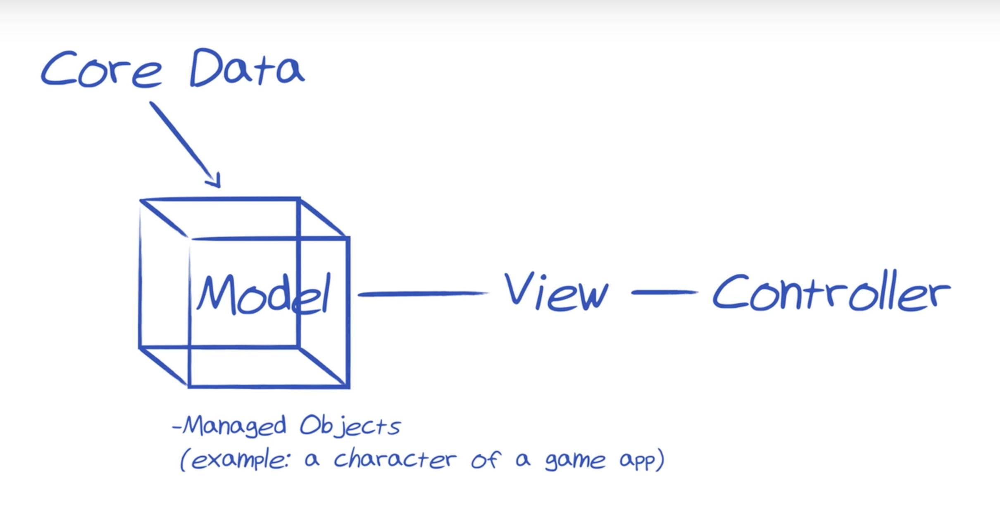

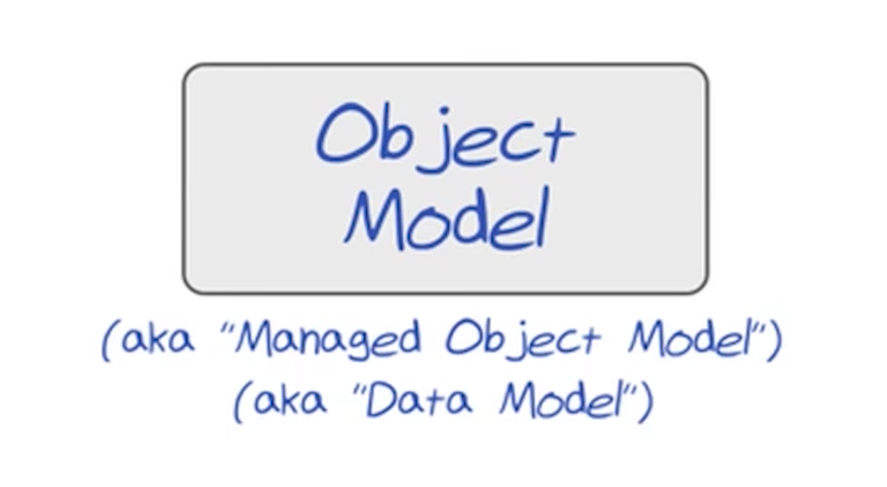

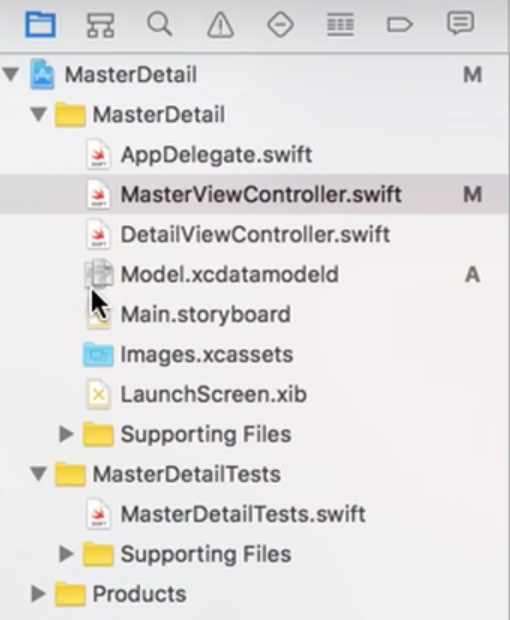

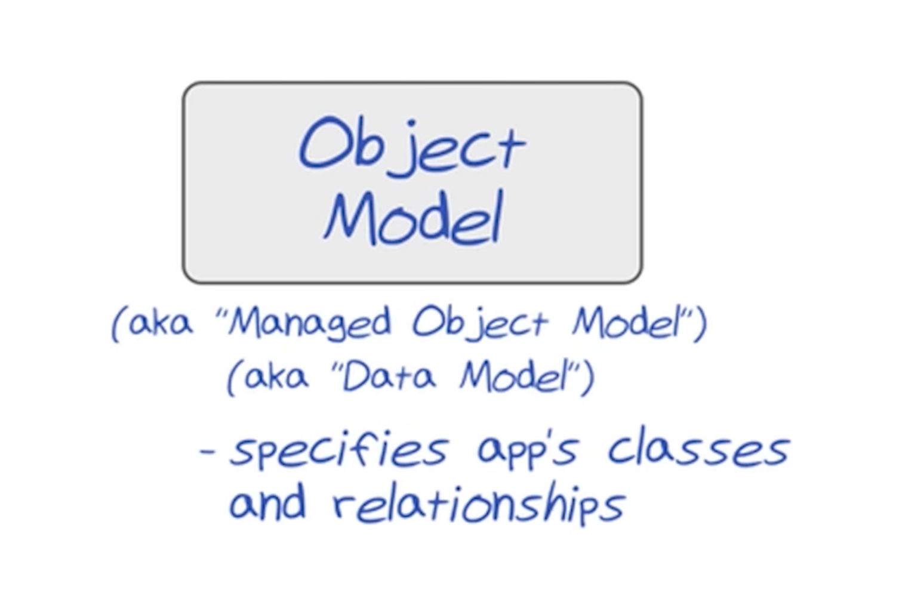

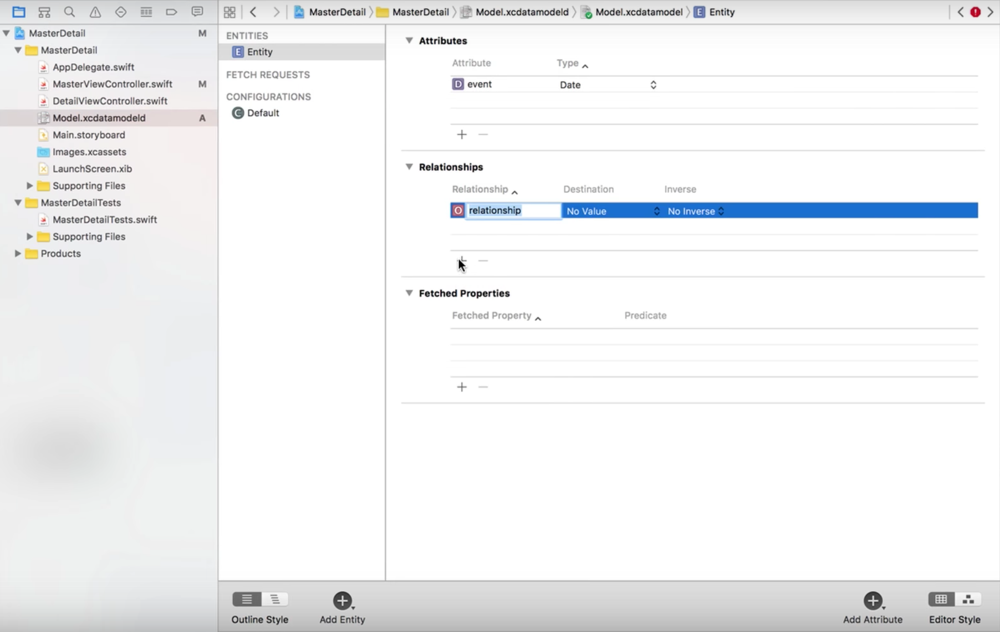

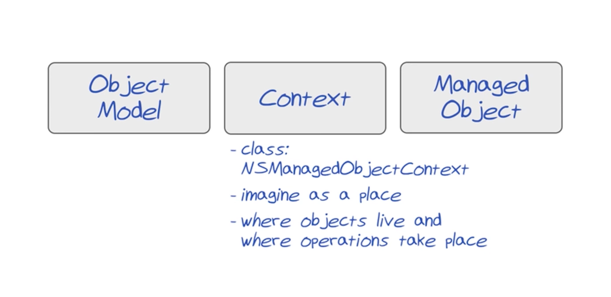

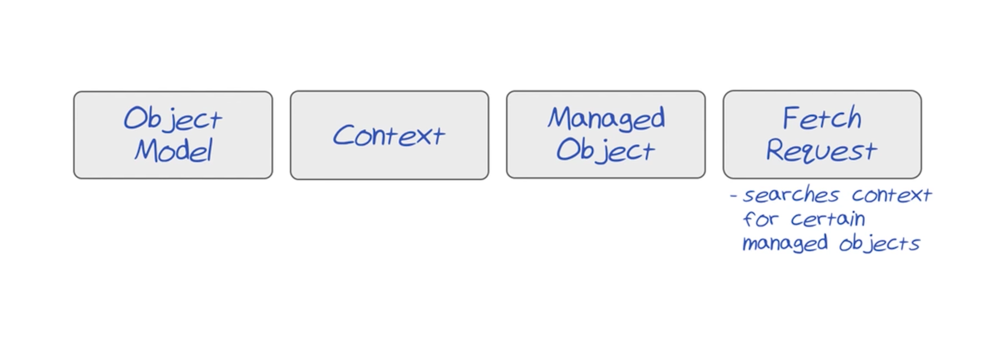

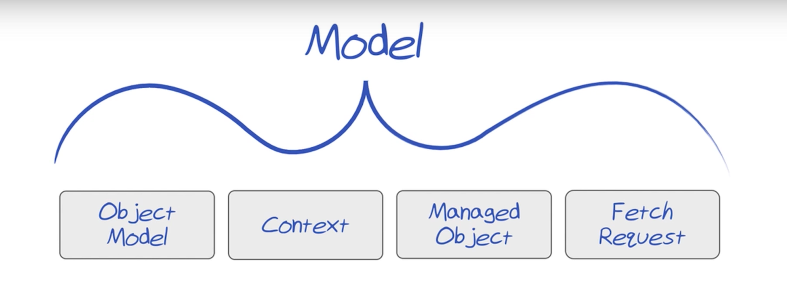

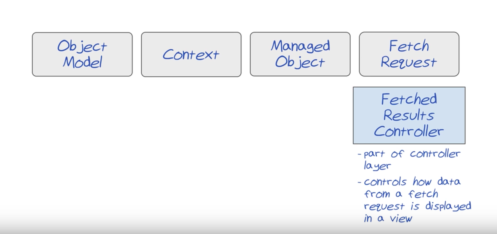

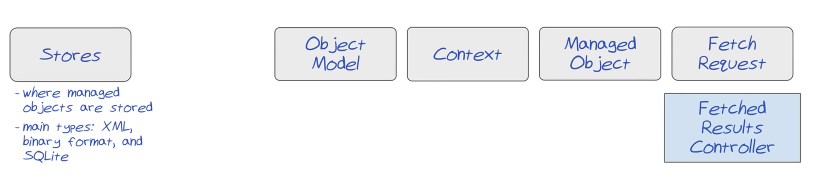

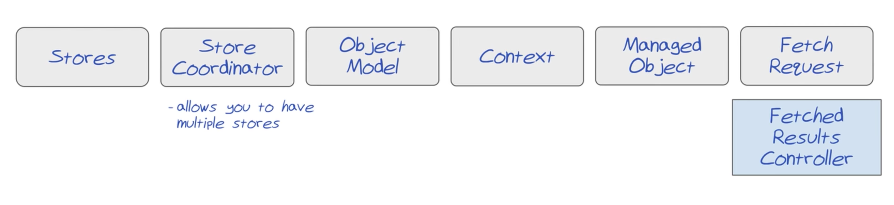

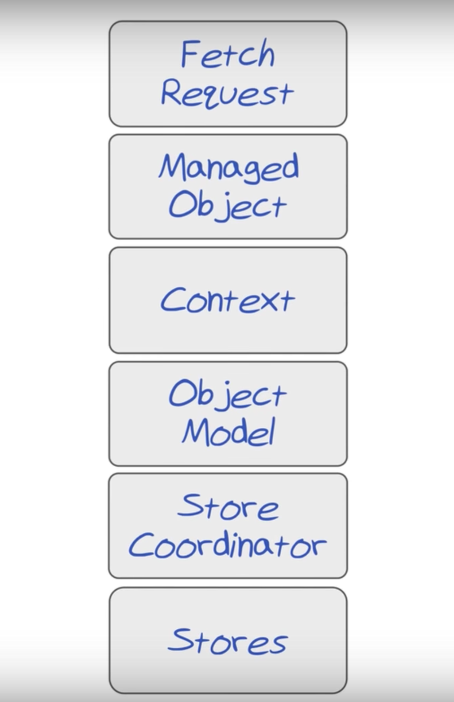

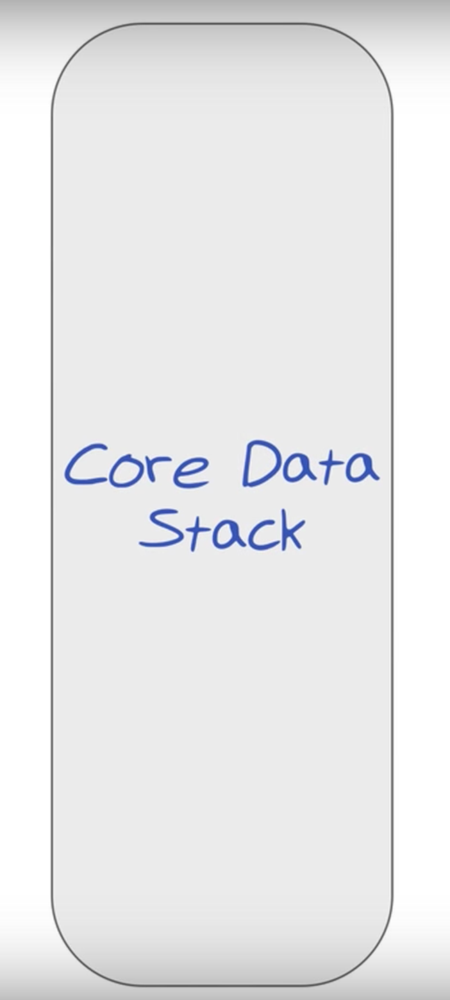
### Refer

[https://www.youtube.com/watch?v=UH8j_GEmIHU](https://www.youtube.com/watch?v=UH8j_GEmIHU)