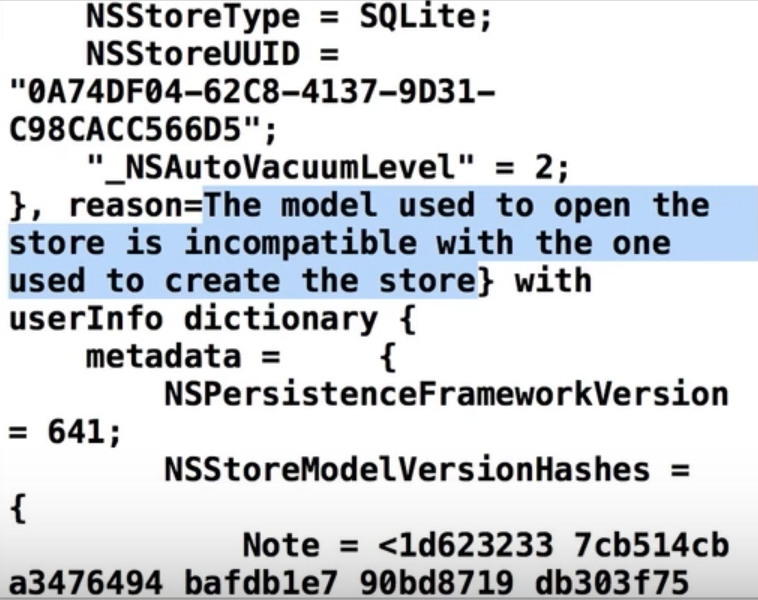
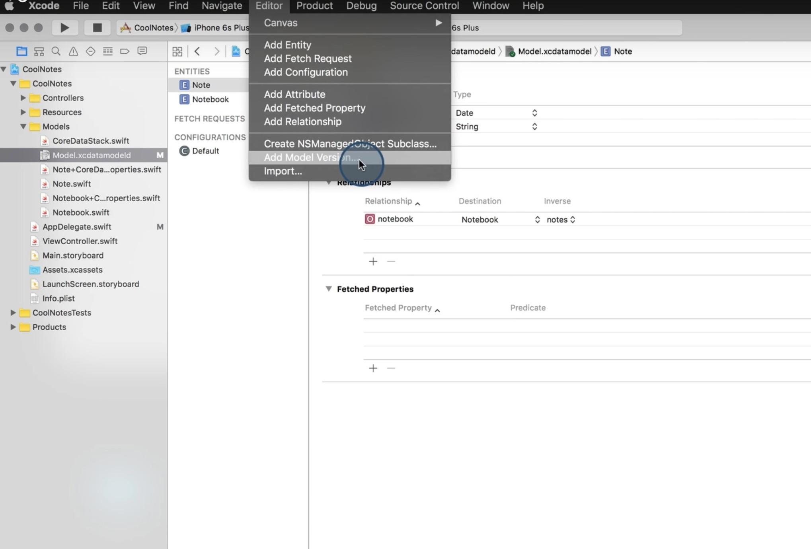
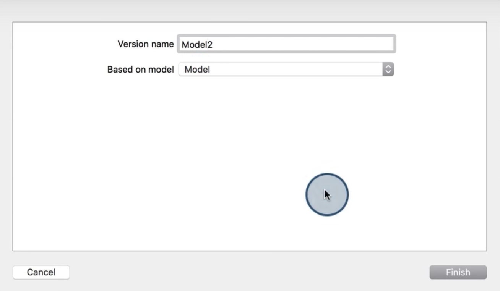
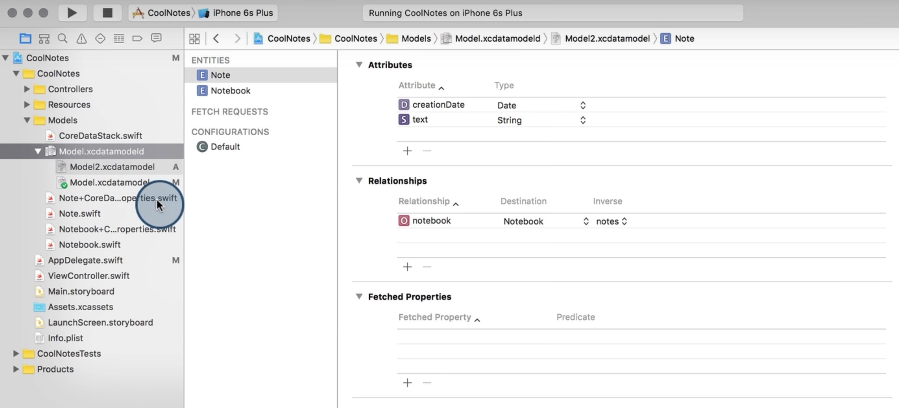
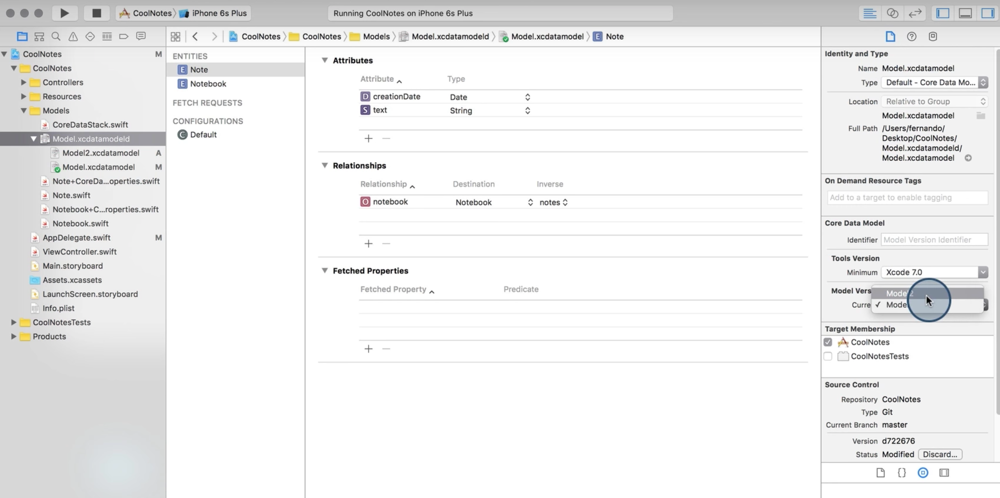
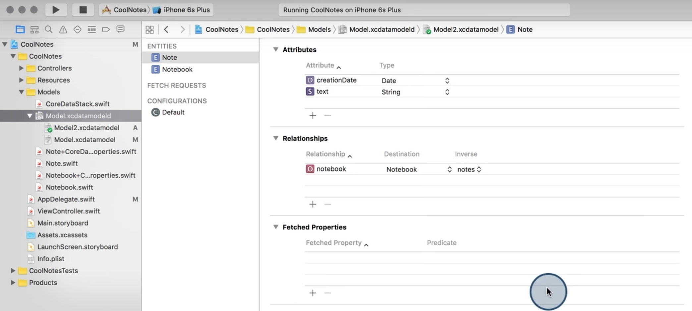
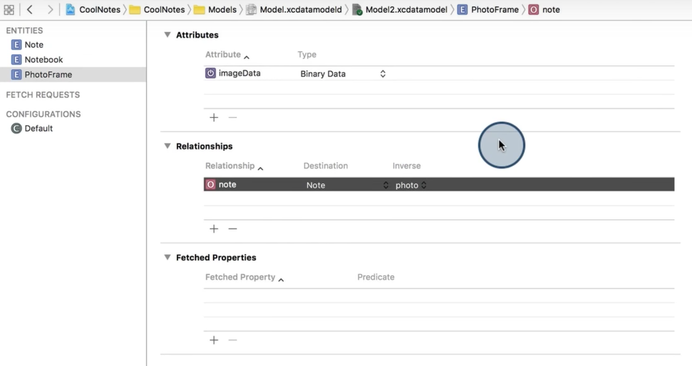

# Migration/Versioning in CoreData

If you suddenly make changes to an existing data model, for example, add a new attribute or table, and try to run the app, you give get an error like:



This is because the data in the previous data model was not migrated into the new version of the data model.

### What is Migration?

Before you make any changes to the existing data model/entity, you first need to convert the old data into new format. This process is called `Migration`.

**Migrations happen in three steps:**

- First, Core Data copies over all the objects from one data store to the next.
- Next, Core Data connects and relates all the objects according to the relationship mapping.
- Enforce any data validations in the destination model. Core Data disables destination model validations during the data copy.

You might ask, **“If something goes wrong, what happens to the original source data store?”** With nearly all types of Core Data migrations, nothing happens to the original store unless the migration completes without error. **Only when a migration is successful, will Core Data remove the original data store.**

### When to migrate?

The easiest answer to this common question is **when you need to make changes to the data model**.

### Types of Migrations

- **Lightweight migrations:**

	A lightweight migration is Apple’s term for the migration with the least amount of work involved on your part. Simply enable a couple of flags when setting up a Core Data stack, and the migration happens automatically. There are some limitations on how much you can change the data model, but because of the small amount of work required to enable this option, it is the ideal setting.

- **Manual migrations**

	Manual migrations involve a little more work on your part. You need to specify how to map the old set of data onto the new set, but you get the benefit of a more explicit mapping model file to configure. Setting up a mapping model in Xcode is much like setting up a data model, with similar GUI tools and some automation.

- **Custom manual migrations**

	This is level 3 of the migration complexity index. You still use a mapping model, but add to that custom code with the ability to also specify custom transformation logic on data. In this case, custom entity transformation logic involves creating an NSEntityMigrationPolicy subclass and performing custom transformations there.

- **Fully manual migrations**

	Fully manual migrations are for those times when even specifying custom transformation logic isn’t enough to fully migrate data from one model version to another. In this case, custom version detection logic and custom handling of the migration process are necessary. In this chapter, you’ll use set up a fully manual migration to update data across non-sequential versions, such as jumping from version 1 to 4.
	
### Steps for Migration

- Before making any changes to the data model, create a new version of your model. Let's give it a name `Model 2`.





By default, you will see the previous version is selected.



- Select the data model, and in the attributes inspector, change the model version to `Model 2`.



Now, you can see new version is selected.



- Now, go ahead and make changes to this new version of the data model. You can add new attributes and new tables into this data model.



- Also you need to set two flags, namely `NSInferMappingModelAutomaticallyOption ` and `NSMigratePersistentStoresAutomaticallyOption `.

	To do this, add the following code into your core data section (preferrably AppDelegate.swift)

	```
	// Options for migration
    let options = [NSInferMappingModelAutomaticallyOption: true, NSMigratePersistentStoresAutomaticallyOption: true]

    do {
        try addStoreCoordinator(NSSQLiteStoreType, configuration: nil, storeURL: dbURL, options: options as [NSObject : AnyObject]?)
    } catch {
        print("unable to add store at \(dbURL)")
    }
	```

### Refer

[https://www.raywenderlich.com/114084/core-data-migrations-tutorial-lightweight-migrations](https://www.raywenderlich.com/114084/core-data-migrations-tutorial-lightweight-migrations)