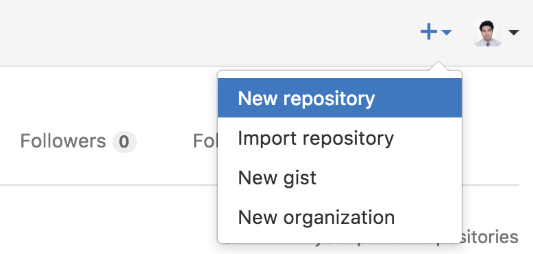
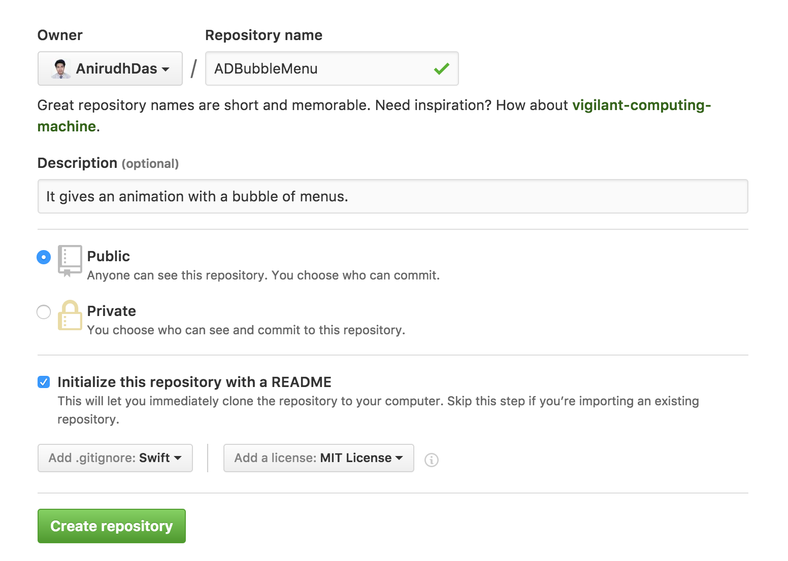
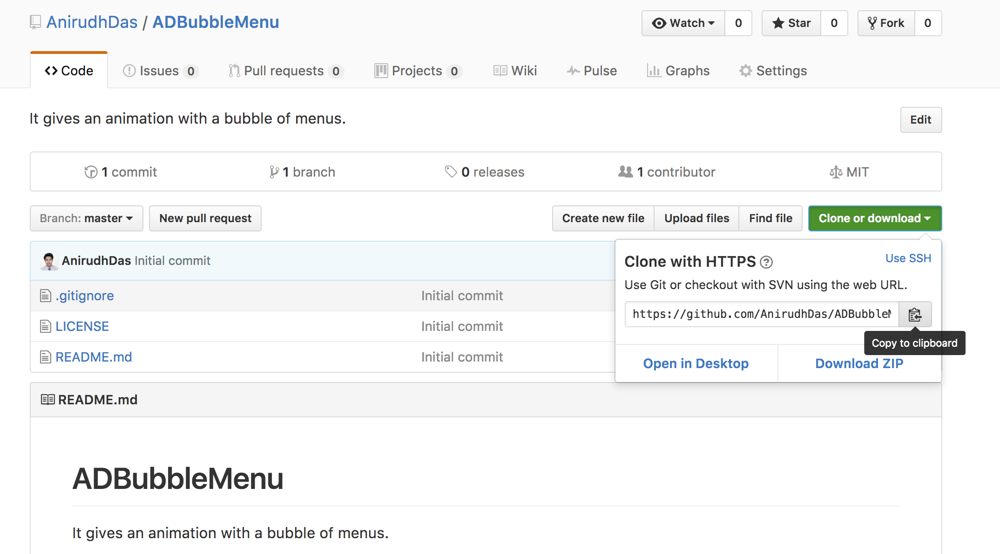
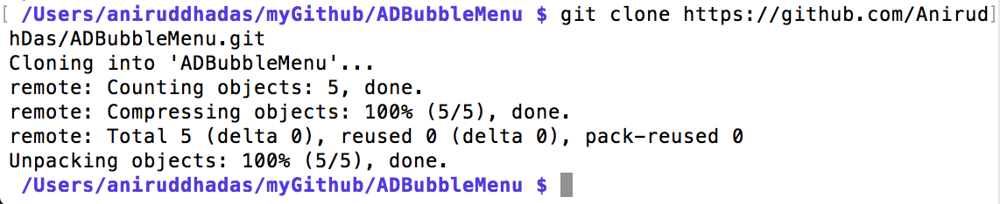
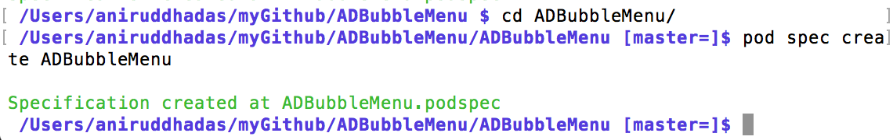
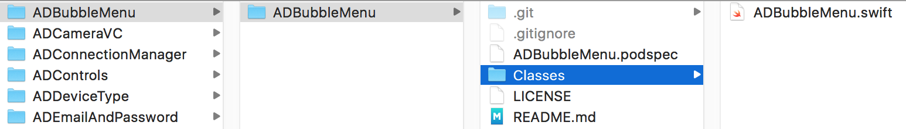
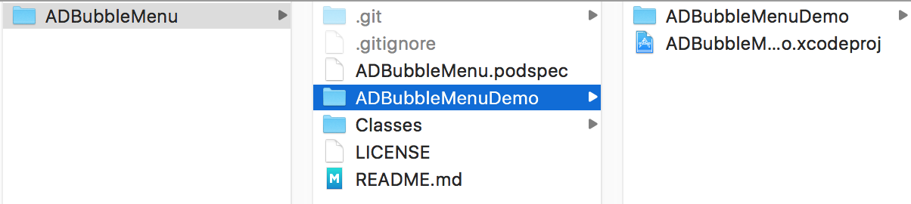
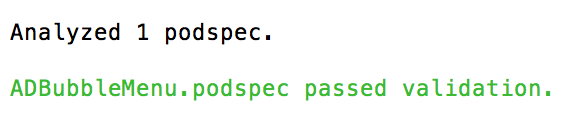
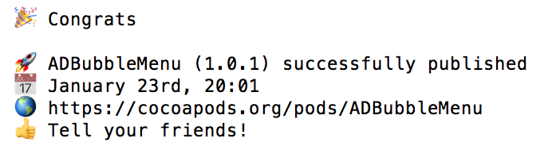
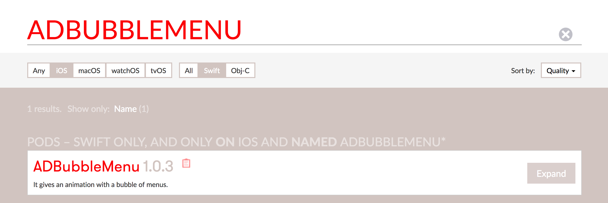

# How to create your own cocoapods?

### Step 1

Create a new repository on Github. In this case, I create a repository named `"ADBubbleMenu"`. Next, give a description for your component. Add `.gitignore` with Swift, and `License` as MIT.





### Step 2

Create a folder named `"ADBubbleMenu"`. Use terminal to get inside this directory. And then copy `git repo path`.



### Step 3

Next, use command `git clone <git repo path>`:

```
git clone https://github.com/AnirudhDas/ADBubbleMenu.git
```

You should see something like this:



### Step 4

Get inside the cloned repo.

```
cd ADBubbleMenu
```

Then use command:

```
pod spec create ADBubbleMenu
```

You should see something like this:



### Step 5

Create a folder **`Classes`** inside the cloned repo.

**Place you source code (.swift files) and other resources (xibs and pngs) inside this folder.**

Make sure any method or variable that you want the end user to access should be declared as **public**.

In this case, I have only one source file `ADBubbleMenu.swift`.



### Step 6

Describe the pod specifications in `ADBubbleMenu.podspec` file.

```
Pod::Spec.new do |s|

  s.name         = "ADBubbleMenu"
  s.version      = "1.0.1"
  s.summary      = "It gives an animation with a bubble of menus."

  s.description  = "It gives an animation with a bubble of menus."

  s.homepage     = "https://github.com/AnirudhDas/ADBubbleMenu"

  s.license      = { :type => "MIT", :file => "LICENSE" }

  s.author             = { "Aniruddha Das" => "cse.anirudh@gmail.com" }

  s.platform     = :ios, "9.0"

  s.source       = { :git => "https://github.com/AnirudhDas/ADBubbleMenu.git", :tag => "#{s.version}" }

  s.source_files  = "Classes", "Classes/**/*.{swift}"

  # s.resources = "Classes/**/*.{png,xib}"

  s.frameworks    =  "Foundation", "UIKit"

  # s.requires_arc = true

  # s.dependency      'MBProgressHUD'
  # s.dependency      'KSReachability'

end
```

### Step 7

You can document the install guide and the usage guide in the `README.md`. Also you can place a demo project within the same folder.



### Step 8

Use command:

```
echo "3.0" > .swift-version
```

### Step 9

```
git add .
```

```
git commit -m "Added files"
```

```
git tag 1.0.1
```

```
git push origin --mirror
```

```
pod spec lint ADBubbleMenu.podspec --verbose --allow-warnings
```

You should see something like this on success:



```
pod trunk push --allow-warnings
```

You should see something like this on success:



### Step 10

Now go to `cocoapods.org` and search for `ADBubbleMenu`. You should be able to see your component in the search results.



**Note:**

Next time onwards, if you make any change in the repository, then increase the `s.version` in the `ADBubbleMenu.podspec` file. And repeat Step 9 with the same tag number as the increased version number.