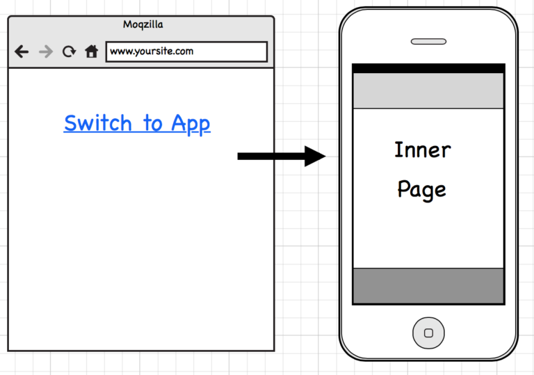
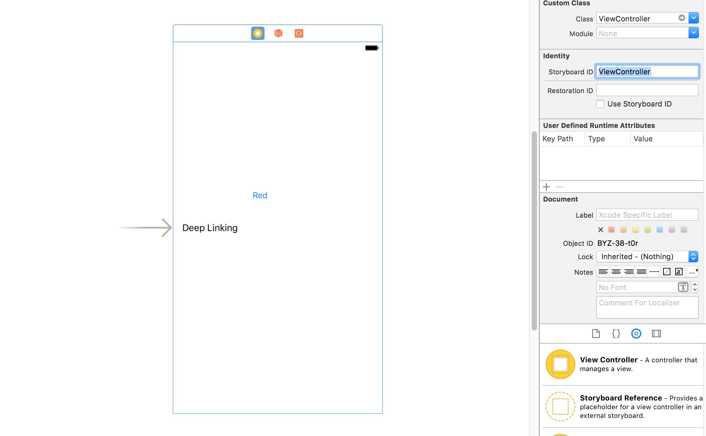
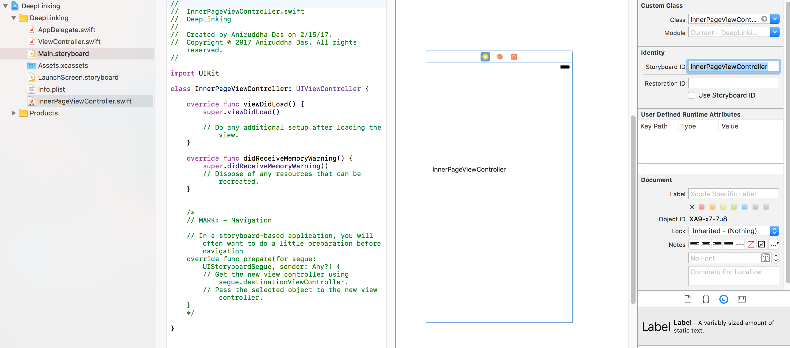
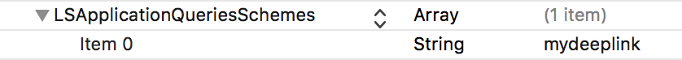
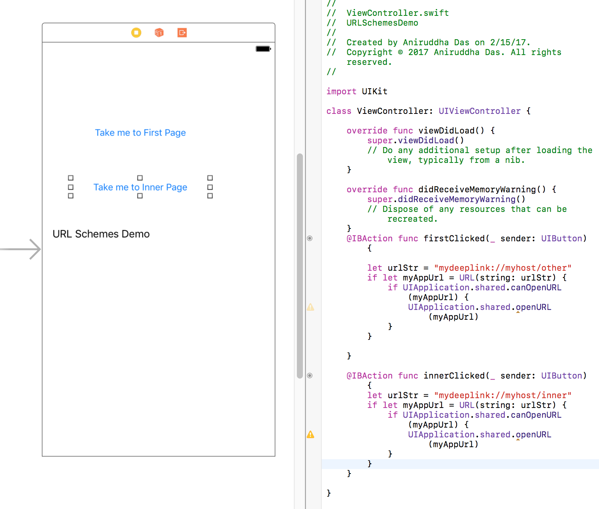
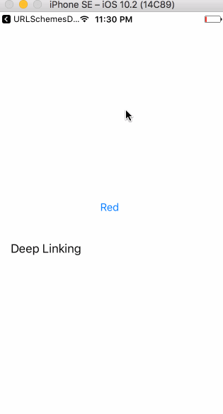

# DEEP LINKING in iOS

Deep Linking is becoming very important in apps these days. You can deep link from another app or even from a website to your app. If you want to direct a user to relevant content and they already have your app, linking to a specific article or an app section from an ad, promotion, or your website makes things a lot easier for them.

We can skip a lot of screens in between and take the user to a particular screen of our app.

In this post, I will discuss how to add Deep Linking support for your app using Custom URL Scheme.



Think of custom url scheme name as another unique protocol of the address you can come up for your app.

For example:

```
mydeeplink://myhost/inner
```

Here,

- `mydeeplink ` is the scheme name
- `myhost` is the host name
- `inner` is the path

----

### Step 1

Create a project named `DeepLinking`. Add a button and a label on the view controller to mark it uniquely. Also add `Storyboard ID` as `ViewController`.



### Step 2

Add an URL Scheme for your app which should be unique in the user's phone amongst all his apps.

For identifier, add your `bundle id`.


### Step 3

Add a new CocoaTouch class named `InnerPageViewController`. Add a view controller in the storyboard and add `InnerPageViewController` as it's class from the Attributes Inspector.

Add the `Storyboard ID` as `InnerPageViewController`.

Also add a label in this view controller to mark it uniquely.



### Step 4

Inside the `AppDelegate.swift`, add this method:

```
func application(_ application: UIApplication, open url: URL, sourceApplication: String?, annotation: Any) -> Bool {
        
        print("url \(url)")
        print("url host :\(url.host!)")
        print("url path :\(url.path)")
        
        
        let urlPath : String = url.path as String!
        let urlHost : String = url.host as String!
        let mainStoryboard: UIStoryboard = UIStoryboard(name: "Main", bundle: nil)
        
        if(urlHost != "myhost")
        {
            print("Host is not correct")
            return false
        }
        
        if(urlPath == "/inner"){
            
            let innerPage: InnerPageViewController = mainStoryboard.instantiateViewController(withIdentifier: "InnerPageViewController") as! InnerPageViewController
            self.window?.rootViewController = innerPage
        } else if (urlPath == "/about"){
            print("Take me to AboutPageViewController")
        } else {
            print("Take me to OtherPageViewController")
            let otherPage: ViewController = mainStoryboard.instantiateViewController(withIdentifier: "ViewController") as! ViewController
            self.window?.rootViewController = otherPage
        }
        self.window?.makeKeyAndVisible()
        return true
    }
```

**Before moving to Step 5, make sure you install / run the app once in your device.**

### Step 5

You can test this from your Safari browser by typing `mydeeplink://myhost/inner`.

I am gonna test it using another app.

Create another app named `URLSchemesDemo`.

Inside it's `Info.plist`, add:



Add a label and two button in your view controller and in their IBAction, write this:

```
@IBAction func firstClicked(_ sender: UIButton) {
        
        let urlStr = "mydeeplink://myhost/other"
        if let myAppUrl = URL(string: urlStr) {
            if UIApplication.shared.canOpenURL(myAppUrl) {
                UIApplication.shared.openURL(myAppUrl)
            }
        }
        
    }
```

```
    @IBAction func innerClicked(_ sender: UIButton) {
        let urlStr = "mydeeplink://myhost/inner"
        if let myAppUrl = URL(string: urlStr) {
            if UIApplication.shared.canOpenURL(myAppUrl) {
                UIApplication.shared.openURL(myAppUrl)
            }
        }
    }
```



Now run the app.



----

### How to access this from a website?

For the code about to work and open the inner page of my app when user clicks on a link in mobile browser, I need to create a link that will look like this:

```
<a href="mydeeplink://myhost/inner">Click here to switch to app</a>
```

**OR**

```
<script language="javascript">
function switchToApp()
{
  document.location = 'mydeeplink://myhost/inner';
 }
</script>
<a href="#" onClick="switchToApp()">Switch to App's Specific ViewController</a>
```