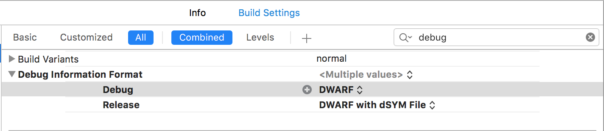
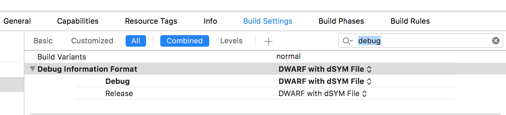

# Difference between `DWARF` and `DWARF with dSYM`

The difference is that:

In the case of `DWARF with dSYM` file, your Archive app.xcarchive (for `adHoc distribution`) also contains dSYM file needed for reverse symbolication of your code in crash reports. In that case, .xcarchive contains:

- dSYMs
- Products
- Info.plist

But in general, for development builds, .xcarchive doesn't contain dSYM file. This is because if you're running under the debugger, of course, it will just stop at the point of the crash; So, you don't need to symbolicate a crash report. So, we use `DWARF`.

So, if you need it for external analysis of crash reports by `third party tools` like `Crashlytics`, under archiving your app for distribution, you should use `DWARF with dSYM file`.

----

The default debug information format for the Debug configuration for new `iOS projects` is **"DWARF" for Debug** and **"DWARF with dSYM file" for Release**, but for new `OS X projects` is just **"DWARF" for both**.



You are advised to have this default configaration.

----

But sometimes, we might get an error saying:

```
2015-03-23 11:35:48.902 run[60036:1047011] Crashlytics.framework/run 1.3.14
2015-03-23 11:35:48.911 run[60036:1047011] 

Crashlytics: dSYM Error

Unable to process <your app>.app.dSYM at path /path/to/<your app>.app.dSYM
Make sure your project build settings are generating a dSYM file. DEBUG_INFORMATION_FORMAT should be set to dwarf-with-dsym for all configurations. This could also be a timing issue, make sure the Crashlytics run script build phase is the last build phase and no other scripts have moved the dSYM from the location Xcode generated it.

Command /bin/sh failed with exit code 1
```

Only in those cases, change it to:



----

### Refer

- [http://stackoverflow.com/questions/22539691/whats-the-difference-between-dwarf-and-dwarf-with-dsym-file](http://stackoverflow.com/questions/22539691/whats-the-difference-between-dwarf-and-dwarf-with-dsym-file)

- [http://stackoverflow.com/questions/31230653/are-dsym-files-necessary-during-development](http://stackoverflow.com/questions/31230653/are-dsym-files-necessary-during-development)

- [http://stackoverflow.com/questions/29209582/make-sure-your-project-build-settings-are-generating-a-dsym-file-debug-informat](http://stackoverflow.com/questions/29209582/make-sure-your-project-build-settings-are-generating-a-dsym-file-debug-informat)