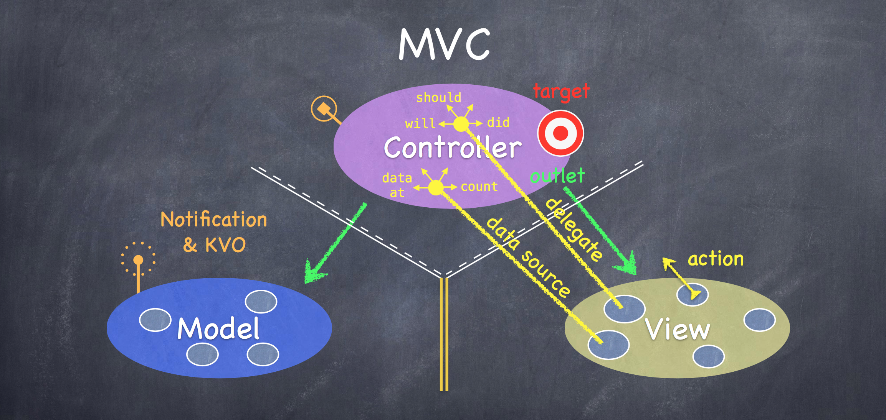
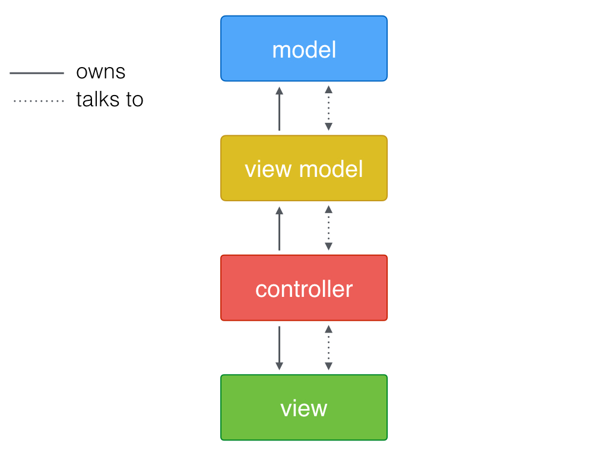
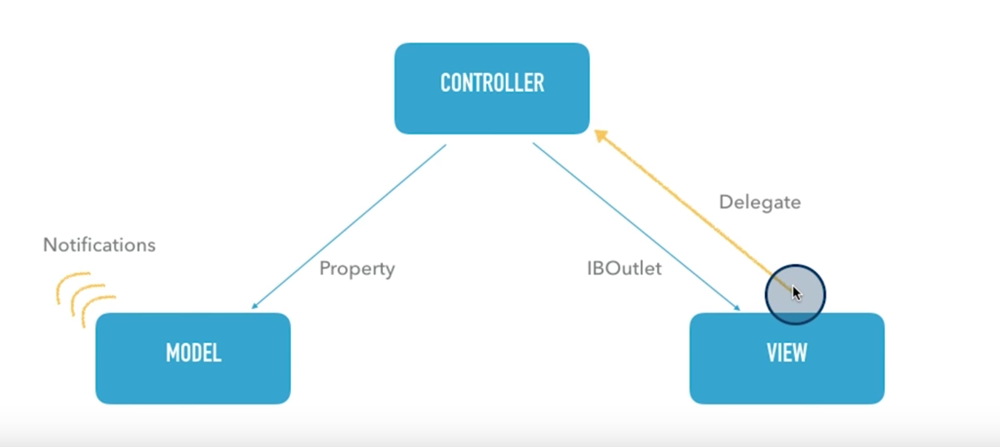
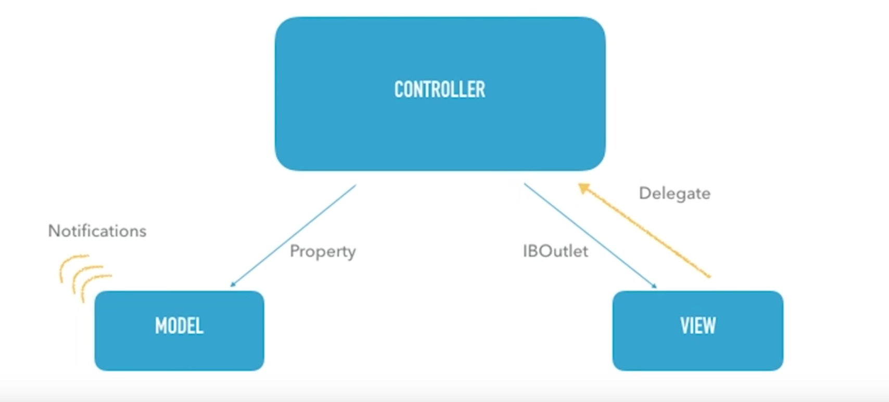
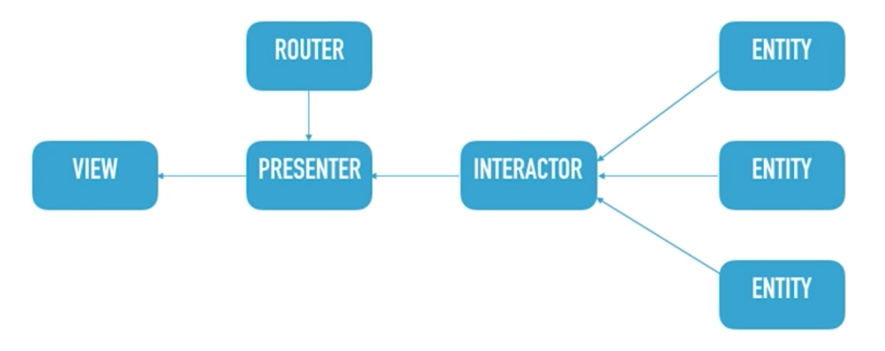
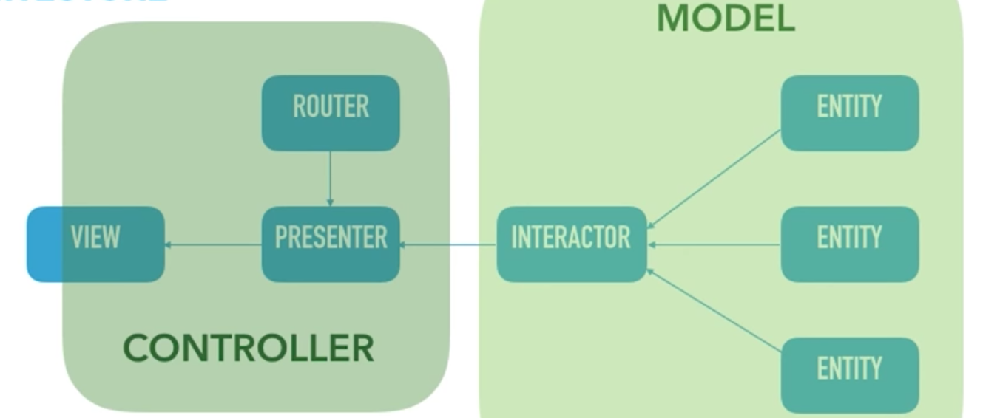

# Design Patterns in iOS

There are 3 categories of design patterns in iOS:

1. Creational - Singleton
2. Structural - MVC, MVVM, Decorator (Extension and Delegate), Adapter, Facade
3. Behavioral - Observer (KVO/KVC and Notification), Memento

### Singleton

It creates only a single instance of a singleton class, throughout the app life cycle. It is useful when we have 5 screens in a navigation controller, and we want to collect data from all the 5 screens, and after we reach the 5th screen, we want to make a service call. So, each of the screen will set some property of the Singleton class.

**Example:**

**SingletonClass.swift**

```
class SingletonClass {
    var name: String = "Ani"
    var age = Int()
    static let sharedInstance = SingletonClass()
}
```

**ViewController.swift**

```
class ViewController: UIViewController {
    let objSingletonClass = SingletonClass. sharedInstance
    override func viewDidLoad() {
        super.viewDidLoad()
        print("Name is: \(objSingletonClass.name)")
        objSingletonClass.age = 32
    }
}
```

### MVC (Model View Controller)

It is the most commonly used design pattern.



1. Model: Business Logic, Data Fetching and Storage
2. View: Xibs, Storyboards
3. Controllers: Intermediatory or Middleman, since Model and View can't directly talk to each other

**Example:**

Screen Button (View) requests controller to get data from server. The Controller asks the Connection Manager (Model) to get it. After getting data, the Connection Manager sends data to Controller, the controller then reflects it back on the screen.

### MVVM (Model View View-Model)

What is wrong with the MVC pattern?

A lot of the code you write doesn’t belong in the view or model layer. No problem. Dump it in the controller. Problem solved. Right? Not really. After thousands of lines of code, you end up with a bunch of overweight controllers, ready to burst and impossible to test.

The MVVM pattern introduces a fourth component, the view model. The view model is responsible for managing the model and funneling the model’s data to the view via the controller. Here, a view-model abstracts or hides the model from the controller.



**Example:**

Custom TableViewCell (view-model) is placed separately from the TableViewController. The TableViewController holds an outlet to the Custom TableViewCell.

### Extension

There are two types of extensions in iOS:

1. **Class Extension / Class Category**
	
	We can add more properties and methods to an existing class.

2. **App Extension**

	Example: Today's Widgets

### Delegate

It does the same thing as closure does. Only difference is Closures does it asyncronously (multithreading). Both Closures and Protocols have one-to-one communication, unlike NotificationCenter which has one-to-many communication. It means several classes may implement methods of the delegate or closure, but in whichever class the delegate method was called, the response comes back only in that class, not all the classes.

We send data from one class to another class where it is processed, and it gets back response to the caller class as ```handler``` or ```delegate = self```.

**Example:**

**ProtocolPattern.swift**

```
@objc protocol AddtionDelegate {
    func addition(result:Int)
    func add() -> Int
    @objc optional func abc()
}
class ProtocolPattern: NSObject {
    var delegate: AddtionDelegate? = nil
    func doAddition(a: Int, b: Int) {
        let c = a + b
        delegate?.addition(result: c)
       let d = delegate?.add()
        print(d)
    }
}
```

**ViewController.swift**

```
class ViewController: UIViewController {

    let obj = ProtocolPattern()
    var result: Int = 0
    override func viewDidLoad() {
        super.viewDidLoad()
        obj.delegate = self
        obj.doAddition(a: 10, b: 10)
    }
}

extension ViewController: AddtionDelegate {
    func addition(result: Int) {
        print(result)
        self.result = result
    }
    func addi() -> Int {
        return self.result
    }
}
```

### Facade

Facade Design Pattern in iOS means abstracting the implementation of your business Logic and provide every thing as consumable APIs. Users are not exposed to classes, but only a single API. Everything is hidden behind the API.

The API internally can have interactions with the Database, Remote System, File System and Memory.

Example: Google APIs.

### KVO (Key Value Observer) and KVC (Key Value Complaint)

Used by XCode to show warnings while typing itself.

**Example:**

```
UserDefaults.saveValueForKey("name")
UserDefaults.getValueFromKey("namee")
```

The complier continuously observes using KVO if the user properly sets a value to a valid key or not. If key is not valid, it throws an exception using KVC.

### Notification

It supports one-to-many communication. It means the classes that have tuned into the observer key, the broadcasted response notification comes back to all those classes, not just a single class.

**Example:**

**ObserverKeyConstants.swift**

```
let keyName = Notification.Name(rawValue: "Broadcast")
```

**ViewController.swift**

```
class ViewController: UIViewController {
    override func viewDidLoad() {
        super.viewDidLoad()
    }
    
    @IBAction func navigateToSecondVC(_ sender: AnyObject) {
        NotificationCenter.default.post(name: keyName, object: nil)
        self.performSegue(withIdentifier: "secondVC", sender: self)
    }
}
```

**SecondVC.swift**

```
class SecondVC: UIViewController {
	override func viewDidLoad() {
        super.viewDidLoad()
        NotificationCenter.default.addObserver(forName: keyName, object:nil, queue:nil) { notification in
            print(notification)
        }
    }
}
```

**Note:**

```Notifications``` are a way to let ```unrelated classes``` communicate. ```Delegation``` on the other hand lets ```related classes``` communicate using a more explicitly defined interface.

### VIPER

This is the most recent of Design Patterns in iOS, and is supposed to be a replacement of MVC.

The tradition MVC looks like:



The common mistake people make while using this MVC pattern is "Monster Class". This refers to a system where the responsiblities are not well distributed amonst all the classes. Instead we have one class which have most of the job surrounded by dumb classes, that do almost nothing. This is bad as the Monster Class becomes hard to maintain and extend. This problem is commonly referred to as "Massive View Controller", where the instances of UIViewController becomes Monster Classes.



**This can be solved in two ways:**

- Break up your controllers into smaller controllers.
- Use VIPER, which enforces this breaking down.

**Note:** The "Massive View Controller" problem is not an inherent problem of MVC, but an `implemented-gone-wrong` problem of MVC.

**The Viper Architecture**



An `entity` is basically is a dumb model. In Swift, it should be implemented as `struct` with data properties only.

All of the behaviour that is part of `model` in MVC goes into `interactor` class. The interactor is the brains of an entity. The interactor should be tested with TDD.

The entity and interactor together comprises of `model` in MVC pattern.

The `presenter` has all the UI Logic and behaviour. The presenter takes data from the `interactor` and decides when and how to display it to the user. This is code that we usually add to the controller in MVC.

The `view` of Viper is different from the view of MVC. It receives instructions from the presenter about what to do, and takes care of the details on how to carry out these orders. It is basically a `protocol`, usually implemented by a UIViewController subclass. It contains methods necessary to carry out the presenter's instructions.

An important part of any iOS app is the navigation information, how one UI screen moves into another. Usually this is decided by UI/UX Team and we as developers implement this plan. This navigation information is laid out through the storyboard. This is fine in simple apps. But for complex apps, it's more convinient to have this information implemented as Swift Code. This code in Viper is placed in `Router`.

The `presenter` knows when to navigate, while the `router` knows how to do it.



### Refer

1. [https://www.raywenderlich.com/86477/introducing-ios-design-patterns-in-swift-part-1](https://www.raywenderlich.com/86477/introducing-ios-design-patterns-in-swift-part-1)
2. [https://www.raywenderlich.com/90773/introducing-ios-design-patterns-in-swift-part-2](https://www.raywenderlich.com/90773/introducing-ios-design-patterns-in-swift-part-2)
3. [https://cocoacasts.com/what-is-wrong-with-model-view-controller/](https://cocoacasts.com/what-is-wrong-with-model-view-controller/)
4. [https://www.andrewcbancroft.com/2014/10/08/fundamentals-of-nsnotificationcenter-in-swift/](https://www.andrewcbancroft.com/2014/10/08/fundamentals-of-nsnotificationcenter-in-swift/)
5. [https://classroom.udacity.com/courses/ud1029/lessons/a27e7e59-dfcd-4368-98fb-bf1bf9c31dc3/concepts/16455951-e5d7-47d1-ab43-2fc67fe3c33e](https://classroom.udacity.com/courses/ud1029/lessons/a27e7e59-dfcd-4368-98fb-bf1bf9c31dc3/concepts/16455951-e5d7-47d1-ab43-2fc67fe3c33e)
6. [https://www.youtube.com/watch?v=nAI-BI-_YWs](https://www.youtube.com/watch?v=nAI-BI-_YWs)